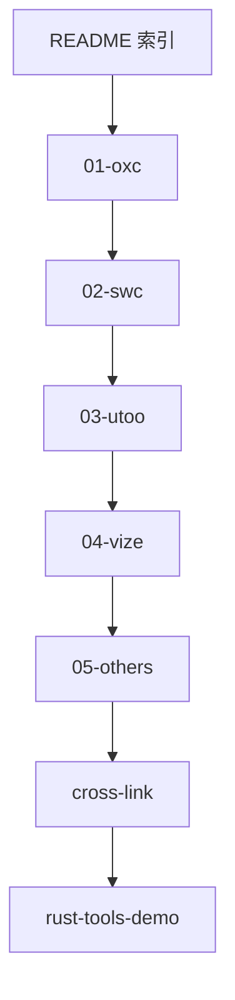

# Rust 前端工具链系列

## 背景与目标

前端工具链正在从 JS 实现（Babel、Webpack、ESLint、Prettier）迁移到 Rust 实现。本系列以 **博客文章** 为主要交付物，重点深度介绍 **Oxc、SWC、Utoo、Vize** 四个工具；其余工具在 [05-others.md](../blog/rust-tools/05-others.md) 中粗讲。

**重点章（01~04）** 配套 [`rust-tools-demo/`](../rust-tools-demo/) 可运行示例；粗讲章（05）仅博客，无独立 demo。

仓库另有 [`napi-rs-demo/`](../napi-rs-demo/)（N-API 原理）和 [`wasm-road-demo/`](../wasm-road-demo/)（浏览器 Wasm 加载），博客中作概念交叉引用。

---

## 目录结构

```
blog/rust-tools/
├── README.md       # 系列索引、生态全景图、三种集成模式、其它工具速览表
├── 01-oxc.md       # ★ 重点
├── 02-swc.md       # ★ 重点
├── 03-utoo.md      # ★ 重点
├── 04-vize.md      # ★ 重点
└── 05-others.md    # 粗讲合集

rust-tools-demo/    # ★ 重点章可运行 demo
├── README.md
├── oxc/            # → 01-oxc
├── swc/            # → 02-swc
├── utoo-pack/      # → 03-utoo
└── vize/           # → 04-vize
```

格式对标 [`blog/webgpu/README.md`](../blog/webgpu/README.md) 的系列索引风格。

---

## 重点章 vs 粗讲章

### 重点章（01~04）— 每章约 1500~2500 字

固定结构：

1. **定位** — 流水线角色、所属阵营、替代了哪些 JS 工具、被谁依赖
2. **前端工程中的使用** — npm 包、CLI、框架集成；附配置/命令片段
3. **Rust 工程中直接使用** — 核心 crate、API 流水线、关键代码片段
4. **集成模式** — 纯 crate / N-API / WASM 各自怎么暴露、怎么选
5. **选型建议** — 何时用它、何时用替代品

每章对应 `rust-tools-demo/` 子目录，博文 inline 代码与 demo 源码同步。

### 粗讲章（05-others.md）— 一篇短文

每个工具 **1~2 段**，统一覆盖：定位、前端入口、Rust embed、与重点工具关系。

涵盖：oxc_resolver、Biome、Lightning CSS、Rspack、Turbopack、Rolldown。

---

## 各重点章内容纲要

### 01 Oxc

- VoidZero 愿景，与 Rolldown/Vite 8/Vitest 关系
- 前端：`oxlint`、`oxfmt`、被 Rolldown/Nuxt 等消费
- Rust：`oxc` 聚合 crate + 独立 `oxc_resolver`
- Demo：`rust-tools-demo/oxc/` — parse → transform → codegen

### 02 SWC

- Vercel/Next.js 生态，@swc/core 架构
- Rust：`swc_ecma_*` + **GLOBALS 闭包**
- Demo：`rust-tools-demo/swc/` — TS → JS

### 03 Utoo

- 蚂蚁统一工具链，`ut` / `@utoo/pack` / `@utoo/web`
- Demo：`rust-tools-demo/utoo-pack/` — up dev/build

### 04 Vize

- Vue 垂直整合，@vizejs/vite-plugin
- Demo：`rust-tools-demo/vize/` — Vite + SFC 编译

---

## 三种集成模式

| 模式 | 代表 | 适用场景 | 仓库参考 |
|------|------|----------|----------|
| 纯 Rust crate | Oxc, oxc_resolver | CLI、代码生成、静态分析 | `rust-tools-demo/oxc`、`swc` |
| N-API 绑定 | @swc/core, @utoo/pack, @vizejs/native | Node 构建工具 | `rust-tools-demo/utoo-pack`、`vize`；[`napi-rs-demo/`](../napi-rs-demo/) |
| WASM 绑定 | @utoo/web, @vizejs/wasm | 浏览器内编译 | [`wasm-road-demo/`](../wasm-road-demo/) |

---

## 实施顺序（已完成）



---

## 不在本次范围

- `@utoo/web` 完整浏览器 demo（Worker + OPFS + Service Worker 配置复杂，见博文与官方 Playground）
- Rolldown 独立章节（Oxc 章 + others 一句带过）
- Rspack custom binding 实操
- Turbopack 源码级嵌入
