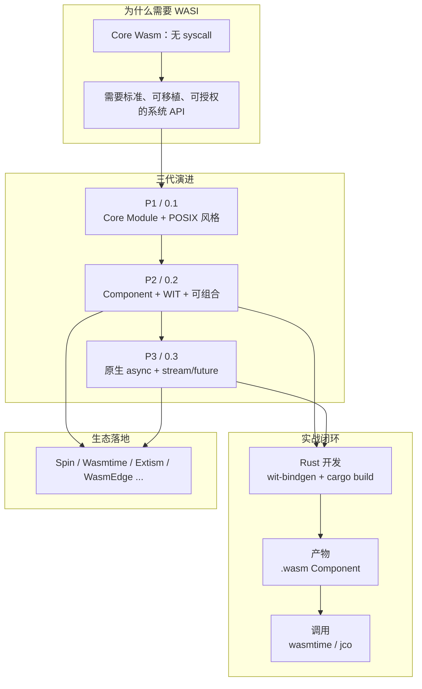
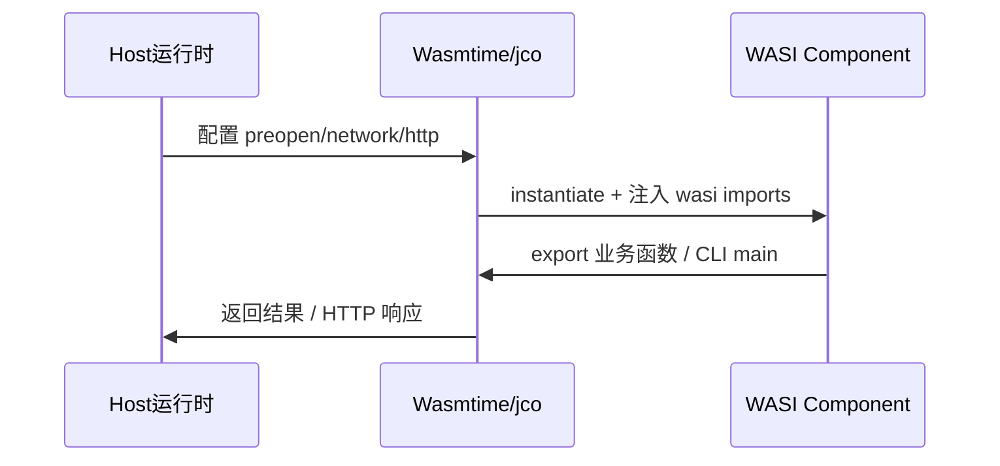

# WASI 介绍文章讲解顺序规划

## 文章定位与风格

- **目标文件**：[blog/wasi-fundamentals.md](blog/wasi-fundamentals.md)（当前为空）
- **定位**：独立的 WASI 专文，自洽完整，不依赖读者先读其他文章
- **写法**：YAML frontmatter、目录锚点、分章 + 本章小结、对比表、Mermaid/ASCII 图、可运行代码块；**能写详细就写详细**，不设字数上限
- **示例策略**：**Rust 写 Guest Component** + **Wasmtime CLI** + **JavaScript（jco）宿主调用**；所有 demo 源码统一放在 [wasi-road-demo/](wasi-road-demo/)

建议 frontmatter：

```yaml
---
title: "WASI 基础：从 P1 到 P3 的系统接口与 Component 开发"
date: 2026-07-06
tags: [wasm, wasi, wasip1, wasip2, wasip3, wit, component-model, rust, wasmtime, jco]
description: "从 WASI 定位与版本演进讲起，P1 简略带过；重点讲解 P2/P3 的 Component Model、WIT API、Rust 开发与 Wasmtime/jco 调用方式，并介绍真实开源生态案例。"
---
```

---

## 整体叙事弧线（读者心智模型）



**讲解顺序原则**：
1. 先建立「Wasm 缺什么 → WASI 补什么 → 为何分三代」的全景
2. P1 只讲「是什么、何时还用、怎么跑」，不展开 API 细节
3. **P2 是 Component/WIT 的主干**（静态结构、接口包、开发/调用完整闭环）
4. **P3 是 P2 的 async 升级**（对照 P2 讲差异，而非重写一遍）
5. **应用场景 + 真实开源项目**贯穿第 1 章与第 9 章，让读者看到 WASI 不是纸面标准
6. 最后收束：运行时矩阵、版本选型、路线图

---

## 章节结构（10 章 + 附录）

### 第 0 部分：开篇

| 小节 | 内容 |
|------|------|
| 0.1 WASI 是什么 | 引用 [wasi.dev](https://wasi.dev/)：面向 Wasm 的标准系统 API 族；W3C Wasm CG 下 WASI Subgroup 维护 |
| 0.2 三代版本对照表 | P1=0.1 Legacy / P2=0.2 Stable / P3=0.3 Stable（2026-06）；Module vs Component 二分 |
| 0.3 核心概念预热 | Capability 沙箱、Preopen、WIT、World、Component、Canonical ABI — 术语表（后文反复使用） |
| 0.4 本文阅读地图 | 指明 P1 从简、P2 含完整开发与调用、P3 仅概念/API 差异（无可运行 demo）；demo 均在 `wasi-road-demo/` |

**关键对照表**（全文第一张表）：

| 维度 | P1 (0.1) | P2 (0.2) | P3 (0.3) |
|------|----------|----------|----------|
| 二进制形态 | Core Module | Component | Component |
| 接口描述 | import 名约定 | WIT 包 `wasi:*@0.2.x` | WIT 包 `wasi:*@0.3.x` |
| 异步模型 | 同步 syscall | `wasi:io` + pollable | `async func` + `stream<T>` + `future<T>` |
| Rust Target | `wasm32-wasip1` | `wasm32-wasip2`（stable Tier 2） | `wasm32-wasip3`（nightly Tier 3） |
| 典型运行时 | Wasmtime/Wasmer/WAMR 广泛 | Wasmtime、jco | Wasmtime 43+、jco preview3-shim |

---

### 第 1 章：Wasm 为何需要系统接口 + WASI 应用场景

#### 1.1 问题背景
- Core Wasm 的设计边界：无文件系统、无网络、无环境变量、无进程概念
- 各宿主私有 import 的碎片化问题
- WASI 的价值主张：跨语言、可组合、能力授权、标准演进

#### 1.2 Capability-based Security
- Guest 零权限启动 → Host 显式 grant preopen fd / network / HTTP 能力
- 图示 + [wasi.dev Security](https://wasi.dev/security) 要点

#### 1.3 WASI 应用场景与成功开源项目（重点新增）

按**场景**组织，每个场景列举**正在生产或广泛使用的开源项目**，说明其使用的 WASI 版本与角色：

| 场景 | 代表项目 | WASI 使用方式 | 链接 |
|------|----------|---------------|------|
| **参考运行时 / 嵌入引擎** | [Wasmtime](https://github.com/bytecodealliance/wasmtime) | 完整 WASI P1/P2/P3、Component Model 参考实现；Spin、Fermyon 等底层依赖 | wasmtime.dev |
| **边缘 Serverless 微服务** | [Spin](https://github.com/spinframework/spin) | 基于 Wasmtime + Component Model；支持 WASI HTTP、WASI KV、WASI Config 等 | spinframework.dev |
| **CDN / 边缘计算** | Fastly Compute@Edge | 从第一天起以 Wasm 为隔离原语；WASI 能力由平台注入 | fastly.com/documentation/guides/compute |
| **CDN / Workers** | Cloudflare Workers | V8 + Wasm 绑定；部分场景编译到 Wasm 在边缘执行 | developers.cloudflare.com/workers |
| **插件 / 宿主嵌入** | [Extism](https://github.com/extism/extism) | 语言无关插件 SDK；Guest 多为 `wasm32-wasi` / Component；OCI 分发插件 | extism.org |
| **Envoy / 服务网格过滤器** | [proxy-wasm](https://github.com/proxy-wasm/spec) | 基于 Wasm 的 L4/L7 过滤器规范；大量生产流量经 Envoy 跑 proxy-wasm | github.com/proxy-wasm |
| **云原生分布式应用** | [wasmCloud](https://github.com/wasmCloud/wasmCloud) | CNCF 沙箱项目；WASI + capability 模型做分布式组件编排 | wasmcloud.com |
| **轻量容器 / 边缘 AI** | [WasmEdge](https://github.com/WasmEdge/WasmEdge) | CNCF 沙箱；WASI + 扩展 API；IoT、边缘 AI 推理 | wasmedge.org |
| **多语言运行时** | [Wasmer](https://github.com/wasmerio/wasmer) | WASI P1/P2 支持；Wasmer Edge PaaS | wasmer.io |
| **Go 生态运行时** | [wazero](https://github.com/tetratelabs/wazero) | 零依赖 Go Wasm 运行时；WASI 测试套件对齐 | wazero.io |
| **嵌入式 / MCU** | [WAMR](https://github.com/bytecodealliance/wasm-micro-runtime) | 轻量 WASI 子集；IoT 设备上跑 Wasm | github.com/bytecodealliance/wasm-micro-runtime |
| **JS 宿主 / Component 工具链** | [jco](https://github.com/bytecodealliance/jco) | 将 Component transpile 为 JS；P2 稳定、P3 preview3-shim 跟进 | github.com/bytecodealliance/jco |
| **Node 原生扩展 Wasm 回退** | [napi-rs](https://github.com/napi-rs/napi-rs) | 无预编译 `.node` 时回退 `wasm32-wasip1-threads`（P1 家族） | napi.rs |
| **Actor 模型并发** | [Lunatic](https://github.com/lunatic-solutions/lunatic) | 基于 Wasm 的 Erlang 式 Actor；WASI 做系统边界 | lunatic.solutions |

写作要求：
- 每个项目 2–4 句：解决什么问题、WASI 哪一层（P1 module / P2 component / P3 async）、与 demo 的关系
- 区分「运行时」「框架」「平台托管」三种角色，避免读者混淆

---

### 第 2 章：WASI P1 简史与现状（从简）

> 目标：让读者知道 P1 是什么、哪里还在用、如何最小运行；**不**逐条讲 syscall。

| 小节 | 要点 |
|------|------|
| 2.1 P1 设计 | POSIX 启发、`wasi_snapshot_preview1`、Core Module 通过固定 import 名调用 |
| 2.2 编译与产物 | `rustup target add wasm32-wasip1`；`cargo build --target wasm32-wasip1` → `.wasm`（Core Module） |
| 2.3 运行方式 | `wasmtime run app.wasm`；preopen 目录：`wasmtime run --dir=. app.wasm` |
| 2.4 Demo | 引用 `wasi-road-demo/crates/wasi-p1-cli-demo/` 最小示例 |
| 2.5 何时仍选 P1 | Go `GOOS=wasip1`、WAMR 嵌入式、遗留工具链、napi-rs 回退路径；新项目默认 P2/P3 |

**本章小结**：P1 = Legacy 但广泛；新项目默认 P2/P3。

---

### 第 3 章：Component Model 与 WIT（P2/P3 共用基础）

P2/P3 详细内容的**概念地基**，必须先讲清再进 API。

| 小节 | 内容 |
|------|------|
| 3.1 Module vs Component | 单模块 vs 可组合包；Component 信封、嵌套、跨语言链接 |
| 3.2 WIT 语法速览 | `interface` / `world` / `import` / `export`；`record` / `variant` / `resource` / `list` / `option` |
| 3.3 World 与包版本 | `wasi:cli/command@0.2.0` 命名；**版本 pin 警告**（[wasi.dev/languages](https://wasi.dev/languages) 提到 mismatch 会 `wrong type`） |
| 3.4 工具链地图 | `wit-bindgen`、`wasm-tools`（`component new/compose/wit`）、`wasi` crate；`cargo-component` 仅作历史注记 |
| 3.5 产物形态 | Guest `.wasm` Component；WIT 只存在于构建期；运行时只需二进制 + 能力配置 |

参考：[Component Model 文档](https://component-model.bytecodealliance.org/)

---

### 第 4 章：WASI P2 特性与 API 全景（重点）

#### 4.1 P2 里程碑与设计理念
- 2024-01 稳定；首次基于 Component Model 的 WASI 大版本
- 跨语言组合、resource 类型、shared-nothing / shared-everything linking
- 生态落地：Spin 2.x+、Wasmtime 17+、jco 1.x 等全面支持 P2

#### 4.2 P2 标准接口包（逐一详细介绍）

基于 [wasi.dev/releases](https://wasi.dev/releases) Phase 3 提案列表，P2 核心包：

| WIT 包 | 职责 | 文章需覆盖的关键类型/函数 |
|--------|------|---------------------------|
| `wasi:cli` | 环境变量、命令行参数、stdio、进程退出 | `get-environment`、`get-arguments`、`stdin/stdout/stderr` |
| `wasi:clocks` | 墙钟 / 单调时钟 | `wall-clock`、`monotonic-clock` |
| `wasi:filesystem` | 预打开目录上的文件操作 | `types`、`preopens`、read/write via stream |
| `wasi:random` | 随机数 | `random`、`insecure-seed` |
| `wasi:sockets` | TCP/UDP/DNS | `network`、`tcp-create-socket`、`udp-*`、`ip-name-lookup` |
| `wasi:http` | HTTP 客户端/服务端 | `outgoing-handler`、`incoming-handler` |
| `wasi:io` | **P2 特有**：pollable、input/output-stream | `pollable`、`poll`、`input-stream`、`output-stream` — **标注 P3 已移除** |

每个包：职责说明 + 精简 `.wit` 片段 + 典型调用流程 + Host 需 grant 的能力 + **哪个开源项目在用**（如 Spin 用 WASI HTTP，Extism 宿主注入文件能力等）

#### 4.3 P2 异步（过渡形态）
- P2 没有语言级 `async`，用 **poll 模型** 模拟异步 I/O
- 流程图：`subscribe()` → 得 `pollable` → `poll()` / `poll-oneoff()` → 再 `read()`
- 为第 6 章 P3 对比埋伏笔

#### 4.4 P2 World 类型
- `wasi:cli/command` — 命令行程序
- `wasi:http/proxy` — HTTP 代理/中间件
- 说明选 world = 选「你的程序要 export/import 哪些接口」

---

### 第 5 章：P2 开发方法（Rust + 完整 demo）

**配套 demo**：`wasi-road-demo/crates/wasi-p2-cli-demo/`

建议 demo 功能（简单但覆盖 CLI + filesystem）：
- 读 preopen 目录下 `data/input.txt`
- 写 `data/output.txt`
- 打印环境变量 / args

#### 5.1 环境准备
```bash
rustup target add wasm32-wasip2
cargo install wasm-tools
# 可选：cargo install wasmtime-cli
```

#### 5.2 工程结构
```
wasi-road-demo/
  Cargo.toml              # workspace root
  crates/
    wasi-p1-cli-demo/     # P1 最小 hello + preopen
    wasi-p2-cli-demo/     # P2 Component
    wasi-p3-cli-demo/     # [暂缓] P3 async Component（需 nightly）
  hosts/
    jco-p2-host/          # Node + jco transpile 调用 P2
    jco-p3-host/          # [暂缓] Node + preview3-shim 调用 P3
  data/                   # preopen 测试数据
  scripts/
    run-p2.sh / run-p3.sh # run-p3.sh [暂缓]
  README.md
```

#### 5.3 依赖与构建
- `wasi` crate / `wit-bindgen` guest 模式
- `cargo build --target wasm32-wasip2 --release`
- 产物：`target/wasm32-wasip2/release/*.wasm`（已是 Component）

#### 5.4 调试与测试
- `wasmtime run --dir=./data::/data target/.../demo.wasm -- arg1`
- 常用 wasmtime flag 表格

#### 5.5 从 P1 Module 适配到 P2（短节）
- `wasm-tools component new app.wasm --adapt wasi_snapshot_preview1=...` 路径说明
- Spin 3.0 等框架中的 `cargo component` / `wkg` 发布 Component 到 OCI 的简要示例（引用 Spin 官方文档）

---

### 第 6 章：WASI P3 特性与 API 差异（重点）

#### 6.1 P3 里程碑
- 2026-06 WASI 0.3.0 稳定；[Bytecode Alliance 公告](https://bytecodealliance.org/articles/WASI-0.3)
- 核心变化：**Component Model 原生 async**，不是 WASI 另起炉灶

#### 6.2 P2 → P3 机制对照表（文章核心表之一）

| P2 (`wasi:io`) | P3 (Component Model) |
|----------------|----------------------|
| `resource pollable` | `future<T>` |
| `resource input-stream` | `stream<T>` |
| `poll(list)` | `await` future（运行时挂起） |
| `subscribe()` 返回 pollable | API 直接返回 `future<...>` |
| `start-foo` / `finish-foo` 拆分 | `async func foo(...)` |

#### 6.3 逐包 P3 变化（相对 P2 的 delta，不全量重复 §4.2）
- **`wasi:io`**：整包删除，能力沉入 Canonical ABI
- **`wasi:cli`**：stdio 签名改为 async stream
- **`wasi:filesystem`**：读写变为 `stream` + `future<result<...>>`
- **`wasi:http`**：重组为 `wasi:http/service` 与 `wasi:http/middleware` 两个 world
- **`wasi:clocks`**：`sleep(duration) -> future<...>` 替代 subscribe+poll
- **`wasi:sockets`**：connect/accept 等 async 化

#### 6.4 P3 生态现状
- Rust `wasm32-wasip3`：nightly Tier 3（[wasi.dev/languages](https://wasi.dev/languages)）
- Wasmtime 43+ 支持 P3；jco `preview3-shim` streams 已落地、futures 跟进中
- Wasmtime、Spin 等上游项目正在跟进 P3 — 列举各项目当前支持状态

---

### 第 7 章：P3 开发方法（概念 + 官方命令，无本地 demo）

> **Demo 决策（2026-07-06）**：`wasm32-wasip3` 目前仅 rustup **nightly Tier 3** 提供，stable target 列表中不存在；本项目 demo 仅使用 stable，故 **跳过** `wasi-p3-cli-demo` 与 `hosts/jco-p3-host`。第 7 章以官方文档命令与 WIT 片段说明为主，待 `wasm32-wasip3` 进入 stable 后再补 demo。

#### 7.1 环境（引用官方，本文不验证）
```bash
rustup toolchain install nightly
rustup target add wasm32-wasip3 --toolchain nightly
```

#### 7.2 Guest 代码差异示例
- WIT 中出现 `async func`、`stream<u8>`、`future<result<...>>`
- Rust guest 侧 async 入口（引用 [wasi.dev/languages](https://wasi.dev/languages) 与官方 Rust 教程，**不以本地 demo 为准**）

#### 7.3 构建与运行（引用官方，本文不验证）
```bash
cargo +nightly build --target wasm32-wasip3 --release
wasmtime run -S preview3=y target/wasm32-wasip3/release/demo.wasm
```
（具体 flag 以 Wasmtime 官方文档为准；**wasi-road-demo 不提供对应可运行产物**）

---

### 第 8 章：WASI 产物的调用方式（P2/P3 重点）

统一回答「编译出来的 `.wasm` Component 谁加载、怎么传 capability」。



#### 8.1 Wasmtime CLI（最快验证）
- `wasmtime run`：preopen、env、TCP/UDP 能力示例命令表
- P2 vs P3 flag 差异
- 对应 demo：`wasi-road-demo/scripts/run-p2.sh`

#### 8.2 Wasmtime 作为 Rust Host
- `wasmtime::component::Component` + `bindgen!` 宏
- 适合「嵌入到自己的 Rust 服务里跑插件」— 与 Extism、自定义插件宿主同类场景

#### 8.3 JavaScript 宿主：jco（重点）
- 安装 `@bytecodealliance/jco`
- **P2 路径**：`jco transpile demo.wasm -o demo-js/` → Node 中 import 生成模块
- **P3 路径**：`preview3-shim` 包；streams/futures 与 JS AsyncIterator/Promise 映射（**仅文档说明，无 `jco-p3-host` demo**）
- 对应 demo：`wasi-road-demo/hosts/jco-p2-host/`（P3 宿主 demo 已跳过）
- 演示流程：JS 主程序加载 Component → 调用 export 函数 / 跑 CLI world（P2 demo 可跑通；P3 引用 jco 官方文档）

#### 8.4 Component 组合与分发
- `wasm-tools compose`：把多个 Component 链在一起
- Spin `spin deps publish` + OCI registry（wkg）— 引用 Spin 3.0 实际命令
- Warg registry（实验性）

#### 8.5 产物形态与调用方式总览

| 路径 | 产物 | 加载方式 | 典型项目 |
|------|------|----------|----------|
| P1 Core Module | `.wasm` | wasmtime run / emnapi | WAMR、Go wasip1、napi-rs 回退 |
| P2 Component | `.wasm` Component | wasmtime / jco / Spin | Spin、wasmCloud、Extism |
| P3 Component | `.wasm` Component | wasmtime 43+ / jco shim | Wasmtime（先行）、Spin（跟进中） |

---

### 第 9 章：运行时选型与生态地图

#### 9.1 运行时矩阵
Wasmtime / Wasmer / WasmEdge / wazero / WAMR / jco — 各自 P1/P2/P3 支持程度（表格，引用 [wasi.dev](https://wasi.dev/)）

#### 9.2 选型决策树
- CLI 工具 / 本地脚本 → wasmtime + P2
- 边缘 HTTP 微服务 → Spin + WASI HTTP
- 宿主内插件 → Extism 或自研 wasmtime 嵌入
- IoT / 嵌入式 → WAMR / WasmEdge
- Node 原生扩展兜底 → napi-rs + wasip1-threads
- IO 密集 async 服务 → 评估 P3 + Wasmtime 43+

#### 9.3 框架 vs 运行时 vs 平台
- 三层架构图：WASI 规范 → 运行时（Wasmtime）→ 框架（Spin/Extism）→ 托管平台（Fermyon Cloud / Fastly / Cloudflare）
- Akamai 收购 Fermyon 后 Spin 与 CDN 边缘的整合方向（简述）

---

### 第 10 章：总结与路线图

- 三代一句话总结
- 活跃提案展望：KV（Spin 已集成）、ML（wasi-nn）、TLS、Threads、SQL…（摘自 [wasi.dev/releases](https://wasi.dev/releases) Phase 1-2 表）
- 延伸阅读链接清单

---

## 附录规划

| 附录 | 内容 |
|------|------|
| A. WIT 速查 | 常用类型、world 模板 |
| B. 命令速查 | rustup / cargo / wasmtime / wasm-tools / jco 一页纸 |
| C. 排错 | `wrong type` 版本不匹配、preopen 路径；P3 需 nightly，本文 demo 不涉及 |
| D. demo 索引 | `wasi-road-demo/` 目录结构与各 crate/host 说明 |
| E. 开源项目速查 | 第 1 章项目表扩展版（含 GitHub star、许可证、WASI 版本） |

---

## Demo 工程规划：wasi-road-demo/

### P3 demo 暂缓决策

| 项 | 结论 |
|----|------|
| `wasm32-wasip3` 可用性 | rustup stable **无此 target**；仅 `nightly` Tier 3 可 `rustup target add wasm32-wasip3 --toolchain nightly` |
| 本项目策略 | **不安装 nightly**；P3 章节只写概念/API/官方命令，**不提供可运行 Rust demo** |
| 跳过范围 | `crates/wasi-p3-cli-demo`、`hosts/jco-p3-host`、`scripts/run-p3.sh` |
| 恢复条件 | `wasm32-wasip3` 进入 stable（或维护者主动安装 nightly 并验证通过）后，再实现任务 `demo-p3-jco` |

所有 demo 统一放在仓库根目录 [wasi-road-demo/](wasi-road-demo/)，采用 **Cargo workspace + hosts 子目录** 结构：

```
wasi-road-demo/
├── Cargo.toml                 # [workspace] members = ["crates/*"]
├── README.md                  # 总览、前置依赖、一键运行命令
├── data/
│   ├── input.txt
│   └── .gitkeep
├── crates/
│   ├── wasi-p1-cli-demo/      # P1：wasm32-wasip1，hello + 读写 preopen 文件
│   ├── wasi-p2-cli-demo/      # P2：wasm32-wasip2 Component，CLI + filesystem
│   └── wasi-p3-cli-demo/      # [暂缓] P3：需 nightly wasm32-wasip3
├── hosts/
│   ├── jco-p2-host/           # package.json + jco transpile + 调用脚本
│   └── jco-p3-host/           # [暂缓] preview3-shim 宿主
└── scripts/
    ├── build-all.sh
    ├── run-p1.sh
    ├── run-p2.sh
    └── run-p3.sh              # [暂缓]
```

### 各 demo 职责

| 路径 | Target | 验证方式 | 状态 |
|------|--------|----------|------|
| `crates/wasi-p1-cli-demo` | `wasm32-wasip1` | `wasmtime run` | 已实现 |
| `crates/wasi-p2-cli-demo` | `wasm32-wasip2` | `wasmtime run` + `hosts/jco-p2-host` | 已实现 |
| `crates/wasi-p3-cli-demo` | `wasm32-wasip3` (nightly) | `wasmtime run -S preview3=y` + `hosts/jco-p3-host` | **暂缓** |

### 根目录 README.md 更新

- 增加 `wasi-fundamentals.md` 与 `wasi-road-demo/` 的索引条目

---

## 图表与代码块清单（写作时优先准备）

1. **三代演进时间线**（Mermaid timeline 或 ASCII）
2. **Capability 授权模型**（Host → Guest 箭头图）
3. **P2 poll 异步流程** vs **P3 await 流程**（对比 sequence diagram）
4. **Module vs Component** 结构图
5. **WASI 生态三层架构**（规范 → 运行时 → 框架 → 平台）
6. **完整命令块**：P1 / P2 cargo+wasmtime / jco transpile（来自 wasi-road-demo）；P3 命令引用官方文档（无本地 demo）
7. **WIT 片段**：P2 stdio vs P3 async stdio 并排对比

---

## 建议实施顺序

1. ~~搭建 `wasi-road-demo/` workspace 骨架~~（已完成）
2. ~~实现并验证 `wasi-p2-cli-demo`（Wasmtime + jco 跑通）~~（已完成）
3. ~~实现 `wasi-p1-cli-demo`~~（已完成）
4. ~~实现 `wasi-p3-cli-demo` + `jco-p3-host`~~（**已跳过**：`wasm32-wasip3` 仅 nightly，stable 不可用）
5. 写第 3–5、第 8 章（P2 主干 + 调用）
6. 写第 2、第 6–7 章（P3 仅概念/API，引用官方命令，无本地 demo）
7. 写第 1 章（含开源项目案例）、第 9–10 章与附录
8. 全文通读：确保 P2 API 与 demo 命令一致；P3 章节标注「无可运行 demo」
