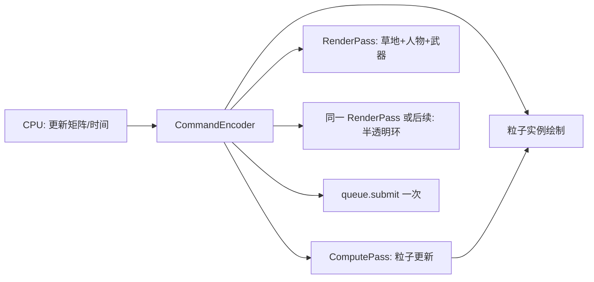

# WebGPU 渲染原理与 Shader 博客 + Demo

## 范围约定

- **不探索**现有工程其它目录；只新增 [`blog/webgpu-shader.md`](blog/webgpu-shader.md) 与 [`webgpu-shader-demo/`](webgpu-shader-demo/)。
- 原文来源：[`blog/webgpu-raw.md`](blog/webgpu-raw.md)（问答式对话）。博客**不照搬问答**，按教学顺序串联知识点，并修正原文中的错误/过度简化。

---

## 一、博客：`blog/webgpu-shader.md`

### 重组后的文章骨架（由浅入深）

1. **开篇：Shader 是什么、为何需要它**
   - CPU 串行 vs GPU 大规模并行
   - 结论：光影/魔法/水面等最终像素颜色由 Shader 决定

2. **渲染管线全景**
   - 可编程：Vertex Shader →（硬件光栅化）→ Fragment Shader
   - 固定功能：深度/模板测试、颜色混合
   - 旁路：Compute Shader（不直接画像素）

3. **VS / FS 分工与武器魔法案例**
   - VS：形状、骨骼/矩阵动画、水面顶点扰动
   - FS：PBR 光影、流光、菲涅尔等
   - **外围法术 ≠ 武器本体 FS 凭空生成**：独立薄网格/粒子/后处理全屏面片（纠正「一个模型像素能画出周围光」的误解）

4. **一帧如何跑起来：CPU 合批 + GPU 流水线**
   - CPU：逻辑更新 → 材质合批 → 写入 CommandBuffer → 一次 `submit`
   - GPU：批次间串行切换管线；批次内 VS/光栅/FS（及深度、混合）流水重叠
   - 否定两种错误模型：「逐物体 VS→FS」与「全场景先全部 VS 再全部 FS」

5. **submit、队列、卡帧与内存**
   - `submit` 不阻塞；多帧排队；队列满/VSync/`rAF` 限流 → 掉帧而非无限堆积
   - 指令在系统 RAM，顶点/贴图/Storage 在 VRAM；`submit` 只移交指令清单

6. **深度、混合与半透明顺序**
   - 片元级：FS 后立刻深度测试与混合（逻辑管线）
   - 批次：不透明先、半透明后；半透明依赖已写入的帧缓冲底色

7. **Compute Shader 与图形管线**
   - 用途：粒子更新、物理、GPGPU
   - 附带一个**修正后**的最小数组求和示例（见下方核验）
   - 说明与渲染同队列的顺序语义（见下方核验）

8. **UI / 文字（收束扩展）**
   - 图集、九宫格、字体 Atlas / SDF；3D 之后再画 UI/文字批次

9. **学习路径 + 指向 Demo**
   - 对应原文四门槛与四阶段路线，并链接本地 `webgpu-shader-demo`

文风对齐现有博客（如 [`blog/edge-server.md`](blog/edge-server.md)）：中文、小标题清晰、必要代码块、少用表格堆砌。

### 知识点核验与纠正（写入博客时显式修正）

| 原文说法 | 核验结论 | 博客处理 |
|---|---|---|
| 求和示例里 `sumResult: f32` + `atomicAdd` | **错误**：WGSL 原子需 `atomic&lt;u32&gt;`/`atomic&lt;i32&gt;`；把 `f32` 转 `u32` 再累加也不等于浮点求和 | 改为 `atomic&lt;u32&gt;` 整型求和，或工作组归约 + 原子加总和；注明正确类型 |
| 同一次 CommandBuffer 内 Compute+Render「硬件自动并行、无等待」 | **过度简化**：WebGPU 默认单队列有序；同 CB 内 Pass 按录制顺序，有资源依赖会自动屏障；无依赖时驱动*可能*重叠，**非 API 保证**；真多队列并行 WebGPU 1.0 基本不可用 | 改为：同 CB 可减少提交开销并让驱动做依赖同步；分开两次 `submit` 一定按队列串行；勿承诺「保证并行」 |
| FS → 深度 → 混合为固定五步 | **教学可用，略简化**：现代 GPU 常有 Early-Z（深度可在 FS 前） | 以逻辑管线讲解，脚注 Early-Z |
| 批次间必须排空流水线再切 shader | **基本正确**（状态切换代价） | 保留，强调合批意义 |
| `submit` 指令在 RAM、资源在 VRAM | **正确** | 保留 |
| 合批、半透明顺序、法术独立网格、粒子 Compute+实例绘制 | **正确** | 作为主线保留 |
| Firefox 115+ 即可 WebGPU | **偏乐观** | 写 Chrome/Edge 稳定支持，其它浏览器以实际为准 |

---

## 二、Demo：`webgpu-shader-demo/`

纯前端 WebGPU 工程（Vite + 原生 JS/TS + WGSL），无 Three.js，便于和博客概念一一对应。

### 目录结构

```
webgpu-shader-demo/
  package.json          # vite
  index.html
  src/
    main.js             # 设备初始化、rAF 循环、一次 submit（compute + 多 render pass）
    math.js             # mat4/vec3 工具
    geometry.js         # 程序化网格：人形、武器棒、环带、地面
    scene.js            # 动画：武器轻轻摆动、环跟随武器
    pipelines/
      character.js      # 不透明：人物+武器+草地
      aura.js           # 半透明环线法术
      particles.js      # 粒子渲染（广告牌）
      computeParticles.js # Compute 更新粒子
    shaders/
      *.wgsl
  README.md             # 启动：npm i && npm run dev；需 Chrome/Edge
```

### 画面与实现要点



1. **草地**：大平面 + 简单程序化绿色片段（噪声条纹模拟草感），不透明批次。
2. **人物**：程序化几何（头球体 + 躯干/四肢胶囊或方块拼接），Lambert/简单光照即可。
3. **武器**：手部挂点矩阵 × `sin(time)` 小幅摆动；金属感简单高光。
4. **环线法术**：武器周围独立圆环/薄环网格；VS 跟随武器；FS 用 `time` 滚动 UV + 边缘 alpha + 发光色；透明混合，在不透明之后绘制。
5. **头顶粒子（Compute）**：
   - StorageBuffer 存 `{pos, vel, life}`，约 2k–8k 粒子
   - Compute：从头部位置发射，向上漂移 + 轻微横向噪声，生命周期结束后重生
   - Render：实例化四边形广告牌，FS 画软圆光斑
   - **同一帧同一 CommandEncoder**：先 `beginComputePass`，再 `beginRenderPass`（粒子读 Compute 写出的 buffer，依赖由实现自动同步）

### 运行与兼容

- `npm install && npm run dev`，浏览器打开本地地址
- 入口检测 `navigator.gpu`，不支持时页面提示

---

## 三、交付物

- [`blog/webgpu-shader.md`](blog/webgpu-shader.md)：重组 + 核验后的技术博文
- [`webgpu-shader-demo/`](webgpu-shader-demo/)：可运行的 WebGPU 演示（人物、摆动武器、环法术、草地、Compute 粒子）

---

## 四、迭代：§2「系统内存 vs 显存」表述收紧（待执行）

### 问题

[`blog/webgpu-shader.md`](blog/webgpu-shader.md) 约 L53–77 想说明原文结论：

> `device.queue.submit()` 提交的**命令指令本身**在系统内存（CPU RAM）；顶点、贴图、Storage Buffer 等**渲染资源本体**一直在显存（VRAM）；`submit` 只移交指令清单，不会把模型/贴图再拷一遍。

当前写法不清晰之处：

1. 开篇两条 bullet 与后面表格职责重叠，读者要在两处拼凑结论。
2. 表格把「JS 上传源」「显存资源」「管线对象」「BindGroup」「CommandBuffer」五类东西平铺，**没突出「指令 vs 资源」这一对主轴**。
3. Pipeline / BindGroup 写成「住显存」易让人以为它们和顶点缓冲一样占 VRAM 业务数据；原文重点是 **CommandBuffer 在 RAM、网格/贴图在 VRAM**。
4. 缺少一句直白纠错：「❌ `submit` 把人物模型推进显存」vs「✅ 模型早在 `createBuffer` + `writeBuffer` 时已在显存」。

### 改写策略（执行时直接改 `webgpu-shader.md` §2 开头至表格）

用「先结论 → 再分两类 → 再流程」三段，**删掉过宽的六行表格**，改成两栏对照 + 一句流程：

**拟替换文案（定稿方向）：**

```markdown
可以把 CPU / GPU 协作先压成一句（对应 `submit` 在干什么）：

- **指令清单（CommandBuffer）住在系统内存（RAM）**：`CommandEncoder` 录制的 `setPipeline` / `draw` / `dispatch` 等，是浏览器进程里的一张「操作菜单」；`device.queue.submit([...])` 把这张菜单的所有权交给驱动队列——**仍然主要在系统内存侧排队**，现代 GPU 常靠 DMA 直接读这份指令，而不是先整份拷进显存。
- **渲染资源本体住在显存（VRAM）**：`createBuffer` / `createTexture` 得到的顶点、索引、Uniform、Storage、深度/颜色纹理等，从创建起就常驻显卡；GPU 执行 `draw` 时按指令里的资源句柄去 **VRAM** 取数。

因此：

| 东西 | 在哪 | `submit` 会不会再搬一次 |
|---|---|---|
| JS 里的 `Float32Array`（算好的顶点、本帧矩阵） | 系统内存 | 不会；要进 GPU 得靠启动时/每帧的 `queue.writeBuffer`（或映射写入）**显式上传** |
| `GPUBuffer` / `GPUTexture`（网格、贴图、粒子 Storage、帧缓冲） | 显存 | **不会**；`submit` 不携带顶点像素，只写「去读几号缓冲、画几次」 |
| `GPUCommandBuffer`（`encoder.finish()` 的结果） | 系统内存里的指令清单 | **会移交**这份清单给队列；移交的是指令，不是模型本体 |

常见误解：以为每帧 `submit` 都会把人物、武器网格再推一遍进显卡。  
事实是：网格早已在显存；每帧最多再 `writeBuffer` 更新一小段 Uniform（矩阵、时间），然后 `submit` 一张操作清单让 GPU 去显存里画。
```

后续小节 2.1 里「创建长期资源」小节可改为短列表（顶点缓冲、深度纹理、两套管线、BindGroup），**不再重复「住哪」表**；管线/BindGroup 只写「绑定到已有显存资源的轻量对象 / 已编译管线状态」，避免和 VRAM 业务数据混谈。

### 不改动的范围

- Demo 代码与其它章节结构不动。
- 仅收紧 §2 内存分工表述，使与 [`blog/webgpu-raw.md`](blog/webgpu-raw.md) L769–810 对齐且更易扫读。
