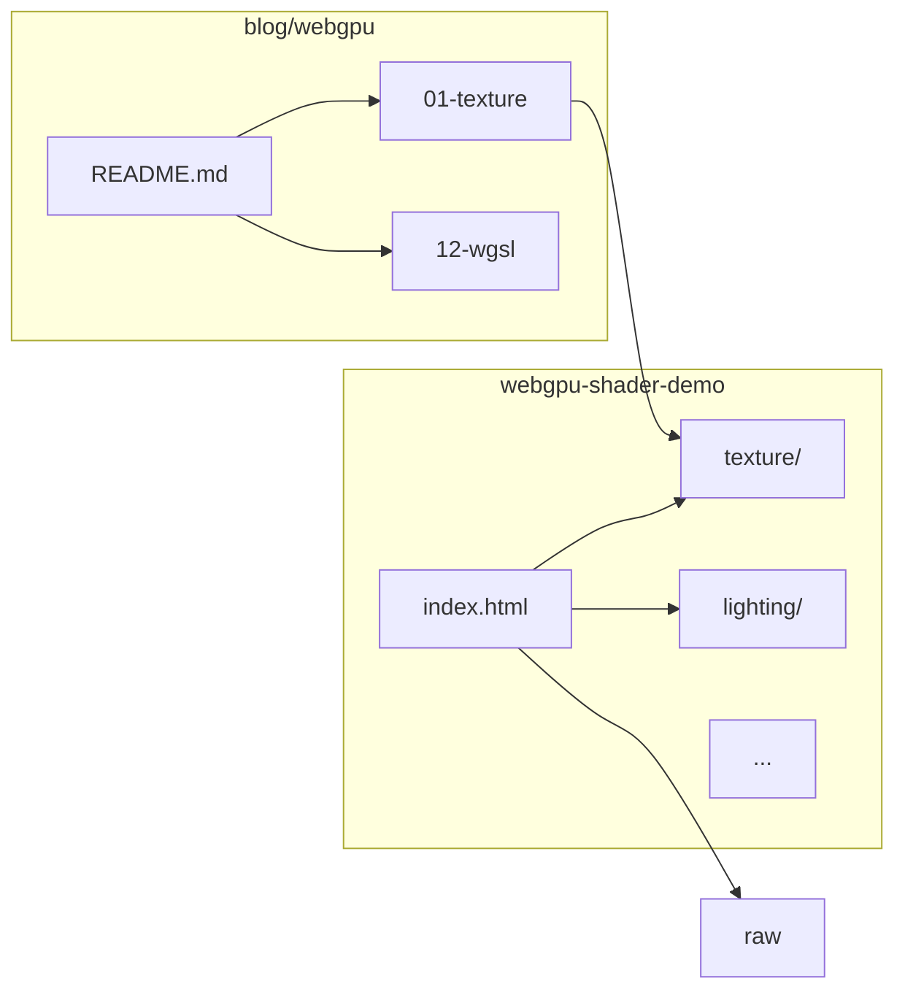

# WebGPU 进阶系列：文档与 Demo 规划

## 目标结构

```text
blog/webgpu/
  README.md                 # 系列索引 + 前置阅读链接
  01-texture-sampling.md
  02-lighting.md
  ...
  12-wgsl-guide.md

webgpu-shader-demo/
  index.html                # 分组展示全部入口
  vite.config.js            # 注册全部 HTML 入口
  README.md                 # 更新说明
  raw/ three/ compute/      # 保留现有综合示例
  texture/ lighting/ ...    # 12 个新专题 demo（互不 import 彼此）
```

## 前置阅读（不移动文件）

[`blog/webgpu/README.md`](blog/webgpu/README.md) 开头链到：

- [`blog/webgpu-shader.md`](../webgpu-shader.md) — 渲染原理、批次、Shader 链路
- [`blog/webgpu-secret.md`](../webgpu-secret.md) — format / texture / GPU 内部原理

现有 [`raw/`](webgpu-shader-demo/raw/)、[`three/`](webgpu-shader-demo/three/)、[`compute/`](webgpu-shader-demo/compute/) 作为 **综合示例**，与新专题 demo 并列展示。

---

## 独立 Demo 约定

每个专题文件夹 **完全自包含**，不 `import` 其他 demo 目录：

| 规则 | 说明 |
|------|------|
| 文件结构 | `index.html` + `main.js` + `shaders/*.wgsl` + 可选 `assets/` |
| 工具代码 | 各 demo 自带精简版 `utils/`（device 初始化、resize、depth 重建、mat4 等，约 80–120 行），从 [`raw/math.js`](webgpu-shader-demo/raw/math.js) 等 **复制** 而非共享模块 |
| 贴图资源 | 小 PNG 放在各 demo 的 `assets/` 内（不建全局 assets 目录） |
| HUD | 统一风格：标题 + 1–2 行说明 + `← 返回选择` 链到 `/` |
| 复杂度 | 每个 demo **只演示一个主题**，场景尽量小（单物体 / 少 draw / 可切换模式） |



---

## 12 篇文档 + 对应 Demo

### 01 纹理与采样 — `texture/`

**文档** [`blog/webgpu/01-texture-sampling.md`](blog/webgpu/01-texture-sampling.md)

- `createTexture` / `writeTexture` / `copyExternalImageToTexture`
- `GPUTextureView`、`GPUSampler`（filter、addressMode）
- WGSL：`texture_2d` + `sampler`、`textureSample` vs `textureLoad`
- Mipmap 概念（可选生成或预建）
- 与 [`webgpu-secret.md`](../webgpu-secret.md) §2 format 的衔接

**Demo** `webgpu-shader-demo/texture/`

- 旋转立方体（或四边形），albedo 贴图 + UV
- HUD 切换：`nearest` / `linear`、`repeat` / `clamp`
- 资源：`assets/checker.png`（64×64 程序化生成后写入亦可）

---

### 02 光照模型 — `lighting/`

**文档** [`blog/webgpu/02-lighting.md`](blog/webgpu/02-lighting.md)

- 法线变换（逆转置矩阵）
- Lambert 漫反射 → Blinn-Phong 镜面
- 方向光 Uniform 结构
- 为后续 PBR 做概念铺垫（不实现完整 PBR）

**Demo** `webgpu-shader-demo/lighting/`

- 带法线的球体或八面体（程序化顶点，无法线贴图）
- 鼠标/时间驱动光源方向
- 分步模式：仅 ambient → +diffuse → +specular（键盘 1/2/3 切换）

---

### 03 显式 BindGroupLayout — `bind-group/`

**文档** [`blog/webgpu/03-bind-group-layout.md`](blog/webgpu/03-bind-group-layout.md)

- `createBindGroupLayout` + `createPipelineLayout` 替代 `layout: "auto"`
- binding 规划：group0 全局（viewProj）、group1 per-object（model + material）
- 多 material 共用同一 layout、不同 bindGroup

**Demo** `webgpu-shader-demo/bind-group/`

- 3 个立方体，同一 pipeline，不同 `@group(1)` bindGroup（颜色/贴图参数不同）
- 代码注释标出 layout 与 auto 的差异

---

### 04 离屏渲染与后处理 — `postprocess/`

**文档** [`blog/webgpu/04-offscreen-postprocess.md`](blog/webgpu/04-offscreen-postprocess.md)

- `RENDER_ATTACHMENT | TEXTURE_BINDING` 用途组合
- 两 Pass：场景 Pass → 全屏三角形采样 Pass
- `loadOp`/`storeOp` 在离屏与交换链上的差异
- 简单 Bloom 或 tone mapping（选一种，文档两种都讲，demo 实现 Bloom 轻量版）

**Demo** `webgpu-shader-demo/postprocess/`

- Pass1：彩色旋转立方体 → offscreen RT
- Pass2：全屏 pass，阈值提取 + 简易 blur + 合成
- 按键开关后处理对比

---

### 05 阴影映射 — `shadow/`

**文档** [`blog/webgpu/05-shadow-mapping.md`](blog/webgpu/05-shadow-mapping.md)

- 光源空间 depth-only Pass
- 主 Pass 比较 shadow map
- shadow acne / bias / PCF 基础

**Demo** `webgpu-shader-demo/shadow/`

- 地面 + 2–3 个立方体 + 一个方向光
- 可切换：无阴影 / hard shadow / PCF soft
- 第二套 depth texture 作 shadow map

---

### 06 透明排序 — `transparency/`

**文档** [`blog/webgpu/06-transparency.md`](blog/webgpu/06-transparency.md)

- 回顾 [`raw/`](webgpu-shader-demo/raw/) 的不透明→半透明批次策略
- depth write 开/关、混合方程
- 错误顺序 vs 按距离排序
- OIT 简介（文档级，demo 不实现）

**Demo** `webgpu-shader-demo/transparency/`

- 3 个 intersecting 半透明平面
- 切换：固定 draw 顺序（错误）/ 按相机距离排序（正确）
- 与 opaque 底面组合

---

### 07 GPU Instancing — `instancing/`

**文档** [`blog/webgpu/07-instancing.md`](blog/webgpu/07-instancing.md)

- `draw` / `drawIndexed` 的 `instanceCount`
- `@builtin(instance_index)` + instance buffer
- 与多次 draw 的性能对比

**Demo** `webgpu-shader-demo/instancing/`

- 10k 实例小立方体/草片（instance buffer 存 model 矩阵或 position+color）
- HUD 显示 draw 次数；切换 instancing on/off（off 时限制为 ~100 实例避免卡死）

---

### 08 Compute 进阶 — `compute-advanced/`

**文档** [`blog/webgpu/08-compute-advanced.md`](blog/webgpu/08-compute-advanced.md)

- workgroup、`var<workgroup>`、`workgroupBarrier`
- Compute 写 Storage → Render 读（与 [`compute/`](webgpu-shader-demo/compute/) 基础版区分）
- 简单粒子或图像处理

**Demo** `webgpu-shader-demo/compute-advanced/`

- 2D 网格上的 Conway 生命游戏 **或** GPU 粒子（workgroup 共享加速）
- 与现有 `compute/pure-compute-shader.js`（数组求和验证）形成互补，首页 tag 区分

---

### 09 骨骼动画 — `skinning/`

**文档** [`blog/webgpu/09-skinning.md`](blog/webgpu/09-skinning.md)

- 骨骼层次、绑定姿态、权重
- VS 内 joint matrix 混合（最多 4 bone weights）
- CPU 算 joint vs GPU skinning 取舍

**Demo** `webgpu-shader-demo/skinning/`

- 简易 2 骨骼「手臂」网格（8–16 顶点），sin 驱动关节角
- 线框 + 实体切换，展示蒙皮前后对比

---

### 10 资源生命周期 — `lifecycle/`

**文档** [`blog/webgpu/10-resource-lifecycle.md`](blog/webgpu/10-resource-lifecycle.md)

- resize 时 depth / MSAA / RT 一并重建（扩展 [`webgpu-secret.md`](../webgpu-secret.md) 的 `recreateDepth`）
- `destroy()` 时机、device.lost
- staging buffer、`mapAsync` 双缓冲上传模式

**Demo** `webgpu-shader-demo/lifecycle/`

- 可拖拽 resize 的 canvas + 实时统计（texture/buffer 数量、显存估算文字说明）
- 按钮触发「故意 destroy 再重建 depth」演示 validation 与修复
- 偏工程演示，视觉可简单（旋转三角形即可）

---

### 11 性能分析与优化 — `performance/`

**文档** [`blog/webgpu/11-performance.md`](blog/webgpu/11-performance.md)

- 减少 pipeline/bindGroup 切换、合批
- overdraw、Early-Z 概念
- Chrome DevTools / `timestamp-query`（若可用）简介

**Demo** `webgpu-shader-demo/performance/`

- 两种渲染路径：N 次 draw 各换 bindGroup vs 合批 instancing
- HUD：`setPipeline` / `draw` 计数、帧时间（`performance.now()`）
- 按键切换模式

---

### 12 WGSL 指南 — `wgsl/`

**文档** [`blog/webgpu/12-wgsl-guide.md`](blog/webgpu/12-wgsl-guide.md)

- 类型、`@location`/`@builtin`/`@group`/`@binding`
- `@interpolate`、精度、与 GLSL 对照表
- 常见编译错误解读

**Demo** `webgpu-shader-demo/wgsl/`

- 极简 fragment 效果切换（渐变 / 噪声 / 环），WGSL 源码在页面侧栏或 HUD 切换展示
- 强调 shader 可读性，非完整 3D 场景

---

## 首页与构建改造

### [`webgpu-shader-demo/index.html`](webgpu-shader-demo/index.html)

重组为两个 `<section>`：

1. **综合示例**：`compute/`、`raw/`、`three/`（保留现有三卡片）
2. **专题教程**（按 01–12 顺序）：12 张卡片，tag 显示编号，链到 `/texture/`、`/lighting/` 等

更新 header 文案：说明系列配合 [`blog/webgpu/`](../blog/webgpu/) 阅读。

### [`webgpu-shader-demo/vite.config.js`](webgpu-shader-demo/vite.config.js)

`rollupOptions.input` 补充全部入口（含现有缺失的 `compute/index.html`）：

```js
input: {
  main: resolve(__dirname, "index.html"),
  compute: resolve(__dirname, "compute/index.html"),
  raw: resolve(__dirname, "raw/index.html"),
  three: resolve(__dirname, "three/index.html"),
  texture: resolve(__dirname, "texture/index.html"),
  lighting: resolve(__dirname, "lighting/index.html"),
  // ... 其余 10 个
}
```

### [`webgpu-shader-demo/README.md`](webgpu-shader-demo/README.md)

- 增加专题 demo 表格（路径 ↔ 博客文章）
- 说明各文件夹独立、无交叉依赖

---

## 文档写作规范（全系列统一）

- 语言：简体中文，风格对齐现有 [`webgpu-shader.md`](blog/webgpu-shader.md)（原理 + 代码 + 表格）
- 每篇结构：**目标 → 概念 → API/WGSL → 与前置知识衔接 → Demo  walkthrough → 常见错误 → 延伸阅读**
- 代码引用 demo 内真实路径，如 `` [`texture/main.js`](../webgpu-shader-demo/texture/main.js) ``
- 篇末链到下一篇 + 对应 demo URL（dev 路径）

---

## 分批次实现建议（一次 PR 体量可控）

| 批次 | 内容 | 预估 |
|------|------|------|
| **Batch A** | README + 01–03 文档 + texture/lighting/bind-group demo + index/vite 骨架 | 基础能力 |
| **Batch B** | 04–06 文档 + postprocess/shadow/transparency demo | 多 Pass |
| **Batch C** | 07–09 文档 + instancing/compute-advanced/skinning demo | GPU 进阶 |
| **Batch D** | 10–12 文档 + lifecycle/performance/wgsl demo + README 收尾 | 工程化 |

每批完成后均可独立运行 `npm run dev` 验证全部已注册入口。

---

## 不在本次范围

- 不移动或改写 [`webgpu-shader.md`](blog/webgpu-shader.md) / [`webgpu-secret.md`](blog/webgpu-secret.md) 正文
- 不修改 `raw/`、`three/` 现有逻辑（仅首页增加专题区链接）
- 不引入新 npm 依赖（保持纯 WebGPU + 现有 three 可选路径）
