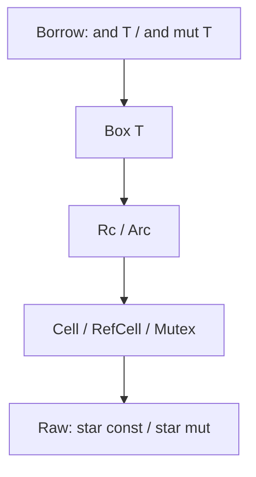

# 03 · 引用与智能指针

> 上一篇：[集合与结构体](./02-collections-structs.md) · 下一篇：[Trait 分类与内存布局](./04-traits.md)

Rust 里的「指针」首先是 **借用**，其次才是堆上的智能指针；裸指针（`*const T` / `*mut T`）出现得更晚、更窄。本章按用途分类，每类覆盖：创建 → 解引用/修改 → 典型场景 → 常见错误。

---

## 1. 总览

| 类型 | 所有权 | 可变性 | 线程 | 一句话 |
| --- | --- | --- | --- | --- |
| `&T` | 借用 | 不可变 | 视 `T` | 只读视图 |
| `&mut T` | 独占借用 | 可变 | 视 `T` | 唯一可变入口 |
| `Box<T>` | 独占、在堆上 | 通过 `Box`/`&mut` | 可跨线程若 `T: Send` | 递归类型、堆分配 |
| `Rc<T>` | 共享（单线程） | 默认不可变 | 否 | 多所有权 |
| `Arc<T>` | 共享（原子） | 默认不可变 | 是 | 多线程共享 |
| `Cell<T>` | 内部 | `Copy` 替换 | 否 | 无运行时借用检查 |
| `RefCell<T>` | 内部 | 运行时借用规则 | 否 | 单线程内部可变 |
| `Mutex<T>` / `RwLock<T>` | 内部 | 锁保护 | 是 | 并发内部可变 |
| `*const T` / `*mut T` | 无生命周期 | 需 `unsafe` 解引用 | — | FFI / 底层 |



---

## 2. 借用：`&T` 与 `&mut T`

### 2.1 规则（编译期）

同一作用域内，对同一数据：

- 任意多个 `&T`，**或**
- 唯一一个 `&mut T`

不能并存。

```rust
fn borrow_rules() {
    let mut x = 5;
    let r1 = &x;
    let r2 = &x;
    println!("{r1}, {r2}");
    // 这里 r1/r2 的最后一次使用已结束，可以再借可变
    let r3 = &mut x;
    *r3 += 1;
    println!("{x}");
}
```

### 2.2 解引用与自动解引用

```rust
fn deref_basics() {
    let mut n = 10;
    let p = &mut n;
    *p += 1; // 显式解引用赋值

    let s = String::from("hello");
    let r = &s;
    // 方法调用会自动 Deref：&String → &str
    assert_eq!(r.len(), 5);
}
```

### 2.3 再借用（reborrow）

编译器常把 `&mut T` 临时再借成更短的 `&T` 或 `&mut T`：

```rust
fn reborrow(v: &mut Vec<i32>) {
    let first = &mut v[0]; // 再借用到元素
    *first += 1;
    // 结束后才能再整体用 v
    v.push(9);
}
```

### 2.4 返回引用：生命周期直觉

```rust
fn longer<'a>(a: &'a str, b: &'a str) -> &'a str {
    if a.len() >= b.len() {
        a
    } else {
        b
    }
}

// 不能返回指向函数内局部变量的引用
// fn bad() -> &str {
//     let s = String::from("x");
//     &s // error：s 被 drop
// }
```

---

## 3. 胖指针：切片与 `dyn`

普通引用 `&i32` 通常是 **一个指针宽**。下列是 **胖指针**（两个机器字：数据指针 + 元数据）：

| 类型 | 元数据含义 |
| --- | --- |
| `&[T]` / `&mut [T]` | 长度 |
| `&str` | 字节长度 |
| `&dyn Trait` / `Box<dyn Trait>` | vtable 指针（见 [04](./04-traits.md)） |

```rust
fn fat_pointers() {
    let arr = [10, 20, 30, 40];
    let s: &[i32] = &arr[1..3]; // 指向 20,30，带长度 2
    assert_eq!(s.len(), 2);

    let text: &str = "你好"; // 指向 UTF-8 字节，len 以字节计
    assert_eq!(text.len(), 6);

    // 栈上引用的「薄 / 胖」尺寸（目标平台相关，示意）
    println!(
        "size &i32={}, size &[i32]={}",
        std::mem::size_of::<&i32>(),
        std::mem::size_of::<&[i32]>()
    );
}
```

---

## 4. `Box<T>`：独占堆分配

### 4.1 基本用法

```rust
fn box_basic() {
    let b = Box::new(5);
    println!("{b}"); // 实现了 Display 的解引用打印
    let n = *b; // T: Copy 时可解出副本
    assert_eq!(n, 5);

    let mut b = Box::new(String::from("hi"));
    b.push_str("!"); // DerefMut → &mut String
    let owned: String = *b; // 移出堆上值，Box 被消费
    assert_eq!(owned, "hi!");
}
```

### 4.2 递归类型

没有 `Box`，编译器算不出无限大小的类型：

```rust
enum List {
    Cons(i32, Box<List>),
    Nil,
}

fn list_demo() -> List {
    List::Cons(1, Box::new(List::Cons(2, Box::new(List::Nil))))
}
```

### 4.3 堆上 Trait 对象

```rust
trait Draw {
    fn draw(&self);
}

struct Circle;
impl Draw for Circle {
    fn draw(&self) {
        println!("circle");
    }
}

fn paint(obj: Box<dyn Draw>) {
    obj.draw();
}

fn use_paint() {
    paint(Box::new(Circle));
}
```

---

## 5. `Rc<T>` / `Weak<T>`：单线程共享所有权

```rust
use std::rc::{Rc, Weak};

fn rc_basic() {
    let a = Rc::new(String::from("shared"));
    let b = Rc::clone(&a); // 强引用计数 +1，不深拷贝字符串
    let c = a.clone();     // 同上
    assert_eq!(Rc::strong_count(&a), 3);
    println!("{b}, {c}");
}
```

**不能**通过 `Rc<T>` 直接可变修改内部（除非配 `RefCell`，见下节）。多线程请用 `Arc`。

### 5.1 避免循环引用：`Weak`

父子树常见模式：父持 `Rc` 孩子，孩子持 `Weak` 父。

```rust
use std::cell::RefCell;
use std::rc::{Rc, Weak};

struct Node {
    value: i32,
    parent: RefCell<Weak<Node>>,
    children: RefCell<Vec<Rc<Node>>>,
}

fn tree() {
    let leaf = Rc::new(Node {
        value: 3,
        parent: RefCell::new(Weak::new()),
        children: RefCell::new(vec![]),
    });

    let branch = Rc::new(Node {
        value: 5,
        parent: RefCell::new(Weak::new()),
        children: RefCell::new(vec![Rc::clone(&leaf)]),
    });

    *leaf.parent.borrow_mut() = Rc::downgrade(&branch);

    if let Some(p) = leaf.parent.borrow().upgrade() {
        println!("parent value = {}", p.value);
    }
}
```

`upgrade` 得到 `Option<Rc<_>>`：父已释放则为 `None`。

---

## 6. `Arc<T>`：多线程共享

```rust
use std::sync::Arc;
use std::thread;

fn arc_demo() {
    let data = Arc::new(vec![1, 2, 3]);
    let mut handles = vec![];

    for i in 0..3 {
        let data = Arc::clone(&data);
        handles.push(thread::spawn(move || {
            println!("thread {i}: len={}", data.len());
        }));
    }

    for h in handles {
        h.join().unwrap();
    }
}
```

`Arc` 本身只保证共享只读。要跨线程改内容，用 `Arc<Mutex<T>>` 或 `Arc<RwLock<T>>`（见第 8 节与 [06](./06-async-threads.md)）。

---

## 7. 内部可变性：`Cell` / `RefCell`

即便外部只有 `&T`，内部也能改——规则从「编译期」挪到「API / 运行时」。

### 7.1 `Cell<T>`（适合 `T: Copy`）

```rust
use std::cell::Cell;

fn cell_demo() {
    let c = Cell::new(1);
    let r = &c;
    r.set(2); // 通过共享引用替换
    assert_eq!(r.get(), 2);
}
```

没有「借用守卫」；适合计数器、标志位等小 `Copy` 值。

### 7.2 `RefCell<T>`（运行时借用检查）

```rust
use std::cell::RefCell;

fn refcell_demo() {
    let data = RefCell::new(vec![1, 2]);
    {
        let mut borrowed = data.borrow_mut();
        borrowed.push(3);
    } // 守卫 drop，释放运行时锁

    assert_eq!(data.borrow().len(), 3);

    // 同时 borrow_mut 两次会 panic（debug/runtime）
    // let a = data.borrow_mut();
    // let b = data.borrow_mut();
}
```

经典组合：**`Rc<RefCell<T>>`**——多所有权 + 内部可变（单线程）。

```rust
use std::cell::RefCell;
use std::rc::Rc;

fn rc_refcell() {
    let shared = Rc::new(RefCell::new(0));
    let a = Rc::clone(&shared);
    let b = Rc::clone(&shared);
    *a.borrow_mut() += 1;
    *b.borrow_mut() += 2;
    assert_eq!(*shared.borrow(), 3);
}
```

---

## 8. `Mutex` / `RwLock`：并发内部可变

```rust
use std::sync::{Arc, Mutex};
use std::thread;

fn mutex_demo() {
    let counter = Arc::new(Mutex::new(0));
    let mut handles = vec![];

    for _ in 0..8 {
        let counter = Arc::clone(&counter);
        handles.push(thread::spawn(move || {
            let mut guard = counter.lock().unwrap();
            *guard += 1;
        }));
    }

    for h in handles {
        h.join().unwrap();
    }
    assert_eq!(*counter.lock().unwrap(), 8);
}
```

```rust
use std::sync::RwLock;

fn rwlock_demo() {
    let lock = RwLock::new(5);
    {
        let r1 = lock.read().unwrap();
        let r2 = lock.read().unwrap(); // 多读可并存
        assert_eq!(*r1, *r2);
    }
    {
        let mut w = lock.write().unwrap();
        *w += 1;
    }
}
```

死锁直觉：同一线程对同一把锁重复 `lock`（非可重入）、或交叉加锁顺序不一致。更多模式见 [06](./06-async-threads.md)。

---

## 9. 裸指针：`*const T` / `*mut T`

安全代码里偶尔会 **得到** 裸指针，但 **解引用** 必须 `unsafe`。常见来源：FFI、与 C 交互、实现底层数据结构。

```rust
fn raw_pointers() {
    let mut x = 42;
    let p: *const i32 = &x;
    let q: *mut i32 = &mut x;

    unsafe {
        assert_eq!(*p, 42);
        *q = 7;
    }
    assert_eq!(x, 7);

    // 从 Box 泄漏 / 收回（高级 API，需保证成对）
    let b = Box::new(9);
    let raw = Box::into_raw(b);
    unsafe {
        assert_eq!(*raw, 9);
        let _b = Box::from_raw(raw); // 重新接管并在 drop 时释放
    }
}
```

本系列不展开 exploit、UB 案例清单；原则是：**能靠借用与智能指针表达的，就不要用裸指针。**

---

## 10. 选型速查

| 需求 | 选择 |
| --- | --- |
| 只读看看 | `&T` |
| 独占修改 | `&mut T` |
| 递归 / 堆上单一所有者 | `Box<T>` |
| 单线程多所有者 | `Rc<T>` |
| 多线程多所有者只读 | `Arc<T>` |
| 单线程「看起来共享、实际要改」 | `Rc<RefCell<T>>` 或 `&RefCell<T>` |
| 多线程要改 | `Arc<Mutex<T>>` / `Arc<RwLock<T>>` |
| 小 `Copy` 内部计数 | `Cell<T>` |
| FFI | 裸指针 + `unsafe` 边界尽量薄 |

---

## 11. 易错点

1. **拿着 `&T` 想改**——改签名为 `&mut T`，或引入 `Cell`/`RefCell`/`Mutex`。
2. **`Rc` 跨线程**——应 `Arc`。
3. **`RefCell` 双借 panic**——缩小 `borrow`/`borrow_mut` 守卫作用域。
4. **`MutexGuard` 跨 `.await` 持有**——异步章会强调：应用 `tokio::sync::Mutex` 或缩短临界区（见 [06](./06-async-threads.md)）。
5. **`Box` 与 `Rc` 混用目标不清**——单一所有者用 `Box`，共享用 `Rc`/`Arc`。

---

## 12. 小结与下一章

指针族解决的是「谁拥有、谁能改、能不能共享」。下一章 [Trait 分类与内存布局](./04-traits.md) 会说明 `dyn Trait` 胖指针里的 vtable，以及标准库一批「像接口又像约定」的 Trait 如何分类使用。
