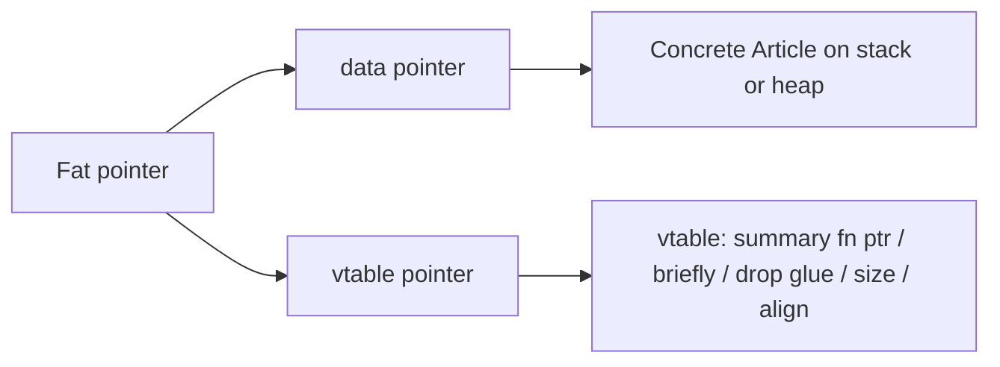

# 04 · Trait 分类与内存布局

> 上一篇：[引用与智能指针](./03-pointers.md) · 下一篇：[Option 与 Result](./05-option-result.md)

Trait 是 Rust 的行为抽象：既可以像「接口」约束泛型，也可以做成运行期的 `dyn Trait`。本章先巩固写法，再按类别扫标准库常用 Trait，最后讲清 **单态化** 与 **vtable 胖指针** 的内存布局。

---

## 1. Trait 基础

### 1.1 定义与实现

```rust
trait Summarize {
    fn summary(&self) -> String;

    // 默认方法
    fn briefly(&self) -> String {
        format!("(summary) {}", self.summary())
    }
}

struct Article {
    title: String,
    body: String,
}

impl Summarize for Article {
    fn summary(&self) -> String {
        format!("{}: {}...", self.title, &self.body[..self.body.len().min(16)])
    }
}

fn notify(item: &impl Summarize) {
    println!("{}", item.briefly());
}
```

### 1.2 Trait bound 与 `where`

```rust
use std::fmt::Display;

fn print_pair<T, U>(a: T, b: U)
where
    T: Display + Clone,
    U: Display,
{
    let _ = a.clone();
    println!("{a} | {b}");
}
```

### 1.3 关联类型 vs 泛型参数

```rust
trait Graph {
    type Node;
    type Edge;

    fn neighbors(&self, n: &Self::Node) -> Vec<Self::Edge>;
}

// 关联类型：实现者选定具体类型，调用方不必到处写 Graph<Node=X, Edge=Y>
// 泛型参数 trait Foo<T>：同一类型可对多种 T 分别实现（更灵活，推理更吵）
```

```rust
trait FromIterator2<A>: Sized {
    fn from_iter2<T: IntoIterator<Item = A>>(iter: T) -> Self;
}
```

### 1.4 派生与手动实现

```rust
#[derive(Debug, Clone, PartialEq, Eq, Hash, Default)]
struct Id(u64);
```

派生生成的是「按字段组合」的标准行为；需要自定义相等语义或格式时再手写 `impl`。

---

## 2. 标准 Trait 分类

### 2.1 标记 Trait（marker）

| Trait | 含义 |
| --- | --- |
| `Copy` | 按位复制，赋值不移动（需同时 `Clone`） |
| `Send` | 所有权可安全转到另一线程 |
| `Sync` | `&T` 可安全被多线程共享（即 `T` 可跨线程引用） |
| `Sized` | 编译期已知大小；`?Sized` 表示可为切片 / dyn 等 |

```rust
fn needs_send<T: Send>(_: T) {}
fn needs_sync<T: Sync + ?Sized>(_: &T) {}

// Rc<T> 不是 Send/Sync；Arc<T> 在 T: Send + Sync 时是
```

多数情况下你不手写 `unsafe impl Send/Sync`；理解边界即可。

### 2.2 转换：`From` / `Into` / `TryFrom` / `AsRef`

```rust
struct UserId(u64);

impl From<u64> for UserId {
    fn from(v: u64) -> Self {
        Self(v)
    }
}

fn take_id(id: impl Into<UserId>) {
    let id = id.into();
    let _ = id.0;
}

fn convert_demo() {
    take_id(42u64);
    take_id(UserId::from(7));

    let s = String::from("hi");
    let slice: &str = s.as_ref(); // AsRef<str for String>
    let _ = slice;
}
```

| Trait | 典型用途 |
| --- | --- |
| `From` / `Into` | 无损转换；优先实现 `From`，自动得 `Into` |
| `TryFrom` / `TryInto` | 可能失败的转换，返回 `Result` |
| `AsRef` / `AsMut` | 廉价借用转换（`String`→`str`，`Vec`→`[T]`） |
| `Borrow` / `ToOwned` | 哈希 map 查询等「拥有 ↔ 借用」抽象 |

`?` 运算符会调用 `From` 做错误类型转换（见 [05](./05-option-result.md)）。

### 2.3 比较与哈希

```rust
use std::cmp::Ordering;

#[derive(Eq, Debug)]
struct Version {
    major: u32,
    minor: u32,
}

impl PartialEq for Version {
    fn eq(&self, other: &Self) -> bool {
        self.major == other.major && self.minor == other.minor
    }
}

impl PartialOrd for Version {
    fn partial_cmp(&self, other: &Self) -> Option<Ordering> {
        Some(self.cmp(other))
    }
}

impl Ord for Version {
    fn cmp(&self, other: &Self) -> Ordering {
        (self.major, self.minor).cmp(&(other.major, other.minor))
    }
}
```

| Trait | 说明 |
| --- | --- |
| `PartialEq` / `Eq` | 相等；`Eq` 表示自反等更强约定（如 `f64` 只有 `PartialEq`） |
| `PartialOrd` / `Ord` | 排序；`BTreeMap` key 需要 `Ord` |
| `Hash` | 与 `Eq` 一致才能进 `HashMap` |

### 2.4 运算 Trait

```rust
use std::ops::Add;

#[derive(Debug, Clone, Copy)]
struct Meters(f64);

impl Add for Meters {
    type Output = Meters;
    fn add(self, rhs: Self) -> Self::Output {
        Meters(self.0 + rhs.0)
    }
}

fn ops_demo() {
    let a = Meters(1.5);
    let b = Meters(2.0);
    assert_eq!((a + b).0, 3.5);
}
```

同类还有 `Sub`、`Mul`、`Index`、`Deref` / `DerefMut`（智能指针的核心）等。

### 2.5 `Clone` / `Debug` / `Default` / `Drop`

```rust
#[derive(Debug, Clone, Default)]
struct Settings {
    retries: u32,
    verbose: bool,
}

struct Guard {
    name: String,
}

impl Drop for Guard {
    fn drop(&mut self) {
        println!("drop {}", self.name);
    }
}

fn drop_demo() {
    let g = Guard {
        name: "file".into(),
    };
    drop(g); // 提前析构
    // println!("{}", g.name); // 已 move
}
```

`Drop` 不能被手动「调用逻辑」两次；`drop(x)` 只是普通函数把值移走以触发析构。

### 2.6 迭代器三件套

```rust
struct Counter {
    cur: usize,
    max: usize,
}

impl Iterator for Counter {
    type Item = usize;
    fn next(&mut self) -> Option<Self::Item> {
        if self.cur < self.max {
            let v = self.cur;
            self.cur += 1;
            Some(v)
        } else {
            None
        }
    }
}

fn iter_demo() {
    let sum: usize = Counter { cur: 0, max: 5 }.sum();
    assert_eq!(sum, 10); // 0+1+2+3+4

    let v = vec![1, 2, 3];
    for x in &v {
        // &v 使用 IntoIterator for &Vec → Iter
        let _ = x;
    }
    let collected: Vec<_> = v.into_iter().map(|x| x * 2).collect(); // FromIterator
    assert_eq!(collected, vec![2, 4, 6]);
}
```

| Trait | 角色 |
| --- | --- |
| `Iterator` | `next` |
| `IntoIterator` | `for` 循环依赖；`into_iter` / `&` / `&mut` 三种 |
| `FromIterator` | `collect()` 的目标 |

### 2.7 闭包：`Fn` / `FnMut` / `FnOnce`

```rust
fn call_once<F: FnOnce()>(f: F) {
    f();
}

fn call_mut<F: FnMut(i32) -> i32>(mut f: F) -> i32 {
    f(1) + f(2)
}

fn call_fn<F: Fn(i32) -> i32>(f: F) -> i32 {
    f(1) + f(1)
}

fn closure_demo() {
    let s = String::from("x");
    call_once(|| println!("{s}")); // 可能吃掉捕获，FnOnce

    let mut acc = 0;
    let total = call_mut(|n| {
        acc += n;
        acc
    });
    assert_eq!(total, 3);

    let add1 = |n| n + 1;
    assert_eq!(call_fn(add1), 4);
}
```

关系：`Fn` ⊂ `FnMut` ⊂ `FnOnce`（能多次不可变调用的，也能作为更弱的 bound）。异步与线程里常要求 `FnOnce() + Send + 'static`。

---

## 3. 内存布局：单态化 vs `dyn Trait`

### 3.1 静态分发（单态化）

```rust
fn hello_static(x: &impl Summarize) {
    println!("{}", x.summary());
}
// 等价于泛型：
fn hello_generic<T: Summarize + ?Sized>(x: &T) {
    println!("{}", x.summary());
}
```

编译器为每个用到的具体 `T` **生成一份专用机器码**（monomorphization）。优点是可内联、无虚调用；缺点是代码体积可能变大。

### 3.2 动态分发：`dyn Trait`

```rust
fn hello_dyn(x: &dyn Summarize) {
    println!("{}", x.summary());
}

fn with_box(x: Box<dyn Summarize>) {
    println!("{}", x.summary());
}
```

`&dyn Summarize` / `Box<dyn Summarize>` 是 **胖指针**：



| 字段 | 作用 |
| --- | --- |
| data | 指向具体值（或堆上对象） |
| vtable | 指向该 **类型对应该 Trait** 的虚表：方法地址、析构、size/align 等 |

调用 `x.summary()` 时：查 vtable → 间接调用。同一函数可处理多种实现类型，但少了跨类型内联。

尺寸直觉：

```rust
fn sizes() {
    println!("&Article (thin) 通常 1 指针宽");
    println!("&dyn Summarize (fat) 通常 2 指针宽");
    println!(
        "size &dyn Summarize = {}",
        std::mem::size_of::<&dyn Summarize>()
    );
}
```

### 3.3 `impl Trait` 写在参数 / 返回值

```rust
fn returns_impl() -> impl Summarize {
    Article {
        title: "t".into(),
        body: "hello world body".into(),
    }
}

// 返回 dyn：需要统一类型或装箱
fn returns_dyn(flag: bool) -> Box<dyn Summarize> {
    if flag {
        Box::new(Article {
            title: "a".into(),
            body: "aaa".into(),
        })
    } else {
        Box::new(Article {
            title: "b".into(),
            body: "bbb".into(),
        })
    }
}
```

| 写法 | 分发 | 返回多种具体类型 |
| --- | --- | --- |
| `impl Trait` 参数 | 静态 | 调用方决定一种 |
| `impl Trait` 返回 | 静态 | **只能是一种** 隐藏类型 |
| `dyn Trait` | 动态 | 可以分支返回不同实现（通常 `Box`/`&`） |

### 3.4 Object safety（对象安全）直觉

并非所有 Trait 都能变成 `dyn Trait`。常见导致 **非对象安全** 的原因：

- 方法返回 `Self`
- 方法有泛型参数
- 需要 `Self: Sized` 的约束方式不兼容

```rust
trait Bad {
    fn clone_self(&self) -> Self; // 返回 Self：不能直接 dyn Bad
}

trait Good {
    fn name(&self) -> &str;
}
```

需要返回「同类」时，常见改法：返回 `Box<dyn Good>`，或不用 dyn、改走泛型。

### 3.5 超 Trait 与 Trait 对象强制

```rust
trait Screen: Summarize {
    fn pixels(&self) -> usize;
}

// &dyn Screen 可以当 &dyn Summarize 用（有强制转换规则）
```

---

## 4. 综合小例：静态与动态混用

```rust
trait Sink {
    fn send(&mut self, msg: &str);
}

struct StdoutSink;
impl Sink for StdoutSink {
    fn send(&mut self, msg: &str) {
        println!("{msg}");
    }
}

struct MemSink {
    buf: Vec<String>,
}
impl Sink for MemSink {
    fn send(&mut self, msg: &str) {
        self.buf.push(msg.to_string());
    }
}

// 静态：最快
fn pipe_static<S: Sink>(s: &mut S, msg: &str) {
    s.send(msg);
}

// 动态：可存异质列表
fn pipe_all(sinks: &mut [Box<dyn Sink>], msg: &str) {
    for s in sinks {
        s.send(msg);
    }
}

fn mix() {
    let mut a = StdoutSink;
    pipe_static(&mut a, "hello");

    let mut list: Vec<Box<dyn Sink>> = vec![
        Box::new(StdoutSink),
        Box::new(MemSink { buf: vec![] }),
    ];
    pipe_all(&mut list, "world");
}
```

---

## 5. 刻意不展开

- 特化（specialization，尚不稳定 / 受限）
- GAT（generic associated types）深水区
- 完全的 ABI / 布局 `#[repr]` 与 Trait 交互

知道它们存在即可；日常中高级代码优先掌握本章分类与 dyn 布局。

---

## 6. 易错点

1. **该用泛型却全程 `Box<dyn Trait>`**——热路径上白白付虚调用与分配。
2. **该存异质列表却死磕 `impl Trait` 返回**——分支两种类型编不过。
3. **为 `HashMap` 手写 `Hash` 却与 `Eq` 不一致**——查找诡异失败。
4. **在库 API 上滥用 `Clone` 派生大数据**——调用方误以为便宜。
5. **忘记 `?Sized`**——写成 `T: Trait` 后无法接 `str` / `dyn Trait`。

---

## 7. 小结与下一章

Trait 约束「能做什么」，布局决定「调用时付什么代价」。下一章 [Option、Result 与特有语法](./05-option-result.md) 把标准库里最常用的两个枚举，以及 `?`、`if let`、`let-else` 等语法一次收齐。
