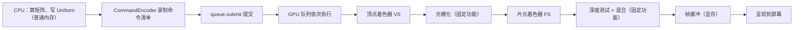

# WebGPU 开发入门：从设备初始化到渲染一帧

> 配套源码：`webgpu-shader-demo/raw/` —— [GitHub 仓库](https://github.com/shenjunjian/wasm-road-blog/tree/main/webgpu-shader-demo/raw)
> 文中代码片段均取自 `raw/` 下的源码，建议对照阅读。

## 一、序言：

我多次尝试入门 WebGL / WebGPU，结果都是"学而不入"，白白浪费时间。直到改用 AI 学习——有问必答，还能逐行解释——反而更快了。

回头看，卡住我的其实是两个误会：

1. **API 太多、太抽象。** 这是误区。WebGPU 的 API 是从三大现代底层图形 API（Vulkan、Metal、DirectX 12）抽象出来的**公共最小集**，真正核心的调用一只手数得过来。难的不是 API 数量，而是**脑子里没有显卡渲染的概念**。概念一通，API 全部串起来了。
2. **需要大量三维数学。** 也夸张了。入门只需要知道 3 维/4 维矩阵（用来做变换）和颜色（RGBA 与像素格式）这两块基础；剩下的（透视矩阵、lookAt、光照公式）由 AI 代劳。

本文假设一个最简单的游戏画面来演示WebGpu的用法：人物站在草地上，手里的武器轻轻摆动，剑身外环绕着流动的法术光环，头顶无数粒子往天上飞。**人物不做运动**，是为了把逻辑减到最少，同时又能看到显卡渲染的完整流程。

全文强调三个概念，请一直带着它们读：

1. **显卡渲染的一切都从三维建模开始。** 以前总觉得游戏里的光影效果很难，不知道怎么做出来的。任何渲染都是先建立顶点（三角形网格），武器外流动的光环就是制作一个圆环薄网格，通过片元着色器来实现特效，本质都是"先有几何，再着色"。
2. **分清 CPU 与 GPU 各自运行什么。** 哪些 buffer / 资源被写进**显存**，哪些数据与命令留在**普通内存**。这是第二章到第三章的重点。
3. **每一帧只需更新 uniform 等资源，然后重新创建命令清单。** 顶点数据进了一次显存就不动了；每帧变的只有矩阵、时间这类小数据。

整条链路可以压缩成一张图：



下面按"初始化 → 建数据 → 绑参数 → 建管线 → 渲染一帧"的顺序，用 `raw/` 的源码走一遍。

---

## 二、初始化设备


### 2.1 三层对象：GPU → Adapter → Device

```js
if (!navigator.gpu) { ... return; }
const adapter = await navigator.gpu.requestAdapter();
const device = await adapter.requestDevice();
const context = canvas.getContext("webgpu");

const format = navigator.gpu.getPreferredCanvasFormat();
context.configure({ device, format, alphaMode: "opaque" });
```

- `navigator.gpu`：浏览器暴露 WebGPU 的入口，不存在说明浏览器不支持。
- `adapter`：对应一块物理 GPU（或其驱动能力），回答"这块显卡支持什么"。
- `device`：**逻辑设备**，是后面所有 `createBuffer`、`createTexture`、`createRenderPipeline`、`queue.submit` 的入口；`device.queue` 是默认提交队列。
- `context`: 画布上下文
- `format` 是**画布颜色纹理的像素格式**，常见 `"bgra8unorm"`（多数 Windows / macOS）或 `"rgba8unorm"`（部分 Linux / Android）。

`context.configure()` 让浏览器创建一条与画布尺寸匹配的**交换链**，即向底层图形 API（D3D12 / Vulkan / Metal）申请 2～3 张 与 canvas 同尺寸的 颜色纹理，放在显存里。 `present` 时，OS 合成器会读这张纹理显示到屏幕。


### 2.2 监听画面 resize

```js
function resize() {
  const dpr = Math.min(window.devicePixelRatio || 1, 2);
  const w = Math.floor(canvas.clientWidth * dpr);
  const h = Math.floor(canvas.clientHeight * dpr);
  canvas.width = w;
  canvas.height = h;
  context.configure({ device, format, alphaMode: "opaque" });
  return { w, h };
}

function recreateDepth() {
  if (depthTexture) depthTexture.destroy();
  depthTexture = device.createTexture({
    size: [canvas.width, canvas.height],
    format: DEPTH_FORMAT,          // "depth24plus"
    usage: GPUTextureUsage.RENDER_ATTACHMENT,
  });
  depthView = depthTexture.createView();
}
```

`canvas.clientWidth / clientHeight` 是 CSS 尺寸，`canvas.width / height` 是物理像素。窗口变化后必须：

1. 按 `devicePixelRatio` 重新设置画布物理尺寸；
2. 重新 `configure`，让交换链按新尺寸生成颜色纹理；
3. 重建深度纹理，因为深度缓冲必须和画布一样大。

**不监听 resize 的后果**：窗口变大后，渲染结果要么被拉伸、要么只画满旧尺寸区域；深度附件尺寸与颜色附件不一致还会让 WebGPU 校验报错。

深度纹理记录"每个像素当前最近的表面离相机多远"，用来做遮挡。这里先记住两个事实：**它是显存里的纹理**；`createView()` 得到的 `depthView` 是给渲染管线用的"视图"。它最终会和 `context.getCurrentTexture()` 一起，作为 `beginRenderPass` 的深度附件与颜色附件传入——第七章再一起讲透。

---

## 三、创建 Buffer：把模型和材质送进显存

场景里的草地、人物、武器、法术环，全部来自 `geometry.js` 生成的 CPU 侧数组（位置 + 法线 + UV 交错排列的 `Float32Array`，加一个 `Uint16Array` 索引）。这些数据在**普通内存**，要画它们，得先搬进显存。`createGpuMesh`（定义在 `mesh.js`）干的就是这件事：

```js
const vertexBuffer = device.createBuffer({
  size: mesh.vertices.byteLength,
  usage: GPUBufferUsage.VERTEX | GPUBufferUsage.COPY_DST,
});
device.queue.writeBuffer(vertexBuffer, 0, mesh.vertices);

const indexBuffer = device.createBuffer({
  size: mesh.indices.byteLength,
  usage: GPUBufferUsage.INDEX | GPUBufferUsage.COPY_DST,
});
device.queue.writeBuffer(indexBuffer, 0, mesh.indices);
```

`main.js` 里就是四次调用 `createGpuMesh`，把四个网格上传成四个"顶点缓冲 + 索引缓冲"对。

### 3.1 顶点的存储方式与 shaderLocation 的作用

顶点缓冲只是一串字节，显卡并不知道"第 0~11 字节是位置、第 12~23 字节是法线"。所以每个项目都要回答两个问题：**数据在内存里怎么排**（由 `geometry.js` 的 `interleave` 决定），以及**GPU 怎么把字节切给 shader 的入参**（由 `VERTEX_LAYOUT` 决定）。

#### 交错存储：一个顶点 32 字节

`geometry.js` 先分别往 `positions / normals / uvs` 三个普通数组里收集数据，最后 `interleave()` 把它们**交错**成一个大 `Float32Array`：每个顶点连续放 8 个 float，顺序是 position(3) + normal(3) + uv(2)。

```js
// 顶点 i 在缓冲里的起始字节 = i * 32
// 偏移:   0        4        8       12       16       20       24       28
//        pos.x    pos.y    pos.z   nor.x    nor.y    nor.z    uv.x     uv.y
//        |-------- 12B 位置 --------|------- 12B 法线 -------|-- 8B UV --|
```

这就是**交错存储（interleaved）**。反过来的做法是**分离存储**：把所有 position 排在前面、所有 normal 排在中间、所有 uv 排在最后，甚至可以拆成多个顶点缓冲。WebGPU 两种都支持，本 demo 选交错是因为它**对 GPU 缓存友好**——取一个顶点时，它的位置、法线、UV 在内存里紧挨着，一次读入就能全部命中；缺点是同类属性不再连续，如果只想单独更新某一类属性，分离存储更方便。两种布局都能被 `VERTEX_LAYOUT` 描述，差别只在于 `arrayStride` 和 `offset` 怎么填。

顺带看索引缓冲：每个四边形只放 4 个顶点，`indices` 用 `Uint16Array` 记录"哪几个顶点组成三角形"（如地面是 `[0,2,1, 0,3,2]`），让相邻三角形**共享顶点**，不用重复存 position/normal/uv。`Uint16Array` 每个索引只占 2 字节，上限 65535 个顶点——demo 的网格远够用；顶点数超过 65536 时就要换成 `Uint32Array`，绘制时相应写 `setIndexBuffer(buf, "uint32")`。

#### VERTEX_LAYOUT：告诉 GPU 怎么切字节

```js
export const VERTEX_STRIDE = 8 * 4;        // 32 字节：一个顶点占 8 个 float
export const VERTEX_LAYOUT = {
  arrayStride: VERTEX_STRIDE,              // 相邻顶点起点相距 32 字节
  attributes: [
    { shaderLocation: 0, offset: 0,  format: "float32x3" }, // 位置，12B
    { shaderLocation: 1, offset: 12, format: "float32x3" }, // 法线，12B
    { shaderLocation: 2, offset: 24, format: "float32x2" }, // UV，8B
  ],
};
```

- **`arrayStride`**：从"顶点 i 的起点"到"顶点 i+1 的起点"的字节距离。这里正好等于 32，因为交错后每个顶点就是 8 个 float；
- **`attributes`**：描述顶点内部每个字段怎么取。`offset` 是该字段相对顶点起点的字节偏移；`format` 同时规定了**类型、分量数和字节数**——`float32x3` 是紧凑的 12 字节，顶点输入里没有 uniform 那种 16 字节对齐 padding，所以 offset 12、24 才能精确咬合。

#### shaderLocation：JS 缓冲 ↔ WGSL 入参的"插头"

WGSL 顶点着色器的入参用 `@location(n)` 声明，JS 侧 attribute 用 `shaderLocation: n` 声明，两边靠**同一个编号**对接：

```wgsl
@vertex
fn vs_main(
  @location(0) position: vec3f, // 对应 { shaderLocation: 0, offset: 0,  format: "float32x3" }
  @location(1) normal: vec3f,   // 对应 { shaderLocation: 1, offset: 12, format: "float32x3" }
  @location(2) uv: vec2f,       // 对应 { shaderLocation: 2, offset: 24, format: "float32x2" }
) -> VSOut { ... }
```

`shaderLocation` 不是字节偏移，而是一个**编号约定**：编号 0 表示"管线的第 0 路顶点输入"，具体取哪几个字节由同一条 attribute 的 `offset + format` 决定。创建管线时（`vertex.buffers: [VERTEX_LAYOUT]`）浏览器会校验两边是否对得上——shader 声明了 `@location(n)` 但缓冲里没提供，或者 `float32x3` 与 `vec3f` 类型不匹配，都会在**创建管线时报错**，而不是画出一团乱。绘制时 `setVertexBuffer(0, mesh.vertexBuffer)` 的 `0` 对应 `buffers: [VERTEX_LAYOUT]` 数组下标（第 0 个顶点缓冲槽）。

> 容易混淆的点：`@location` 有两套，别搞混。
> - 顶点着色器**入参**的 `@location`：对接顶点缓冲的 `shaderLocation`，就是上面这套。
> - 顶点着色器**输出**（`VSOut`）里的 `@location(0/1/2)`：是传给片元着色器做插值的通道（worldPos / normal / uv），与顶点缓冲无关。demo 里两套都从 0 开始编号，只是巧合。

### 3.2 createBuffer 的两个关键属性

**`size`**：字节数。顶点缓冲是 `byteLength`（整个数组），uniform 缓冲是固定大小（如 256，见下）。WebGPU 要求 size 是 4 的倍数。

**`usage`**：位标志，声明这块缓冲的用途，驱动据此决定内存怎么分配、放在哪。常用枚举：

| 枚举 | 用途 | 本 demo |
|---|---|---|
| `GPUBufferUsage.VERTEX` | 顶点缓冲，供 `setVertexBuffer` | 顶点缓冲 |
| `GPUBufferUsage.INDEX` | 索引缓冲，供 `setIndexBuffer` | 索引缓冲 |
| `GPUBufferUsage.UNIFORM` | uniform 常量，供 BindGroup 绑定、shader 只读 | 每对象一个 |
| `GPUBufferUsage.STORAGE` | storage 缓冲，shader 可读写（compute 常用） | 粒子数据 |
| `GPUBufferUsage.COPY_DST` | 允许 `writeBuffer` / 拷贝命令写入 | 上面都带 |
| `GPUBufferUsage.COPY_SRC` | 允许被拷出（读回 CPU 或搬进纹理） | — |
| `GPUBufferUsage.MAP_READ` / `MAP_WRITE` | 允许 CPU 映射后读写 | — |
| `GPUBufferUsage.INDIRECT` | 作为 indirect 绘制参数缓冲 | — |

用法是"或"起来的位组合：顶点缓冲要 `VERTEX | COPY_DST`——既当顶点数据源，又要允许从 CPU 拷入。

### 3.3 writeBuffer：真实写入显存

```js
device.queue.writeBuffer(buffer, 0, data); // buffer, 目标偏移, CPU 数据
```

`writeBuffer` 把 `Float32Array` 的内容**真正拷贝到 GPU 可访问的显存**（目标缓冲必须带 `COPY_DST`）。这个拷贝请求进入 `device.queue`（默认队列），由驱动异步执行；由于后续渲染命令也在同一条队列里排队，GPU 按顺序执行时一定能看到刚写入的数据。

> 记忆点：`createBuffer` 只"圈地"（分配显存），数据还没有；`writeBuffer` 才是"搬运"。以后看到 `Float32Array`，记住它住在普通内存，GPU 读不到，必须显式上传。

### 3.4 uniform buffer：为什么每个物体一个

```js
const UNIFORM_SIZE = 256;
const groundUB  = createUniformBuffer(device, UNIFORM_SIZE);
const charUB    = createUniformBuffer(device, UNIFORM_SIZE);
const weaponUB  = createUniformBuffer(device, UNIFORM_SIZE);
```

uniform 是 shader 每帧要读的常量（viewProj 矩阵、model 矩阵、时间、颜色）。实际数据约 176 字节，统一分 256 字节是留余量、简化对齐。**每个物体一个** uniform buffer，是因为每个物体每帧的 `model` 矩阵不同；各用各的，互不覆盖（也可以合在一块里按偏移分片更新，demo 为了直白选择了分开）。

顺带一提：`main.js` 里创建的三条渲染管线（opaque / aura / particles），以及一组 BindGroup，是"怎么画、参数从哪来"的定义，第五章与第四章依次展开，这里先跳过。

### 3.5 扩展：createTexture 与 writeTexture

纹理和缓冲是同一套思路：**`createTexture` 分配显存，`writeTexture` 上传数据**。

```js
// 创建：size、format、usage 三要素
device.createTexture({
  size: [w, h],
  format: "rgba8unorm",
  usage: GPUTextureUsage.TEXTURE_BINDING | GPUTextureUsage.COPY_DST,
});
// 上传：与 writeBuffer 类似，多了子资源（mip / 层）与行布局参数
device.queue.writeTexture({ texture }, pixels, { bytesPerRow }, [w, h]);
```

`usage` 枚举对应关系：

| 纹理 usage | 含义 |
|---|---|
| `TEXTURE_BINDING` | 供 shader 采样（贴图） |
| `RENDER_ATTACHMENT` | 作为颜色 / 深度附件被渲染（本 demo 的 depthTexture） |
| `STORAGE_BINDING` | 供 compute shader 读写 |
| `COPY_DST` / `COPY_SRC` | 允许写入 / 拷出 |

区别在于纹理是多维的：`writeTexture` 要额外指定 `bytesPerRow`（每行字节数）和 `rowsPerImage`。第二章的 `depthTexture` 用法是 `RENDER_ATTACHMENT` 且不用 `writeTexture`——它每帧由 `loadOp: "clear"` 直接清空（第七章）。

---

## 四、创建 BindGroup：把资源"插"给 shader

### 4.1 BindGroupLayout 与 BindGroup

- **BindGroupLayout（插座规格）**：声明"第 n 组、第 m 槽"上资源的**类型**——是 uniform buffer、storage buffer、贴图还是采样器。
- **BindGroup（插头）**：把**具体的** `GPUBuffer` / `GPUTexture` / `GPUSampler` 插进这些槽位。

shader 里写 `@group(0) @binding(0)`，就是声明"我要从第 0 组的 0 号槽取资源"。BindGroupLayout 是这句话的类型化描述，BindGroup 是这句话的实体填充。

### 4.2 创建BindGroupLayout

### 4.2.1 auto模式创建

```js
// pipelines/opaque.js —— 创建管线时
 device.createRenderPipeline({
    layout: "auto",
    // ......
 })

// main.js —— 创建 BindGroup 时
const groundBG = device.createBindGroup({
  layout: opaquePipeline.getBindGroupLayout(0),
  entries: [{ binding: 0, resource: { buffer: groundUB } }],
});
```

`layout: "auto"` 让浏览器**从 WGSL 源码自动推断** shader 需要哪些组、哪些槽、什么类型，生成管线自带的 BindGroupLayout。之后 `pipeline.getBindGroupLayout(0)` 把这个"组 0 的规格"取回来，创建 BindGroup 时填进对应的具体 buffer。

这意味着**两端自动对齐**：shader 里写什么类型，BindGroupLayout 就是什么类型；类型不匹配时创建管线或绑定就会报错，而不是运行到一半才花屏。

### 4.2.2 手动创建 BindGroupLayout 

`layout: "auto"` 背后做的事，也可以自己写出来。opaque 管线对应的 shader 只有一条声明：

```wgsl
@group(0) @binding(0) var<uniform> u: Uniforms;
```

`vs_main` 和 `fs_main` 都会读 `u`，所以 visibility 要覆盖顶点与片元两个阶段；槽位类型是 uniform buffer：

```js
const opaqueBindGroupLayout = device.createBindGroupLayout({
  entries: [{
    binding: 0,
    visibility: GPUShaderStage.VERTEX | GPUShaderStage.FRAGMENT,
    buffer: { type: "uniform" },
  }],
});
const opaquePipelineLayout = device.createPipelineLayout({
  bindGroupLayouts: [opaqueBindGroupLayout], // 下标 0 ↔ shader 的 @group(0)
});
```

创建管线时把 `layout: "auto"` 换成 `layout: opaquePipelineLayout`；创建 BindGroup 时也不再调用 `getBindGroupLayout(0)`，而是直接引用上面的 layout：

```js
const opaquePipeline = device.createRenderPipeline({
  layout: opaquePipelineLayout, // 等价于 layout: "auto"
  /* vertex / fragment / ... 不变 */
});

const groundBG = device.createBindGroup({
  layout: opaqueBindGroupLayout, // 等价于 opaquePipeline.getBindGroupLayout(0)
  entries: [{ binding: 0, resource: { buffer: groundUB } }],
});
```

效果与 auto 完全一致：同一套 binding 契约，同一组 buffer 填充方式。差别在于 layout 在 JS 里**可见、可复用**——多条管线可以共用 `opaqueBindGroupLayout`，不必每条都 `getBindGroupLayout` 一遍。更系统的分组策略见 [03 · 显式 BindGroupLayout](./03-bind-group-layout.md)。

### 4.3 entries：一个组里可以有多个槽

`entries` 是数组，支持同一个组内多个绑定：

```js
entries: [
  { binding: 0, resource: { buffer: uniformBuf } }, // uniform
  { binding: 1, resource: sampler },                 // 采样器
  { binding: 2, resource: textureView },             // 贴图视图
]
```

而"多个组"靠编号区分：渲染时 `setBindGroup(0, ...)`、`setBindGroup(1, ...)` 分别绑定，shader 里对应 `@group(0) ...`、`@group(1) ...`。本 demo 简化到每个组只有一个 binding（uniform buffer），但机制一样。

### 4.4 为什么每个物体一个 BindGroup

每帧每个物体的 uniform 内容不同，所以为每个物体建一个"自己的 uniform buffer + 自己的 BindGroup"：`groundBG` / `charBG` / `weaponBG` 分别指向 `groundUB` / `charUB` / `weaponUB`，法术环还有两个（`auraBG` / `auraBG2`）。渲染时换一个 BindGroup，就等于告诉 shader："这组参数换了"。BindGroup 是很轻的对象，它本身不复制数据，只是引用显存里的 buffer。

---

## 五、创建 Pipeline：焊死整条图形管线，并打通 shader 变量

### 5.1 createRenderPipeline 各属性

```js
const module = device.createShaderModule({ code: opaqueCode }); // 校验 WGSL，真正编译在 createRenderPipeline

device.createRenderPipeline({
  layout: "auto",                        // 自动生成 BindGroupLayout（第四章）
  vertex: {                              // 顶点阶段
    module,
    entryPoint: "vs_main",               // 从同一个模块里点名顶点入口
    buffers: [VERTEX_LAYOUT],            // 顶点数据怎么取
  },
  fragment: {                            // 片元阶段
    module,
    entryPoint: "fs_main",
    targets: [{ format }],               // 颜色写到哪、什么格式（第七章细讲）
  },
  primitive: {                           // 图元装配（固定功能）
    topology: "triangle-list",           // 三角形列表
    cullMode: "back",                    // 背面剔除
  },
  depthStencil: {                        // 深度 / 模板阶段（第七章细讲）
    format: depthFormat,                 // "depth24plus"
    depthWriteEnabled: true,
    depthCompare: "less",
  },
});
```

逐个属性：

- **`vertex`**：描述"顶点从哪来、怎么解析"。`buffers: [VERTEX_LAYOUT]` 就是 `geometry.js` 里导出的顶点布局。
- **`fragment`**：描述"每个片元用什么程序算颜色、结果写进哪个颜色附件"。`targets` 是数组，第 i 项对应 FS 返回的 `@location(i)` 与 RenderPass 的第 i 个颜色附件。
- **`primitive`**：三角形怎么组装、要不要剔除背面（aura 是 `cullMode: "none"`，因为法术环要双面可见）。
- **`depthStencil`**：深度 / 模板附件的格式与比较规则（第七章展开）。
- **`layout`**：把第四章的 BindGroupLayout 体系接进管线。

`createShaderModule` 只负责创建模块并校验 WGSL（语法、类型等），这一步通常很快。真正把 WGSL 译成 GPU 机器码、并把 VS/FS 与 layout / 顶点格式 / 颜色附件焊在一起，发生在 `createRenderPipeline`。同一个模块里可以同时有 `vs_main` 和 `fs_main`，由 `vertex.entryPoint` / `fragment.entryPoint` 分别点名。

### 5.2 VERTEX_LAYOUT：顶点字节流 ↔ shader 入参

```js
// geometry.js
export const VERTEX_LAYOUT = {
  arrayStride: 32, // position(12) + normal(12) + uv(8) = 32 字节
  attributes: [
    { shaderLocation: 0, offset: 0,  format: "float32x3" }, // position
    { shaderLocation: 1, offset: 12, format: "float32x3" }, // normal
    { shaderLocation: 2, offset: 24, format: "float32x2" }, // uv
  ],
};
```

WGSL 侧完全按这个顺序声明入参：

```wgsl
@vertex
fn vs_main(
  @location(0) position: vec3f, // 对应 attributes[0]
  @location(1) normal: vec3f,   // 对应 attributes[1]
  @location(2) uv: vec2f,       // 对应 attributes[2]
) -> VSOut { ... }
```

`arrayStride` = 一个顶点占多少字节；`attributes[i].offset` = 该属性在顶点内的字节偏移；`shaderLocation` = 与 WGSL 的 `@location(n)` **一一对应**。GPU 取顶点时，按这个布局从字节流里切出 `position / normal / uv`，喂给 VS 的并行单元。

### 5.3 一张表看清三层对应关系

| 数据 | CPU / API 侧 | WGSL 侧 |
|---|---|---|
| 顶点属性 | `VERTEX_LAYOUT.attributes[i].shaderLocation` | VS 入参 `@location(i)` |
| 每帧常量 | BindGroup `entries[{ binding: m }]` → buffer | `@group(g) @binding(m) var<uniform> u: Uniforms` |
| VS 输出给 FS | `VSOut` 结构体 | `@builtin(position)` 给光栅化；`@location(i)` 插值后进 FS |
| 颜色输出 | `fragment.targets[i]` ↔ RenderPass 颜色附件 i | FS 返回 `@location(i) vec4f` |
| 深度 | `depthStencil.format` ↔ 深度附件 | 片元深度来自 VS 输出的 `@builtin(position)` |

回到第四章的 BindGroup：`entries` 里 `binding: 0` 对应 shader 的 `@group(0) @binding(0) var<uniform> u: Uniforms`。渲染时 `setBindGroup(0, groundBG)` 把 groundUB 插进 0 号槽，VS / FS 里读 `u.viewProj`、`u.model` 拿到的就是这块显存里的最新数据。

另外，uniform 的内存布局必须与 JS 打包一致：`opaque.wgsl` 的 `Uniforms` 结构体（viewProj 64 字节 → model 64 字节 → lightDir 16 → tint 16 → params 16 = 176 字节），与 `fillOpaqueUniform` 里 `Float32Array` 的下标完全对应。这是 CPU 与 GPU 之间的"内存契约"，写错位置就是花屏。

---

## 六、帧与命令清单：CPU 编排，GPU 执行

### 6.1 每帧只更新 uniform，不重传顶点

帧循环从 `requestAnimationFrame(frame)` 开始。进入 `frame()` 后，CPU 先做三件事：

1. 计算本帧的 `viewProj`（相机）与各物体的 `model` 矩阵（武器摆动、光环跟随）；
2. 把结果写进各个 uniform buffer：`fillOpaqueUniform(...)` 内部是 `device.queue.writeBuffer(buffer, 0, data)`；
3. 粒子模拟参数同样 `writeBuffer` 进 `simUniform`。

**顶点、索引缓冲呢？完全不动。** 它们启动时已上传显存，且几何不变。每帧变的只有矩阵和时间这类小数据——这就是序言里的概念 3：**每帧更新 uniform，然后创建命令清单**。

### 6.2 命令清单：只是"记菜单"

```js
const encoder = device.createCommandEncoder();

// 1) 粒子模拟（Compute Pass，GPU 上并行更新粒子位置）
const computePass = encoder.beginComputePass();
computePass.setPipeline(particles.computePipeline);
computePass.setBindGroup(0, particles.computeBindGroup);
computePass.dispatchWorkgroups(Math.ceil(particles.count / 64));
computePass.end();

// 2) 渲染（Render Pass）
const colorView = context.getCurrentTexture().createView();
const renderPass = encoder.beginRenderPass({
  colorAttachments: [ ... ],
  depthStencilAttachment: { ... },
});

renderPass.setPipeline(opaquePipeline);           // 批次开始
renderPass.setBindGroup(0, groundBG);
renderPass.setVertexBuffer(0, groundMesh.vertexBuffer);
renderPass.setIndexBuffer(groundMesh.indexBuffer, "uint16");
renderPass.drawIndexed(groundMesh.indexCount);
// ... 人物、武器同样三件套

renderPass.setPipeline(auraPipeline);             // 换批次
// ... 两圈法术环

renderPass.setPipeline(particles.renderPipeline);
renderPass.draw(6, particles.count);              // 实例化绘制

renderPass.end();
device.queue.submit([encoder.finish()]);
```

`setPipeline` / `setBindGroup` / `setVertexBuffer` / `setIndexBuffer` / `drawIndexed` 这些调用，**全部只是在普通内存里把命令写进清单**，GPU 一个像素都没画，所以录制极快。

> 类比：`createCommandEncoder()` 就像开一张点菜单，`setBindGroup`、`drawIndexed` 是在菜单上写"来一份草地、一份人物"。**菜单全部记完，`submit` 才把整张单子交给厨房（GPU）去烹制。**

`encoder.finish()` 把清单固化成 `GPUCommandBuffer`，`device.queue.submit([...])` 把它交给默认队列，JS 立刻返回，不等 GPU 干完。

### 6.3 GPU 侧：批次内按顺序执行，流水线并行

GPU 取出命令清单后，在 Render Pass 内部逐段执行。

**批次** = 一次 `setPipeline` 之后、下一次 `setPipeline` 之前的所有 draw。本 demo 有 3 个批次：

| 批次 | 管线 | 包含的 draw |
|---|---|---|
| 1 | opaque | 草地 → 人物 → 武器 |
| 2 | aura | 法术环 ×2 |
| 3 | particles | 粒子（实例化 ×count） |

每个批次内的 draw **按录制顺序依次发起**，但这不是"串行掏空流水线"。GPU 有成千上万个着色器核心：

- 一笔 `drawIndexed` 里的几千个顶点，**并行**跑 VS；
- 光栅化（固定功能）把三角形拆成片元；
- 几十万片元**并行**跑 FS；
- 深度测试与混合在输出合并阶段完成，写回帧缓冲。

不同 draw 之间还会**流水线重叠**：draw A 的片元还没跑完时，draw B 的顶点可能已经开跑。真正需要串行化的是**写同一像素**的操作——输出合并按命令顺序处理，保证"后画的半透明能读到先画的底色"。

**批次边界是硬约束**：下一次 `setPipeline` 之前，上一批次的全部绘制必须完成。因为换管线意味着 VS / FS 程序、深度 / 混合状态全部要换，GPU 必须先把在流水线里的旧批次消化完（写回帧缓冲），再加载新状态，否则新旧状态混用会产出错误结果。这也是为什么半透明（aura）必须排在不透明（opaque）后面——混合要读帧缓冲里已有的底色。

---

## 七、补充：fragment / depthStencil 与 RenderPass 附件

这一章把前面留的两个尾巴（format 链、两个附件）一次讲完。

### 7.1 format 链：从画布到管线必须一致

```js
const format = navigator.gpu.getPreferredCanvasFormat();
context.configure({ device, format, alphaMode: "opaque" });
// opaque.js：fragment.targets: [{ format }]
```

`getPreferredCanvasFormat()` 返回当前平台最适合画布呈现的颜色格式（`"bgra8unorm"` 或 `"rgba8unorm"`：每通道 8 位、归一化、线性）。这条 **format 必须贯穿一致**：

1. `context.configure({ format })` —— 交换链纹理的格式；
2. `createRenderPipeline` 的 `fragment.targets[0].format` —— 片元颜色要写成的格式；
3. `beginRenderPass` 的颜色附件 view —— 实际承载写入的纹理。

三者不一致，创建管线或渲染时校验直接报错。`alphaMode: "opaque"` 表示画布不透明（alpha 不参与合成）。

### 7.2 两个附件：colorView 与 depthView

```js
const colorView = context.getCurrentTexture().createView();
const renderPass = encoder.beginRenderPass({
  colorAttachments: [{
    view: colorView,          // 颜色写到这里
    clearValue: CLEAR_COLOR,  // 清屏色（天空蓝）
    loadOp: "clear",          // 开始前先清空
    storeOp: "store",         // 结束后保留
  }],
  depthStencilAttachment: {
    view: depthView,          // 深度读写这里
    depthClearValue: 1,       // 初始"无穷远"
    depthLoadOp: "clear",
    depthStoreOp: "store",
  },
});
```

- **`colorView`**：`context.getCurrentTexture()` 从交换链取出**本帧要画的那张颜色纹理**，`createView()` 得到它的视图。所有通过测试的片元，颜色最终写进这张纹理；本帧命令执行完，它被呈现到屏幕。
- **`depthView`**：第二章 `recreateDepth()` 创建的深度纹理视图（`depth24plus`：24 位深度，可附带 8 位模板）。每个像素存"当前最近的表面深度"。
- **`loadOp: "clear"` + `clearValue`**：开始绘制前把附件清成指定值。颜色清成背景色；深度清成 `1`——配合 `depthCompare: "less"`（更近者胜），任何可见片元都比"无穷远"近，能通过测试。
- **`storeOp: "store"`**：绘制结束后把结果留在纹理里（颜色留作呈现、深度留作后续复用）。

为什么是"view"而不是直接用纹理：一张纹理可能有很多层 / mip，视图负责圈定"用哪一层、哪一部分"。`createView()` 不带参数就是整张纹理的默认视图。

### 7.3 GPU 在相应阶段怎么用这两个附件

把片元在管线里的命运对应到附件：

1. **VS 输出** `@builtin(position)`：每个顶点得到裁剪空间坐标，光栅化据此算出片元的屏幕位置与**深度值**。
2. **深度测试阶段**：拿片元的深度值与 `depthView` 里已存的深度比较（`less`）。通过 → 进入混合；失败 → 丢弃。
3. **混合 / 写入阶段**：片元颜色按 `fragment.targets[0]` 的混合配置（aura 开、opaque 关）与 `colorView` 里的底色组合，写回颜色附件。

于是两个附件与管线配置的对应关系是：

| 管线配置 | 附件 | 作用 |
|---|---|---|
| `fragment.targets[0].format` ↔ 混合配置 | `colorAttachments[0].view`（colorView） | 颜色输出与混合 |
| `depthStencil.format` / `depthCompare` / `depthWriteEnabled` | `depthStencilAttachment.view`（depthView） | 深度测试与写入 |

`depthWriteEnabled` 的差别解释了 demo 里的两套管线：opaque 开（`true`）——草地 / 人物 / 武器要写深度，后面的物体才能被正确遮挡；aura 关（`false`）——法术环只测深度（被墙挡住的不显示）但不写深度，避免半透明表面互相错误遮挡。混合配置则定义法术环如何"发光"：`src-alpha` 源色 × 透明度 + `one` 目标色直接加，就是常见的加色光效。

至此整条链完整了：**几何进显存 → BindGroup 把每帧参数插给 shader → pipeline 焊死取数与输出规则 → 每帧更新 uniform、录制命令 → submit 后 GPU 按批次并行跑完 VS / 光栅化 / FS / 深度 / 混合 → 写进 colorView → 呈现到屏幕。** 概念通了之后，WebGPU 的 API 不过是这条链上的一个个名字而已。
