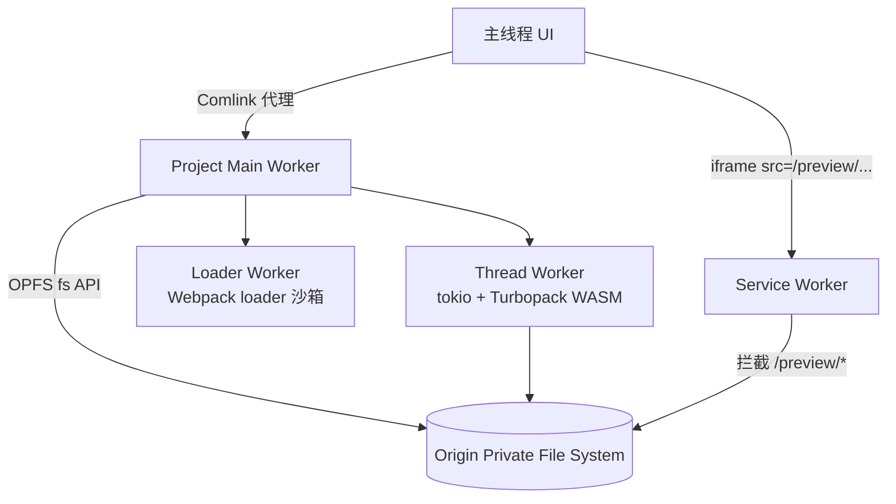

# 03 · Utoo — 蚂蚁统一工具链

**Utoo** 是蚂蚁集团（Ant Group）发起的 Rust 前端统一工具链，覆盖包管理、本地/CI 打包、浏览器内完整 dev/build 三条路径。它是 Mako（蚂蚁上一代 Rust 构建工具）的继任者，bundler 层直接依赖 **Turbopack** 核心 crate，但提供独立的 CLI、配置模型与 Webpack 兼容层——**内嵌 Turbopack 引擎，不等同于 Next.js bundler**。

本系列中，Utoo 的独特价值在于 **`@utoo/web`**：在浏览器中通过 WASM + OPFS 跑完整工具链，与本仓库 [`wasm-road-demo/`](../../wasm-road-demo/) 的 Wasm 主题高度契合。

---

## 1. 定位

### 流水线角色

Utoo 不是单一编译器，而是一套 **PM → Bundler → Browser Dev** 的垂直整合：

| 组件 | 替代的传统 JS 工具 | 说明 |
| --- | --- | --- |
| `utoo` / `ut` | npm / pnpm / yarn | Rust 包管理器，npm 命令兼容 |
| `@utoo/pack` | Webpack / Vite（部分场景） | 基于 Turbopack 的 bundler + dev server |
| `@utoo/pack-cli` | — | `up dev` / `up build` CLI 封装 |
| `@utoo/web` | 本地 Node 构建环境 | 浏览器 WASM 版完整 dev/build |

与 Oxc / SWC 不同，Utoo **不自研 parser/transform**——转译走 Turbopack 内嵌的 SWC，bundler 增量引擎走 Turbopack 的 `turbo-tasks` 架构。

### 所属阵营

Utoo 代表 **蚂蚁 / 国内大厂自研工具链** 路线：在 Turbopack 开源核心之上构建通用 bundler（utoopack），而非绑定 Next.js 或 VoidZero 生态。Mako 的用户可平滑迁移到 `@utoo/pack`。

### 与 Turbopack 的关系

```text
@utoo/pack (Node API + CLI)
    ↓ N-API (pack-napi)
pack-api / pack-core (utoopack 自有 bundler 逻辑)
    ↓ 直接依赖 Turbopack Rust crates
turbo-tasks / turbo-tasks-fs / turbopack-core ...
    ↓ 转译
SWC (@swc/core 同级 Rust crate)
```

utoopack **不是 Turbopack fork**，而是依赖其 crate 并在之上叠加通用配置、Webpack 兼容模式、独立 CLI。Turbopack 作为 Next.js 内置 bundler 无独立 crate API（见 [05-others](./05-others.md#turbopack)），Utoo 是目前少数将 Turbopack 引擎 **脱离 Next.js 暴露给通用前端项目** 的路径之一。

---

## 2. 前端工程中的使用

Utoo 前端侧分 **三件套**，按场景选用。

### 2.1 `utoo` / `ut` — 包管理器

Rust 实现的 npm 兼容 PM，**无需 Node.js 即可安装**（也可 `npm install -g utoo`）。

**安装**（任选其一）：

```bash
curl -fsSL https://utoo.land/install | bash   # 官方脚本
brew install utooland/tap/utoo                 # macOS / Linux
npm install -g utoo                            # 跨平台 npm
cargo install utoo-pm                          # 从源码编译
```

**常用命令**（与 npm 对齐）：

```bash
ut install              # 安装依赖（别名 ut i）
ut add lodash           # 添加依赖
ut add -D typescript    # 添加 devDependency
ut run dev              # 执行 package.json scripts
ut x create-react-app   # npx 风格执行远程包
```

支持 `--from pnpm` 读取 pnpm lockfile、monorepo workspace、私有 registry 等 npm 生态能力。全局包版本缓存 + 并行安装是其性能卖点。

### 2.2 `@utoo/pack` — 本地/CI 打包

**安装**：

```bash
ut install @utoo/pack @utoo/pack-cli -D
```

**package.json**：

```json
{
  "scripts": {
    "dev": "up dev",
    "build": "up build"
  },
  "devDependencies": {
    "@utoo/pack": "^1.4.6",
    "@utoo/pack-cli": "^1.4.6"
  }
}
```

**配置**（`utoopack.json`）：

```json
{
  "$schema": "@utoo/pack/config_schema.json",
  "entry": [
    {
      "import": "./src/index.ts",
      "html": { "template": "./index.html" }
    }
  ],
  "output": {
    "path": "./dist",
    "filename": "[name].[contenthash:8].js",
    "clean": true
  },
  "sourceMaps": true
}
```

也支持 `utoopack.config.mjs` / `utoopack.config.js`。

**开发 / 构建**：

```bash
up dev                  # HMR dev server，默认端口 3000
up build                # 生产构建
up dev --webpack        # Webpack 兼容模式（迁移现有项目）
up build --webpack
```

**Webpack 兼容模式**：对已有 Webpack 项目，将 `dev` / `build` script 改为 `up dev --webpack` / `up build --webpack`，utoopack 读取现有 webpack 配置做快速迁移，无需一次性重写配置。

**Node API**（构建工具集成）：

```javascript
import { build, dev } from "@utoo/pack";

await build({ /* utoopack 配置 */ });
```

底层通过 `pack-napi` 与 Rust 侧 `pack-api` 通信，原理同 [`napi-rs-demo/`](../../napi-rs-demo/) 中的 N-API 绑定模式。

### 2.3 `@utoo/web` — 浏览器 WASM 开发

在浏览器中提供 **完整 dev/build 环境**：OPFS 虚拟文件系统、npm 依赖安装、Turbopack 增量构建、HMR、Service Worker 预览——**无需本地 Node.js**。

**安装**：

```bash
ut install @utoo/web -S
```

**Project 初始化**：

```javascript
import { Project } from "@utoo/web";

const project = new Project({
  cwd: "/my-app",                                    // OPFS 中的项目根路径
  workerUrl: `${location.origin}/worker.js`,         // 主 Worker：fs + 核心逻辑
  threadWorkerUrl: `${location.origin}/threadWorker.js`, // 计算 Worker：bundling
  loaderWorkerUrl: `${location.origin}/loaderWorker.js`, // Loader Worker
  serviceWorker: {
    url: `${location.origin}/serviceWorker.js`,
    scope: "/preview",                               // 预览 iframe 作用域
  },
  loadersImportMap: {
    "my-loader": "https://cdn.example.com/loader.umd.js",
  },
});

await project.installServiceWorker();
await project.install(["react", "react-dom"]);       // 从 npm registry 安装
await project.writeFile("/my-app/src/index.tsx", sourceCode);
await project.build();
```

**Worker 脚本**（各一行 import 即可）：

```typescript
// worker.ts
import "@utoo/web/esm/worker";

// threadWorker.ts
import "@utoo/web/esm/threadWorker";

// loaderWorker.ts
import "@utoo/web/esm/loaderWorker";

// serviceWorker.ts
import "@utoo/web/esm/serviceWorker";
```

**架构概览**：



关键机制：

| 机制 | 作用 |
| --- | --- |
| **OPFS** | 浏览器私有文件系统，项目文件持久化存储 |
| **tokio-fs-ext** | 为 WASM 提供 `tokio::fs` 兼容 API；OpfsOffload 解决 JS 句柄跨线程 `!Send` 问题 |
| **FileSystemObserver** | OPFS 文件变更监听，驱动 Turbopack 增量构建 |
| **Thread Worker** | 移植 tokio runtime，CPU 密集 bundling 不阻塞 UI |
| **Service Worker** | 拦截 `/preview` 请求，从 OPFS 提供构建产物 |

`@utoo/web` 完整浏览器环境配置较复杂，见官方文档；本地打包 demo 见 [`rust-tools-demo/utoo-pack`](../../rust-tools-demo/utoo-pack/)。

---

## 3. Rust 工程中直接使用

### 依赖形态

Utoo monorepo 的 Rust 部分分两类：

| 类型 | Crate / 包 | embed 友好度 |
| --- | --- | --- |
| 包管理器 | `utoo-pm`（crates.io） | ⚠️ CLI 二进制，非 library API |
| Bundler 核心 | `pack-core`、`pack-api` 等 | ❌ 内部 crate，无稳定公开 embed API |
| WASM 绑定 | `utoo-wasm` | ❌ 供 `@utoo/web` 内部使用 |

**结论**：Utoo 的 Rust 层 **不适合像 Oxc 那样轻量 embed**。PM 可 `cargo install utoo-pm` 获得 CLI；bundler 应通过 `@utoo/pack` N-API 或 `@utoo/web` WASM 消费。

### PM 源码结构

```
crates/
├── pm/              # utoo-pm，包管理器 CLI（二进制名 utoo，别名 ut）
├── ruborist/        # PM 内部依赖解析引擎
├── pack-core/       # utoopack bundler 核心
├── pack-api/        # Rust 侧构建 API
├── pack-napi/       # N-API 绑定（→ @utoo/pack）
├── utoo-wasm/       # WASM 绑定（→ @utoo/web）
└── tokio-fs-ext/    # OPFS 文件系统抽象（独立 crate）
```

`cargo install utoo-pm` 安装的是 PM CLI，不是 library。若要在 Rust 工程中调用 bundler 逻辑，目前没有官方稳定路径——应使用 Node 侧 `@utoo/pack` API。

### WASM 编译配置

`@utoo/web` 的 Rust 部分编译目标为 `wasm32-unknown-unknown`，使用专用 profile：

```toml
# Utoo 仓库 Cargo.toml 片段
[profile.wasm-dev]
inherits = "dev"
opt-level = 1
```

依赖 `wasm-bindgen`、`wasm_thread`、`tracing-web`、`console_error_panic_hook` 等浏览器适配 crate。这与 [`wasm-road-demo/`](../../wasm-road-demo/) 中 wasm-pack 编译路径类似，但 Utoo 额外移植了完整 tokio + Turbopack 引擎，复杂度远高于单函数 Wasm 模块。

---

## 4. 集成模式

| 模式 | Utoo 的实现 | 说明 |
| --- | --- | --- |
| CLI 二进制 | ✅ `utoo` / `ut` | PM 主入口，npm 兼容 |
| N-API | ✅ `@utoo/pack` | 本地/CI bundler，参见 [`napi-rs-demo/`](../../napi-rs-demo/) |
| WASM | ✅ `@utoo/web` | 浏览器完整 dev/build，参见 [`wasm-road-demo/`](../../wasm-road-demo/) |
| 纯 Rust crate embed | ❌ 不推荐 | 无稳定公开 library API |

**推荐路径**：

```text
日常开发 / CI          → ut + @utoo/pack（N-API）
Webpack 项目迁移       → up dev --webpack / up build --webpack
浏览器 Playground / IDE → @utoo/web（WASM + OPFS + Service Worker）
Rust 工具 embed parser  → 用 Oxc / SWC，而非 Utoo
```

**@utoo/web 与 wasm-road-demo 的对比**：

| 维度 | wasm-road-demo | @utoo/web |
| --- | --- | --- |
| 目标 | 演示 wasm-pack / wasm-bindgen 加载 | 完整浏览器 dev/build 工具链 |
| 文件系统 | 内存 / 简单 fetch | OPFS 持久化 + Node.js-like fs API |
| 构建能力 | 无（手动编译 .wasm） | Turbopack 增量 bundling + HMR |
| 复杂度 | 入门友好 | 生产级浏览器 IDE 基础设施 |

两者互补：wasm-road-demo 帮助理解 Wasm 加载机制；`@utoo/web` 展示 Wasm 在工具链级别的应用上限。

---

## 5. 选型建议

### 何时选 Utoo

- 需要 **统一 PM + Bundler**，且偏好 Rust 性能（蚂蚁内部 / Mako 迁移）
- 希望使用 **Turbopack 引擎**但不想绑定 Next.js
- 构建 **浏览器内 IDE / Playground / 在线 dev 环境**（`@utoo/web` 几乎无竞品）
- Webpack 项目需要 **渐进式迁移**（`--webpack` 兼容模式）

### 何时考虑其它工具

| 场景 | 更合适的工具 |
| --- | --- |
| Next.js 项目 | 内置 Turbopack / SWC，无需 Utoo |
| Vite 8 + Rolldown 生态 | [01-oxc](./01-oxc.md) / VoidZero 路线 |
| Vue SFC 编译 / lint / typecheck | [04-vize](./04-vize.md) |
| Rust embed parse/transform | Oxc 或 SWC crate，非 Utoo |
| 仅需 Lint + Format | Biome 或 Oxlint（见 [05-others](./05-others.md)） |

### Utoo vs 其它 bundler 简表

| 维度 | Utoo (`@utoo/pack`) | Vite + Rolldown | Next.js Turbopack |
| --- | --- | --- | --- |
| 底层引擎 | Turbopack crate | Oxc + Rolldown | Turbopack（框架内置） |
| 独立使用 | ✅ CLI + Node API | ✅ | ❌ 绑定 Next.js |
| 浏览器 WASM | ✅ `@utoo/web` | ❌ | ❌ |
| Webpack 兼容 | ✅ `--webpack` 模式 | ⚠️ 插件生态不同 | ❌ |
| PM 一体化 | ✅ `ut` | ❌（需 pnpm/npm） | ❌ |

### 常见错误

| 现象 | 原因 |
| --- | --- |
| `up` 命令找不到 | 未安装 `@utoo/pack-cli`，或未加入 devDependencies |
| `@utoo/web` 预览白屏 | Service Worker 未 `installServiceWorker()`，或 scope 与 iframe src 不匹配 |
| OPFS 写入失败 | 非 HTTPS / 非 localhost 环境，或浏览器不支持 OPFS |
| Worker 加载报错 | `workerUrl` 等路径不正确，或 build 未输出 worker 脚本 |
| `--webpack` 模式部分 loader 不工作 | 兼容层非 100% 覆盖，需查阅 utoopack 文档确认支持列表 |

---

## 6. 延伸阅读

- 系列索引：[Rust 前端工具链系列](./README.md)
- 上一篇：[02 · SWC — Next.js 编译器](./02-swc.md)
- 下一篇：[04 · Vize — Vue 垂直工具链](./04-vize.md)
- 粗讲合集：[05 · 其它工具速览](./05-others.md)
- 可运行 demo：[`rust-tools-demo/utoo-pack`](../../rust-tools-demo/utoo-pack/)
- N-API 原理：[napi-rs-demo](../../napi-rs-demo/) · Wasm 加载：[wasm-road-demo](../../wasm-road-demo/)
- Wasm 基础：[Wasm 基础](../wasm-fundamentals.md)
- 官方站点：[utoo.land](https://utoo.land/)
- PM 文档：[utoo (ut)](https://utoo.land/en/docs/utoo)
- Bundler 介绍：[utoopack intro](https://utoo.land/en/docs/blog/utoopack-intro)
- 浏览器开发：[@utoo/web](https://utoo.land/en/docs/utooweb)
- GitHub：[utooland/utoo](https://github.com/utooland/utoo)
