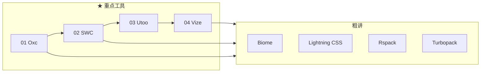

# Rust 前端工具链系列

前端构建、转译、Lint、格式化正在从 JavaScript 实现（Babel、Webpack、ESLint、Prettier）迁移到 Rust 实现。本系列以 **博客文章** 为唯一交付物，重点深度介绍 **Oxc、SWC、Utoo、Vize** 四个工具的前端用法与 Rust 直接调用；其余工具在 [05-others.md](./05-others.md) 中粗讲。

**重点章（01~04）** 配套 [`rust-tools-demo/`](../../rust-tools-demo/) 可运行 demo；粗讲章（05）仅博客 inline 代码。

## 前置阅读

建议先读完以下两篇，再按编号顺序学习本系列：

| 文档 | 内容 |
| --- | --- |
| [Wasm 基础](../wasm-fundamentals.md) | Wasm 原理、Rust 编译、napi-rs 与 Wasm 回退 |
| [WASI 基础](../wasi-fundamentals.md) | WASI 运行时、浏览器与 Node 中的 Wasm 集成 |

仓库已有 [`napi-rs-demo/`](../../napi-rs-demo/)（N-API 绑定）、[`wasm-road-demo/`](../../wasm-road-demo/)（浏览器 Wasm）和 [`rust-tools-demo/`](../../rust-tools-demo/)（重点章可运行示例），各章在「集成模式」小节作概念交叉引用。

## 建议阅读顺序

1. **01 Oxc** — VoidZero 生态核心，Rust crate 嵌入首选
2. **02 SWC** — Next.js / Deno 生态，@swc/core 与 Rust API
3. **03 Utoo** — 蚂蚁统一工具链，N-API + 浏览器 Wasm
4. **04 Vize** — Vue 垂直 Rust 工具链，SFC 编译 / lint / typecheck
5. **05 others** — Biome、Lightning CSS、Rspack、Turbopack 等速览

## 可运行 Demo

重点章（01~04）源码在 [`rust-tools-demo/`](../../rust-tools-demo/)：

| 博文 | Demo 目录 | 运行 |
| --- | --- | --- |
| 01 Oxc | [`oxc/`](../../rust-tools-demo/oxc/) | `cargo run` |
| 02 SWC | [`swc/`](../../rust-tools-demo/swc/) | `cargo run` |
| 03 Utoo | [`utoo-pack/`](../../rust-tools-demo/utoo-pack/) | `npm install && npm run dev` |
| 04 Vize | [`vize/`](../../rust-tools-demo/vize/) | `npm install && npm run dev` |

## 三种集成模式

Rust 前端工具暴露给 JavaScript 生态，常见三种路径：

| 模式 | 代表 | 适用场景 | 仓库参考 |
| --- | --- | --- | --- |
| 纯 Rust crate | Oxc、`oxc_resolver` | CLI、代码生成、静态分析、自定义编译器 | [`rust-tools-demo/oxc`](../../rust-tools-demo/oxc/) |
| N-API 绑定 | `@swc/core`、`@utoo/pack`、`@vizejs/native` | Node 构建工具、Webpack/Rspack 插件 | [`rust-tools-demo/utoo-pack`](../../rust-tools-demo/utoo-pack/)、[`vize`](../../rust-tools-demo/vize/)；[`napi-rs-demo/`](../../napi-rs-demo/) |
| WASM 绑定 | `@utoo/web`、`@vizejs/wasm` | 浏览器内编译、无后端预览 | [`wasm-road-demo/`](../../wasm-road-demo/) |

选型原则：**能纯 crate 就不绕 Node**；需要与 npm 生态对接时用 N-API；要在浏览器跑完整工具链时用 WASM。

## 其它工具速览

以下工具不在重点章展开，详见 [05-others.md](./05-others.md)：

| 工具 | 前端入口 | Rust embed | 详见 |
| --- | --- | --- | --- |
| `oxc_resolver` | npm `oxc-resolver` | ✅ 独立 crate | [05-others](./05-others.md#oxc_resolver) |
| Biome | `@biomejs/biome` CLI | ✅ 内部 crate，无稳定公开 API | [05-others](./05-others.md#biome) |
| Lightning CSS | `lightningcss` npm | ✅ `lightningcss` crate | [05-others](./05-others.md#lightning-css) |
| Rspack | `@rspack/core` | ⚠️ N-API 为主，custom binding 有限 | [05-others](./05-others.md#rspack) |
| Turbopack | Next.js 内置 | ❌ 无独立 crate API | [05-others](./05-others.md#turbopack) |
| Rolldown | Vite 8 bundler | ⚠️ 底层消费 Oxc，非独立 embed 入口 | [01-oxc](./01-oxc.md) |

## 专题目录

| # | 文章 | 侧重 |
| --- | --- | --- |
| ★ 01 | [Oxc — VoidZero 生态核心](./01-oxc.md) | parse / transform / lint / minify / resolver，Rust crate 嵌入 |
| ★ 02 | [SWC — Next.js 编译器](./02-swc.md) | `@swc/core`、GLOBALS、与 Oxc 对比 |
| ★ 03 | [Utoo — 蚂蚁统一工具链](./03-utoo.md) | `ut` / `@utoo/pack` / `@utoo/web`，N-API 与 WASM |
| ★ 04 | [Vize — Vue 垂直工具链](./04-vize.md) | SFC 编译 / lint / typecheck，Vite 插件 |
| 05 | [其它工具速览](./05-others.md) | Biome、Lightning CSS、Rspack、Turbopack 等 |
