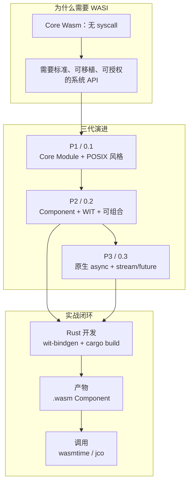
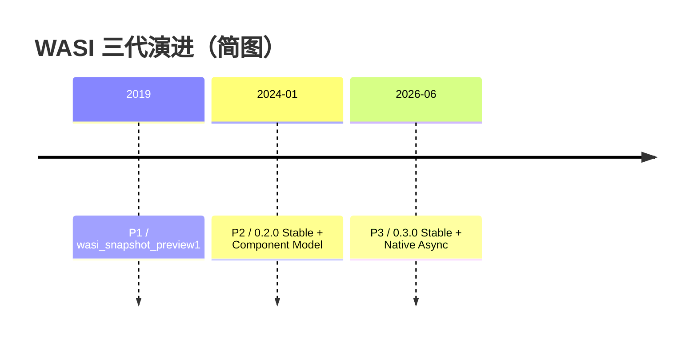
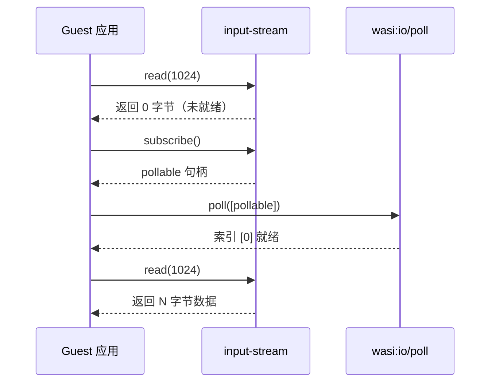
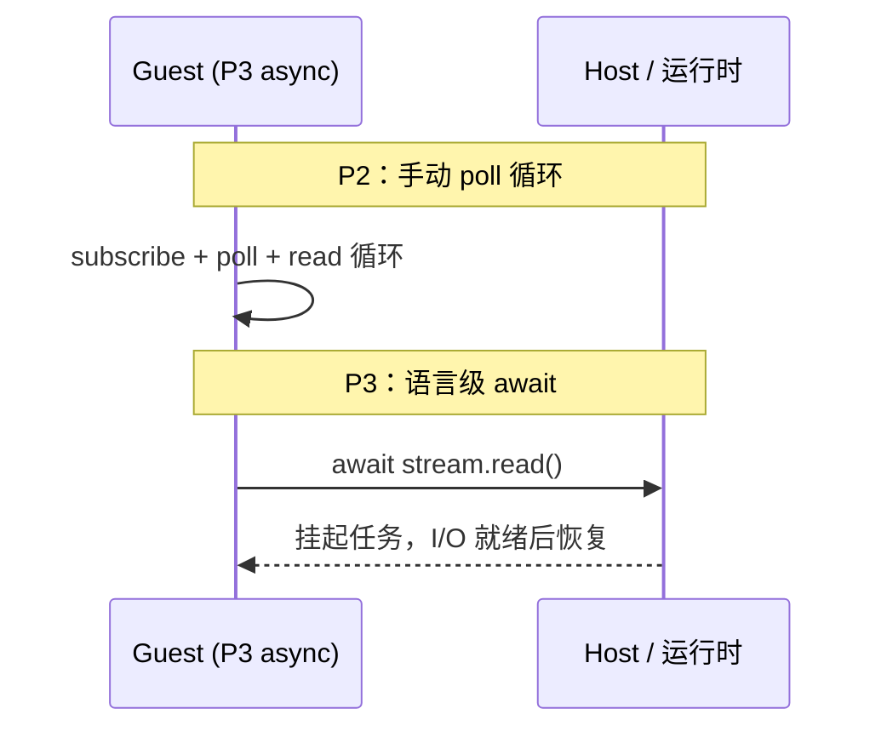
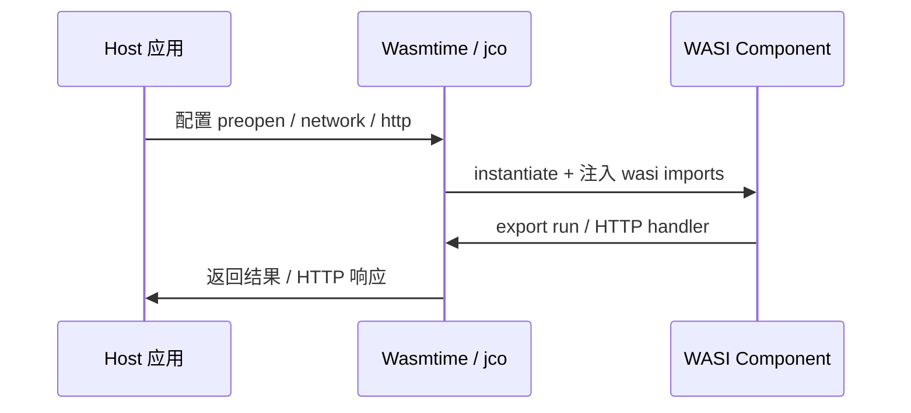
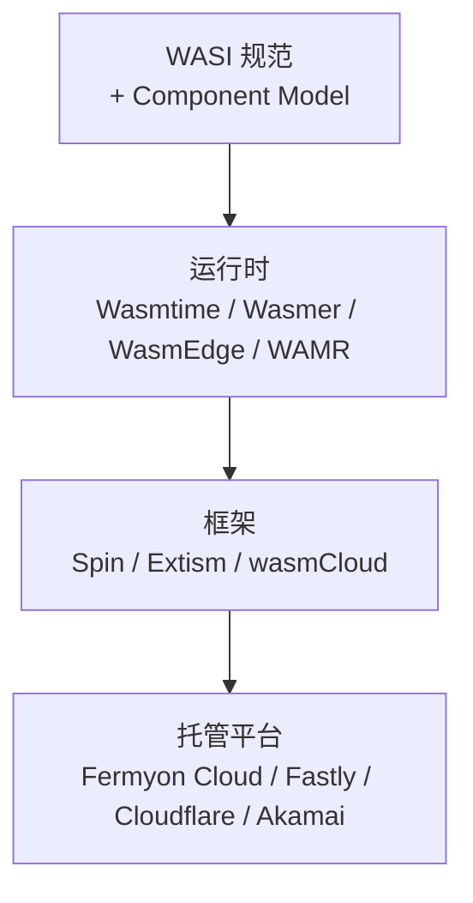

---

## title: "WASI 基础：从 P1 到 P3 的系统接口与 Component 开发"
date: 2026-07-06
tags: [wasm, wasi, wasip1, wasip2, wasip3, wit, component-model, rust, wasmtime, jco]
description: "从 WASI 定位与版本演进讲起，P1 简略带过；重点讲解 P2/P3 的 Component Model、WIT API、Rust 开发与 Wasmtime/jco 调用方式，并介绍真实开源生态案例。"

# WASI 基础：从 P1 到 P3 的系统接口与 Component 开发

> 一篇自洽的 WASI 专文：P1 简略带过，P2 作为 Component/WIT 主干深入讲解，P3 对照 P2 讲 async 差异；配套可运行 demo 见 [wasi-road-demo/](../wasi-road-demo/)。

---

## 目录

1. [第 0 部分：开篇](#第-0-部分开篇)
2. [第 1 章：Wasm 为何需要系统接口 + WASI 应用场景](#第-1-章wasm-为何需要系统接口--wasi-应用场景)
3. [第 2 章：WASI P1 简史与现状](#第-2-章wasi-p1-简史与现状)
4. [第 3 章：Component Model 与 WIT（P2/P3 共用基础）](#第-3-章component-model-与-witp2p3-共用基础)
5. [第 4 章：WASI P2 特性与 API 全景](#第-4-章wasi-p2-特性与-api-全景)
6. [第 5 章：P2 开发方法（Rust + 完整 demo）](#第-5-章p2-开发方法rust--完整-demo)
7. [第 6 章：WASI P3 特性与 API 差异](#第-6-章wasi-p3-特性与-api-差异)
8. [第 7 章：P3 开发方法（概念 + 官方命令，无本地 demo）](#第-7-章p3-开发方法概念--官方命令无本地-demo)
9. [第 8 章：WASI 产物的调用方式](#第-8-章wasi-产物的调用方式)
10. [第 9 章：运行时选型与生态地图](#第-9-章运行时选型与生态地图)
11. [第 10 章：总结与路线图](#第-10-章总结与路线图)
12. [附录 A：WIT 速查](#附录-awit-速查)
13. [附录 B：命令速查](#附录-b命令速查)
14. [附录 C：常见问题与排错](#附录-c常见问题与排错)
15. [附录 D：demo 索引](#附录-ddemo-索引)
16. [附录 E：开源项目速查](#附录-e开源项目速查)

---


## 第 0 部分：开篇


### 0.1 WASI 是什么

如果你已经读过 [Wasm 基础：原理、Rust 编译与 Node 集成](./wasm-fundamentals.md)，你会知道 Core Wasm 只是一台「没有操作系统的虚拟机」。**WASI（WebAssembly System Interface）** 补上的，正是操作系统那一层——文件、时钟、网络、HTTP、随机数等系统能力的**标准接口**。

官方定义见 [wasi.dev](https://wasi.dev/)：WASI 是面向 Wasm 的**系统 API 族**，由 W3C WebAssembly Community Group 下的 **WASI Subgroup** 维护，与 Component Model 规范协同演进。它不是某一个运行时的私有 API，而是跨 Wasmtime、Wasmer、Spin、WasmEdge 等生态的**共同语言**。

### 0.2 三代版本对照表

WASI 目前经历三代大版本，版本号与二进制形态各不相同：


| 维度          | P1 (0.1)                             | P2 (0.2)                       | P3 (0.3)                                 |
| ----------- | ------------------------------------ | ------------------------------ | ---------------------------------------- |
| 状态          | Legacy，广泛部署                          | **Stable**（2024-01）            | **Stable**（2026-06）                      |
| 二进制形态       | Core Module                          | Component                      | Component                                |
| 接口描述        | 固定 import 名 `wasi_snapshot_preview1` | WIT 包 `wasi:*@0.2.x`           | WIT 包 `wasi:*@0.3.x`                     |
| 异步模型        | 同步 syscall                           | `wasi:io` + `pollable`         | `async func` + `stream<T>` + `future<T>` |
| Rust Target | `wasm32-wasip1`                      | `wasm32-wasip2`（stable Tier 2） | `wasm32-wasip3`（nightly Tier 3）          |
| 典型运行时       | Wasmtime / Wasmer / WAMR 广泛支持        | Wasmtime 17+、jco 1.x、Spin 2.x+ | Wasmtime 43+、jco preview3-shim           |





**选型速记**：遗留系统 / 嵌入式 / Go wasip1 → P1；**新项目默认 P2**；IO 密集且愿尝鲜 → 评估 P3。

### 0.3 核心概念预热

后文反复出现的术语，先在此统一：


| 术语                | 含义                                                                 |
| ----------------- | ------------------------------------------------------------------ |
| **Capability**    | 基于能力的安全模型：Guest 默认零权限，Host 显式授予                                    |
| **Preopen**       | Host 将宿主目录映射进 Guest 文件系统命名空间，如 `--dir=./data::/data`               |
| **WIT**           | Wasm Interface Type，用 `.wit` 文件描述 Component 接口的 IDL                |
| **World**         | WIT 中描述一个 Component「import/export 哪些接口」的清单，如 `wasi:cli/command`    |
| **Component**     | P2/P3 的二进制包格式，可内嵌多模块、跨语言链接                                         |
| **Canonical ABI** | Component Model 规定的跨语言调用约定，负责类型编组与 resource 生命周期                   |
| **Resource**      | P2 线性句柄类型（如 `pollable`、`input-stream`），P3 部分被 `stream`/`future` 取代 |


### 0.4 本文阅读地图


| 章节                  | 深度                           | Demo                                    |
| ------------------- | ---------------------------- | --------------------------------------- |
| 第 1 章 应用场景          | 全景 + 开源案例                    | —                                       |
| 第 2 章 P1            | **从简**：知道是什么、怎么跑即可           | `wasi-p1-cli-demo`                      |
| 第 3 章 Component/WIT | **主干**：包格式、依赖、构建、产物、运行时链接    | —                                       |
| 第 4–5 章 P2 API 与开发  | API 全景 + Rust 实战闭环           | `wasi-p2-cli-demo`                      |
| 第 6–7 章 P3          | **概念与 API 差异**，对照 P2 讲 delta | **无本地 demo**（`wasm32-wasip3` 仅 nightly） |
| 第 8 章 调用方式          | Wasmtime / jco / 组合分发        | P1/P2 可运行                               |
| 第 9–10 章            | 选型、路线图                       | —                                       |


所有可运行 demo 源码与脚本见 [wasi-road-demo/](../wasi-road-demo/)。

---


## 第 1 章：Wasm 为何需要系统接口 + WASI 应用场景


### 1.1 问题背景

Core WebAssembly 的设计边界非常清晰：**只定义指令集、内存模型和模块链接**，不内置文件系统、网络、环境变量、进程或线程等操作系统概念。Guest 模块想访问宿主能力，必须通过 `import` 向宿主「借」——而早期各宿主各自定义 import 名与语义，导致同一份 `.wasm` 难以跨运行时移植。

**WASI（WebAssembly System Interface）** 正是为了填补这一空白：[wasi.dev](https://wasi.dev/) 将其定义为面向 Wasm 的**标准系统 API 族**，由 W3C Wasm CG 下的 WASI Subgroup 维护。其价值主张可以概括为四点：


| 维度   | 说明                                     |
| ---- | -------------------------------------- |
| 跨语言  | Rust、C、Go、Python 等编译出的 Guest 共享同一套接口约定 |
| 可组合  | P2 起基于 Component Model，多语言模块可像乐高一样链接   |
| 能力授权 | 默认零权限，Host 显式授予文件、网络、HTTP 等能力          |
| 标准演进 | P1 → P2 → P3 有序迭代，生态有明确的版本锚点           |


### 1.2 Capability-based Security

WASI 的安全模型是 **基于能力（Capability）** 的，而非基于身份或全局权限表。Guest 启动时**不拥有任何系统资源**；Host 在实例化前通过配置显式注入能力：

- **Preopen 目录**：`wasmtime run --dir=./data::/data` 将宿主 `./data` 映射为 Guest 内的 `/data`
- **环境变量**：`--env KEY=VALUE` 白名单注入
- **网络**：`--tcplisten`、`--udp` 等 flag 开放 socket 能力
- **HTTP**：Spin、Wasmtime 等平台级 HTTP handler 配置

```
┌─────────────────────────────────────────────────────┐
│  Host（Wasmtime / Spin / Extism ...）               │
│  ┌───────────────────────────────────────────────┐  │
│  │  Capability 配置                               │  │
│  │  • preopen: /data ← ./data                    │  │
│  │  • env: WASI_DEMO=p2                          │  │
│  │  • network: (未授予 → Guest 无法 connect)      │  │
│  └───────────────────────────────────────────────┘  │
│                        │ grant                       │
│                        ▼                             │
│  ┌───────────────────────────────────────────────┐  │
│  │  Guest Wasm Component（零权限启动）            │  │
│  │  只能访问 Host 已注入的能力                     │  │
│  └───────────────────────────────────────────────┘  │
└─────────────────────────────────────────────────────┘
```

更多安全设计细节见 [wasi.dev/security](https://wasi.dev/security)。

### 1.3 WASI 应用场景与成功开源项目

WASI 不是纸面标准——它已被大量生产系统采用。下面按**场景**组织，区分三种角色：**运行时**（实现 WASI 规范）、**框架**（在运行时之上提供开发/部署体验）、**平台托管**（云厂商注入能力）。

#### 参考运行时 / 嵌入引擎

**[Wasmtime](https://github.com/bytecodealliance/wasmtime)**（Bytecode Alliance）是 WASI 与 Component Model 的**参考实现**，完整支持 P1/P2/P3。Spin、Fermyon、wasmCloud 等框架底层均依赖 Wasmtime。若你要验证 WIT 接口、调试 Component 链接，Wasmtime CLI 是最快的起点——本文 demo 全部以 `wasmtime run` 验证。

#### 边缘 Serverless 微服务

**[Spin](https://github.com/spinframework/spin)** 基于 Wasmtime + Component Model，是 Fermyon 推出的 Wasm 微服务框架。Spin 2.x+ 全面采用 WASI P2，扩展了 WASI HTTP、WASI KV、WASI Config 等接口，开发者用 `spin build` / `spin up` 即可本地跑 HTTP 微服务，再部署到 Fermyon Cloud 或 Akamai 边缘。与本文 demo 的关系：Spin 的 CLI 程序 world 与 `wasi:cli/command@0.2.x` 同源，P2 demo 的命令行行为在 Spin 中同样适用。

#### CDN / 边缘计算

**Fastly Compute@Edge** 从第一天起以 Wasm 为隔离原语，平台向 Guest 注入 HTTP、KV、日志等能力，开发者无需关心底层 WASI 版本细节，但编译目标与 WASI 能力模型一致。**Cloudflare Workers** 基于 V8 + Wasm 绑定，部分场景将 Rust/C++ 编译为 Wasm 在边缘执行——虽非完整 WASI 运行时，但体现了「沙箱 + 标准接口」的边缘计算范式。

#### 插件 / 宿主嵌入

**[Extism](https://github.com/extism/extism)** 提供语言无关的插件 SDK，宿主可以是 Go、Rust、Python、JS 等。Guest 多为 `wasm32-wasi`（P1 家族）或 Component（P2 跟进中），通过 Extism 的 Host 函数注入文件、HTTP、配置等能力，并支持 OCI 分发插件。适合「在主应用内安全运行第三方代码」——与本文第 8 章 Wasmtime 嵌入宿主场景同类。

#### Envoy / 服务网格过滤器

**[proxy-wasm](https://github.com/proxy-wasm/spec)** 定义了基于 Wasm 的 L4/L7 过滤器规范，大量生产流量经 Envoy 运行 proxy-wasm 插件。它使用 Wasm 沙箱而非完整 WASI CLI，但能力授权思路一致：Envoy 作为 Host 注入网络与配置能力。

#### 云原生分布式应用

**[wasmCloud](https://github.com/wasmCloud/wasmCloud)**（CNCF 沙箱项目）用 WASI + capability 模型做分布式组件编排：Actor 通过 WIT 接口通信，能力在 lattice 中动态授予，适合微服务网格式的 Wasm 部署。

#### 轻量容器 / 边缘 AI

**[WasmEdge](https://github.com/WasmEdge/WasmEdge)**（CNCF 沙箱）在标准 WASI 之上扩展了 AI 推理（wasi-nn）、socket 等 API，面向 IoT 与边缘 AI 场景，与 WAMR 同属「轻量运行时」路线。

#### 多语言运行时


| 项目                                                             | 角色                     | WASI 支持   |
| -------------------------------------------------------------- | ---------------------- | --------- |
| [Wasmer](https://github.com/wasmerio/wasmer)                   | 运行时 + Wasmer Edge PaaS | P1/P2     |
| [wazero](https://github.com/tetratelabs/wazero)                | 零依赖 Go 运行时             | P1，测试套件对齐 |
| [WAMR](https://github.com/bytecodealliance/wasm-micro-runtime) | 嵌入式/MCU                | WASI 子集   |


#### JS 宿主 / Component 工具链

**[jco](https://github.com/bytecodealliance/jco)** 将 Wasm Component **转译为 JavaScript**，使 Node/Browser 可直接 `import` 生成的模块。P2 已稳定；P3 通过 `preview3-shim` 跟进 async stream/future。本文第 8 章以 jco 演示 JS 侧加载 P2 Component。

#### 其他值得关注

- **[napi-rs](https://github.com/napi-rs/napi-rs)**：无预编译 `.node` 时回退 `wasm32-wasip1-threads`（P1 家族）
- **[Lunatic](https://github.com/lunatic-solutions/lunatic)**：基于 Wasm 的 Erlang 式 Actor，WASI 做系统边界


#### 场景速查表


| 场景          | 代表项目                | WASI 使用方式                      | 链接                                                                                                       |
| ----------- | ------------------- | ------------------------------ | -------------------------------------------------------------------------------------------------------- |
| 参考运行时       | Wasmtime            | P1/P2/P3 完整实现                  | [wasmtime.dev](https://wasmtime.dev/)                                                                    |
| 边缘微服务       | Spin                | Wasmtime + WASI HTTP/KV/Config | [spinframework.dev](https://spinframework.dev/)                                                          |
| CDN 边缘      | Fastly Compute@Edge | 平台注入 Wasm 能力                   | [fastly.com/docs/compute](https://www.fastly.com/documentation/guides/compute)                           |
| CDN Workers | Cloudflare Workers  | V8 + Wasm 绑定                   | [developers.cloudflare.com/workers](https://developers.cloudflare.com/workers/)                          |
| 插件宿主        | Extism              | P1 module / P2 component       | [extism.org](https://extism.org/)                                                                        |
| 服务网格        | proxy-wasm          | Envoy 过滤器规范                    | [github.com/proxy-wasm](https://github.com/proxy-wasm/spec)                                              |
| 云原生编排       | wasmCloud           | WASI + capability lattice      | [wasmcloud.com](https://wasmcloud.com/)                                                                  |
| 边缘 AI       | WasmEdge            | WASI + wasi-nn 扩展              | [wasmedge.org](https://wasmedge.org/)                                                                    |
| Go 运行时      | wazero              | P1 测试对齐                        | [wazero.io](https://wazero.io/)                                                                          |
| 嵌入式         | WAMR                | WASI 子集                        | [github.com/bytecodealliance/wasm-micro-runtime](https://github.com/bytecodealliance/wasm-micro-runtime) |
| JS 工具链      | jco                 | P2 稳定、P3 preview3-shim         | [github.com/bytecodealliance/jco](https://github.com/bytecodealliance/jco)                               |
| Node 扩展回退   | napi-rs             | wasm32-wasip1-threads          | [napi.rs](https://napi.rs/)                                                                              |
| Actor 并发    | Lunatic             | WASI 系统边界                      | [lunatic.solutions](https://lunatic.solutions/)                                                          |


**本章小结**：Wasm 天生无 syscall，WASI 用标准接口 + 能力授权填补缺口；上述项目证明 WASI 已在边缘、插件、云原生、嵌入式等场景落地。下一章简要回顾 P1，再进入 P2/P3 的 Component 主干。

---


## 第 2 章：WASI P1 简史与现状

> 目标：知道 P1 是什么、哪里还在用、如何最小运行。**不**逐条讲 syscall 细节。


### 2.1 P1 设计

WASI P1（版本号 **0.1**，也称 **Legacy WASI**）发布于 Component Model 之前，设计深受 **POSIX** 启发：

- Guest 是 **Core Module**（普通 `.wasm`），通过固定 import 名 `wasi_snapshot_preview1` 调用系统接口
- 接口以 **syscall 风格** 的函数呈现：`fd_read`、`path_open`、`environ_get` 等
- 没有 WIT 文件，接口语义靠 [WASI 文档](https://github.com/WebAssembly/WASI/tree/main/legacy/preview1) 与运行时实现约定

```
Core Module (P1)
┌─────────────────────────────┐
│  你的代码（main / _start）    │
│         │ import            │
│         ▼                   │
│  wasi_snapshot_preview1     │
│  • fd_read / fd_write       │
│  • path_open / prestat_*    │
│  • environ_get / args_get   │
└─────────────────────────────┘
         │ 由 Host 实现
         ▼
    Wasmtime / Wasmer / WAMR ...
```


### 2.2 编译与产物

```bash
rustup target add wasm32-wasip1
cd wasi-road-demo
cargo build --target wasm32-wasip1 --release -p wasi-p1-cli-demo
```

产物：`target/wasm32-wasip1/release/wasi-p1-cli-demo.wasm`——这是一个 **Core Module**，不是 Component。可用 `wasm-tools validate` 验证（注意：不要用 `component wit` 子命令，该命令仅适用于 Component）。

### 2.3 运行方式

最简运行（无文件系统权限）：

```bash
wasmtime run target/wasm32-wasip1/release/wasi-p1-cli-demo.wasm
```

带 preopen 目录（读写文件所必需）：

```bash
wasmtime run --dir=./data::/data \
  --env WASI_DEMO=p1 \
  target/wasm32-wasip1/release/wasi-p1-cli-demo.wasm -- hello
```

或使用项目脚本：

```bash
bash scripts/run-p1.sh -- hello
```

`--dir=HOST::GUEST` 语法：将宿主 `HOST` 路径映射为 Guest 内的 `GUEST` 路径。Demo 从 Guest 视角读写 `/data/input.txt`，对应宿主 `wasi-road-demo/data/input.txt`。

### 2.4 Demo

配套最小示例：[wasi-road-demo/crates/wasi-p1-cli-demo/](../wasi-road-demo/crates/wasi-p1-cli-demo/)

与 P2 demo 功能相同（读 `input.txt`、写 `output.txt`、打印 args/env），便于**同功能、不同产物形态**对照：P1 产出 Core Module，P2 产出 Component。

### 2.5 何时仍选 P1


| 场景               | 原因                                       |
| ---------------- | ---------------------------------------- |
| Go `GOOS=wasip1` | Go 1.21+ 官方 wasip1/wasm 目标基于 P1          |
| WAMR / 嵌入式       | 轻量运行时，完整 P2 Component 开销较大               |
| 遗留工具链            | 已有 `wasm32-wasi` 构建流水线                   |
| napi-rs Wasm 回退  | 无预编译 `.node` 时回退 `wasm32-wasip1-threads` |
| 快速验证 syscall     | `wasmtime run` 零配置跑单模块                   |


**新项目默认选 P2（或评估 P3）**——P1 不会消失，但 Component + WIT 是生态前进方向。

**本章小结**：P1 = Legacy 但广泛；`wasm32-wasip1` + `wasi_snapshot_preview1` + preopen 即可跑通最小 CLI。下文进入 P2/P3 共用的 Component Model 与 WIT。

---


## 第 3 章：Component Model 与 WIT（P2/P3 共用基础）

P2 与 P3 共享同一套 **Component Model** 与 **WIT** 描述语言。本章把读者最容易混淆的四件事一次讲清：


| 主题      | 一句话                                                |
| ------- | -------------------------------------------------- |
| **包格式** | WIT 包是 `.wit` 文本合同；Component 是带信封的 `.wasm` 二进制     |
| **依赖**  | WIT 包之间用 `import` 引用；标准 WASI 依赖由 Host 履约，不是下载 wasm |
| **构建**  | Rust `wasm32-wasip2` 隐式路径，或 `wit-bindgen` 显式路径     |
| **产物**  | 开发期产出绑定代码；运行期只部署 Guest `.wasm` + Host 配置           |


读懂本章，再读 P2 API 与 P3 差异会轻松很多。

### 3.1 Module vs Component：两种二进制格式


| 维度        | Core Module（P1）       | Component（P2/P3）                  |
| --------- | --------------------- | --------------------------------- |
| 二进制格式     | 单一 Core Wasm 模块       | Component 信封，可内嵌一个或多个 Core 模块     |
| 链接方式      | 静态 import/export 名字符串 | WIT 接口 + Canonical ABI 类型化链接      |
| 跨语言       | 需手动约定 ABI             | WIT 自动生成各语言绑定                     |
| 组合        | 困难（名冲突、类型不匹配）         | `wasm-tools compose` 链式组合         |
| 自描述       | 只有函数签名，无高级类型          | 内嵌 WIT 接口清单与版本 pin                |
| 典型 target | `wasm32-wasip1`       | `wasm32-wasip2` / `wasm32-wasip3` |


#### Component 信封里有什么

P2/P3 的 `.wasm` 并非「普通 Core Module」，而是 **Component 信封**——在 Core 模块外包了一层元数据：

```
Component .wasm（信封）
├── 类型化 import/export 清单（来自 WIT，带版本 pin）
├── Canonical ABI 适配信息（跨语言调用约定）
├── 一个或多个 Core Wasm 模块（你的业务逻辑）
└── （可选）实例化/链接辅助数据
```

与 P1 的对照：

```
Core Module (P1)                    Component (P2/P3)
┌──────────────────┐               ┌─────────────────────────────┐
│  单个 Core 模块   │               │  Component 信封              │
│  import "wasi_   │               │  ┌─────────┐  ┌─────────┐  │
│    snapshot_     │               │  │ Core    │  │ 适配层   │  │
│    preview1"     │               │  │ module  │──│ (可选)   │  │
│  export _start   │               │  └─────────┘  └─────────┘  │
└──────────────────┘               │  WIT 接口清单 + 版本 pin    │
  只有字符串 import 名              └─────────────────────────────┘
  无类型化接口描述                    可用 wasm-tools 解析接口清单
```

用 `wasm-tools component wit` 可以查看已编译 Component 内嵌的接口清单——**不必在服务器上保留** `.wit` **文件**，类型信息已烧进二进制。

Component Model 的完整规范见 [component-model.bytecodealliance.org](https://component-model.bytecodealliance.org/)。

### 3.2 WIT 语法速览

WIT（Wasm Interface Type）是描述 Component 接口的 IDL——**纯文本合同**，不是可执行的 `.wasm`。核心语法：

```wit
// 包声明：命名空间 + 版本（下面 example:hello 是自定义示例）
package example:hello@0.1.0;

// 接口（interface）：一组类型与函数，是一份 API 合同
interface greeter {
  record person { name: string, age: u32 }
  greet: func(who: person) -> string;
}

// World：描述一个 Component 的 import/export 清单（角色模板，不是实现代码）
world hello-world {
  export greeter;                       // 本组件向外提供
  import wasi:cli/environment@0.2.0;  // 本组件需要宿主提供（标准接口）
}
```


#### 名字怎么读：`命名空间:包名/条目@版本`

WIT 用四段式全局唯一 ID 标识一个包或条目：


| 部分   | 示例                        | 含义                          |
| ---- | ------------------------- | --------------------------- |
| 命名空间 | `wasi` / `example`        | 防冲突的「域名」，WASI 标准固定用 `wasi`  |
| 包名   | `cli` / `hello`           | 把相关接口打成一个包                  |
| 条目名  | `environment` / `command` | 包内的 interface 或 world 名     |
| 版本   | `0.2.0`                   | 语义化版本 pin，Guest 与 Host 必须一致 |


- `wasi:cli/environment@0.2.0` → 包 `wasi:cli` 里的 **interface** `environment`
- `wasi:cli/command@0.2.0` → 包 `wasi:cli` 里的 **world** `command`


#### interface 与 world 的区别


| 概念            | 是什么                                 | 类比                                 |
| ------------- | ----------------------------------- | ---------------------------------- |
| **interface** | 一份 API 合同：定义有哪些函数、类型                | 类似 Java `interface`、OpenAPI schema |
| **world**     | 一份角色清单：列出需要 import 哪些接口、export 哪些接口 | 类似「岗位 JD」——需要什么能力、提供什么入口           |


`import` = Guest 向 Host **要**的能力；`export` = Guest **提供**给 Host 调用的入口。

#### 标准名字 vs 自定义名字


|                     | WASI 标准（官方规定）                                                                                                                          | 你自己的项目                       |
| ------------------- | -------------------------------------------------------------------------------------------------------------------------------------- | ---------------------------- |
| 命名空间                | 固定 `wasi`                                                                                                                              | 随意，如 `example`、`mycompany`   |
| 包名                  | 固定 `cli`、`filesystem`、`http`…                                                                                                          | 随意，如 `hello`                 |
| interface / world 名 | 固定 `environment`、`command`…                                                                                                            | 随意，如 `greeter`、`hello-world` |
| 版本                  | 标准发布 `0.2.0`、`0.3.0`                                                                                                                   | 你自己定                         |
| 源码位置                | [wasi-cli](https://github.com/WebAssembly/wasi-cli)、[wasi-filesystem](https://github.com/WebAssembly/wasi-filesystem) 等官方仓库的 `.wit` 文件 | 你项目里的 `wit/` 目录              |


上面 `example:hello` 是**自定义示例**；`wasi:cli/...` 是**标准合同**，名字和版本均由 Bytecode Alliance 发布，不能随意改名。

标准 interface 在官方仓库里同样用 WIT 定义，例如 `wasi:cli/environment` 精简片段：

```wit
package wasi:cli@0.2.0;

interface environment {
  get-environment: func() -> list<tuple<string, string>>;
  get-arguments: func() -> list<string>;
  // ...
}
```

常用类型：


| WIT 类型         | 含义          | 示例                                              |
| -------------- | ----------- | ----------------------------------------------- |
| `record`       | 结构体         | `record header { name: string, value: string }` |
| `variant`      | 枚举/联合       | `variant result { ok(string), err(error) }`     |
| `resource`     | 线性句柄（P2 核心） | `resource pollable { ... }`                     |
| `list<T>`      | 列表          | `list<u8>`                                      |
| `option<T>`    | 可选          | `option<string>`                                |
| `result<T, E>` | 成功/失败       | `result<u64, error>`                            |
| `stream<T>`    | 流（P3 原生）    | `stream<u8>`                                    |
| `future<T>`    | 异步结果（P3 原生） | `future<result<_, error>>`                      |


P3 新增 `async func` 关键字，函数可直接返回 `future` 或 `stream`——详见第 6 章。

### 3.3 WIT 包格式与依赖

WASI 以 **WIT 包 + import 引用** 组织接口体系——思路类似 npm / Cargo 发包与依赖，但分发的是**接口契约**（`.wit`），不是 `.wasm` 二进制。

#### 一个 WIT 包长什么样

官方每个 WIT 包对应一个 Git 仓库（或子目录），典型布局：

```
wasi-cli/                         # 仓库名
├── wit/
│   ├── cli.wit                   # package wasi:cli@0.2.0;
│   │                             #   interface environment { ... }
│   │                             #   interface stdio { ... }
│   │                             #   world command { import ...; export ...; }
│   └── deps/                     # 本包依赖的其他 WIT 包（vendor 或子模块）
│       ├── wasi-io/
│       ├── wasi-filesystem/
│       └── ...
```

要点：

- **一个** `package` **声明** = 一个可依赖的包单元（如 `wasi:cli@0.2.0`）
- 包内可含多个 **interface** 和 **world**
- 包与包之间通过 `import wasi:io/streams@0.2.0` **朴素引用**，形成依赖树


#### 依赖树示例

以 `wasi:cli/command` world 为例，依赖关系大致如下（箭头 = import 方向，即「我需要谁」）：

```
wasi:cli/command@0.2.0                    ← world：CLI 程序角色
  ├── wasi:cli/environment@0.2.0          ← interface
  ├── wasi:cli/stdio@0.2.0
  │     └── wasi:io/streams@0.2.0           ← interface 之间也会互相依赖
  │           └── wasi:io/error@0.2.0
  ├── wasi:filesystem/types@0.2.0
  │     └── wasi:io/streams@0.2.0
  ├── wasi:clocks/wall-clock@0.2.0
  ├── wasi:clocks/monotonic-clock@0.2.0
  ├── wasi:io/poll@0.2.0
  ├── wasi:random/random@0.2.0
  ├── wasi:sockets/network@0.2.0
  └── export wasi:cli/run@0.2.0           ← 唯一 export：程序入口
```

这与 Cargo 的 `Cargo.toml` 依赖类似：world 是顶层「应用清单」，底层 interface 包被递归引用。区别在于——这里依赖的是**合同文本**，编译期和运行期分别由工具链和 Host 履约。

#### 版本 pin 与兼容性

**版本 pin 警告**：Guest 编译时 pin 的 WIT 版本必须与 Host 运行时提供的版本**完全一致**，否则实例化时会报 `wrong type` 或链接失败。[wasi.dev/languages](https://wasi.dev/languages) 明确建议：构建时锁定与目标运行时相同的 `@0.2.x` 或 `@0.3.x` 版本。


| 情况                             | 结果                 |
| ------------------------------ | ------------------ |
| Guest `@0.2.0` + Host `@0.2.0` | 正常链接               |
| Guest `@0.2.1` + Host `@0.2.0` | 可能失败（函数签名或类型有变）    |
| Guest `@0.3.0` + Host `@0.2.0` | 必定失败（P2/P3 大版本不兼容） |


WASI 小版本（`0.2.x`）内力求兼容，但**不要假设**「差不多就行」——以你目标运行时的版本为准。

#### 两种依赖：WIT 包依赖 vs 运行时 import


| 层次                       | 依赖的是什么                  | 谁履约                       | 有没有 wasm              |
| ------------------------ | ----------------------- | ------------------------- | --------------------- |
| **WIT 包依赖**（编译期）         | `.wit` 接口定义             | 编译器 / bindgen 生成绑定代码      | 无                     |
| **标准 WASI import**（运行期）  | Guest wasm 里的 import 声明 | Host 内置原生实现（Wasmtime 等）   | Guest 有声明，Host 无 wasm |
| **业务 Component 依赖**（组合期） | 另一个 Guest Component     | `wasm-tools compose` 静态链接 | 双方各有 wasm             |


初学者常把三者混为一谈。标准 WASI（`wasi:cli/environment` 等）只属于前两行——**永远不会**以独立 guest wasm 形式让你下载。

### 3.4 World：程序角色模板

World 把多个 interface **组装成一种程序角色**。选择 world = 选择「我要写哪类程序」。

#### 标准 World 一览


| World               | 版本                  | 典型场景                  |
| ------------------- | ------------------- | --------------------- |
| `wasi:cli/command`  | `@0.2.0` / `@0.3.0` | 命令行工具、批处理             |
| `wasi:http/proxy`   | `@0.2.0`            | 反向代理、API 网关、HTTP 中间件  |
| `wasi:http/service` | `@0.3.0`            | 纯 HTTP 服务端（P3 重组后更完整） |


#### 官方 `wasi:cli/command` 的 WIT 源码

下面不是示意——它正是官方定义 `wasi:cli/command@0.2.0` 的方式（摘自 [wasi-cli](https://github.com/WebAssembly/wasi-cli) 仓库，略去部分 import）：

```wit
package wasi:cli@0.2.0;   // 声明：本文件属于官方包 wasi:cli

world command {           // world 名 command → 全名 wasi:cli/command@0.2.0
  import wasi:cli/environment@0.2.0;
  import wasi:cli/stdio@0.2.0;
  import wasi:clocks/wall-clock@0.2.0;
  import wasi:clocks/monotonic-clock@0.2.0;
  import wasi:filesystem/types@0.2.0;
  import wasi:filesystem/preopens@0.2.0;
  import wasi:io/streams@0.2.0;
  import wasi:io/poll@0.2.0;
  import wasi:random/random@0.2.0;
  import wasi:sockets/network@0.2.0;
  // ... 更多 import
  export wasi:cli/run@0.2.0;   // Guest 提供给 Host 的入口，类似 main()
}
```

读这份 world 的含义：

- `import wasi:cli/environment` → 程序需要读环境变量、命令行参数
- `import wasi:cli/stdio` → 程序需要 stdin/stdout/stderr
- `import wasi:filesystem/...` → 程序需要读写文件
- `export wasi:cli/run` → 程序对外暴露运行入口

每个被 import 的接口在各自官方仓库里有独立的 `.wit` 定义；world 只是**接线图**，不包含任何实现代码。

### 3.5 构建：从源码到 Component

构建路径分两条：**隐式路径**（大多数 Rust CLI 开发者）和 **显式路径**（自定义 WIT 组件或多语言 bindgen）。

#### 路径 A：隐式构建（Rust `wasm32-wasip2`，推荐入门）

本文 `wasi-p2-cli-demo` 走的就是这条路——写普通 Rust，`Cargo.toml` 无需 WIT 依赖：

```rust
// 普通 Rust，工具链自动映射到 WASI 接口
env::args()           // → import wasi:cli/environment
fs::read_to_string()  // → import wasi:filesystem/...
println!(...)         // → import wasi:cli/stdio
```

```bash
rustup target add wasm32-wasip2
cargo build --target wasm32-wasip2 --release -p wasi-p2-cli-demo
# 产物：target/wasm32-wasip2/release/wasi-p2-cli-demo.wasm
```

工具链在编译期做了什么：

1. 读取内置的 `wasi:cli/command@0.2.x` world 定义
2. 将 `std` 调用映射到对应 WASI import
3. 把你的 `main` 包装为 `export wasi:cli/run`
4. 输出符合 Component Model 的 `.wasm`（已是 Component，无需 `wasm-tools component new`）


#### 路径 B：显式构建（`wit-bindgen` + 自定义 WIT）

当你写**自定义接口**、**非 Rust 语言**，或需要 **精确控制 world** 时，走显式路径：

```
my-component/
├── wit/
│   └── world.wit              # 你的 world 定义
├── src/
│   └── lib.rs                 # 调用 wit-bindgen 生成的绑定
├── Cargo.toml
│   └── wit-bindgen 依赖
│   └── 通过 path/git 引入官方 WIT 包
└── build.rs                   # 调用 wit-bindgen 生成代码
```

典型 `build.rs` 流程：

1. `wit-bindgen` 读取 `wit/world.wit` 及其依赖的 `.wit` 包
2. 生成 Rust（或其他语言）的 import/export 绑定代码到 `OUT_DIR`
3. 你的代码调用生成代码中的函数
4. `cargo build --target wasm32-wasip2` 产出 Component

显式路径下，WIT 包依赖的引入方式：


| 方式             | 说明                           |
| -------------- | ---------------------------- |
| `wit/deps/` 目录 | 手动 vendor 官方 `.wit` 文件（最常见）  |
| Git 子模块        | 引用 wasi-cli 等官方仓库            |
| `wasi` crate   | Rust 生态预打包的 WIT 绑定，省去手写 deps |


#### 构建期全链路

```
【隐式路径 — 本文 demo】

  官方 WIT（内置于 rustc/stdlib）     你的 Rust 源码
              │                            │
              └────────────┬───────────────┘
                           ▼
                  cargo build --target wasm32-wasip2
                           │
                           ▼
               wasi-p2-cli-demo.wasm
               （唯一产物：export run + import 清单）


【显式路径 — 自定义组件】

  wit/world.wit + wit/deps/*.wit      你的业务代码
              │                            │
              └────────────┬───────────────┘
                           ▼
                  wit-bindgen（build.rs）
                  生成绑定代码到 OUT_DIR
                           │
                           ▼
                  cargo build --target wasm32-wasip2
                           │
                           ▼
               my-component.wasm
```


### 3.6 产物形态与运行时链接

#### 各阶段产物一览


| 阶段      | 产出物               | 是否随应用分发      | 说明                         |
| ------- | ----------------- | ------------ | -------------------------- |
| **开发期** | `.wit` 文件         | 否            | 接口合同，仅编译期使用                |
| **开发期** | bindgen 生成代码      | 否（已编译进 wasm） | `wit-bindgen` 或 rustc 内置生成 |
| **构建期** | `.wasm` Component | **是，核心交付物**  | 自包含类型信息与 import/export 清单  |
| **部署期** | OCI 镜像 / Warg 包   | 可选           | Spin、`wkg` 等分发渠道           |


运行时只需：**Component 二进制 + Host 能力配置**（preopen、网络等），不需要在服务器上放置 `.wit` 文件。

#### Component 二进制里有什么

用 `wasm-tools` 可以窥探产物内容：

```bash
# 查看 Component 内嵌的 WIT 接口清单
wasm-tools component wit target/wasm32-wasip2/release/wasi-p2-cli-demo.wasm

# 查看二进制结构（模块数、段信息）
wasm-tools objdump  target/wasm32-wasip2/release/wasi-p2-cli-demo.wasm
```

你的 Guest wasm 内嵌了：

- **export**：`wasi:cli/run@0.2.x`（程序入口）
- **import 声明**：`wasi:cli/environment`、`wasi:filesystem/...` 等（仅占位，**无实现**）


#### 运行时链接：谁履约 import

```
WIT（合同/接线图）  ≠  Component（履约方/二进制）

wasi:cli/command    →  你的 CLI 程序 wasm（Guest，实现 export run）
wasi:cli/environment → Wasmtime 内置实现（Host，原生 Rust/C 代码）
```

运行：

```bash
wasmtime run --dir=./data::/data target/wasm32-wasip2/release/wasi-p2-cli-demo.wasm -- hello
```

Wasmtime 做的事：

```
加载 wasi-p2-cli-demo.wasm
  │
  ├─ 解析内嵌的 import 清单
  │    - wasi:cli/environment@0.2.0
  │    - wasi:cli/stdio@0.2.0
  │    - wasi:filesystem/types@0.2.0
  │    - ...
  │
  ├─ 逐一接到 Wasmtime 内置 WASI 实现（Host 原生代码，非独立 wasm）
  │    ├── environment  → 读真实 OS 环境变量
  │    ├── stdio        → 接终端 stdin/stdout
  │    └── filesystem   → 按 --dir 做 preopen 映射
  │
  └─ 调用 export wasi:cli/run → 你的 main 开始执行
```

| 东西                            | 形态                      | 有没有独立 `.wasm`    |
| ----------------------------- | ----------------------- | ---------------- |
| WIT 包（`wasi:cli/environment`） | `.wit` 文本合同             | **没有**           |
| World（`wasi:cli/command`）     | WIT 里的 import/export 清单 | **没有**           |
| 你的程序（`wasi-p2-cli-demo`）      | 编译出的 Component          | **有**，通常就这一个     |
| Host 实现（Wasmtime 里的 WASI）     | 宿主进程内的原生代码              | **不是**你项目里的 wasm |

#### 多个 wasm 何时出现

标准 WASI import **不会**产生多个 guest wasm。多个 `.wasm` 只出现在 **Component 组合**场景：

```bash
# 把两个业务 Component 静态链接为一个
wasm-tools compose -d component-a.wasm -d component-b.wasm -o composed.wasm
```

或通过 `wkg` 从 OCI registry 拉取第三方业务组件——这与标准 WASI 的 Host 履约是不同层面的事。

### 3.7 工具链地图


| 工具                                  | 阶段    | 用途                                                  |
| ----------------------------------- | ----- | --------------------------------------------------- |
| `rustc` + `wasm32-wasip2wasm-tools` | 构建    | 隐式路径：普通 Rust → Component，自动链接 `wasi:cli/command`    |
| `wit-bindgen`                       | 构建    | 显式路径：从 WIT 生成 Guest/Host 语言绑定                       |
| `wasm-tools`                        | 构建/检查 | `component wit` 查看接口清单、`compose` 组合组件、`validate` 校验 |
| `wasi` crate（Rust）                  | 构建    | P2/P3 标准 WIT 包的预生成 Rust 绑定                          |
| `wasmtime` / `wasmtime-cli`         | 运行    | 加载 Component、履约标准 WASI import、preopen 授权            |
| `jco`                               | 运行    | Node.js 宿主：transpile Component 为 JS 并调用             |
| `wkg`                               | 部署    | Component 的 OCI 包发布/拉取（Spin 3.0+ 生态）                |
| `cargo-component`                   | —     | **已过时**，被 `wasm32-wasip2` target 内置 Component 产出取代  |

**本章小结**：WIT 包 = `.wit` 合同，通过 `import` 组成依赖树；World = 程序角色模板；构建产出唯一的 Guest Component `.wasm`；标准 WASI import 由 Host 原生履约，无独立 wasm。包格式、依赖、构建、产物四件事贯穿 P2/P3——下面第 4 章逐包展开 P2 API，第 5 章用 Rust demo 跑通闭环。

---

## 第 4 章：WASI P2 特性与 API 全景

### 4.1 P2 里程碑与设计理念

WASI **0.2.0** 于 **2024 年 1 月**稳定发布，是首个基于 **Component Model** 的 WASI 大版本。核心设计理念：

1. **跨语言组合**：Rust 写的 HTTP 中间件与 C 写的图像处理库可链接为同一 Component
2. **Resource 类型**：`pollable`、`input-stream` 等以线性资源表示，由 Canonical ABI 管理生命周期
3. **Shared-nothing / shared-everything linking**：组件间既可消息传递，也可零拷贝共享（视链接模式而定）
4. **生态全面跟进**：Spin 2.x+、Wasmtime 17+、jco 1.x 等均将 P2 作为默认路径



### 4.2 P2 标准接口包

以下基于 [wasi.dev/releases](https://wasi.dev/releases) Phase 3 提案列表，逐一介绍 P2 核心 WIT 包。

#### `wasi:cli` — 命令行环境

**职责**：环境变量、命令行参数、标准输入/输出/错误、进程退出。

```wit
// wasi:cli/environment 精简片段
interface environment {
  get-environment: func() -> list<tuple<string, string>>;
  get-arguments: func() -> list<string>;
  get-stdin: func() -> input-stream;
  get-stdout: func() -> output-stream;
  get-stderr: func() -> output-stream;
}
```

**典型流程**：程序启动 → `get-arguments` 读 argv → `get-environment` 读 env → 通过 `stdout` 的 `output-stream` 写日志 → `exit` 返回码。

**Host 能力**：默认授予 stdio；env 需 `--env` 白名单；无需 preopen 即可使用终端流。

**生态**：所有 `wasi:cli/command` world 的程序（本文 demo、Spin CLI 组件、wasmCloud actor）均依赖此包。

#### `wasi:clocks` — 时钟

**职责**：墙钟（wall-clock）与单调时钟（monotonic-clock）。

```wit
interface monotonic-clock {
  now: func() -> duration;
  subscribe-duration: func(duration) -> pollable;  // P2：返回 pollable
}
```

**典型流程**：计时 benchmark 用 `now`；超时等待用 `subscribe-duration` 得 `pollable`，再交给 `wasi:io/poll` 做 `poll`。

**P3 变化预告**：`subscribe-duration` 改为 `sleep(duration) -> future<...>`，见第 6 章。

#### `wasi:filesystem` — 预打开文件系统

**职责**：在 Host **preopen** 的目录上执行文件与目录操作。

```wit
interface types {
  resource descriptor { ... }
  open-at: func(path: string, flags: open-flags) -> result<descriptor, error-code>;
  read-via-stream: func(offset: filesize) -> result<input-stream, error-code>;
  write-via-stream: func(offset: filesize) -> result<output-stream, error-code>;
}

interface preopens {
  get-directories: func() -> list<tuple<descriptor, string>>;
}
```

**典型流程**：`get-directories` 确认 preopen 挂载点 → `open-at` 打开文件 → 通过 `input-stream` / `output-stream` 读写（非阻塞，需 poll）。

**Host 能力**：必须 `wasmtime run --dir=./data::/data` 类 preopen；未 preopen 的路径不可访问——这是 capability 模型的核心体现。本文 demo 读写 `/data/input.txt` 正依赖此机制。

**生态**：Spin 的本地文件访问、Extism 宿主注入的目录能力，均映射到 preopen 模型。

#### `wasi:random` — 随机数

**职责**：密码学安全随机数与不安全种子。

```wit
interface random {
  get-random-bytes: func(len: u64) -> list<u8>;
  get-random-u64: func() -> u64;
}
```

**Host 能力**：通常默认授予，无需额外 flag。

#### `wasi:sockets` — 网络套接字

**职责**：TCP/UDP 创建、连接、收发，以及 DNS 解析。

```wit
interface network {
  resource network { ... }
}
interface tcp-create-socket {
  create-tcp-socket: func(address-family) -> result<tcp-socket, error-code>;
}
interface ip-name-lookup {
  resolve-addresses: func(name: string) -> result<list<ip-address>, error-code>;
}
```

**典型流程**：Host 创建 `network` 实例并注入 → Guest `create-tcp-socket` → `start-connect` → 通过 stream + poll 收发数据。

**Host 能力**：Wasmtime 需 `--tcplisten`、`--udp` 等显式开放；默认无网络权限。

**生态**：Spin 的 outbound HTTP 底层、wasmCloud 的 NATS 桥接等场景使用 socket 能力。

#### `wasi:http` — HTTP 客户端与服务端

**职责**：HTTP 请求的发出（outgoing-handler）与接收（incoming-handler）。

```wit
interface outgoing-handler {
  handle: func(request: outgoing-request, options: option<request-options>)
    -> result<future-incoming-response, error-code>;
}
interface incoming-handler {
  handle: func(request: incoming-request, response-outparam: response-outparam);
}
```

**典型流程（代理 world）**：作为 `http/proxy` 导出 `incoming-handler` 处理入站请求，同时 import `outgoing-handler` 向上游转发。

**Host 能力**：由 Spin、Wasmtime HTTP 插件或自定义 Host 注入；纯 CLI `wasmtime run` 不自动提供 HTTP，需额外配置或使用 Spin。

**生态**：**Spin** 是 WASI HTTP 最成熟的生产用户；Fermyon 的 `spin trigger http` 即基于 `wasi:http/proxy` world。

#### `wasi:io` — Poll 与流（P2 特有，P3 已移除）

**职责**：P2 的**异步 I/O 基础层**——`pollable` 资源、`input-stream` / `output-stream` 资源，以及 `poll` 函数。

```wit
package wasi:io@0.2.0;

interface poll {
  resource pollable {
    ready: func() -> bool;
    block: func();
  }
  poll: func(in: list<borrow<pollable>>) -> list<u32>;
}

interface streams {
  resource input-stream {
    read: func(len: u64) -> result<list<u8>, stream-error>;
    subscribe: func() -> pollable;
    // ...
  }
  resource output-stream {
    write: func(contents: list<u8>) -> result<(), stream-error>;
    subscribe: func() -> pollable;
    flush: func() -> result<(), stream-error>;
  }
}
```

**关键语义**：

- 读写是**非阻塞**的：可能返回 0 字节，表示「当前无数据，稍后再试」
- 需要等待时：对 stream 调 `subscribe()` 得 `pollable`，将多个 `pollable` 放入 `poll()` 等待就绪
- P3 将**整包删除**，能力沉入 Component Model 原生的 `stream<T>` / `future<T>`

**生态**：所有 P2 的 stdio、filesystem stream、HTTP body 均建立在 `wasi:io` 之上。

#### 接口包总览


| WIT 包             | 职责          | 关键类型/函数                               | 典型 Host 授权       | 代表用户              |
| ----------------- | ----------- | ------------------------------------- | ---------------- | ----------------- |
| `wasi:cli`        | 环境/参数/stdio | `get-arguments`、`get-stdout`          | `--env`、默认 stdio | 所有 CLI demo       |
| `wasi:clocks`     | 时钟          | `now`、`subscribe-duration`            | 默认               | 超时/计时             |
| `wasi:filesystem` | 文件系统        | `preopens`、`open-at`、stream 读写        | `--dir` preopen  | Spin、Extism       |
| `wasi:random`     | 随机数         | `get-random-bytes`                    | 默认               | 加密、采样             |
| `wasi:sockets`    | TCP/UDP/DNS | `tcp-socket`、`resolve-addresses`      | `--tcp`/`--udp`  | Spin outbound     |
| `wasi:http`       | HTTP 入站/出站  | `incoming-handler`、`outgoing-handler` | 平台注入             | Spin HTTP trigger |
| `wasi:io`         | Poll + 流    | `pollable`、`poll`、`input-stream`      | 随 stdio/fs 附带    | P2 全系（P3 移除）      |


### 4.3 P2 异步（过渡形态）

P2 **没有**语言级 `async/await`，而是用 **poll 模型**模拟异步 I/O：



这与 BSD `select`/`poll` 的思路类似：Guest 负责循环，Host 负责在 I/O 就绪时唤醒。P3 用原生 `async func` + `await` 取代这一样板代码——第 6 章详述。

### 4.4 P2 World 类型

> World 的概念与官方 `wasi:cli/command` 源码解读见 [3.4 节](#34-world程序角色模板)。此处仅列 P2 常用 world 速查。


| World               | 用途                                    | 典型场景            |
| ------------------- | ------------------------------------- | --------------- |
| `wasi:cli/command`  | 导出 `run`，import cli/fs/io 等           | 命令行工具、批处理       |
| `wasi:http/proxy`   | 导出 `incoming-handler`，import outgoing | 反向代理、API 网关、中间件 |
| `wasi:http/service` | 导出 HTTP 服务（P3 重组）                     | 纯服务端（P3 更完整）    |


本文 `wasi-p2-cli-demo` 使用 Rust 标准库 + `wasm32-wasip2` target，编译器自动链接 `wasi:cli/command` world。

**本章小结**：P2 = Component + 七大标准包 + poll 异步；`wasi:io` 是 P2 与 P3 的分水岭。下一章用 Rust 实战把开发闭环跑通。

---

## 第 5 章：P2 开发方法（Rust + 完整 demo）

**配套 demo**：[wasi-road-demo/crates/wasi-p2-cli-demo/](../wasi-road-demo/crates/wasi-p2-cli-demo/)

Demo 功能：读 preopen 目录下 `data/input.txt` → 写 `data/output.txt` → 打印命令行参数与环境变量。与 P1 demo 逻辑相同，但产物为 **P2 Component**。

### 5.1 环境准备

```bash
# Rust stable + P2 target
rustup target add wasm32-wasip2

# Component 工具链（可选，用于 inspect/compose）
cargo install wasm-tools

# 运行时验证
cargo install wasmtime-cli
```

### 5.2 工程结构

```
wasi-road-demo/
├── Cargo.toml              # workspace root
├── data/
│   └── input.txt           # preopen 测试数据
├── crates/
│   ├── wasi-p1-cli-demo/   # P1 对照组
│   └── wasi-p2-cli-demo/   # 本章主角
├── hosts/
│   └── jco-p2-host/        # 第 8 章 JS 宿主
└── scripts/
    └── run-p2.sh
```

`wasi-p2-cli-demo` 的 `Cargo.toml` 极为精简——无需 `wit-bindgen` 手动配置，标准库在 `wasm32-wasip2` 上已对接 WASI P2（隐式构建路径，详见 [3.5 节](#35-构建从源码到-component)）：

```toml
[package]
name = "wasi-p2-cli-demo"
# ...

[[bin]]
name = "wasi-p2-cli-demo"
path = "src/main.rs"
```

核心源码（节选）：

```rust
use std::env;
use std::fs;
use std::io::{self, Write};

const INPUT_PATH: &str = "/data/input.txt";
const OUTPUT_PATH: &str = "/data/output.txt";

fn main() -> io::Result<()> {
    let demo = "wasi-p2-cli-demo";
    println!("=== {demo} (WASI P2 / wasm32-wasip2 Component) ===\n");

    let args: Vec<String> = env::args().skip(1).collect();
    // ... 打印 args、env、读写文件
    Ok(())
}
```

普通 `std::fs`、`std::env` 在 `wasm32-wasip2` 下自动映射到 `wasi:filesystem` 与 `wasi:cli` 接口。

### 5.3 依赖与构建

```bash
cd wasi-road-demo
cargo build --target wasm32-wasip2 --release -p wasi-p2-cli-demo
```

产物路径：

```
target/wasm32-wasip2/release/wasi-p2-cli-demo.wasm
```

此文件**已是 Wasm Component**（可用 `wasm-tools component wit` 查看其 world 与 import 清单），无需再执行 `component new`（产物形态与运行时链接详见 [3.6 节](#36-产物形态与运行时链接)）。

验证产物类型：

```bash
wasm-tools validate target/wasm32-wasip2/release/wasi-p2-cli-demo.wasm
wasm-tools component wit target/wasm32-wasip2/release/wasi-p2-cli-demo.wasm
```


### 5.4 调试与测试

使用项目脚本一键运行：

```bash
bash scripts/run-p2.sh
# 等价于：
wasmtime run --dir=./data::/data \
  target/wasm32-wasip2/release/wasi-p2-cli-demo.wasm -- hello
```

带环境变量：

```bash
wasmtime run --dir=./data::/data --env WASI_DEMO=p2 \
  target/wasm32-wasip2/release/wasi-p2-cli-demo.wasm -- arg1 arg2
```

常用 Wasmtime flag：


| Flag                | 作用         | 示例                     |
| ------------------- | ---------- | ---------------------- |
| `--dir=HOST::GUEST` | Preopen 目录 | `--dir=./data::/data`  |
| `--env KEY=VAL`     | 注入环境变量     | `--env RUST_LOG=debug` |
| `--tcplisten=...`   | 允许 TCP 监听  | HTTP 服务场景              |
| `-S tcp`            | 启用 TCP 出站  | 配合 sockets 使用          |


预期输出包含 args 列表、`WASI_DEMO` 环境变量、`input.txt` 内容，并在 `data/output.txt` 生成写入结果。

### 5.5 从 P1 Module 适配到 P2

若你已有 `wasm32-wasip1` 的 Core Module，迁移路径：

1. **推荐**：改 target 为 `wasm32-wasip2`，重新 `cargo build`（本文 demo 即采用此路径）
2. **适配器**：用 `wasm-tools component new` 将旧 module 包装为 Component，并挂载 `wasi_snapshot_preview1` 适配器：

```bash
wasm-tools component new app.wasm \
  --adapt wasi_snapshot_preview1=wasi_snapshot_preview1.reactor.wasm \
  -o app.component.wasm
```

1. **框架路径**：Spin 3.0+ 可用 `spin build` 直接产出 Component，用 `wkg` 发布到 OCI registry（详见 [Spin 文档](https://spinframework.dev/)）

**本章小结**：P2 Rust 开发 = `wasm32-wasip2` target + 普通 cargo build + wasmtime preopen；标准库即 WASI 绑定。下一章看 P3 如何在此基础上引入原生 async。

---


## 第 6 章：WASI P3 特性与 API 差异

> **Demo 说明**：`wasm32-wasip3` 目前仅在 Rust **nightly Tier 3** 提供，stable 不可用。本文 **不提供** P3 可运行 Rust demo；以下以官方规范与命令为准。待 target 进入 stable 后，将在 [wasi-road-demo/](../wasi-road-demo/) 补全 `wasi-p3-cli-demo`。


### 6.1 P3 里程碑

**WASI 0.3.0** 于 **2026 年 6 月**稳定（参见 [Bytecode Alliance 公告](https://bytecodealliance.org/articles/WASI-0.3)）。核心变化一句话：

> **Component Model 原生 async**——不是 WASI 另起炉灶，而是把 P2 的 poll 样板沉入 Canonical ABI，向开发者暴露 `async func`、`stream<T>`、`future<T>`。


### 6.2 P2 → P3 机制对照表


| P2（`wasi:io`）                         | P3（Component Model 原生）                   |
| ------------------------------------- | ---------------------------------------- |
| `resource pollable`                   | `future<T>`                              |
| `resource input-stream`               | `stream<T>`                              |
| `poll(list<pollable>)`                | `await` future（运行时挂起任务）                  |
| `subscribe()` 返回 pollable             | API 直接返回 `future<...>` 或 `stream<...>`   |
| `start-connect` / `finish-connect` 拆分 | `async func connect(...) -> result<...>` |




### 6.3 逐包 P3 变化（相对 P2 的 delta）

#### `wasi:io` — 整包删除

P3 不再有独立的 `wasi:io` 包。Poll、stream 能力由 **Component Model Canonical ABI** 原生提供。这是 P2 → P3 最大的结构性变化。

#### `wasi:cli` — stdio 异步化

```wit
// P2
get-stdin: func() -> input-stream;

// P3
get-stdin: func() -> stream<u8>;
```

读写函数变为 `async`，可直接 `await`。

#### `wasi:filesystem` — stream + future

文件读写不再返回 `input-stream` resource，而是 `stream<u8>` 与 `future<result<...>>`：

```wit
// P3 示意
read: async func(length: u64) -> list<u8>;
write: async func(contents: list<u8>) -> u64;
```


#### `wasi:http` — world 重组

P3 将 HTTP 拆为两个更清晰的 world：

- `wasi:http/service` — 纯 HTTP 服务端
- `wasi:http/middleware` — 中间件/代理（类似 P2 的 `proxy`）


#### `wasi:clocks` — sleep 返回 future

```wit
// P2
subscribe-duration: func(duration) -> pollable;

// P3
sleep: func(duration) -> future<result<_, error>>;
```


#### `wasi:sockets` — connect/accept 异步化

TCP 连接、accept、收发均改为 `async func`，返回 `stream<u8>` 或 `future<result<...>>`，消除 P2 的 start/finish 拆分模式。

### 6.4 P3 生态现状


| 项目                   | P3 支持状态                                 |
| -------------------- | --------------------------------------- |
| Wasmtime 43+         | 完整 P3，`wasmtime run -S preview3=y`      |
| jco                  | `preview3-shim`：streams 已落地，futures 跟进中 |
| Spin                 | 上游跟进中，尚未全面默认 P3                         |
| Rust `wasm32-wasip3` | nightly Tier 3 only                     |
| wasi crate           | `@0.3.x` 版本跟进                           |


选型建议：**IO 密集、需要简洁 async 代码的新服务**可评估 P3 + Wasmtime 43+；**生产默认**仍建议 P2，待 `wasm32-wasip3` 进入 stable 后再切换。

**本章小结**：P3 = 删掉 `wasi:io` + 全面 `async func`/`stream`/`future`；编程模型更接近 Tokio/async Rust，但生态仍在追赶 P2 的成熟度。

---


## 第 7 章：P3 开发方法（概念 + 官方命令，无本地 demo）

> 本章命令引用 [wasi.dev/languages](https://wasi.dev/languages) 与 Wasmtime 官方文档，**未经本地 demo 验证**。


### 7.1 环境（官方）

```bash
rustup toolchain install nightly
rustup target add wasm32-wasip3 --toolchain nightly
```


### 7.2 Guest 代码差异示例

P3 WIT 中出现 `async func` 与原生 stream/future：

```wit
package wasi:cli@0.3.0;

interface stdio {
  get-stdin: func() -> stream<u8>;
  get-stdout: func() -> stream<u8>;
}

interface run {
  run: async func() -> result;
}
```

Rust guest 侧将使用 `async fn` 入口，由 `wit-bindgen` 生成 async 绑定（详见官方 Rust 教程）。与 P2 的同步 `fn main()` 相比，入口函数本身变为 async。

### 7.3 构建与运行（官方）

```bash
cargo +nightly build --target wasm32-wasip3 --release
wasmtime run -S preview3=y target/wasm32-wasip3/release/demo.wasm
```

具体 flag 以 [Wasmtime CLI 文档](https://docs.wasmtime.dev/) 为准。`wasi-road-demo` 在 `wasm32-wasip3` 进入 stable 前**不提供**对应可运行产物。

**本章小结**：P3 开发流程与 P2 类似，但需 nightly target + Wasmtime preview3；核心差异在 WIT 层的 async 签名，而非构建工具链本身。

---


## 第 8 章：WASI 产物的调用方式

编译出 `.wasm` Component 之后，**谁加载、如何传 capability**？本章回答这一问题。




### 8.1 Wasmtime CLI（最快验证）

P2 demo 验证命令：

```bash
cd wasi-road-demo
bash scripts/run-p2.sh
# 或完整命令：
wasmtime run --dir=./data::/data --env WASI_DEMO=p2 \
  target/wasm32-wasip2/release/wasi-p2-cli-demo.wasm -- hello
```

P2 vs P3 flag 差异：


| 场景  | P2                      | P3                                    |
| --- | ----------------------- | ------------------------------------- |
| 运行  | `wasmtime run app.wasm` | `wasmtime run -S preview3=y app.wasm` |
| 异步  | 内置 poll 实现              | 需 preview3 启用原生 async                 |


能力配置 flag 在 P2/P3 间基本一致（`--dir`、`--env`、网络相关）。

### 8.2 Wasmtime 作为 Rust Host

将 Component 嵌入自有 Rust 服务（插件系统、微服务宿主）：

```rust
use wasmtime::component::{Component, Linker, bindgen};

bindgen!({
    world: "wasi:cli/command",
    // ...
});

let engine = wasmtime::Engine::default();
let component = Component::from_file(&engine, "demo.wasm")?;
let mut linker = Linker::new(&engine);
// 配置 WASI 上下文：preopen、env ...
let instance = linker.instantiate(&mut store, &component)?;
```

这与 Extism、自定义插件宿主的模式同类：Host 掌控 capability，Guest 专注业务逻辑。完整 API 见 [wasmtime::component](https://docs.rs/wasmtime/latest/wasmtime/component/)。

### 8.3 JavaScript 宿主：jco

**[jco](https://github.com/bytecodealliance/jco)** 将 Component 转译为 JS，适合 Node/Browser 直接加载。

安装：

```bash
npm install -D @bytecodealliance/jco
```

P2 典型流程：

```bash
# 1. 构建 Rust Component
cargo build --target wasm32-wasip2 --release -p wasi-p2-cli-demo

# 2. 转译为 JS
npx jco transpile \
  target/wasm32-wasip2/release/wasi-p2-cli-demo.wasm \
  -o hosts/jco-p2-host/generated

# 3. Node 中 import 并调用
node hosts/jco-p2-host/run.js
```

jco 会将 WIT 类型映射为 JS 对象，`stream`/`pollable` 在 P2 路径映射为 JS 的 ReadableStream 等 Web 标准类型。

**P3 路径**：使用 `@bytecodealliance/preview3-shim`，streams 已可用，futures 映射为 Promise 的能力仍在完善。本文 `hosts/jco-p3-host` 暂缓，请参阅 jco 官方 P3 文档。

项目占位目录：[wasi-road-demo/hosts/jco-p2-host/](../wasi-road-demo/hosts/jco-p2-host/)

### 8.4 Component 组合与分发

**本地组合**：

```bash
wasm-tools compose -d component-a.wasm -d component-b.wasm \
  -o composed.wasm
```

**OCI 分发（Spin 3.0+）**：

```bash
spin build
spin registry push ghcr.io/your-org/your-app
# 底层使用 wkg 与 OCI 镜像格式
```

**Warg registry**（实验性）：[warg.wa.dev](https://warg.wa.dev/) 提供联邦式 Wasm 包索引，面向 Component Model。

### 8.5 产物形态与调用方式总览


| 路径             | 产物                | 加载方式                                    | 典型项目                      |
| -------------- | ----------------- | --------------------------------------- | ------------------------- |
| P1 Core Module | `.wasm` module    | `wasmtime run` / emnapi                 | WAMR、Go wasip1、napi-rs 回退 |
| P2 Component   | `.wasm` component | `wasmtime` / `jco` / Spin               | Spin、wasmCloud、Extism     |
| P3 Component   | `.wasm` component | Wasmtime 43+ `-S preview3=y` / jco shim | Wasmtime（先行）、Spin（跟进）     |


**本章小结**：验证用 Wasmtime CLI；生产嵌入用 Wasmtime Rust API 或 Spin；JS 生态用 jco 转译。Capability 始终在 Host 侧配置，与 P1/P2/P3 版本无关。

---


## 第 9 章：运行时选型与生态地图


### 9.1 运行时矩阵

以下矩阵概括主流运行时对 WASI 各代的支持程度（以 [wasi.dev](https://wasi.dev/) 与各项目文档为参考，细节随版本更新）：


| 运行时                                                            | 角色         | P1   | P2 Component | P3 Async      | 备注                     |
| -------------------------------------------------------------- | ---------- | ---- | ------------ | ------------- | ---------------------- |
| [Wasmtime](https://wasmtime.dev/)                              | 参考运行时      | ✅ 完整 | ✅ 完整         | ✅ 43+         | Bytecode Alliance 官方实现 |
| [Wasmer](https://wasmer.io/)                                   | 运行时 + PaaS | ✅    | ✅            | 跟进中           | Wasmer Edge 托管         |
| [WasmEdge](https://wasmedge.org/)                              | 轻量 + AI 扩展 | ✅ 子集 | ✅            | 部分            | CNCF 沙箱，wasi-nn        |
| [wazero](https://wazero.io/)                                   | Go 零依赖运行时  | ✅    | 部分           | —             | 测试套件对齐 P1              |
| [WAMR](https://github.com/bytecodealliance/wasm-micro-runtime) | 嵌入式/MCU    | ✅ 子集 | 有限           | —             | 体积极小                   |
| [jco](https://github.com/bytecodealliance/jco)                 | JS 转译工具链   | —    | ✅ 稳定         | preview3-shim | 非独立运行时，配合 Node/V8      |
| [Spin](https://spinframework.dev/)                             | 微服务框架      | 兼容   | ✅ 默认         | 跟进中           | 底层 Wasmtime            |
| [Extism](https://extism.org/)                                  | 插件 SDK     | ✅    | ✅ 跟进         | —             | 多语言宿主                  |
 
### 9.2 选型决策树

```
你的需求是什么？
│
├─ CLI 工具 / 本地脚本 / 学习验证
│   └─→ wasmtime + P2（wasm32-wasip2）
│
├─ 边缘 HTTP 微服务 / Serverless
│   └─→ Spin + WASI HTTP（P2 Component）
│
├─ 在主应用内嵌入插件（Go/Rust/Python/JS 宿主）
│   └─→ Extism，或自研 wasmtime::component 嵌入
│
├─ IoT / MCU / 极致轻量
│   └─→ WAMR 或 WasmEdge（P1 子集为主）
│
├─ Node 原生扩展跨平台兜底
│   └─→ napi-rs + wasm32-wasip1-threads（P1 家族）
│
└─ IO 密集、希望原生 async 代码
    └─→ 评估 P3 + Wasmtime 43+（注意 nightly target）
```


| 场景                    | 推荐组合                           | WASI 版本               |
| --------------------- | ------------------------------ | --------------------- |
| 本地开发验证                | `cargo build` + `wasmtime run` | P2                    |
| 边缘 HTTP API           | Spin `http` trigger            | P2 + WASI HTTP        |
| 插件市场 / 沙箱扩展           | Extism SDK                     | P1 或 P2               |
| 服务网格过滤器               | proxy-wasm + Envoy             | Wasm 沙箱（非完整 WASI CLI） |
| 分布式组件                 | wasmCloud lattice              | P2 capability 模型      |
| 浏览器/Node 加载 Component | jco transpile                  | P2                    |


### 9.3 框架 vs 运行时 vs 平台

容易混淆的三层：




| 层级      | 职责                                   | 例子                                |
| ------- | ------------------------------------ | --------------------------------- |
| **规范**  | 定义 WIT 接口与 ABI                       | WASI 0.2/0.3、Component Model      |
| **运行时** | 加载 Wasm、实现 WASI import、注入 capability | Wasmtime                          |
| **框架**  | 开发体验、构建/deploy 工具链、扩展 API            | Spin（HTTP trigger、KV）             |
| **平台**  | 云托管、全球分发、计费                          | Fermyon Cloud、Fastly Compute@Edge |


2024 年 **Akamai 收购 Fermyon** 后，Spin 与全球最大 CDN 之一深度整合，Wasm 微服务从「独立框架」进一步走向「CDN 边缘原生工作负载」——底层仍是 Wasmtime + WASI P2，开发者心智从「跑 wasm 文件」升级为「部署 Spin 应用」。

**本章小结**：选型先看场景，再选框架/运行时组合；P2 是当前生产默认，P3 适合愿意跟进前沿的 IO 密集服务。

---


## 第 10 章：总结与路线图


### 10.1 三代一句话总结


| 版本           | 一句话                                                        |
| ------------ | ---------------------------------------------------------- |
| **P1 (0.1)** | POSIX 风格 syscall + Core Module，Legacy 但部署广泛                |
| **P2 (0.2)** | Component Model + WIT + poll 异步，**当前生产默认**                 |
| **P3 (0.3)** | 原生 `async func` + `stream`/`future`，删除 `wasi:io`，IO 编程模型质变 |


### 10.2 活跃提案展望

WASI 仍在快速演进，[wasi.dev/releases](https://wasi.dev/releases) 列出了 Phase 1–2 活跃提案，值得关注的方向：


| 提案领域                | 状态 / 说明       | 生态进展                     |
| ------------------- | ------------- | ------------------------ |
| **KV**              | 键值存储接口        | Spin 已集成 WASI KV         |
| **Config**          | 配置注入          | Spin、wasmCloud 支持        |
| **ML / wasi-nn**    | 机器学习推理        | WasmEdge 扩展领先            |
| **TLS**             | 传输层安全         | 提案阶段                     |
| **Threads**         | 多线程           | P1 `wasip1-threads` 已有实践 |
| **SQL**             | 数据库访问         | 提案阶段                     |
| **Blob / Registry** | 大对象存储与 OCI 分发 | wkg、Spin 3.0 OCI         |


### 10.3 延伸阅读


| 资源                 | 链接                                                                                       |
| ------------------ | ---------------------------------------------------------------------------------------- |
| WASI 官网            | [wasi.dev](https://wasi.dev/)                                                            |
| Component Model 文档 | [component-model.bytecodealliance.org](https://component-model.bytecodealliance.org/)    |
| Wasmtime 文档        | [docs.wasmtime.dev](https://docs.wasmtime.dev/)                                          |
| Spin 文档            | [spinframework.dev](https://spinframework.dev/)                                          |
| jco 仓库             | [github.com/bytecodealliance/jco](https://github.com/bytecodealliance/jco)               |
| WASI 0.3 发布公告      | [bytecodealliance.org/articles/WASI-0.3](https://bytecodealliance.org/articles/WASI-0.3) |
| 本文配套 demo          | [wasi-road-demo/](../wasi-road-demo/)                                                    |
| 姊妹篇：Wasm 基础        | [wasm-fundamentals.md](./wasm-fundamentals.md)                                           |


---


## 附录 A：WIT 速查


### 常用类型


| WIT 类型               | 语义        | P2 示例                            | P3 示例                    |
| -------------------- | --------- | -------------------------------- | ------------------------ |
| `u8` / `u32` / `u64` | 无符号整数     | `len: u64`                       | 同左                       |
| `string`             | UTF-8 字符串 | `path: string`                   | 同左                       |
| `list<T>`            | 列表        | `list<u8>`                       | 同左                       |
| `option<T>`          | 可选        | `option<string>`                 | 同左                       |
| `result<T, E>`       | 成功/失败     | `result<descriptor, error-code>` | 同左                       |
| `record`             | 结构体       | `record tuple { ... }`           | 同左                       |
| `variant`            | 枚举联合      | `variant error { ... }`          | 同左                       |
| `resource`           | 线性句柄      | `resource pollable`              | P3 减少                    |
| `stream<T>`          | 字节/数据流    | 经 `wasi:io` resource 间接使用        | `stream<u8>` 原生          |
| `future<T>`          | 异步结果      | 经 poll 间接模拟                      | `future<result<...>>` 原生 |


### World 模板

**CLI 程序（P2）**：

```wit
package example:app@0.1.0;

world cli-app {
  include wasi:cli/command@0.2.0;
  // 你的业务 export 可在此追加
}
```

**HTTP 代理（P2）**：

```wit
world http-proxy {
  include wasi:http/proxy@0.2.0;
}
```

---


## 附录 B：命令速查


### Rust target

```bash
rustup target add wasm32-wasip1      # P1
rustup target add wasm32-wasip2      # P2（stable）
rustup target add wasm32-wasip3 --toolchain nightly  # P3
```


### 构建

```bash
# P1 Core Module
cargo build --target wasm32-wasip1 --release -p wasi-p1-cli-demo

# P2 Component
cargo build --target wasm32-wasip2 --release -p wasi-p2-cli-demo

# P3（nightly，本文未验证）
cargo +nightly build --target wasm32-wasip3 --release
```


### Wasmtime 运行

```bash
# P1 / P2 通用
wasmtime run --dir=./data::/data --env KEY=VAL app.wasm -- arg1 arg2

# P3
wasmtime run -S preview3=y app.wasm
```


### wasm-tools

```bash
wasm-tools validate app.wasm
wasm-tools component wit app.wasm          # 仅 Component
wasm-tools component new mod.wasm -o app.component.wasm
wasm-tools compose -d a.wasm -d b.wasm -o composed.wasm
```


### jco（P2）

```bash
npx jco transpile app.wasm -o ./generated
```

---


## 附录 C：常见问题与排错


### `wrong type` / 实例化失败

**原因**：Guest 编译时 pin 的 WIT 版本（如 `@0.2.3`）与 Host 运行时提供的版本（如 `@0.2.8`）不一致。

**解决**：

1. 升级 Wasmtime 到最新稳定版
2. 确保 `wasi` crate / target 与运行时对齐
3. 用 `wasm-tools component wit app.wasm` 查看产物实际 import 版本


### Preopen 路径找不到

**现象**：`No such file or directory` 读写 `/data/...`

**检查**：

- 是否传入 `--dir=./data::/data`（注意 HOST 路径存在）
- Guest 内路径是否使用 GUEST 侧名称（`/data` 而非 `./data`）
- Windows 下建议用 Git Bash 或 WSL 运行 `scripts/*.sh`


### P1 与 P2 产物混淆


| 检查                         | P1                      | P2                      |
| -------------------------- | ----------------------- | ----------------------- |
| Target                     | `wasm32-wasip1`         | `wasm32-wasip2`         |
| `wasm-tools component wit` | 报错/不适用                  | 可列出 world               |
| 产物目录                       | `target/wasm32-wasip1/` | `target/wasm32-wasip2/` |


### P3 相关

- `wasm32-wasip3` 仅在 **nightly** toolchain 可用，stable rustup 无法安装
- 本文 [wasi-road-demo](../wasi-road-demo/) **不提供** P3 可运行 demo；P3 命令以官方文档为准

---


## 附录 D：demo 索引

完整工程：[wasi-road-demo/](../wasi-road-demo/)

```
wasi-road-demo/
├── Cargo.toml                 # workspace: crates/*
├── data/input.txt             # preopen 测试数据
├── crates/
│   ├── wasi-p1-cli-demo/      # P1 Core Module ✅
│   └── wasi-p2-cli-demo/      # P2 Component ✅
├── hosts/
│   └── jco-p2-host/           # jco 宿主（骨架，见第 8 章命令）
└── scripts/
    ├── run-p1.sh              # 一键运行 P1
    └── run-p2.sh              # 一键运行 P2
```


| 路径                        | 文章章节    | 验证命令                     |
| ------------------------- | ------- | ------------------------ |
| `crates/wasi-p1-cli-demo` | 第 2 章   | `bash scripts/run-p1.sh` |
| `crates/wasi-p2-cli-demo` | 第 5 章   | `bash scripts/run-p2.sh` |
| `hosts/jco-p2-host`       | 第 8 章   | `jco transpile` + Node   |
| `crates/wasi-p3-cli-demo` | 第 6–7 章 | **暂缓**（需 nightly）        |


---


## 附录 E：开源项目速查

> Star 数为约数，随时间变化，以 GitHub 页面为准。


| 项目                                                             | Stars | 许可证          | WASI 版本    | 角色       |
| -------------------------------------------------------------- | ----- | ------------ | ---------- | -------- |
| [Wasmtime](https://github.com/bytecodealliance/wasmtime)       | ~17k  | Apache-2.0   | P1/P2/P3   | 运行时      |
| [Spin](https://github.com/spinframework/spin)                  | ~5k   | Apache-2.0   | P2 默认      | 框架       |
| [Extism](https://github.com/extism/extism)                     | ~4k   | BSD-3-Clause | P1/P2      | 插件 SDK   |
| [wasmCloud](https://github.com/wasmCloud/wasmCloud)            | ~3k   | Apache-2.0   | P2         | 分布式框架    |
| [WasmEdge](https://github.com/WasmEdge/WasmEdge)               | ~8k   | Apache-2.0   | P1/P2 + 扩展 | 运行时      |
| [Wasmer](https://github.com/wasmerio/wasmer)                   | ~18k  | MIT          | P1/P2      | 运行时      |
| [wazero](https://github.com/tetratelabs/wazero)                | ~5k   | Apache-2.0   | P1         | Go 运行时   |
| [WAMR](https://github.com/bytecodealliance/wasm-micro-runtime) | ~5k   | Apache-2.0   | P1 子集      | 嵌入式运行时   |
| [jco](https://github.com/bytecodealliance/jco)                 | ~1k   | Apache-2.0   | P2/P3      | JS 工具链   |
| [proxy-wasm](https://github.com/proxy-wasm/spec)               | ~900  | Apache-2.0   | Wasm 沙箱    | 规范       |
| [napi-rs](https://github.com/napi-rs/napi-rs)                  | ~6k   | MIT          | P1 回退      | Node 绑定  |
| [Lunatic](https://github.com/lunatic-solutions/lunatic)        | ~4k   | Apache-2.0   | P1         | Actor 框架 |


---

