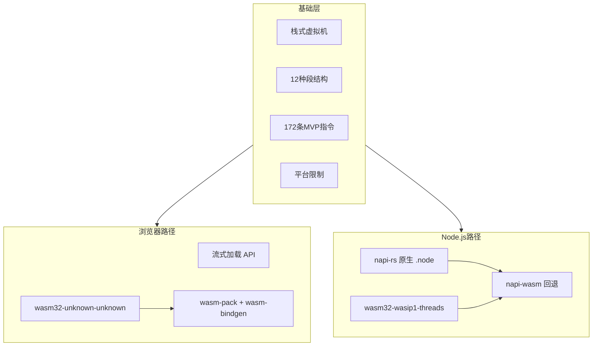
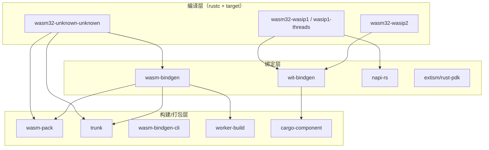
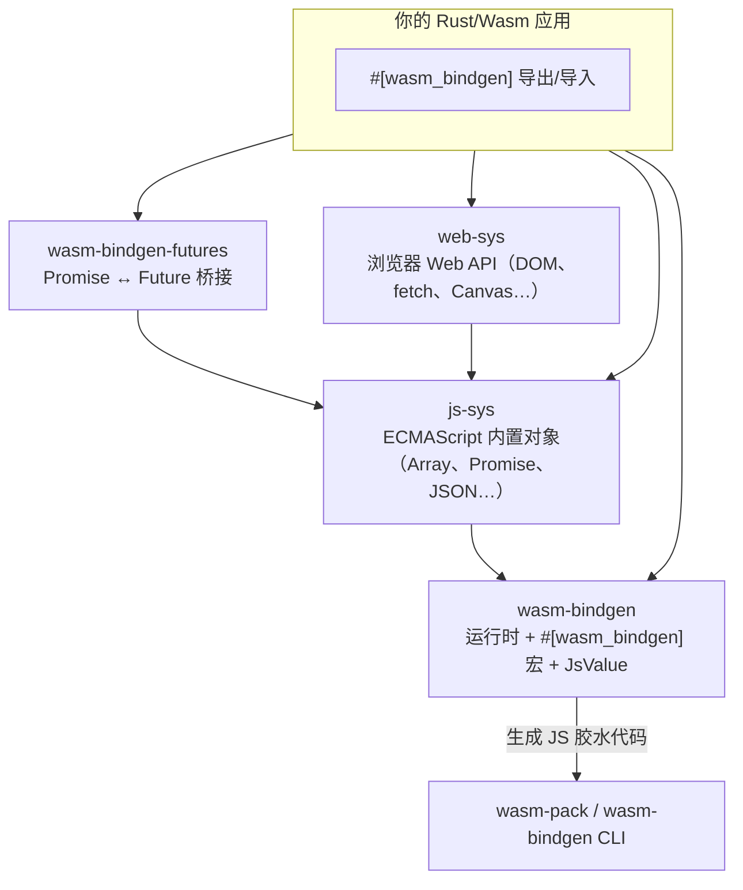
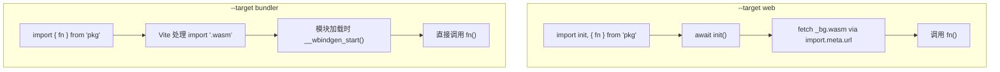
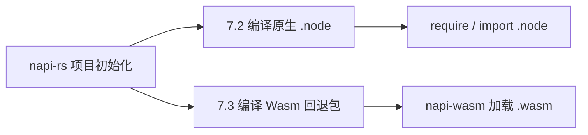

# Wasm 基础：原理、Rust 编译与 Node 集成

> 一篇从浅到深、不限制篇幅的 Wasm 全景指南。适合第一次接触 Wasm 的开发者系统阅读，也适合已有经验、希望把浏览器前端与 Node.js 集成串成完整知识链的工程师。

---

## 目录

1. [前言：Wasm 是什么，解决什么问题](#前言wasm-是什么解决什么问题)
2. [第 1 章：Wasm 原理与栈式虚拟机](#第-1-章wasm-原理与栈式虚拟机)
3. [第 2 章：二进制格式与段结构](#第-2-章二进制格式与段结构)
4. [第 3 章：指令集、内存模型与平台限制](#第-3-章指令集内存模型与平台限制)
5. [第 4 章：网页引入 wasm 与流式加载](#第-4-章网页引入-wasm-与流式加载)
6. [第 5 章：多语言编译 Wasm — 以 Rust 为例](#第-5-章多语言编译-wasm--以-rust-为例)
7. [第 6 章：wasm-pack 与 wasm-bindgen 生态](#第-6-章wasm-pack-与-wasm-bindgen-生态)
8. [第 7 章：napi-rs — 原生 Node 模块与 Wasm 回退](#第-7-章napi-rs--原生-node-模块与-wasm-回退)
9. [附录 A：用 WAT 手写一个最小模块](#附录-a用-wat-手写一个最小模块)
10. [附录 B：常见问题与排错](#附录-b常见问题与排错)
11. [总结与延伸阅读](#总结与延伸阅读)

---

## 前言：Wasm 是什么，解决什么问题

### 从 JavaScript 的局限说起

JavaScript 是 Web 的通用语言，但它是解释型、动态类型的。对于图像处理、音视频编解码、游戏物理引擎、加密计算等 **CPU 密集型** 任务，纯 JS 往往力不从心。过去常见的做法是：

- 用 C/C++ 编写核心逻辑，通过 **Emscripten** 编译为 Asm.js 或 Wasm
- 用 **Native Addon**（Node.js 的 `.node` 模块）在服务端跑原生代码

这些方案有效，但要么性能折损大，要么平台绑定强、分发困难。

### WebAssembly 的定位

**WebAssembly（Wasm）** 是一种低级、可移植的二进制指令格式，设计目标是：

| 目标 | 说明 |
|------|------|
| 快速 | 接近原生机器码的执行速度（引擎 JIT/AOT 编译后） |
| 安全 | 沙箱隔离，无法直接访问宿主内存或系统调用 |
| 开放 | 标准开放，多种语言可编译为目标格式 |
| 紧凑 | 二进制比文本 JS 更小，适合网络传输 |

Wasm **不是** JavaScript 的替代品，而是 **JS 的搭档**：

- **JS** 负责 DOM 操作、事件处理、网络请求、UI 逻辑
- **Wasm** 负责计算密集的核心算法

两者通过 `import` / `export` 互相调用。

### Wasm 的应用场景

```
浏览器前端     → 图像处理、游戏引擎、CAD、音视频、加密
Node.js       → 原生扩展的跨平台替代、napi-rs Wasm 回退
边缘计算       → Cloudflare Workers、Fastly Compute@Edge
插件系统       → 沙箱化第三方扩展（Figma、VS Code 等）
非 Web 运行时  → Wasmtime、Wasmer、WAMR（配合 WASI）
```

### Wasm 跨语言复用与包生态

Wasm 的核心价值之一，是把 **「一次编译，多处运行」** 从「同一语言内跨平台」扩展到 **跨语言边界**：Rust、C/C++、Go、AssemblyScript 等各自编译出 `.wasm`，宿主（浏览器 JS、Node、Python、Wasmer CLI 等）只需按统一的 `import` / `export` 约定加载，就能调用其中的函数——**调用方不必与编写方使用同一种语言**。例如用 Rust 写的图像压缩库编译为 `.wasm` 后，前端 JS 直接 `WebAssembly.instantiate` 调用；在 Node 里也可通过 `napi-wasm` 或 WASI 运行时复用同一份二进制。

随着 **Component Model + WIT** 的发展，跨语言复用更进一步：接口以 `.wit` 描述，各语言通过 `wit-bindgen` 生成绑定，组件之间像拼乐高一样组合——这才是 Wasm 生态长期对标 npm 的方向。

目前已有的共享渠道（成熟度不一）：

| 平台 | 地址 | 定位 |
|------|------|------|
| **Wasmer Registry** | [wasmer.io](https://wasmer.io/) | 最接近「Wasm 版 npm」——`wasmer publish` 发布、`wasmer run` 安装运行；原 WAPM 已并入此处 |
| **npm** | [npmjs.com](https://www.npmjs.com/) | 前端主流路径：`wasm-pack` 将 Rust Wasm 与 JS 胶水一并发布（如 `wasm-bindgen` 系包），搜索关键词 `wasm` 可找到大量模块 |
| **OCI / wkg** | [wasm-pkg-tools](https://github.com/bytecodealliance/wasm-pkg-tools) | Bytecode Alliance 推动的 Component 分发方案，通过 `wkg` CLI 从 OCI 镜像仓库拉取/发布 Wasm 组件 |
| **Warg 注册表** | [warg.wa.dev](https://warg.wa.dev/) | 实验性的联邦式 Wasm 包索引，面向 Component Model，生态仍在建设中 |

一句话总结：**跨语言复用靠 `.wasm` 二进制 + 统一接口；找现成模块，生产环境优先看 Wasmer Registry 和 npm，Component 时代则关注 OCI + `wkg` 工具链。**

### 本文知识地图



---

## 第 1 章：Wasm 原理与栈式虚拟机

### 1.1 编译链路：从高级语言到 Wasm

无论你用 Rust、C++ 还是 Go，编译到 Wasm 的典型链路是：

```
源代码 (.rs / .cpp / .go)
    ↓ 编译器前端
LLVM IR / 中间表示
    ↓ LLVM Wasm 后端 / 专用后端
Wasm 二进制 (.wasm) 或文本格式 (.wat)
    ↓ 浏览器/Node 引擎
机器码（JIT 或 AOT 编译）
```

你不需要手写 Wasm 指令——编译器负责生成。但理解栈式虚拟机有助于：

- 阅读反汇编和调试
- 理解为什么某些代码编译后体积大
- 排查 import/export 签名不匹配的问题

#### WAT 与 Wasm 原文对照（加法示例）

Wasm 有两种等价表示：**文本格式 WAT**（WebAssembly Text Format，人类可读）和 **二进制格式 `.wasm`**（网络传输与引擎加载用）。下面是一个最小的 `add(a, b) = a + b` 模块——逻辑完全相同，只是载体不同。

**WAT 文本**（保存为 `add.wat`）：

```wat
(module
  ;; 导出函数 add(i32, i32) -> i32
  (func (export "add") (param i32 i32) (result i32)
    local.get 0    ;; 取第 1 个参数压栈
    local.get 1    ;; 取第 2 个参数压栈
    i32.add        ;; 弹出两个 i32 相加，结果压栈
  )
)
```

**`.wasm` 二进制原文**（用十六进制查看时的实际字节，共 40 字节）：

```
00 61 73 6d   ;; Magic: "\0asm"
01 00 00 00   ;; Version: 1

01 07 01 60 02 7f 7f 01 7f   ;; type 段：1 个函数类型 (i32,i32) -> i32
03 02 01 00                  ;; function 段：1 个函数，签名索引 0
07 07 01 03 61 64 64 00 00   ;; export 段：导出函数名 "add"（0x61 0x64 0x64）
0a 09 01 07 00 20 00 20 01 6a 0b
;; code 段：函数体 = local.get 0 + local.get 1 + i32.add + end
```

用文本编辑器打开 `.wasm` 会看到乱码——这是正常的，它本来就是紧凑的二进制指令流，不是给人直接阅读的。想理解二进制里写了什么，要么反汇编回 WAT，要么借助下面提到的工具。

> 更完整的 WAT 手写示例（含内存、import）见 [附录 A](#附录-a用-wat-手写一个最小模块)。

#### WAT ↔ Wasm 互转：工具与命令

官方生态里最常用的是 **[WABT](https://github.com/WebAssembly/wabt)**（WebAssembly Binary Toolkit）：

| 方向 | 命令 | 说明 |
|------|------|------|
| WAT → Wasm | `wat2wasm add.wat -o add.wasm` | 文本编译为二进制 |
| Wasm → WAT | `wasm2wat add.wasm -o add.wat` | 反汇编为可读文本 |
| 查看结构 | `wasm-objdump -x add.wasm` | 列出段、类型、导出等 |
| 解释执行 | `wasm-interp add.wasm -r add -a "i32:3" -a "i32:5"` | 命令行直接调用导出函数，输出 `i32:8` |

安装方式（任选其一）：

```bash
# macOS
brew install wabt

# Windows（Scoop）
scoop install wabt

# npm
npm install -g wabt

# 源码编译
git clone https://github.com/WebAssembly/wabt
cd wabt && mkdir build && cd build && cmake .. && cmake --build .
```

除 WABT 外，**Binaryen** 工具集里的 `wasm-as` / `wasm-dis` 也能完成同类转换；`llvm-objdump -d module.wasm` 则适合分析 C/C++/Rust 经 LLVM 编译出的产物。日常「一段 WAT 和一份 `.wasm` 互相对照」用 WABT 就足够。

#### 用 Chrome 调试 Wasm

从 Chrome 73 起，DevTools 已支持 WebAssembly 调试；近年版本能力更完整，主要包括：

1. **无调试信息时**：在 DevTools → **Sources** 面板中仍能看到 Wasm 模块，引擎会把二进制**反汇编**为类 WAT 的文本，可单步执行、查看操作数栈变化（需配合 Scope / 调试侧边栏）。
2. **有 DWARF 调试信息时**（C/C++/Rust 用 `-g` 编译，并生成 `.dwarf.wasm` 或内嵌 DWARF）：DevTools 能直接映射回**原始源代码**，支持断点、变量查看、调用栈——体验接近调试普通 JS。

典型工作流：

```
1. 用 WAT/WABT 或编译器生成 .wasm
2. 页面通过 WebAssembly.instantiate(Streaming) 加载
3. 打开 DevTools → Sources → 左侧找到 .wasm 或对应的 .c/.rs 源文件
4. 点击行号设断点，触发调用后单步调试
```

截至 2026 年，[Chrome 官方文档](https://developer.chrome.com/docs/devtools/wasm)仍要求安装扩展 [C/C++ DevTools Support (DWARF)](https://goo.gle/wasm-debugging-extension)——DWARF 解析尚未完全内置进 DevTools，扩展负责把 Wasm 里的调试信息关联到原始源文件。安装后需重启 Chrome；

构建侧：Rust 用 `wasm-pack build --dev` 并在 `Cargo.toml` 中设置 `dwarf-debug-info = true`（默认 release 会剥离 DWARF）；Emscripten / Clang 用 `-g` 生成 DWARF。若只看到反汇编而没有源码，先检查 `.wasm` 里是否含 `.debug_*` 段（`wasm-objdump -x`），再确认扩展已启用。

在 Sources 面板中还可对线性内存使用 **Memory Inspector**（右键 `WebAssembly.Memory` 对象 → Inspect memory），以十六进制查看 Wasm 线性内存的读写内容。

### 1.2 栈式虚拟机（Stack Machine）

#### 什么是操作数栈

Wasm 是 **栈式虚拟机（Stack Machine）**。函数执行时维护一个 **操作数栈（Operand Stack）**，大多数指令从栈顶取操作数，将结果压回栈顶。

每条 Wasm 指令由两部分组成：

- **Opcode（操作码）**：1 字节，标识指令类型
- **Immediate（立即数）**：可选的附加参数，如 `i32.const 42` 中的 `42`，或 `local.get 3` 中的局部变量索引 `3`

#### 与控制流栈的配合

除操作数栈外，Wasm 还有 **控制流栈（Control Stack）**，管理结构化控制指令：

| 指令 | 作用 |
|------|------|
| `block` | 创建一个块，有结果类型 |
| `loop` | 创建循环头 |
| `if` / `else` | 条件分支 |
| `br` | 跳转到外层 block/loop |
| `br_table` | 多路分支（类似 switch） |
| `return` | 从函数返回 |
| `end` | 关闭当前 block/loop/if |

Wasm **禁止任意 `goto`**。所有跳转必须指向结构化块内的标签，这使得引擎可以在编译前 **静态验证** 控制流的合法性——不会出现"跳进了栈已销毁的栈帧"这类运行时错误。

### 1.3 模块、实例与内存

Wasm 程序以 **模块（Module）** 为编译单元。模块本身不可执行，必须经过 **实例化（Instantiate）** 才能运行。

```
Module（编译后的代码 + 元数据）
    ↓ instantiate(imports)
Instance（可执行的运行时实体）
    ├── 线性内存（Memory）
    ├── 函数表（Table）
    ├── 全局变量（Globals）
    ├── 已绑定的 import 函数
    └── 导出（exports）
```

**线性内存（Linear Memory）** 是 Wasm 唯一可寻址的内存空间，表现为一个连续的字节数组：

- 最小 1 页 = 64 KiB
- 可通过 `memory.grow` 动态增长
- 读写通过 `i32.load` / `i32.store` 等指令，带边界检查
- 不是 GC 堆，它没有 `malloc`/`free` 的内建实现，需语言运行时自行管理

### 1.4 验证（Validation）

引擎在实例化前会对模块做 **静态验证**，确保：

1. 每条指令的类型正确（如 `i32.add` 要求栈顶两个值都是 `i32`）
2. 操作数栈在每条指令后深度正确（栈平衡）
3. 控制流合法（`br` 目标存在且类型匹配）
4. 内存访问偏移合法
5. `call` / `call_indirect` 的目标函数签名匹配

验证失败则实例化直接报错，**不会**运行到一半才崩溃。这是 Wasm 安全模型的重要一环。

```javascript
// js 环境下校验
const wasmBytes = new Uint8Array([...])
WebAssembly.validate(wasmBytes) // 只校验，不生成机器码

WebAssembly.compile(bufferSource) // 隐式校验，再生成机器码
```

```bash
# wabt 校验
wasm-validate your_module.wasm
```

### 1.5 二进制文件头

每个 `.wasm` 文件以固定头部开始：

| 偏移 | 字段 | 内容 |
|------|------|------|
| 0–3 | Magic | `\0asm`（十六进制 `00 61 73 6D`） |
| 4–7 | Version | `1`（小端 u32，即 `01 00 00 00`） |

头部之后是段序列。可用 `wasm-objdump`（WABT 工具集）查看：

```bash
# 安装 WABT: https://github.com/WebAssembly/wabt
wasm-objdump -x add.wasm
```

### 本章小结

Wasm 是栈式虚拟机，靠操作数栈做运算、控制流栈管理分支。模块需实例化后执行，线性内存是唯一的可寻址空间。静态验证保证类型安全和栈平衡——这是 Wasm 能在不可信环境中安全运行的基石。

---

## 第 2 章：二进制格式与段结构

### 2.1 段的通用格式

每个段由三部分组成：

```
section_id   (1 byte)    — 段类型 ID
section_size (LEB128)    — payload 字节数
payload      (variable)  — 段内容
```

**LEB128（Little Endian Base 128）** 是一种变长整数编码，小数值占更少字节，广泛用于 Wasm 二进制格式中的索引和长度字段。

### 2.2 十二种标准段

按照 [WebAssembly Core Specification](https://webassembly.github.io/spec/core/binary/modules.html)，**Wasm 1.0 MVP 定义了 12 种标准段**（ID 0–11）：

| ID | 段名 | 作用 | 是否必须 |
|----|------|------|---------|
| 0 | custom | 自定义元数据（调试信息、producers 等） | 否 |
| 1 | type | 函数类型签名 | 否（但通常有） |
| 2 | import | 从宿主导入函数/内存/表/全局变量 | 否 |
| 3 | function | 模块内函数声明（索引到 type 段） | 否 |
| 4 | table | 函数引用表（`funcref` 类型） | 否 |
| 5 | memory | 线性内存定义 | 否 |
| 6 | global | 模块级全局变量 | 否 |
| 7 | export | 导出函数/内存/表/全局变量 | 否 |
| 8 | start | 实例化后自动执行的函数索引 | 否 |
| 9 | element | 表初始化（函数引用列表） | 否 |
| 10 | code | 函数体（局部变量 + 指令） | 否 |
| 11 | data | 内存初始化数据 | 否 |

### 2.3 各段详解

以下按模块依赖顺序说明各段：**作用**、**WAT 写法**、**二进制编码**。每条类型/条目编码后，段本身仍遵循 [2.1 节的通用格式](#21-段的通用格式)：`section_id` + `section_size`（LEB128）+ `payload`。

常用值类型字节：`7f` = i32，`7e` = i64，`7d` = f32，`7c` = f64，`70` = funcref。

#### type 段（ID 1）

**作用**：定义函数签名（参数与返回值类型）。function 段、import 段中的函数都通过索引引用此处的类型。

**WAT 示例**（类型在 `(func ...)` 中内联声明时，编译器会写入 type 段）：

```wat
(func (param i32 i32) (result i32))
```

**二进制编码**：

单条 func type 以 `0x60` 开头，后跟参数个数、各参数类型、返回值个数、各返回值类型：

```
60 02 7f 7f 01 7f
│  │  └──┘  │  └─ 1 个 i32 返回值
│  │         └─ 1 个返回值
│  └─ 2 个 i32 参数
└─ func type 标签
```

完整 type 段（含 1 条类型）：

```
01 07 01 60 02 7f 7f 01 7f
│  │  │  └─ 类型条目
│  │  └─ 1 条类型
│  └─ payload 长度 7
└─ 段 ID = type
```

#### import 段（ID 2）

**作用**：声明模块从外部 **导入** 的函数、表、内存或全局变量。Wasm 没有内置 I/O，宿主能力（打印、网络、系统调用等）都通过 import 函数注入——**这是 Wasm 与外部世界交互的入口**。

**WAT 示例**：

```wat
(import "env" "add" (func (param i32 i32) (result i32)))
(import "env" "memory" (memory 1))
```

**二进制编码**：

每条 import = 模块名（字符串）+ 字段名（字符串）+ 种类字节 + 描述符：

| 种类字节 | 含义 | 描述符 |
|---------|------|--------|
| `00` | 函数 | type 段索引 |
| `01` | 表 | 表类型（`70` + limits） |
| `02` | 内存 | limits |
| `03` | 全局 | 全局类型 + 初始化表达式 |

导入函数 `"env"."add"`（签名索引 0）：

```
03 65 6e 76 03 61 64 64 00 00
│           │           │  └─ type 索引 0
│           │           └─ kind = func
│           └─ "add"（3 字节）
└─ "env"（3 字节）
```

完整 import 段（1 条函数导入）：

```
02 0b 01 03 65 6e 76 03 61 64 64 00 00
```

导入内存 `"env"."memory"`（最小 1 页，无上限）：

```
03 65 6e 76 06 6d 65 6d 6f 72 79 02 00 01
                                      │  └─ min = 1 页
                                      └─ limits：flags=0（无 max）
```

#### function 段（ID 3）

**作用**：声明模块 **内部定义** 的函数列表；每条仅是一个 type 段索引，不含函数体。函数体在 code 段，**function 段条目数必须与 code 段一致**。

**WAT 示例**（3 个内部函数，前两个签名同 type 0，第三个同 type 1）：

```wat
(func (type 0))
(func (type 0))
(func (type 1))
```

**二进制编码**：

```
03 04 03 00 00 01
│  │  │  └─┴─┴─ 3 个 type 索引：0, 0, 1
│  │  └─ 3 个函数
│  └─ payload 长度 4
└─ 段 ID = function
```

#### table 段（ID 4）

**作用**：定义函数引用表（元素类型 `funcref`）。配合 `call_indirect` 按表索引间接调用，是实现函数指针、虚表、动态分派的基础。

**WAT 示例**：

```wat
(table 2 funcref)
```

**二进制编码**：

表类型 = 元素类型 `70`（funcref）+ limits（`flags` + `min` [+ `max`]）：

```
70 00 02
│  │  └─ 最小 2 个槽位
│  └─ flags=0（无 max）
└─ funcref
```

完整 table 段（1 张表）：

```
04 04 01 70 00 02
      │  └─ 表类型
      └─ 1 张表
```

#### memory 段（ID 5）

**作用**：声明模块的线性内存。页大小固定 64 KiB；可只设下限，也可同时设上限。

**WAT 示例**：

```wat
(memory 1)       ;; 最小 1 页，无上限
(memory 1 10)    ;; 最小 1 页，最大 10 页
```

**二进制编码**：

limits：`flags`（`0` = 仅 min，`1` = min + max）+ LEB128 页数。

仅最小 1 页：

```
00 01
│  └─ min = 1
└─ 无 max
```

min=1、max=10：

```
01 01 0a
│  │  └─ max = 10
│  └─ min = 1
└─ 含 max
```

完整 memory 段（1 块内存，1–10 页）：

```
05 04 01 01 01 0a
```

#### global 段（ID 6）

**作用**：定义模块级全局变量（类型 + 是否可变 + 编译期常量初始化表达式）。常用于堆指针、计数器等跨函数共享状态。

**WAT 示例**：

```wat
(global i32 (i32.const 0))              ;; 不可变，初值 0
(global (mut i32) (i32.const 42))       ;; 可变，初值 42
```

**二进制编码**：

每条 = 值类型 + mut 标志（`0` 不可变 / `1` 可变）+ init 表达式（必须以 `0x0b`/`end` 结尾）。

可变 i32，初值 42：

```
7f 01 41 2a 0b
│  │  │     └─ end
│  │  └─ i32.const 42（0x2a）
│  └─ mut
└─ i32
```

完整 global 段（1 个全局变量）：

```
06 06 01 7f 01 41 2a 0b
```

#### export 段（ID 7）

**作用**：把函数、表、内存或全局变量 **导出** 给宿主，宿主通过 `instance.exports.<name>` 访问。

**WAT 示例**：

```wat
(export "add" (func 0))
(export "memory" (memory 0))
```

**二进制编码**：

每条 = 导出名（字符串）+ kind + 索引：

| kind | 含义 |
|------|------|
| `00` | 函数 |
| `01` | 表 |
| `02` | 内存 |
| `03` | 全局 |

导出函数 `"add"`（函数索引 0）：

```
03 61 64 64 00 00
│           │  └─ 函数索引 0
│           └─ kind = func
└─ "add"
```

完整 export 段（1 条导出）——与 [前文 add 示例](#wat-与-wasm-原文对照加法示例)一致：

```
07 07 01 03 61 64 64 00 00
```

#### start 段（ID 8）

**作用**：可选。指定一个 **无参数、无返回值** 的函数索引；模块实例化完成后 **自动调用一次**，常用于全局初始化。

**WAT 示例**：

```wat
(start 0)    ;; 实例化后自动执行函数索引 0
```

**二进制编码**：

payload 仅一个函数索引：

```
08 01 00
│  │  └─ 函数索引 0
│  └─ payload 长度 1
└─ 段 ID = start
```

#### element 段（ID 9）

**作用**：在实例化时向 table 写入函数引用，为 `call_indirect` 准备跳转目标（类似填充函数指针数组）。

**WAT 示例**：

```wat
(elem (i32.const 0) func 0 1)    ;; 从表偏移 0 起，依次放入函数 0、1
```

**二进制编码**：

每条 element = 表索引 + offset 表达式 + 函数索引列表。

```
00 41 00 0b 02 00 01
│  └─────┘  │  └─┴─ 函数索引 0、1
│           └─ 2 个函数
└─ table 0；offset = i32.const 0；end
```

完整 element 段（1 条 segment）：

```
09 09 01 00 41 00 0b 02 00 01
      │  └─ segment
      └─ 1 条 element
```

#### code 段（ID 10）

**作用**：存放各内部函数的 **函数体**（局部变量声明 + 指令序列）。静态指令在模块加载后常驻，直到卸载。

**WAT 示例**（与 type 0 对应的函数体）：

```wat
(func (type 0)
  (local i32)           ;; 额外局部变量（参数之外）
  local.get 0
  local.get 1
  i32.add)
```

**二进制编码**：

每个函数体 = body 大小（LEB128）+ 局部变量组 + 表达式（以 `end` 结尾）。

无额外局部、`local.get 0` + `local.get 1` + `i32.add`：

```
07 00 20 00 20 01 6a 0b
│  │  └──────────┘     └─ end
│  └─ 0 组局部变量
└─ body 长度 7
```

完整 code 段（1 个函数）——与 [前文 add 示例](#wat-与-wasm-原文对照加法示例)一致：

```
0a 09 01 07 00 20 00 20 01 6a 0b
```

#### data 段（ID 11）

**作用**：在实例化时把 **只读字节序列** 复制到线性内存指定偏移，用于初始化字符串、常量池、全局数据等。

**WAT 示例**：

```wat
(data (i32.const 0) "Hi")    ;; 从内存偏移 0 写入 "Hi"
```

**二进制编码**：

每条 data = 内存索引 + offset 表达式 + 字节数组（长度前缀 + 数据）。

```
00 41 00 0b 02 48 69
│  └─────┘  │  └── "Hi"
│           └─ 2 字节
└─ memory 0；offset = i32.const 0；end
```

完整 data 段（1 条 data segment）：

```
0b 09 01 00 41 00 0b 02 48 69
```

#### custom 段（ID 0）

**作用**：携带工具链自定义元数据，**不影响 Wasm 语义**。可出现在模块任意位置，也可有多条。WAT 源文件通常不写 custom 段，由编译器/链接器附加。

**常见 payload**（段内 `name` 字符串区分用途）：

- `name`：函数、局部变量调试名
- `producers`：编译器、工具版本
- 调试信息（如 DWARF）

**WAT 示例**：

custom 段无对应 WAT 语法；下面是有 `name` custom 段时，反汇编可能看到的函数名（仍来自 metadata，不是语言本身语法）：

```wat
;; 反汇编输出中可能显示：
(func $add ...)    ;; $add 来自 name 段，非 WAT 关键字
```

**二进制编码**：

custom 段 payload = 段名（字符串）+ 任意字节数据。示例：名为 `"hello"`、数据为 `"world"` 的 custom 段：

```
00 0b 05 68 65 6c 6c 6f 77 6f 72 6c 64
│  │  │  └─ "hello"   └─ 数据 "world"
│  │  └─ payload 长度 11
│  └─ 段 ID = custom
```

`name` 段结构更复杂（含子节：模块名、函数名、局部变量名等），可用 `wasm-objdump -x module.wasm` 查看；日常理解二进制格式时，记住 **「名字 + 不透明数据」** 即可。

### 2.4 段的排列规则

```
┌─────────────────────────────────────────────────────┐
│  Header: magic + version                            │
├─────────────────────────────────────────────────────┤
│  [custom]*                                          │
│  type → import → function → table → memory → global │
│  [custom]*                                          │
│  export → start → element → code → data             │
│  [custom]*                                          │
└─────────────────────────────────────────────────────┘
```

- **custom 段**可出现在任意位置，可有多个
- 其余标准段 **至多出现一次**，且必须按 ID 升序, 目的是支持‌流式解析（Streaming Parsing）‌和‌单次遍历验证‌
- 所有段都可以为空（空模块也是合法模块）

### 2.5 扩展段

Wasm 2.0+ 引入了 **datacount 段（ID 12）**，在 data 段之前声明数据段条目数，便于流式验证。此外还有与 Component Model 相关的新段。本文以 MVP 为主，掌握 12 种标准段即可理解绝大多数 `.wasm` 文件。

### 本章小结

段是 Wasm 模块的骨架：**type/import/export**定义接口，**code/data** 定义实现，**memory/table/global** 定义运行时资源。**import** 段是 Wasm 请求宿主能力的桥梁——没有它，Wasm 只是一个纯粹的计算孤岛。

---

## 第 3 章：指令集、内存模型与平台限制

### 3.1 指令总览：172 条 MVP 指令

Wasm 1.0 MVP 共 **172 条指令**，opcode 为单字节。按功能分为 5 大类：

#### 控制流指令（13 条）

| 指令 | 作用 |
|------|------|
| `unreachable` | 触发陷阱（trap），类似 `abort` |
| `nop` | 空操作 |
| `block` / `loop` / `if` / `else` / `end` | 结构化控制流 |
| `br` | 无条件分支到标签 |
| `br_if` | 条件分支 |
| `br_table` | 多路分支 |
| `return` | 从函数返回 |
| `call` | 直接调用函数 |
| `call_indirect` | 通过表间接调用 |

#### 参数化指令（2 条）

| 指令 | 作用 |
|------|------|
| `drop` | 弹出栈顶值并丢弃 |
| `select` | 根据条件选择两个值之一 |

#### 变量指令（5 条 ）

| 指令 | 作用 |
|------|------|
| `local.get` / `local.set` / `local.tee` | 读/写/读改写局部变量 |
| `global.get` / `global.set` | 读/写全局变量 |

#### 内存指令（25 条）

| 指令 | 作用 |
|------|------|
| `i32.load` / `i64.load` / `f32.load` / `f64.load` | 从线性内存读取 |
| `i32.store` / `i64.store` / `f32.store` / `f64.store` | 写入线性内存 |
| `memory.size` | 返回当前内存页数 |
| `memory.grow` | 扩展内存 |

所有 load/store 都带 **对齐（align）** 和 **偏移（offset）** 参数，引擎在运行时做边界检查。

#### 数值指令（127 条）

涵盖 `i32`/`i64`/`f32`/`f64` 的：

- 常量：`i32.const`、`f64.const` 等
- 比较：`i32.eq`、`f64.lt` 等
- 一元运算：`i32.clz`、`f64.sqrt`、`f64.neg` 等
- 二元运算：`i32.add`、`i32.mul`、`i32.div_s`、`f64.add` 等
- 类型转换：`i32.wrap_i64`、`f32.convert_i32_s` 等
- 位运算：`i32.and`、`i32.shl`、`i32.rotl` 等

### 3.2 扩展指令与前缀编码

MVP 之后，指令总数超过 256，引入了 **前缀字节** 编码：

| 前缀 | 扩展 | 示例指令 |
|------|------|---------|
| `0xfc` | 杂项 / Bulk Memory | `memory.copy`、`memory.fill`、`table.copy` |
| `0xfd` | SIMD 128 位向量 | `v128.load`、`i32x4.add` |
| `0xfe` | 线程 / 原子操作 | `memory.atomic.add`、`memory.atomic.wait` |

因此 **172 是 MVP 基线**；Chrome、Firefox、Node.js 等现代引擎实际支持数百条指令。

MVP（Chrome 57，2017 年 3 月）之后，Chrome 通过 V8 陆续默认启用了大量扩展提案。下表按 **Chrome 版本** 升序列出主要已落地特性（数据来源：[webassembly.org/roadmap](https://webassembly.org/features/)，截至 2026 年初）：

| 提案名 | 提案描述 | Chrome 支持版本 |
|--------|----------|----------------|
| Mutable Globals | 允许在模块间导入/导出**可变**全局变量 | 74 |
| Sign-extension Operators | 有符号扩展指令，如 `i32.extend8_s`、`i64.extend32_s` | 74 |
| Threads | 共享线性内存 + 原子操作，支持 `SharedArrayBuffer` 多线程 Wasm（需站点开启 [跨域隔离](https://web.dev/articles/cross-origin-isolation-guide)） | 74 |
| Bulk Memory Operations | 批量内存/表操作：`memory.copy`、`memory.fill`、`memory.init`、`table.copy` 等；支持 passive 数据段 | 75 |
| Non-trapping float-to-int | 饱和浮点转整型（`i32.trunc_sat_f32_s` 等），越界时饱和而不 trap | 75 |
| Multi-value | 函数与块支持**多个返回值**，如 `(result i32 i32)` | 85 |
| JS BigInt Integration | JS `BigInt` 与 Wasm `i64` 在 JS API 层互操作（非字节码指令） | 85 |
| Fixed-width SIMD | 128 位固定宽度向量指令，前缀 `0xfd`，如 `v128.load`、`i32x4.add` | 91 |
| Legacy Exception Handling | 旧版异常处理方案（`try/catch` 块），已被 exnref 版取代 | 95 |
| Reference Types | 引入 `funcref`、`externref` 引用类型，表元素不再限于 `anyfunc` | 96 |
| Web Content Security Policy | Wasm 模块遵守宿主页面的 CSP 策略 | 97 |
| Tail Call | 尾调用优化：`return_call`、`return_call_indirect` | 112 |
| Extended Constant Expressions | 全局变量、元素段、数据段初始化可使用更丰富的常量表达式 | 114 |
| Relaxed SIMD | 放宽部分 SIMD 指令的语义约束以换取更高性能（如 `i32x4.relaxed_dot_i8x16_i7x16`） | 114 |
| Garbage Collection (WasmGC) | 结构体/数组堆类型，托管语言编译产物可直接复用 V8 垃圾回收器 | 119 |
| Typed Function References | 强类型函数引用，`call_ref` 等指令，表项携带精确函数签名 | 119 |
| Multiple Memories | 单个模块可声明并直接访问**多个**线性内存 | 120 |
| JS String Builtins | Wasm 通过 import 直接调用宿主 JS 字符串内置方法（如 `fromCharCode`） | 130 |
| Memory64 | 内存与表索引升级为 `i64`，寻址空间突破 4 GiB 上限 | 133 |
| Branch Hinting | 为分支指令附加预测提示，帮助引擎优化热路径布局 | 137 |
| Exception Handling (exnref) | 基于 `exnref` 的最终版异常处理，取代旧版 `try/catch` 方案 | 137 |
| JS Promise Integration | Wasm 函数可挂起并等待 JS `Promise` 完成，简化异步互操作 | 137 |

> 另有部分提案在 Chrome 中仅通过实验 flag 提供（如 Type Reflection、Stack Switching、Compilation Hints），尚未默认开启，上表未收录。

### 3.3 值类型

#### MVP 四种基本类型

| 类型 | 字节码 | 说明 |
|------|--------|------|
| `i32` | `0x7F` | 32 位整数 |
| `i64` | `0x7E` | 64 位整数 |
| `f32` | `0x7D` | 32 位浮点 |
| `f64` | `0x7C` | 64 位浮点 |

#### 扩展类型

| 类型 | 说明 | 用途 |
|------|------|------|
| `v128` | 128 位向量 | SIMD 并行计算 |
| `funcref` | 函数引用 | 表元素、间接调用 |
| `externref` | 外部引用 | 存放 JS 对象引用（需引擎支持） |

#### 函数类型

```
(param i32 i32) (result i32)    ;; 接受两个 i32，返回一个 i32
(param) (result)                ;; 无参无返回值
```

MVP 限制最多 1 个返回值。**Multi-value** 扩展后支持多返回值，如 `(result i32 i32)`。

>  为什么 MVP 不支持原生 string 类型？  
   字符串涉及编码（UTF-8/16/32）、内存管理（GC 或手动 malloc/free）、子串切片等复杂逻辑，MVP 旨在提供一个最小的、可移植的编译目标，将这些复杂性留给上层语言（C/Rust/Go）的工具链处理。  
   字符串在 Wasm MVP 中是通过‌“内存指针 + 长度”‌的模式，存储在‌线性内存（Linear Memory）‌中, 比如代码中硬编码的字符串（如 "Hello World"），编译器会将其放入 Wasm 模块的 ‌Data 段， 在模块实例化时，这些数据会被自动复制到 Linear Memory 的指定偏移位置。运行时生成的字符串，调用内存分配函数（如 C 的 malloc 或 Rust 的 alloc），在 Linear Memory 中申请一块足够大的空间，使用 i32.store8 等指令，将字符串的 UTF-8 字节逐个写入申请的内存区域，返回起始地址（i32）和长度（i32）即可。

```javascript
// 如何从wasm实例中，读取字符串到 JS
const memory = wasmInstance.exports.memory;
const ptr = wasmInstance.exports.get_string_ptr(); // 返回 i32
const len = wasmInstance.exports.get_string_len(); // 返回 i32

// 从 Wasm 内存中读取字节
const bytes = new Uint8Array(memory.buffer, ptr, len);
// 解码为 JS 字符串 (默认 UTF-8)
const jsString = new TextDecoder('utf-8').decode(bytes);
console.log(jsString);
```
   有关string的提案有很多，大都夭折了，目前可以关注 3.2 节的`JS String Builtins（chrome 130+)`,通过 import 调用宿主 JS 字符串 API。 另外实际开发时，不需要关注这个，大多数开发语言会处理字符串的问题，`wasm-bindgen` 参见 6.6 节。


### 3.4 内存模型深入

```
线性内存
┌──────────────────────────────────────────┐
│ 0x0000 │ data 段初始化的静态数据           │
│ 0x0100 │ 字符串、常量                      │
│ 0x1000 │ 堆（Rust/ C 运行时 malloc）       │
│  ...   │                                   │
│ 0xNNNN │ 栈（编译器分配的栈空间）           │
└──────────────────────────────────────────┘
         ↑ memory.grow 可扩展
```

关键特性：

- **单一连续字节数组**，无分段、无保护页（MVP）
- 访问必须带边界检查，越界触发 **trap**（不可捕获的异常，实例终止）
- 内存可以被多个实例共享（通过 `SharedArrayBuffer` + 线程扩展）
- Rust 的 `Vec`、`String` 最终都落在这条线性内存上

### 3.5 平台限制：Wasm 不能做什么

这是最重要的认知——Wasm 是 **计算层**，不是 **平台层**。

| 限制 | 原因 | 解决方案 |
|------|------|---------|
| **无自动内存管理** | 只有线性内存，无 GC | 语言运行时自带分配器（Rust `dlmalloc`/`wee_alloc`）,GC扩展提案主要服务 Java/Kotlin/JS 等托管语言编译器 |
| **无 DOM 访问** | 沙箱隔离 | `wasm-bindgen` + `web-sys` 从 JS 导入 |
| **无文件系统** | 无 syscall | WASI（`wasm32-wasi`）或 JS import |
| **无网络** | 同上 | `web-sys::fetch` 或 WASI socket 扩展 |
| **无线程** | 单线程模型 | Threads扩展 + `SharedArrayBuffer` |
| **无随机数** | 确定性要求 | 导入 `Math.random` 或 `getrandom` crate |
| **无直接系统调用** | 安全沙箱 | 全部通过 import 请求宿主 |

### 3.6 平台能力：Wasm 能做什么

| 能力 | 说明 |
|------|------|
| 高性能数值计算 | JIT 编译后接近原生速度 |
| 确定性执行 | 相同输入 → 相同输出（浮点遵循 IEEE 754） |
| 跨平台可移植 | 同一份 `.wasm` 到处运行 |
| 安全沙箱 | 适合运行不可信第三方代码 |
| 与 JS 互操作 | 通过 import/export 双向调用 |
| 紧凑体积 | 二进制格式 + 压缩（gzip/brotli） |

### 3.7 WASI：Wasm 的系统接口标准

**WASI（WebAssembly System Interface）** 是 Wasm 在非浏览器环境中的标准系统接口：

- 提供文件读写、目录操作、时钟、随机数、环境变量等
- Target 为 `wasm32-wasi` 或更新的 `wasm32-wasip1` / `wasm32-wasip1-threads`
- 可在 Node.js、Wasmtime、Wasmer 等运行时中执行
- napi-rs 的 Wasm 回退使用 `wasm32-wasip1-threads`，正是 WASI 家族的一员

### 本章小结

172 条 MVP 指令 + 4 种基本类型构成了 Wasm 的计算能力。线性内存是唯一的可寻址空间，无 GC、无 I/O、无 DOM——一切外部能力都通过 import 获取。牢记这一点，后面 wasm-bindgen 和 napi-rs 的设计就顺理成章了。

---

## 第 4 章：Rust wasm 与流式加载

### 4.1 完整rust 编译最简wasm工程

参见 `simple-wasm` 示例, 下面记录一下重要知识点：

1. 工程配置

标准的 `lib` 工程， 需要安装编译目标 `wasm32-unknown-unknown`, 

```bash
# 1. 安装 Rust
curl --proto '=https' --tlsv1.2 -sSf https://sh.rustup.rs | sh

# 2. 添加 wasm32 编译目标
rustup target add wasm32-unknown-unknown
```

设置编译选项，后面详述。  

```toml
# simple-wasm\.cargo\config.toml

[target.wasm32-unknown-unknown]
rustflags = [
    "-C", "link-arg=--export-memory",
    "-C", "link-arg=--export-table",
]
```

```bash
 # 构建发布 大约 838 字节
 cargo build -p simple-wasm --target wasm32-unknown-unknown --release

 # 构建（含 DWARF 调试信息）约 603 kb
 cargo build -p simple-wasm --target wasm32-unknown-unknown
```

2. #![no_std] 与 #[panic_handler]
 
 正常情况下，每个 Rust 二进制或库项目都会隐式链接 std 标准库。

增加#![no_std] 全局属性，用于声明当前 crate ‌不链接 Rust 标准库（std）‌，仅使用核心库（core）。`core 模式`是rust的最小子集，不依赖任何操作系统，只包括：`基础类型`， `基础 trait`, `内存操作`, `数学运算`， 不包含 `std` 提供的库： `堆分配 Box,Vec,String` , `线程， IO, 网络`, `集合类 HashMap,HashSet` `操作系统相关`， 所以体积更小， 多用于`嵌入式， 操作系统内核， wasm模块`等场合。 

在  `simple-wasm` 示例中，它有以下注意点：

+  `core 模式`没有标准库的默认 panic 处理，所以必须提供 #[panic_handler]， 如果生产环境更常用 wasm-bindgen 或带 backtrace 的 panic hook。
+  不能直接使用 `std` 里的 `String、Vec、HashMap、HashSe、Box`,编译器会报错。当前程序中使用了基础类型：i32、u8、bool、&str、切片 &[T]、固定数组 [T; N],这些都是合法的。
 
如果既要 no_std，又想要动态集合，可以额外引入 alloc crate：

```rust
#![no_std]

extern crate alloc;

use alloc::string::String;
use alloc::vec::Vec;
```
alloc 只提供类型定义，还需要全局分配器（如 wee_alloc、dlmalloc）。wasm32-unknown-unknown 默认没有系统分配器，要自己配置，**体积和复杂度**都会上去.

更常见的做法是， 不要加 no_std， 使用  `wasm-bindgen 常规路线`，隐式链接 std，因此可以用 String、Vec 等, 详见第五章。

3. #[no_mangle]

禁止 Rust 对符号名做 name mangling， 通常和 pub extern "C" 一起用，方便宿主按名字调用。

4. 线性内存的读写

  `simple-wasm\.cargo\config.toml` 的配置中，可以指定2种模式：

 1. 使用 `--export-memory` 后，模块内部创会建 memory， JS 通过 `instance.exports.memory` 拿到这个内存

 2. 使用 `--import-memory` 后，模块没有自己的 memory 段， JS 必须先 `new WebAssembly.Memory({ initial: 17 })` 放进 imports.env.memory， 然后 Rust 的栈、.rodata、.bss、堆（若有）、以及所有指针操作，全部在这块 imported memory 里。

无论哪个模式，它都只是同一块线性内存，它们是互斥的。

读写内存，直接按照索引去读取 i32, i64 这样就好了, 详见示例：

```rust
unsafe {
        (offset as *mut i32).write_volatile(result); // i32.store offset=0 
        (offset as *const i32).read_volatile();  // i32.load offset=0
}
```

5. table 示例

Wasm 规范里和「函数表」相关的其实是**两个段**，职责不同：

| 段 | 作用 |
|---|---|
| **table 段（Section 4）** | 只声明「有一张 `funcref` 表，初始/最大长度是多少」——**不包含具体函数** |
| **elem 段（Section 9）** | 把 `ref.func` 写进表的指定槽位——**这里才会出现 `table_add` / `table_sub` 的引用** |
| **code 段** | 函数本体（`table_add`、`table_sub` 的指令在这里） |

5.1  export-table 的用法
Rust 里这种写法就是标准的table 用法：

```rust
static OPS: [fn(i32, i32) -> i32; 2] = [table_add, table_sub];
OPS[index as usize](a, b)  // → 编译成 call_indirect
```

是 Rust/`wasm32-unknown-unknown` 里演示 **函数指针 + 间接调用** 的常见方式：编译器会生成 `__indirect_function_table`，并在 elem 段里填入函数引用。

用 `wasm-objdump` 看当前 debug 产物，结构大致是：

```text
Table[1]:
  table[0] type=funcref initial=4 max=4

Elem[1]:
  segment[0] table=0 offset=1 count=3
    elem[1] = ref.func: table_add
    elem[2] = ref.func: table_sub
    elem[3] = ref.func: (Rust fmt 相关函数，编译器自动塞进去的)

Export:
  table[0] -> "__indirect_function_table"
```

**和 memory 一样：export 模式 vs import 模式，二选一。你当前 demo 走的是 export-table。**

```toml
#.cargo/config.toml
"-C", "link-arg=--export-table",
```

含义是：

- Wasm **自己创建**函数表
- 实例化后从 **`instance.exports.__indirect_function_table`** 拿到
- JS **不需要**事先 `new WebAssembly.Table(...)`

只有对应链接参数 `--import-table`，import 段里传入table时，才需要在实例化前由宿主创建并传入：

```wat
(import "env" "table" (table ...))
```

5.2  import-table 的用法

```javascript
// 创建一张可存放函数引用的表（anyfunc = funcref）
const table = new WebAssembly.Table({ initial: 3, element: 'anyfunc' });
// 把 JS 函数放进表里（按索引）
table.set(0, () => console.log('hello from table[0]'));
table.set(1, (a, b) => a + b);
const imports = {
  env: {
    table,  // 作为 import 传给 wasm
  },
};
const { instance } = await WebAssembly.instantiateStreaming(
  fetch('module.wasm'),
  imports
);
// 调用 wasm 导出的函数，让它通过 table 间接调用 JS
instance.exports.run_via_table(0);        // 打印 hello
instance.exports.call_add(1, 10, 20);      // 返回 30
```

对应的 Wasm 文本（WAT）,通过 `call_indirect` 实现表调用 ，大致是这样：

```wat
(import "env" "table" (table 3 funcref))

(type $void_fn (func))
(type $add_fn (func (param i32 i32) (result i32)))

;; 调用 table[0]，无参无返回值
(func (export "run_via_table") (param $idx i32)
  local.get $idx
  call_indirect (type $void_fn)
)

;; 调用 table[1]，两个 i32 参数
(func (export "call_add") (param $idx i32) (param $a i32) (param $b i32) (result i32)
  local.get $a
  local.get $b
  local.get $idx
  call_indirect (type $add_fn)
)
```

5.3 Rust 侧：如何调用 Table 里的函数

纯 Rust（`wasm32-unknown-unknown`）里没有像 `table.get(1)` 这样的高层 API；编译器在通过**函数指针 / trait 对象**做间接调用时，会生成 `call_indirect`。常见两种写法：

  方式 A：手写 `extern "C"` + 函数指针（接近 WAT）

```rust
type AddFn = extern "C" fn(i32, i32) -> i32;

#[no_mangle]
pub unsafe extern "C" fn call_add(idx: u32, a: i32, b: i32) -> i32 {
    // 实际项目里 idx 会配合模块自己的 table / 链接脚本使用；
    // 这里表达的是「按索引间接调用」这一语义
    let f: AddFn = core::mem::transmute(idx as usize);
    f(a, b)
}
```

更稳妥的做法是让 **table 成为模块的 import**，由链接配置（`.cargo/config.toml` 或 `wasm-bindgen`）把 `call_indirect` 绑到那张表上，而不是手写 `transmute`。

  方式 B：`wasm-bindgen`（工程里更常见）

`wasm-bindgen` 会把闭包、回调放进 **function table**，JS 更新 table 后，Rust 侧通过生成的 trampoline 间接调用——这正是 Table 的典型用途。

```rust
use wasm_bindgen::prelude::*;

#[wasm_bindgen]
extern "C" {
    #[wasm_bindgen(js_namespace = ["table"], js_name = get)]
    fn table_get(idx: u32) -> js_sys::Function;
}
```

日常更常见的是：`#[wasm_bindgen]` 把 Rust 回调注册进 table，或 `Closure::wrap` 让 JS 持有并在之后调用。

5.4 Table的优势：

**直接 import 函数**（如 `imports.env.add`）是**静态绑定**：实例化时名字就固定了，Wasm 用 `call` 直接调，不能在运行时换实现。  
**import table** 是**动态间接调用**：Wasm 用 `call_indirect` 按索引查表再调，表内容由 JS（或 Wasm 自己）在运行时 `table.set(i, fn)` 更新，适合回调、虚函数、插件式替换。

---

支持动态更新函数引用是 Table 的核心价值之一：

```javascript
table.set(1, (a, b) => a + b);      // 第一次：普通加法
instance.exports.call_add(1, 10, 20); // → 30

table.set(1, (a, b) => a * b);      // 运行时替换
instance.exports.call_add(1, 10, 20); // → 200（同一条 call_indirect，新实现）
```

注意：

- 新函数的**类型**（参数/返回值）必须和 Wasm 里 `call_indirect` 用的 type 一致，否则行为未定义。
- `element: 'anyfunc'` 在较新的规范里更常写成 `'funcref'`，语义相同。
- 若 table 是 **import** 进来的，一般由 **JS 宿主** `set`；若 table 在 Wasm 模块内且 export 给 JS，两边都可以更新（取决于你怎么设计）。

### 4.2 完整 HTML 示例

浏览器通过 `WebAssembly` 全局对象与 Wasm 交互。核心类型：

| 类型 | 说明 |
|------|------|
| `WebAssembly.Module` | 已编译的 Wasm 模块，可多次实例化 |
| `WebAssembly.Instance` | 已实例化的模块，包含 exports |
| `WebAssembly.Memory` | 可从 JS 创建并传入 Wasm 的内存对象 |
| `WebAssembly.Table` | 可从 JS 创建并传入 Wasm 的函数表 |

核心 API：

| 方式 | API | 特点 |
|------|-----|------|
| 同步编译 | `new WebAssembly.Module(bytes)` | 阻塞主线程，不推荐 |
| 异步编译 | `WebAssembly.compile(bytes)` | 返回 Promise\<Module\> |
| 流式编译 | `WebAssembly.compileStreaming(response)` | 边下载边编译 |
| 同步实例化 | `new WebAssembly.Instance(module, imports)` | 阻塞 |
| 异步实例化 | `WebAssembly.instantiate(bytes, imports)` | 编译 + 实例化 |
| 流式实例化 | `WebAssembly.instantiateStreaming(response, imports)` | **推荐** |

参见 `load-wasm-in-page` 示例, 下面记录一下重要知识点：

1. 初始化线性内存
`new WebAssembly.Memory({ initial: 17 })`   17 页 = 17 *  65,536 (64kb)  个字节 =约 1.06 Mb。

含义大致是：

栈指针从 1 MiB（第 16 页末尾）开始向下增长
.rodata 静态数据放在 1048576 起，用到 1049597
最高地址 ÷ 页大小：ceil(1049597 / 65536) = 17 → 至少需要 17 页
所以 17 = 链接器算出的 最小页数，要覆盖栈 + 静态数据 + 预留空间。

若使用 --import-memory，JS 侧 initial 必须 ≥ Wasm 模块 import 段声明的最小页数，否则实例化会报 LinkError。

2. vite 工程加载 wasm的几种方式 

在 Vite 里，`fetch('/add.wasm')` 这种写法**不会自动找到** `src/` 下的 wasm 文件。你当前工程里实际文件是 `src/simple_wasm.wasm`，而 `/add.wasm` 只会去 `public/add.wasm` 找——`public/` 里并没有这个文件，所以会 404。

Vite 里加载 wasm 主要有三种方式，按场景选择：

---

#### 方式一：`public/` + 绝对路径（最简单，但不参与打包）

把 wasm 放到 `public/` 目录，开发时 Vite 会原样挂在站点根路径：

```
public/simple_wasm.wasm
```

```ts
fetch('/simple_wasm.wasm')
```

- 开发、生产都能用
- 不参与 hash、不参与依赖分析与打包
- 适合演示或固定路径的静态资源

---

#### 方式二：`?url` 导入 或 `assetsInclude`配置

##### 2.1  `?url` 导入

wasm 放在 `src/` 里，用 Vite 的 `?url` 拿到**构建后的真实 URL**：

```ts
import wasmUrl from './simple_wasm.wasm?url'

async function loadWasm() {
  const imports = { env: { /* ... */ } }

  let instance: WebAssembly.Instance
  try {
    instance = (await WebAssembly.instantiateStreaming(
      fetch(wasmUrl),  // 用导入的 URL，不是硬编码 '/add.wasm'
      imports
    )).instance
  } catch (e) {
    const bytes = await (await fetch(wasmUrl)).arrayBuffer()
    instance = (await WebAssembly.instantiate(bytes, imports)).instance
  }
  // ...
}
```

##### 2.2 `assetsInclude`配置

在 `vite.config.ts` 里加上：

```ts
export default defineConfig({
  assetsInclude: ['**/*.wasm'],
})
```

Vite 会把 `.wasm` 当成**静态资源**处理。之后你可以这样写：

```ts
// 不需要 ?url 后缀
import wasmUrl from './simple_wasm.wasm'

fetch(wasmUrl)  // wasmUrl 是 Vite 解析后的真实 URL
```

这和 `import wasmUrl from './simple_wasm.wasm?url'` 效果基本相同——都是让 Vite 在构建时解析路径，返回可用的 URL 字符串。

---

优点：

- 开发、生产路径都正确
- 构建时会复制到 `dist/assets/` 并带 hash
- 适合你这种**手动写 imports、演示流式加载**的场景

---

#### 方式三：`?init` 导入（Vite 内置封装）

Vite 内置了 wasm 初始化 helper，会自动处理 `fetch` + `instantiateStreaming` 回退：

```ts
import initWasm from './simple_wasm.wasm?init'

const instance = await initWasm({
  env: {
    abort: () => console.error('Wasm abort called'),
    host_double: (x: number) => x * 2,
  },
})

instance.exports.add(3, 4)
```

- 最省事
- 但封装掉了 `instantiateStreaming` 的细节

---

#### 对比

| 方式 | 文件位置 | 写法 | 适用场景 |
|------|----------|------|----------|
| `public/` | `public/xxx.wasm` | `fetch('/xxx.wasm')` | 固定路径、不参与打包 |
| `?url` | `src/xxx.wasm` | `import url from './xxx.wasm?url'` | 手动 `instantiateStreaming` |
| `?init` | `src/xxx.wasm` | `import init from './xxx.wasm?init'` | 快速集成，不关心底层细节 |

---
 


### 4.3 服务器配置

#### Content-Type

**必须** 配置为 `application/wasm`：

```nginx
# Nginx
types {
    application/wasm wasm;
}
```

```json
// Vite / webpack dev server 通常自动处理
// 若未处理，在 vite.config.js 中：
server: {
  headers: {
    'Cross-Origin-Opener-Policy': 'same-origin',
    'Cross-Origin-Embedder-Policy': 'require-corp',
  }
}
```

#### 压缩

`.wasm` 文件 gzip 后通常能压缩 60%–70%。确保服务器开启 gzip/brotli：

```nginx
gzip_types application/wasm;
```

#### CORS

跨域加载需要服务器返回 `Access-Control-Allow-Origin`。同源部署则无此问题。

### 4.5 与 wasm-bindgen 生成物的关系

`wasm-pack build` 生成的 `pkg/` 目录结构：

```
pkg/
├── my_wasm.js          ← JS 胶水代码（封装 imports、内存、字符串编解码）
├── my_wasm_bg.wasm     ← 实际 Wasm 二进制
├── my_wasm.d.ts        ← TypeScript 类型定义
└── package.json
```

`my_wasm.js` 导出的 `default` 函数（通常叫 `init`）内部做了这些事：

1. `fetch` 加载 `my_wasm_bg.wasm`
2. 创建 `WebAssembly.Memory` 并放入 imports
3. 调用 `WebAssembly.instantiate` 或 `instantiateStreaming`
4. 将 exports 中的函数挂载到 JS 对象上

你不需要手动写 imports——wasm-bindgen 帮你生成好了。

### 4.7 调试技巧

```javascript
// 查看模块导出了什么
console.log(WebAssembly.Module.exports(module));
console.log(WebAssembly.Module.imports(module));

// Chrome DevTools → Sources → 可以看到 wasm 函数
// Firefox DevTools → Debugger → 支持 wasm 断点
```

### 本章小结

浏览器加载 Wasm 的推荐路径是 `instantiateStreaming` + 正确的 `Content-Type`。`imports` 是 Wasm 与 JS 之间的契约，必须精确匹配。wasm-bindgen 生成的 JS 胶水代码封装了这些细节，让你只需 `import init from './pkg/my_wasm.js'` 即可。

---

## 第 5 章：多语言编译 Wasm — 以 Rust 为例

### 5.1 哪些语言可以编译为 Wasm

| 语言 | 工具链 | 成熟度 | 典型场景 |
|------|--------|--------|---------|
| **Rust** | `wasm-bindgen` / `wasip2` | 最成熟 | 前端、Node、WASI |
| **C/C++** | Emscripten / WASI SDK | 成熟 | 游戏、遗留代码移植 |
| **Go** | TinyGo / `GOOS=js GOARCH=wasm` | 中等 | 服务端工具 |
| **AssemblyScript** | 专用编译器 | 成熟 | 前端（TS 语法） |
| **Kotlin** | Kotlin/Wasm | 发展中 | 多平台 UI |
| **C#** | Blazor WebAssembly | 成熟 | .NET Web 应用 |
| **Zig** | 原生 Wasm target | 发展中 | 系统编程 |

本文以 **Rust** 为例，因为它的工具链最完善，且内存安全特性与 Wasm 沙箱模型天然契合。

### 5.2 Rust 生态全景关系图

#### 5.2.1 Rust 的 编译 Target 
编译目标也相当于编译层，就是一份rust源码，可以编译出支持什么指令的产物，比如在我机器，刚升级完成 `rust1.96`后， 查询全部可以目标有 113 个，精简如下：

``` bash
# 查询全部目标
rustup target list
# 输出
aarch64-apple-darwin
...
wasm32-unknown-emscripten
wasm32-unknown-unknown (installed)
wasm32-wasip1
wasm32-wasip1-threads
wasm32-wasip2
wasm32v1-none
.....
x86_64-pc-windows-gnullvm
x86_64-pc-windows-msvc (installed)
......
```

#### 5.2.2 WASM 的编译层 > 绑定层 > 构建打包工具  和 运行时 的关系

根据下图，理解一下 `编译层 > 绑定层 > 构建打包工具` 之间的依赖关系：




#### 5.2.1 Rust 编译 Target（最基础，不算「库」但必须知道）

| Target | 原理简述 | 典型配合工具 | 场景 | 活跃度 |
|--------|----------|--------------|------|--------|
| **`wasm32-unknown-unknown`** | 裸 Wasm，无 OS/syscall，标准库 I/O 不可用；一切外部能力靠 `import` | `wasm-bindgen`、`wasm-pack`、`trunk`、`workers-rs` | **浏览器**、Cloudflare Workers、Extism 插件 | ★★★★★（Rust 官方一等 target） |
| **`wasm32-wasip1`** | WASI Preview 1，产出 core wasm module | `cargo-component`、`wit-bindgen` + `wasm-tools component new` | CLI 工具、通用 WASI 运行时 | ★★★★ |
| **`wasm32-wasip2`** | WASI Preview 2，**可直接产出 Component** | `wit-bindgen`、`wasi` crate、`wasm-tools` | Component Model、跨语言组合、服务端 Wasm | ★★★★★（Rust 1.82+ 上游原生支持） |
| **`wasm32-wasip1-threads`** | WASI P1 + 线程 + shared memory | `@napi-rs/cli` Wasm 回退 | **Node napi-rs 无原生 node 时的回退**、浏览器需 COOP/COEP | ★★★（napi-rs 主推） |

不考虑 `wasi`， 所以 `wasm32-unknown-unknown` 是我们唯一的目标。

#### 5.2.2 核心工具总表（按类别）

  1. 绑定 / 互操作层（决定「Wasm 怎么跟宿主说话」）

| 工具 | 类型 | 编译目标 | 核心原理 | 生态重要包 | 典型场景 | 活跃度 |
|------|------|----------|----------|------------|----------|--------|
| **[wasm-bindgen](https://github.com/rustwasm/wasm-bindgen)** | 绑定生成器（crate + CLI） | `wasm32-unknown-unknown` | 编译后 **后处理** `.wasm`：改写导出符号、生成 JS/TS 胶水、管理 linear memory 与字符串/闭包/table | `js-sys`、`web-sys`、`wasm-bindgen-futures`、`serde-wasm-bindgen`、`console_error_panic_hook`、`gloo`、`wasm-bindgen-test` | 浏览器、Workers、任何 JS 宿主 | ★★★★★ ~9k⭐，2026-06 仍在更新 |
| **[wit-bindgen](https://github.com/bytecodealliance/wit-bindgen)** | WIT → 多语言绑定 | `wasm32-wasip1` / `wasip2` | 从 `.wit` 接口描述生成 Rust guest/host 代码；配合 `wasm-tools component new` 包装为 Component | `wit-bindgen-cli`、`wasm-tools`、`wasi` crate | Component Model、跨语言模块组合 | ★★★★ ~1.4k⭐，Bytecode Alliance 主力 |
| **[napi-rs](https://github.com/napi-rs/napi-rs)** | Node 原生扩展 + Wasm 回退 | 原生：各平台 triple；Wasm：`wasm32-wasip1-threads` | `#[napi]` 宏展开为 Node-API C ABI；Wasm 路径用 WASI+线程模拟 N-API，由 `napi-wasm` 在 JS 侧加载 | `napi`、`napi-derive`、`napi-build`、`@napi-rs/cli`、`@napi-rs/wasm-runtime` | Node 高性能原生模块；无预编译 .node 时 Wasm 兜底 | ★★★★★ ~7.8k⭐，2026-06 活跃 |
| **[extism/rust-pdk](https://github.com/extism/rust-pdk)** | 插件 PDK | `wasm32-unknown-unknown` | 统一 **bytes-in/bytes-out** ABI，不依赖 Component Model；宿主通过 Extism runtime 调用 | `extism`（宿主 SDK）、`extism-pdk` 各语言版 | 插件系统、可嵌入多宿主（Go/JS/Rust…） | ★★★ extism 主仓 ~5.6k⭐；rust-pdk 较小 |

重点关注 `wasm-bindgen, napi-rs` 即可！

  2. 构建 / 打包层（编排 cargo + 绑定 + 优化）

| 工具 | 类型 | 编译目标 | 核心原理 | 生态重要包 | 典型场景 | 活跃度 |
|------|------|----------|----------|------------|----------|--------|
| **cargo build**（裸编译） | 最基础 | 任意 wasm target | `rustc` 直接产出 `.wasm`，无 JS 胶水、无 npm 元数据 | 无（需手写 imports 或另接绑定工具） | 学习、底层实验、Extism 极简插件 | ★★★★★ |
| **[wasm-pack](https://github.com/rustwasm/wasm-pack)** | npm 打包 CLI | `wasm32-unknown-unknown` | `cargo build` → 调用 `wasm-bindgen` CLI → 生成 `pkg/`（`.js` + `_bg.wasm` + `package.json` + `.d.ts`）→ 可选 `wasm-opt` | 内置驱动 `wasm-bindgen-cli`、`wasm-opt` | **发布 Rust 库到 npm**、被 JS 项目引用 | ★★★★ ~7.2k⭐；维护节奏放缓，仍可用 |
| **[wasm-bindgen-cli](https://github.com/rustwasm/wasm-bindgen)** | 底层 CLI | `wasm32-unknown-unknown` | 单独执行绑定后处理；`--target web/bundler/nodejs/deno` 控制加载方式 | 与 crate 版本 **必须严格一致** | 自定义构建管线、CI、Trunk/wasm-pack 底层 | ★★★★★（与 wasm-bindgen 同仓） |
| **[trunk](https://github.com/trunk-rs/trunk)** | 前端应用打包器 | `wasm32-unknown-unknown` | 以 `index.html` 为入口，监听资源变更；内部调 `cargo` + `wasm-bindgen`，管理 SCSS/静态资源/HMR dev server | 常与 `leptos`、`yew` 配合；`Trunk.toml` 配置 | **Rust 全栈 SPA** 开发与部署 | ★★★★ ~4.3k⭐，2026-06 活跃（v0.22 beta） |
| **[worker-build](https://github.com/cloudflare/workers-rs)** | Workers 专用构建 | `wasm32-unknown-unknown` | 包装 `wasm-bindgen` + wrangler 集成，适配 Cloudflare V8 isolate 环境 | `worker`、`worker-sys`、`worker-macros` | Cloudflare Workers 边缘函数 | ★★★★ workers-rs ~3.5k⭐ |
| **[cargo-component](https://github.com/bytecodealliance/cargo-component)** | Component 构建 | `wasm32-wasip1` → 适配为 P2 Component | 编译 core module 后自动嵌入 WASI adapter，产出 Component；支持 WIT 依赖与 registry 发布 | `cargo component new/add/publish`、`warg` registry | 自定义 WIT 接口的 Component | ★★☆ ~588⭐；**正在被 `wasm32-wasip2` 原生编译取代** |
| **[cargo-wasi](https://github.com/bytecodealliance/cargo-wasi)** | WASI 便捷子命令 | `wasm32-wasi` | 自动装 target、调 wasmtime 运行/测试 | 推荐改用 `cargo component` 或原生 wasip2 | 遗留 WASI 项目 | ★☆ **已弃用** |
| **[cargo-wasix](https://github.com/wasix-org/cargo-wasix)** | WASIX 扩展子命令 | `wasm32-wasmer-wasi` | WASI 超集（线程、进程、socket 等），自动下载 Wasmer 工具链 | Wasmer 生态 | 需要 WASI 以上能力的应用 | ★★ ~62⭐，小众 |

重点关注 `前三个` 即可！

  3. 平台 SDK（编译出 Wasm，但绑定的是特定运行时）

| 工具 | 类型 | 编译目标 | 核心原理 | 生态重要包 | 典型场景 | 活跃度 |
|------|------|----------|----------|------------|----------|--------|
| **[workers-rs](https://github.com/cloudflare/workers-rs)** | 边缘平台 SDK | `wasm32-unknown-unknown` | 通过 `wasm-bindgen` 导入 Workers JS Runtime API（KV、R2、Durable Objects 等） | `worker`、`worker-macros`、`worker-build` | Cloudflare Workers 全 Rust 开发 | ★★★★ ~3.5k⭐ |
| **[Spin SDK](https://github.com/spinframework/spin)** | Fermyon 边缘框架 | 现文档多用 `wasm32-wasi` / Component 方向演进 | `#[http_component]` 宏 + Spin 运行时 HTTP 触发器 | `spin-sdk`、`spin` CLI | 边缘 HTTP 微服务、事件驱动 | ★★★★ Spin 生态活跃（Fermyon） |
| **[Extism](https://github.com/extism/extism)** | 通用插件宿主 | 各 PDK 编译 wasm | 宿主加载 wasm，插件通过固定 ABI 读写 input/output | `rust-pdk`、多语言 PDK、`modsurfer` 分析 | 应用内插件、多语言扩展 | ★★★★ ~5.6k⭐ |

  4. 前端框架（本身不「编译」，但驱动整条 Wasm 管线）

| 框架 | 绑定方式 | 常用构建工具 | 原理要点 | 活跃度 |
|------|----------|--------------|----------|--------|
| **[Yew](https://github.com/yewstack/yew)** | `wasm-bindgen` | `trunk` | 类 React 组件模型，虚拟 DOM | ★★★★★ ~32.7k⭐ |
| **[Leptos](https://github.com/leptos-rs/leptos)** | `wasm-bindgen` | `trunk`、`cargo-leptos` | 细粒度响应式 + SSR/CSR 混合 | ★★★★★ ~20.9k⭐ |
| **[Dioxus](https://github.com/dioxuslabs/dioxus)** | `wasm-bindgen`（web 端） | `dx serve`、trunk | 跨平台 UI（Web/Desktop/Mobile） | ★★★★★ ~36.3k⭐ |

  5. 优化 / 调试 / 分发（不直接编译，但生态必备）

| 工具 | 作用 | 原理 | 活跃度 |
|------|------|------|--------|
| **[wasm-opt](https://github.com/WebAssembly/binaryen)**（Binaryen） | 二进制体积/性能优化 | 对 `.wasm` 做 dead code elimination、inlining 等 | ★★★★★ wasm-pack 默认集成 |
| **[twiggy](https://github.com/rustwasm/twiggy)** | 体积分析 | 分析 `.wasm` 各函数/段占用 | ★★★ ~1.4k⭐ |
| **[wasm-tools](https://github.com/bytecodealliance/wasm-tools)** | Component 工具链 | `component new/wit/compose` 等 | ★★★★ Bytecode Alliance 主力 |
| **[wkg](https://github.com/bytecodealliance/wasm-pkg-tools)** | Component 包管理 | 从 OCI 拉取/发布 Wasm 组件 | ★★★ 新兴，Component 时代分发 |

  6. Wasm 运行时（Rust 实现，**加载** wasm 而非「从 Rust 编译」）

| 运行时 | 原理 | 与 Rust 编译关系 | 活跃度 |
|--------|------|------------------|--------|
| **[Wasmtime](https://github.com/bytecodealliance/wasmtime)** | Bytecode Alliance 参考实现，完整 WASI/Component 支持 | `cargo wasi run`、wasip2 测试、wit-bindgen host 侧 | ★★★★★ ~18.2k⭐ |
| **[Wasmer](https://github.com/wasmerio/wasmer)** | 高性能运行时 + Wasmer Registry | `cargo-wasix`、Wasmer 边缘部署 | ★★★★★ ~20.8k⭐ |

---

######  按使用场景选型（速查）

| 你想做什么 | 推荐路径 | 编译目标 |
|------------|----------|----------|
| 浏览器里跑 Rust 计算库，给 JS 调用 | `wasm-pack` / `wasm-bindgen` | `wasm32-unknown-unknown` |
| Rust 写的完整 Web 应用（Leptos/Yew） | `trunk` + 框架 | `wasm32-unknown-unknown` |
| 发布 npm 包给 React/Vue 用 | `wasm-pack build --target bundler` | `wasm32-unknown-unknown` |
| Node 高性能扩展，兼顾无预编译平台 | `napi-rs`（原生 + Wasm 回退） | 原生 triple / `wasm32-wasip1-threads` |
| Cloudflare Workers | `workers-rs` + `worker-build` | `wasm32-unknown-unknown` |
| 边缘 HTTP 服务（Spin/Fermyon） | `spin-sdk` | `wasm32-wasi` / Component |
| 跨语言 Component、WASI 服务端 | `wit-bindgen` + `wasm32-wasip2` | `wasm32-wasip2` |
| 应用内插件系统 | `extism` + `rust-pdk` | `wasm32-unknown-unknown` |
| 学习/理解底层 | 裸 `cargo build --target wasm32-unknown-unknown` | 最基础 |

---

######  几个容易混淆的点

1. **wasm-pack ≠ wasm-bindgen**：前者是打包编排器，后者是绑定核心；Trunk、worker-build 也都底层依赖 wasm-bindgen。

2. **napi-rs 主路径不是 Wasm**：它首要产出各平台 `.node`；Wasm 是 **回退方案**，且目标固定为 `wasm32-wasip1-threads`，与浏览器用的 `wasm32-unknown-unknown` 完全不同。

3. **cargo-component 正在被取代**：Rust 1.82+ 的 `wasm32-wasip2` 可直接 `cargo build` 出 Component；仅当需要非 WASI 的自定义 WIT 时，`cargo-component` 仍有价值。

4. **Neon 不产 Wasm**：它是 Rust 写 Node 原生模块的另一条路（绑 V8），与你问的 Wasm 路径无关。

5. **版本耦合陷阱**：`wasm-bindgen` crate 与 `wasm-bindgen-cli` 版本必须一致，否则构建报莫名错误。


### 5.3 wasm-pack 环境搭建

第四章，我们没有使用任何 `工具链和绑定库` 实现了一个最简单的原生Wasm 编译， 本小节我们搭建一下成熟的工具环境。

请参阅 [wasm-pack文档](https://wasm-bindgen.github.io/wasm-pack/)

###### 常用命令速查

| 命令 | 说明 |
|------|------|
| `wasm-pack build` | 默认 **release** 构建，生成 `pkg/`（JS 胶水 + `_bg.wasm` + `package.json`） |
| `wasm-pack build --dev` | **debug** 构建，保留调试符号，体积更大、编译更快 |
| `wasm-pack build --target <T>` | 指定 JS 加载方式，见下表 |
| `wasm-pack build --out-dir pkg` | 自定义输出目录（默认 `pkg`） |
| `wasm-pack build -- --features foo` | `--` 后的参数原样传给 `cargo build` |
| `wasm-pack test` | 在 headless 浏览器（默认 Chrome）中跑 `#[wasm_bindgen_test]` 测试 |
| `wasm-pack test --node` | 在 Node.js 中跑测试 |
| `wasm-pack publish` | 将 `pkg/` 发布到 npm（需已登录 `npm login`） |
| `wasm-pack new my-app` | 从官方模板脚手架创建新项目 |
| `wasm-pack --version` | 查看当前安装版本 0.15.0 |

**`--target` 取值**（第 6 章有更详细说明）：

| target | 典型场景 |
|--------|----------|
| `web` | 纯 HTML + `<script type="module">`，需手动 `await init()` |
| `bundler` | Vite / Webpack / Rollup 等前端打包器（**最常用**），也是target的默认值 |
| `nodejs` | Node.js，CommonJS + `fs` 读 wasm |
| `deno` | Deno 运行时 |
| `no-modules` | 无模块系统的旧式 `<script>` 标签 |

使用它的命令，创建`wasm-pack-demo` 示例: 

```bash
# 1. 安装 wasm-pack（构建 + 打包工具）
cargo install wasm-pack
# npm install -g wasm-pack   # npm 也可以安装

# 2. 创建lib项目
wasm-pack new wasm-pack-demo

# 3. 构建，产物输出到 pkg 目录
wasm-pack build   
wasm-pack build --dev  
```

### 5.4 wasm-pack 示例工程解析
观察示例模板 Cargo.toml 中的配置较低，可以升级上来。

```toml
[package]
name = "wasm-pack-demo"
edition = "2021"

[lib]
crate-type = ["cdylib", "rlib"]

[dependencies]
wasm-bindgen = "0.2.123"

[dev-dependencies]
wasm-bindgen-test = "0.3.73"

[profile.release]
opt-level = "s"
```

`cdylib` 是 C Dynamic Library（C 动态库格式），给浏览器 / JS 用的 WASM ,在 wasm32-unknown-unknown 目标上，含义是：生成 .wasm 文件，且不带 start  
`rlib`  是给 Rust 工具链用的静态库，Rust 默认的库格式， 给示例模板的 test 代码用的。

编译后有**2个不同格式的 Wasm**，它们是**同一次构建流水线里不同阶段、不同用途的产物**。

| 文件 | 角色 |
|------|------|
| `target/wasm32-unknown-unknown/debug/wasm_pack_demo.wasm` | **rustc 直接输出的原始 cdylib**（中间产物，含大量调试段） |
| `pkg/wasm_pack_demo_bg.wasm` | **wasm-bindgen 处理后的浏览器可用模块**（配合 `pkg/*.js` 使用） |

wasm-pack 工具打包的流程：

1. cargo build --target wasm32-unknown-unknown --release
2. wasm-bindgen target/wasm32-unknown-unknown/release/my_wasm.wasm
   → 生成 pkg/my_wasm.js（JS 胶水）
   → 生成 pkg/my_wasm_bg.wasm（处理后的 wasm）
3. 生成 pkg/package.json
4. 可选：wasm-opt 优化体积（release）

```text
Rust 源码
    │
    ▼
cargo build --target wasm32-unknown-unknown
    │
    ▼
target/.../wasm_pack_demo.wasm     ← 原始 Wasm（~2.4 MB debug）
    │
    ▼
wasm-bindgen CLI（wasm-pack 自动调用）
    │
    ├── pkg/wasm_pack_demo_bg.wasm  ← 处理后 Wasm（~19 KB）
    ├── pkg/wasm_pack_demo_bg.js    ← 胶水层
    └── pkg/wasm_pack_demo.js       ← 入口
    │
    ▼（release 模式下还会跑 wasm-opt 进一步压缩）
```

 命名上的 `_bg` 是什么意思？

`_bg` = **background**（wasm-bindgen 的惯例命名）：

- `wasm_pack_demo_bg.wasm`：核心 Wasm 模块  
- `wasm_pack_demo_bg.js`：与 Wasm 内存、导出函数打交道的胶水  
- `wasm_pack_demo.js`：对外 API 入口（例如 `greet`）

`pkg/wasm_pack_demo.js` 里就是这样加载的：

```1:9:d:\WORK\wasm-road-blog\rust-monorepo-demos\crates\wasm-pack-demo\pkg\wasm_pack_demo.js
/* @ts-self-types="./wasm_pack_demo.d.ts" */
import * as wasm from "./wasm_pack_demo_bg.wasm";
import { __wbg_set_wasm } from "./wasm_pack_demo_bg.js";

__wbg_set_wasm(wasm);
wasm.__wbindgen_start();
export {
    greet
} from "./wasm_pack_demo_bg.js";
```

---

| 场景 | 用哪个 |
|------|--------|
| 在网页 / npm 包里引用 | `pkg/` 整目录（JS + `_bg.wasm`） |
| 用 DevTools 做源码级调试 | `wasm-pack build --dev`，并保留 DWARF（见博客第 220 行附近说明） |
| 看 rustc 原始输出、写自定义构建脚本 | `target/.../wasm_pack_demo.wasm` |
| 生产部署 | `wasm-pack build`（release + wasm-opt），不要用 `target/debug/` 里那个 |


### 5.5 wasm-pack 打包体积优化方案

Wasm 文件大小直接影响加载速度。常用优化手段：

| 手段 | 配置 | 效果 |
|------|------|------|
| 体积优化 | `opt-level = "s"` | 编译器优先减小体积 |
| 链接时优化 | `lto = true` | 跨 crate 消除死代码 |
| 轻量分配器 | `wee_alloc` crate | 替代默认分配器，减小 10–30 KiB |
| wasm-opt | `wasm-pack build` 自动调用 | 二进制级别优化，可减小 20%–50% |
| `#![no_std]` | 不使用标准库 | 大幅减小，但开发难度高 |

`wee_alloc` 虽然优化10+ kb的体积，但是引起性能下降。且它已经7年多未更新了，随着 wasm-opt 的升级，可以消除部分未使用的分配器代码了。 较新的 `dlmalloc` 或 `mimalloc` 分配器库也是候选方式。如果项目足够简单，请使用#![no_std] 来彻底删除分配器代码。

`opt-level = "s" | "z"` 它是编译器的优化参数， s 是优选参数， z 是极端压缩，在 s 的基础下再减少 5%~10%。 但牺牲了循环展开，向量化等，会有性能损失，嵌入式设备才有必要这么一点优化。

### 5.6 wasm-pack 模板中为什么没有 `.cargo/config.toml`?

 `.cargo/config.toml`只是向 `rustc` 传 `rustflags` 的**一种方式**，等价手段还有：

| 方式 | 示例 |
|------|------|
| 项目级 `.cargo/config.toml` | `simple-wasm` 用的就是这种 |
| 环境变量 | `RUSTFLAGS='-C link-arg=--export-memory'` |
| 工作区根目录 `.cargo/config.toml` | 对整个 workspace 生效 |

官方 [wasm-pack-template](https://github.com/rustwasm/wasm-pack-template) 只有 `Cargo.toml`，没有 `.cargo/config.toml`。

实际机制是：**`rustc` + `wasm-ld` 在 `cdylib` + `wasm32-unknown-unknown` 下，默认就会导出 memory**。

我刚在你本地构建的 `wasm-pack-demo` 上验证过：

**原始 rustc 产物**（wasm-bindgen 处理前）：
```text
Memory[1]:
 - memory[0] pages: initial=17
Export[75]:
 - memory[0] -> "memory"
```

全程没有 `.cargo/config.toml`，memory 已经被导出为 `"memory"`。


### 本章小结

Rust 编译 Wasm 的核心是 `wasm32-unknown-unknown` + `cdylib` + `wasm-pack`。裸 `cargo build` 只产出二进制；要与浏览器交互，必须经 wasm-bindgen 生成 JS 绑定。注意区分不同 wasm target 的用途。

---

## 第 6 章：  wasm-bindgen 深入

通过上面一章，我们看到一个 wasm-pack 模板工程，只依赖了 `wasm-bindgen`  这个包， 所以本质上 rust 开发wasm程序就是学习 `wasm-bindgen` 和它的相关生态包。

[wasm-bindgen 文档](https://wasm-bindgen.github.io/wasm-bindgen/)

在 `wasm-pack-demo`中，我们导出了 `rust侧` 的一个 `greet`函数给`JS 侧`使用， 可以仔细查看 `\wasm-pack-demo\pkg\wasm_pack_demo.js` 和 `\wasm-pack-demo\pkg\wasm_pack_demo_bg.js` 来学习 wasm-pack 帮我们生成的js 逻辑，它包含字符串处理和在模块启动时设置 WebAssembly 的 externref 引用表（Reference Types 特性）

下面我们将以更复杂的例子`wasm-pack-interaction-demo`，来演示`rust侧` 与 `JS 侧`的互操作。

### 6.1 生态关系概览

这四个 crate 构成 Rust/Wasm 与 JavaScript 互操作的完整栈，层次由底向上依次叠加：



| Crate | 文档 | 定位 |
|-------|------|------|
| [wasm-bindgen](https://docs.rs/wasm-bindgen/latest/wasm_bindgen/) | 核心运行时 | 提供 `#[wasm_bindgen]` 宏、`JsValue` 类型系统、闭包/字符串 ABI，以及 `wasm-bindgen` CLI 生成 JS 胶水 |
| [js-sys](https://docs.rs/js-sys/latest/js_sys/) | JS 语言层 | 绑定 ECMAScript 标准全局对象（`Array`、`Promise`、`JSON` 等），**不含** Web/Node 专有 API |
| [web-sys](https://docs.rs/web-sys/latest/web_sys/) | 浏览器 API 层 | 由 WebIDL 自动生成，绑定 DOM、`fetch`、Canvas、WebGL 等浏览器 API；依赖 js-sys |
| [wasm-bindgen-futures](https://docs.rs/wasm-bindgen-futures/latest/wasm_bindgen_futures/) | 异步桥接层 | 在 Rust `Future` 与 JS `Promise` 之间转换；实现已迁入 `js_sys::futures`，本 crate 为兼容 re-export |

**依赖关系**：`web-sys` → `js-sys` → `wasm-bindgen`；`wasm-bindgen-futures` → `js-sys`（`futures` 子模块）。

---

### 6.2 wasm-bindgen

文档：[docs.rs/wasm-bindgen](https://docs.rs/wasm-bindgen/latest/wasm_bindgen/index.html)

`wasm-bindgen` 是整个生态的**根基**：编译期由 `#[wasm_bindgen]` 宏改写代码，运行期提供 `JsValue` 等类型，构建期由 CLI 生成 JS 胶水。

#### 模块

| 模块 | 说明 | 示例 |
|------|------|------|
| [`prelude`](https://docs.rs/wasm-bindgen/latest/wasm_bindgen/prelude/index.html) | 常用 glob 导入 | `use wasm_bindgen::prelude::*;` |
| [`closure`](https://docs.rs/wasm-bindgen/latest/wasm_bindgen/closure/index.html) | 将 Rust 闭包传给 JS | `Closure::wrap(Box::new(\|v\| { ... }))` |
| [`convert`](https://docs.rs/wasm-bindgen/latest/wasm_bindgen/convert/index.html) | 类型转换（不稳定） | 一般通过 `From`/`Into` 隐式转换 |
| [`sys`](https://docs.rs/wasm-bindgen/latest/wasm_bindgen/sys/index.html) | js-sys 类型的 re-export | 内部使用，应用层直接用 js-sys |

#### 结构体

| 结构体 | 说明 | 示例 |
|--------|------|------|
| [`JsValue`](https://docs.rs/wasm-bindgen/latest/wasm_bindgen/struct.JsValue.html) | 任意 JS 值的 Rust 侧表示 | `JsValue::from(42)`、`val.as_string()` |
| [`JsError`](https://docs.rs/wasm-bindgen/latest/wasm_bindgen/struct.JsError.html) | 导出函数返回 `Result<T, JsError>` 时向 JS 抛 Error | `Err(JsError::new("bad input"))` |
| [`Clamped`](https://docs.rs/wasm-bindgen/latest/wasm_bindgen/struct.Clamped.html) | 绑定 `Uint8ClampedArray` | `Clamped(&[255u8, 0, 128])` 传给 Canvas |
| [`Parent`](https://docs.rs/wasm-bindgen/latest/wasm_bindgen/struct.Parent.html) | `#[wasm_bindgen(extends = Parent)]` 的父类字段 | 继承 JS 类时使用 |

#### Trait

| Trait | 说明 | 示例 |
|-------|------|------|
| [`JsCast`](https://docs.rs/wasm-bindgen/latest/wasm_bindgen/trait.JsCast.html) | JS 类型间动态转换 | `js_val.dyn_into::<web_sys::Element>()?` |
| [`UnwrapThrowExt`](https://docs.rs/wasm-bindgen/latest/wasm_bindgen/trait.UnwrapThrowExt.html) | `Option`/`Result` 失败时抛 JS 异常 | `some_option.unwrap_throw()` |

#### 函数

| 函数 | 说明 | 示例 |
|------|------|------|
| [`throw_str`](https://docs.rs/wasm-bindgen/latest/wasm_bindgen/fn.throw_str.html) | 抛出 JS 字符串异常 | `throw_str("something went wrong");` |
| [`throw_val`](https://docs.rs/wasm-bindgen/latest/wasm_bindgen/fn.throw_val.html) | 重新抛出 JS 异常 | 在 `catch` 块中 `throw_val(e)` |
| [`memory`](https://docs.rs/wasm-bindgen/latest/wasm_bindgen/fn.memory.html) | 获取 Wasm 线性内存句柄 | `memory().buffer()` |
| [`instance`](https://docs.rs/wasm-bindgen/latest/wasm_bindgen/fn.instance.html) | 获取 `WebAssembly.Instance` | 仅 `--target web` 等目标可用 |
| [`intern`](https://docs.rs/wasm-bindgen/latest/wasm_bindgen/fn.intern.html) / [`unintern`](https://docs.rs/wasm-bindgen/latest/wasm_bindgen/fn.unintern.html) | 字符串 intern 缓存 | 高频传字符串到 JS 时加速 |

#### 宏

| 宏 | 说明 | 示例 |
|----|------|------|
| `#[wasm_bindgen]` | 导出/导入 Rust 函数、结构体、JS 函数；支持 `start`、`js_namespace` 等属性 | 见下方详解 |
| [`link_to!`](https://docs.rs/wasm-bindgen/latest/wasm_bindgen/macro.link_to.html) | 链接 JS 模块并返回运行时 URL | `link_to!("./helper.js")` |

`#[wasm_bindgen]` 是整个绑定层的**入口宏**：加在 Rust 函数/结构体上表示**导出给 JS**；加在 `extern "C" { ... }` 块及其成员上表示**从 JS 导入**。除默认行为外，宏还支持大量**属性参数**（可组合），用于控制 JS 侧命名、类语义、初始化时机等。完整列表见 [官方属性参考](https://wasm-bindgen.github.io/wasm-bindgen/reference/attributes/index.html)。

##### 属性一览

| 属性 | 作用对象 | 说明 |
|------|----------|------|
| [`start`](https://wasm-bindgen.github.io/wasm-bindgen/reference/attributes/on-rust-exports/start.html) | 导出函数 | Wasm 模块实例化后**自动执行**；可写多个，顺序不保证 |
| `start, private` | 导出函数 | 仅注册为 start，**不导出**给 JS 调用 |
| [`js_namespace`](https://wasm-bindgen.github.io/wasm-bindgen/reference/attributes/on-rust-exports/js_namespace.html) | 导出/导入 | 将符号挂到 JS 命名空间对象下，避免污染全局 |
| [`js_name`](https://wasm-bindgen.github.io/wasm-bindgen/reference/attributes/on-rust-exports/js_name.html) | 导出/导入 | 在 JS 侧使用与 Rust 不同的名字（函数、类型、参数） |
| [`js_class`](https://wasm-bindgen.github.io/wasm-bindgen/reference/attributes/on-rust-exports/js_class.html) | `impl` 块 | 将方法挂到指定 JS 类（常与 `js_name` 配合） |
| [`constructor`](https://wasm-bindgen.github.io/wasm-bindgen/reference/attributes/on-rust-exports/constructor.html) | 导出方法 | 标记为 JS 类构造函数，支持 `new Foo()` |
| [`getter` / `setter`](https://wasm-bindgen.github.io/wasm-bindgen/reference/attributes/on-rust-exports/getter-and-setter.html) | 导出方法 | 生成 JS 属性访问器；非 `Copy` 字段可用 `getter_with_clone` |
| [`extends`](https://wasm-bindgen.github.io/wasm-bindgen/reference/attributes/on-rust-exports/extends.html) | 导出结构体 | Rust 导出类继承另一个导出类，生成真实 JS 原型链 |
| [`skip`](https://wasm-bindgen.github.io/wasm-bindgen/reference/attributes/on-rust-exports/skip.html) | 导出字段 | 该字段不暴露给 JS（无 getter/setter） |
| [`inspectable`](https://wasm-bindgen.github.io/wasm-bindgen/reference/attributes/on-rust-exports/inspectable.html) | 导出结构体 | 自动生成 `toJSON` / `toString`，便于调试 |
| [`method`](https://wasm-bindgen.github.io/wasm-bindgen/reference/attributes/on-js-imports/method.html) | 导入函数 | 绑定 JS 实例方法（首参为 `this: &T`） |
| `structural` | 导入类型 | 按结构匹配 JS 对象，而非 `instanceof` |

**命名空间 struct 的注意点**：`impl` 块是**独立的宏展开**，无法读取 struct 上的 `js_namespace` / `js_name`，因此 `impl` 上必须**重复声明**相同命名空间（及 `js_class`），否则编译会报错并提示应补的属性。

##### 基本用法：导出函数与导入 JS 全局

`wasm-pack-demo` 中的典型用法——导出 Rust 函数、导入 JS 全局 `alert`：

```rust
use wasm_bindgen::prelude::*;

#[wasm_bindgen]
extern "C" {
    fn alert(s: &str);          // 导入 JS 侧函数
}

#[wasm_bindgen]
pub fn greet() {                 // 导出给 JS 调用
    alert("Hello, wasm-pack-demo!");
}
```

##### `start`：实例化时自动执行

`#[wasm_bindgen(start)]` 会在 Wasm **加载/实例化完成后**自动调用，常用于安装 panic hook、初始化全局状态。约束：无参数，返回 `()` 或 `Result<(), JsValue>`；`wasm-bindgen-test` 环境下**不会**执行。

```rust
#[wasm_bindgen(start)]
pub fn main() {
    console_error_panic_hook::set_once();
}

// 仅初始化、不暴露给 JS：
#[wasm_bindgen(start, private)]
fn init_internal() { /* ... */ }
```

同一 crate（及依赖）内可声明多个 `start` 函数，它们会被链接成链**全部执行**，但**顺序未定义**，彼此不应有依赖。

##### `js_namespace`：命名空间与嵌套路径

**导出侧**：把函数/类放进命名空间对象，而不是挂在模块顶层：

```rust
#[wasm_bindgen(js_namespace = math)]
pub fn add(a: i32, b: i32) -> i32 { a + b }
// JS: import { math } from './pkg'; math.add(1, 2)
```

**导入侧**：声明 JS 上位于某命名空间下的 API；支持**嵌套路径**（数组形式）：

```rust
#[wasm_bindgen]
extern "C" {
    #[wasm_bindgen(js_namespace = console)]
    fn log(s: &str);                              // console.log

    #[wasm_bindgen(js_namespace = ["window", "document"])]
    fn write(s: &str);                            // window.document.write

    #[wasm_bindgen(js_namespace = ["table"], js_name = get)]
    fn table_get(idx: u32) -> js_sys::Function;   // table.get(i)
}

// 块内所有项同一命名空间时，可提到 extern 块上：
#[wasm_bindgen(js_namespace = Math)]
extern "C" {
    #[wasm_bindgen] fn random() -> f64;
    #[wasm_bindgen] fn log(a: f64) -> f64;
}
```

`js_namespace = "default"` 可将导出作为**默认导出对象**（见官方 [js_namespace](https://wasm-bindgen.github.io/wasm-bindgen/reference/attributes/on-rust-exports/js_namespace.html) 文档）。

##### `js_name` / `js_class`：重命名与参数名

默认 Rust 的 `snake_case` 会映射为 JS 的 `camelCase`；需要精确控制时使用 `js_name`：

```rust
#[wasm_bindgen(js_name = greetUser)]
pub fn greet_user(name: &str) -> String {
    format!("Hello, {name}")
}

// 仅改 JS 侧参数名（Rust 侧仍为 snake_case）：
#[wasm_bindgen]
pub fn create_user(#[wasm_bindgen(js_name = userName)] user_name: &str) -> String {
    user_name.to_string()
}

// 类型在 JS 侧叫 Counter，Rust 侧仍叫 RustCounter：
#[wasm_bindgen(js_name = Counter)]
pub struct RustCounter { value: i32 }

#[wasm_bindgen(js_class = Counter)]   // impl 必须显式指定 js_class
impl RustCounter { /* ... */ }
```

还支持 Well-known Symbol，例如 `js_name = "[Symbol.toPrimitive]"`、`getter = "[Symbol.toStringTag]"`。

##### 导出 Rust 类：`constructor`、`getter`、`setter`

导出带状态的 Rust 类型时，wasm-bindgen 会生成 ES 类。`constructor` 对应 `new`；公开字段默认生成 getter/setter，也可用显式方法控制：

```rust
#[wasm_bindgen]
pub struct Counter {
    value: i32,
}

#[wasm_bindgen]
impl Counter {
    #[wasm_bindgen(constructor)]
    pub fn new(start: i32) -> Counter {
        Counter { value: start }
    }

    pub fn increment(&mut self) -> i32 {
        self.value += 1;
        self.value
    }

    pub fn get(&self) -> i32 {
        self.value
    }

    // 显式属性访问器（JS 侧 counter.value / counter.value = 10）：
    #[wasm_bindgen(getter)]
    pub fn value(&self) -> i32 { self.value }

    #[wasm_bindgen(setter)]
    pub fn set_value(&mut self, v: i32) { self.value = v; }
}
```

JS 侧：`const c = new Counter(0); c.increment(); c.get();`

##### `extends`：导出类继承

`extends = Parent` 在 JS 侧生成 `class Child extends Parent`，`instanceof` 行为正确。子 struct 会注入隐藏的 `parent: Parent<ParentType>` 字段，在 Rust 中通过 `self.parent.borrow()` 访问父类数据（详见上文 [`Parent`](https://docs.rs/wasm-bindgen/latest/wasm_bindgen/struct.Parent.html) 结构体说明）。

##### 导入 JS 实例方法：`method`

对 `extern "C"` 中声明的 JS 类型，用 `method` 绑定原型方法：

```rust
#[wasm_bindgen]
extern "C" {
    type Set;

    #[wasm_bindgen(method)]
    fn has(this: &Set, element: &JsValue) -> bool;
}
// Rust: set.has(&elem)  →  JS: set.has(elem)
```

##### 其它常用属性

- **`skip`**：标记导出 struct 的字段，不在 JS 类上生成 accessor（内部状态）。
- **`inspectable`**：为导出类生成 `toJSON`/`toString`，`JSON.stringify(obj)` 时可见公开字段。
- **错误与异步**：导出函数返回 `Result<T, JsValue>` 或 `Result<T, JsError>` 会在 JS 侧抛异常；`async fn` 导出会自动变为返回 `Promise` 的函数（见 6.4 节 `fetch_url` 示例）。

---

### 6.3 js-sys

文档：[docs.rs/js-sys](https://docs.rs/js-sys/latest/js_sys/index.html)

[js-sys](https://docs.rs/js-sys/latest/js_sys/) 绑定 **ECMAScript 标准**中的全局对象，与运行环境无关（浏览器、Node、Deno 均适用）。方法名遵循 Rust `snake_case` 惯例（如 JS 的 `decodeURI` → `decode_uri`）。

#### 模块

| 模块 | 对应 JS | 示例 |
|------|---------|------|
| [`JSON`](https://docs.rs/js-sys/latest/js_sys/JSON/index.html) | `JSON.parse` / `JSON.stringify` | `JSON::parse(&JsValue::from(r#"{"a":1}"#))?` |
| [`Math`](https://docs.rs/js-sys/latest/js_sys/Math/index.html) | `Math.random()` 等 | `Math::random()` |
| [`Reflect`](https://docs.rs/js-sys/latest/js_sys/Reflect/index.html) | `Reflect.get` / `Reflect.set` | `Reflect::get(obj, &key)?` |
| [`Atomics`](https://docs.rs/js-sys/latest/js_sys/Atomics/index.html) | `Atomics` + `SharedArrayBuffer` | 多线程 Wasm 场景 |
| [`WebAssembly`](https://docs.rs/js-sys/latest/js_sys/WebAssembly/index.html) | JS 侧 `WebAssembly` 命名空间 | 动态加载 Wasm 模块 |
| [`futures`](https://docs.rs/js-sys/latest/js_sys/futures/index.html) | Promise ↔ Future 桥接 | 见 6.4 节；也可 `promise.await` |

#### 常用结构体（按类别）

| 类别 | 结构体 | 对应 JS | 示例 |
|------|--------|---------|------|
| 基础类型 | `Object`, `Array`, `Function` | 对象、数组、函数 | `Array::new()` + `arr.push(&JsValue::from(1))` |
| 集合 | `Map`, `Set`, `WeakMap`, `WeakSet` | ES6 集合 | `Map::new()` + `map.set(&key, &val)` |
| 异步 | `Promise`, `AsyncGenerator` | Promise、async 生成器 | `Promise::resolve(&JsValue::from(42))` |
| 二进制 | `ArrayBuffer`, `Uint8Array`, `DataView` | TypedArray 家族 | `Uint8Array::new(&buffer)` |
| 错误 | `Error`, `TypeError`, `RangeError` | 内置 Error 类型 | `Error::new("msg")` |
| 特殊值 | `Null`, `Undefined` | `null` / `undefined` | `JsValue::NULL`、`JsValue::UNDEFINED` |
| 字符串 | `JsString` | JS 字符串对象 | `JsString::from("hello")` |
| 其他 | `Date`, `RegExp`, `Symbol`, `BigInt` | 日期、正则、Symbol | `Date::new_0().get_time()` |

#### 全局函数

| 函数 | 对应 JS | 示例 |
|------|---------|------|
| [`global`](https://docs.rs/js-sys/latest/js_sys/fn.global.html) | 全局对象 | `global().dyn_into::<js_sys::Object>()` |
| [`parse_int`](https://docs.rs/js-sys/latest/js_sys/fn.parse_int.html) | `parseInt()` | `parse_int("42", 10)` |
| [`parse_float`](https://docs.rs/js-sys/latest/js_sys/fn.parse_float.html) | `parseFloat()` | `parse_float("3.14")` |
| [`encode_uri`](https://docs.rs/js-sys/latest/js_sys/fn.encode_uri.html) | `encodeURI()` | URL 编码 |
| [`try_iter`](https://docs.rs/js-sys/latest/js_sys/fn.try_iter.html) | `Symbol.iterator` 协议 | 遍历 JS 可迭代对象 |

#### Trait（节选）

| Trait | 说明 | 示例 |
|-------|------|------|
| [`Iterable`](https://docs.rs/js-sys/latest/js_sys/trait.Iterable.html) | 实现 `Symbol.iterator` 的类型 | `for item in array.iter()` |
| [`TypedArray`](https://docs.rs/js-sys/latest/js_sys/trait.TypedArray.html) | 所有 TypedArray 的公共接口 | `arr.length()` |
| [`Promising`](https://docs.rs/js-sys/latest/js_sys/trait.Promising.html) | 可 `.await` 的 Promise 类型 | `some_promise.await`（需 async 上下文） |

完整示例——在 Rust 中构造 JS 数组并序列化为 JSON：

```rust
use js_sys::{Array, Object, JSON};
use wasm_bindgen::prelude::*;

#[wasm_bindgen]
pub fn create_array() -> JsValue {
    let arr = Array::new();
    arr.push(&JsValue::from(1));
    arr.push(&JsValue::from(2));

    let obj = Object::new();
    js_sys::Reflect::set(&obj, &"items".into(), &arr).unwrap();
    JSON::stringify(&obj).unwrap()
}
```

---

### 6.4 web-sys

文档：[docs.rs/web-sys](https://docs.rs/web-sys/latest/web_sys/index.html)

[web-sys](https://docs.rs/web-sys/latest/web_sys/) 由浏览器 WebIDL **自动生成**，涵盖 DOM、网络、Canvas、WebGL、Web Audio 等全部 Web API。默认编译几乎为空——**每个类型对应一个 Cargo feature**，必须按需启用：

```toml
[dependencies]
web-sys = { version = "0.3", features = [
    "console",
    "Document",
    "Element",
    "HtmlCanvasElement",
    "CanvasRenderingContext2d",
    "Window",
    "Response",
    "Request",
    "RequestInit",
] }
```

#### 模块

| 模块 | 说明 | 示例 |
|------|------|------|
| [`console`](https://docs.rs/web-sys/latest/web_sys/console/index.html) | 浏览器控制台 | `console::log_1(&"hello".into())` |
| [`css`](https://docs.rs/web-sys/latest/web_sys/css/index.html) | CSS 相关常量 | 配合 `element.style()` 使用 |
| `gpu_*` | WebGPU 常量模块 | 需 `--cfg=web_sys_unstable_apis` |

#### 常用结构体（按领域，完整列表见 [Cargo.toml features](https://github.com/rustwasm/wasm-bindgen/tree/main/crates/web-sys)）

| 领域 | 代表类型 | 说明 | 示例 |
|------|----------|------|------|
| DOM | `Document`, `Element`, `Node`, `HtmlElement` | 文档树操作 | `doc.create_element("p")?` |
| 窗口 | `Window`, `Location`, `History` | 浏览器窗口 | `web_sys::window().unwrap()` |
| 事件 | `Event`, `MouseEvent`, `KeyboardEvent` | 事件对象 | `event.target()` |
| 网络 | `Request`, `Response`, `Headers`, `RequestInit` | Fetch API | `Request::new_with_str(&url)?` |
| Canvas | `HtmlCanvasElement`, `CanvasRenderingContext2d` | 2D 绘图 | `canvas.get_context("2d")?` |
| 存储 | `Storage`, `IdbFactory` | localStorage / IndexedDB | 需对应 feature |
| 媒体 | `HtmlVideoElement`, `MediaStream` | 音视频 | 需对应 feature |
| WebGL | `WebGlRenderingContext`, `WebGl2RenderingContext` | 3D 渲染 | 需对应 feature |

#### 枚举（节选）

| 枚举 | 用途 | 示例 |
|------|------|------|
| `RequestMode` | Fetch 模式（Cors、No-cors 等） | `opts.set_mode(RequestMode::Cors)` |
| `ScrollBehavior` | 滚动行为 | `element.scroll_into_view_with_scroll_into_view_options(...)` |
| `VisibilityState` | 页面可见性 | `document.visibility_state()` |

#### 函数

| 函数 | 说明 | 示例 |
|------|------|------|
| [`window`](https://docs.rs/web-sys/latest/web_sys/fn.window.html) | 获取全局 `Window` | `web_sys::window().ok_or("no window")?` |

完整示例——DOM 操作与控制台输出：

```rust
use wasm_bindgen::prelude::*;
use web_sys::{console, window};

#[wasm_bindgen]
pub fn manipulate_dom() -> Result<(), JsValue> {
    let win = window().ok_or("no window")?;
    let doc = win.document().ok_or("no document")?;
    let body = doc.body().ok_or("no body")?;

    let p = doc.create_element("p")?;
    p.set_text_content(Some("Created by Rust/Wasm!"));
    body.append_child(&p)?;

    console::log_1(&"DOM manipulation done".into());
    Ok(())
}
```

---

### 6.5 wasm-bindgen-futures

文档：[docs.rs/wasm-bindgen-futures](https://docs.rs/wasm-bindgen-futures/latest/wasm_bindgen_futures/index.html)

[wasm-bindgen-futures](https://docs.rs/wasm-bindgen-futures/latest/wasm_bindgen_futures/) 解决 Rust `async`/`.await` 与 JS `Promise` 的互操作。自较新版本起，**核心实现已迁入 `js_sys::futures`**，本 crate 仅 re-export 以保持向后兼容；也可直接使用 `js_sys::Promise` 的 `.await`。

#### 结构体

| 结构体 | 说明 | 示例 |
|--------|------|------|
| [`JsFuture`](https://docs.rs/wasm-bindgen-futures/latest/wasm_bindgen_futures/struct.JsFuture.html) | 将 JS `Promise` 包装为 Rust `Future` | `JsFuture::from(promise).await?` |

#### 函数

| 函数 | 说明 | 示例 |
|------|------|------|
| [`spawn_local`](https://docs.rs/wasm-bindgen-futures/latest/wasm_bindgen_futures/fn.spawn_local.html) | 在当前线程调度 Rust Future | `spawn_local(async { ... })` |
| [`future_to_promise`](https://docs.rs/wasm-bindgen-futures/latest/wasm_bindgen_futures/fn.future_to_promise.html) | Rust `Future` → JS `Promise` | 见下方反向示例 |
| [`future_to_promise_typed`](https://docs.rs/wasm-bindgen-futures/latest/wasm_bindgen_futures/fn.future_to_promise_typed.html) | 带泛型类型的 Promise | `future_to_promise_typed::<i32>(async { Ok(42) })` |

#### 模块

| 模块 | 说明 | 示例 |
|------|------|------|
| [`stream`](https://docs.rs/wasm-bindgen-futures/latest/wasm_bindgen_futures/stream/index.html) | JS `AsyncIterator` → Rust `Stream` | 处理 ReadableStream 等 |

**Rust `.await` JS Promise**（配合 web-sys 的 `fetch`）：

```rust
use wasm_bindgen::prelude::*;
use wasm_bindgen_futures::JsFuture;
use web_sys::{Request, RequestInit, RequestMode, Response};

#[wasm_bindgen]
pub async fn fetch_url(url: String) -> Result<String, JsValue> {
    let opts = RequestInit::new();
    opts.set_method("GET");
    opts.set_mode(RequestMode::Cors);

    let request = Request::new_with_str_and_init(&url, &opts)?;
    let window = web_sys::window().unwrap();

    let resp_value = JsFuture::from(window.fetch_with_request(&request)).await?;
    let resp: Response = resp_value.dyn_into()?;
    let text = JsFuture::from(resp.text()?).await?;

    Ok(text.as_string().unwrap_or_default())
}
```

**Rust `Future` → JS `Promise`**（导出给 JS 侧 `await`）：

```rust
use wasm_bindgen::prelude::*;
use wasm_bindgen_futures::future_to_promise;

#[wasm_bindgen]
pub fn async_computation(n: u32) -> js_sys::Promise {
    future_to_promise(async move {
        let result = fibonacci(n);
        Ok(JsValue::from(result))
    })
}
```

JS 侧调用：

```javascript
const result = await async_computation(20);
console.log(result); // 6765
```

---

### 6.6 字符串传递原理

字符串是 Wasm/JS 互操作中最复杂的类型。wasm-bindgen 的处理流程：

```
JS 字符串 (UTF-16)
    ↓ JS 胶水代码
Wasm 线性内存中的 UTF-8 字节
    ↓ Rust 侧
&str / String

反向:
Rust String/&str (UTF-8)
    ↓ wasm-bindgen 分配器
Wasm 内存
    ↓ JS 胶水代码
JS 字符串 (UTF-16)
```

这也是为什么需要 wasm-bindgen 的 JS 胶水代码——裸 Wasm 只认识 `i32`/`f64`，不认识字符串。

### 6.7 在 Vite 项目中完整集成

本节用仓库里的两个配套工程，把「Rust 编译 → `pkg/` 产物 → Vite 页面引用」串成完整链路。重点对比 `wasm-pack build --target web` 与 `--target bundler` 的产物差异，以及 JS 侧引入方式的不同。

#### 示例工程概览

| 工程 | 路径 | 角色 |
|------|------|------|
| **`wasm-pack-interaction-demo`** | `rust-monorepo-demos/crates/wasm-pack-interaction-demo/` | Rust 侧 Wasm 库，`wasm-pack build` 产出 `pkg/` |
| **`wasm-pack-interactive-demo-page`** | `wasm-road-demo/apps/wasm-pack-interactive-demo-page/` | Vite 前端演示页，通过 `file:` 依赖引用上述 `pkg/` |

**Rust 库 `wasm-pack-interaction-demo`** 在 6.2–6.5 各节概念之上做了可运行的互操作演示，源码按方向拆成两个模块：

| 模块 | 文件 | 方向 | 演示内容 |
|------|------|------|----------|
| Rust → JS | `src/rust-vars.rs` | 导出给 JS 调用 | 基本 `JsValue`、`web-sys` DOM、`fetch`、`serde-wasm-bindgen` 往返、`js-sys` Promise、`tiny-skia` 绘制 PNG buffer |
| JS → Rust | `src/js-vars.rs` | JS 传入 Rust 使用 | 接收 JS 对象/函数/Promise、`SharedArrayBuffer` 求和、通过 JS 回调的 `setTimeout` / `fetch` |

**前端页 `wasm-pack-interactive-demo-page`** 把上述导出函数接到页面上：`rust-vars-demo.ts` 展示 Rust 导出，`js-vars-demo.ts` 构造 JS 值传入 Rust。`package.json` 在 `predev` / `prebuild` 时自动编译 Wasm，并通过本地路径依赖引入：

```json
{
  "scripts": {
    "wasm:build": "cd ../../../rust-monorepo-demos/crates/wasm-pack-interaction-demo && wasm-pack build --dev --target web --out-dir pkg"
  },
  "dependencies": {
    "wasm-pack-interaction-demo": "file:../../../rust-monorepo-demos/crates/wasm-pack-interaction-demo/pkg"
  }
}
```

本地开发时，在 `wasm-road-demo` 根目录执行 `pnpm dev`（或进入该 app 目录执行 `vp dev`）即可同时启动 Vite 并触发 Wasm 构建。

#### `--target web` 与 `--target bundler`：产物对比

两者编译出的 `_bg.wasm` 二进制相同，差异在 **wasm-bindgen 生成的 JS 胶水代码及其加载方式**。

```bash
# web：浏览器 fetch 异步加载 wasm，需手动 await init()
wasm-pack build --dev --target web --out-dir pkg

# bundler：假定有 Vite/Webpack/Rollup 处理 .wasm 模块 import
wasm-pack build --dev --target bundler --out-dir pkg
```

| 对比项 | `--target web` | `--target bundler` |
|--------|----------------|-------------------|
| **设计假设** | 无打包器，或打包器不参与 wasm 加载 | 打包器识别 `import ... from '.wasm'` |
| **`pkg/` 文件** | `xxx.js`（单文件，含全部胶水）+ `_bg.wasm` + `.d.ts` | `xxx.js`（薄入口）+ `xxx_bg.js` + `_bg.wasm` + `.d.ts` |
| **default 导出 `init`** | 有 | **无** |
| **Wasm 加载时机** | 调用 `await init()` 时，`fetch` + `instantiate` | **import 模块时**由打包器同步/异步完成 |
| **`.d.ts` 中的 `init`** | 有 `export default function init(...)` | 只有具名导出，无 default `init` |
| **典型场景** | 纯 HTML `<script type="module">`、需要显式控制初始化时机 | 发布 npm 包给 React/Vue/Vite 项目（wasm-pack 默认 target） |

**web 产物入口**（`pkg/wasm_pack_interaction_demo.js` 末尾）：导出 default 的 `init`，内部用 `import.meta.url` 定位 `_bg.wasm` 并 `fetch` 加载：

```javascript
// web target 生成的加载逻辑（节选）
async function __wbg_init(module_or_path) {
    if (wasm !== undefined) return wasm;
    if (module_or_path === undefined) {
        module_or_path = new URL('wasm_pack_interaction_demo_bg.wasm', import.meta.url);
    }
    // fetch → WebAssembly.instantiateStreaming / instantiate
    return __wbg_finalize_init(instance, module);
}
export { initSync, __wbg_init as default };
```

**bundler 产物入口**（`pkg/wasm_pack_interaction_demo.js` 全文）：直接 import `.wasm`，模块求值时即完成初始化：

```javascript
import * as wasm from "./wasm_pack_interaction_demo_bg.wasm";
import { __wbg_set_wasm } from "./wasm_pack_interaction_demo_bg.js";

__wbg_set_wasm(wasm);
wasm.__wbindgen_start();
export { greet, get_basic_js_values, /* ... */ } from "./wasm_pack_interaction_demo_bg.js";
```



#### JS 侧引入方式

**方式 A：`web` + 显式 `init`（演示页当前用法）**

构建命令与 `package.json` 中的 `wasm:build` 一致，使用 `--target web`。JS 必须先 `await init()`，再调用导出函数：

```typescript
// wasm-road-demo/apps/wasm-pack-interactive-demo-page/src/rust-vars-demo.ts
import init, {
  get_basic_js_values,
  fetch_resource,
  serde_roundtrip,
} from "wasm-pack-interaction-demo";

export async function runRustVarsDemo() {
  await init();                          // ← web target 必须
  const basic = get_basic_js_values();
  // ...
}
```

Vite 下 web target 同样可用：dev server 会托管 `_bg.wasm`，`init()` 内部的 `fetch` 能正常取到文件。建议在 `vite.config.ts` 中排除预打包，避免 esbuild 错误处理 wasm 胶水：

```javascript
// vite.config.ts
export default {
  optimizeDeps: {
    exclude: ["wasm-pack-interaction-demo"],
  },
};
```

**方式 B：`bundler` + 无 `init`（Vite 更常见的 npm 包用法）**

改用 `--target bundler` 构建后，入口不再导出 `init`，import 后即可调用：

```typescript
import {
  get_basic_js_values,
  fetch_resource,
  serde_roundtrip,
} from "wasm-pack-interaction-demo";

// 无需 await init()
const basic = get_basic_js_values();
```

若仍写 `import init, { ... }` 并 `await init()`，会在运行时报错——bundler 产物根本没有 default 导出。

#### 如何选择

| 你的需求 | 推荐 target | JS 写法 |
|----------|-------------|---------|
| 纯 HTML 页面、Trunk、或想自己控制 wasm 加载时机 | `web` | `import init, { fn }` → `await init()` → `fn()` |
| 发布 npm 包给 Vite/Webpack 项目，import 即用 | `bundler` | `import { fn }` → 直接 `fn()` |
| 演示页与本文示例保持一致 | `web` | 同 `rust-vars-demo.ts` |

两种 target 在 Vite 中都能工作，**关键是构建 target 与 JS 引入写法必须配对**：有 `init` 用 `web`，无 `init` 用 `bundler`。混用（bundler 构建 + `await init()`，或 web 构建却省略 `init()`）是最常见的集成错误。

### 6.8 常用辅助 crate

| Crate | 作用 |
|-------|------|
| `console_error_panic_hook` | 将 Rust panic 信息打印到 `console.error` |
| `wee_alloc` | 轻量级 Wasm 分配器 |
| `serde-wasm-bindgen` | Serde 序列化/反序列化 JsValue，以代替内置的 JSValue.from_serde,JSValue.into_serde |
| `gloo` | 高层 Web API 封装（定时器、事件、网络等） |
| `wasm-bindgen-test` | Wasm 环境下的单元测试 |

```rust
// 开发时建议加上 panic hook
#[wasm_bindgen(start)]
pub fn main() {
    console_error_panic_hook::set_once();
}
```

### 6.9 TypeScript 类型生成

`wasm-pack build` 会自动生成 `my_wasm.d.ts`：

```typescript
/* tslint:disable */
export function greet(name: string): string;
export class Counter {
  free(): void;
  constructor(start: number);
  increment(): number;
  get(): number;
}
export function fetch_url(url: string): Promise<string>;
export default function init(module_or_path?: any): Promise<void>;
```

前端项目可直接获得类型提示和自动补全。

### 本章小结

wasm-bindgen 生态是 Rust 前端 Wasm 开发的核心：`wasm-bindgen` 负责绑定生成，`js-sys` 覆盖 JS 内置对象，`web-sys` 覆盖 Web API，`wasm-bindgen-futures` 桥接异步。`wasm-pack` 将这一切打包为可直接 `npm publish` 的 `pkg/` 目录。

---

## 第 7 章：napi-rs — 原生 Node 模块与 Wasm 回退

### 7.1 为什么需要 napi-rs

Node.js 的性能敏感场景（图像处理、数据库驱动、加密、文件解析等）通常需要 **原生扩展**。传统方案：

| 方案 | 缺点 |
|------|------|
| `node-gyp` + C++ | 配置复杂，依赖 Python/VS Build Tools |
| `node-ffi` | 性能差，类型不安全 |
| Neon（Rust） | 依赖 V8 API，随 Node 版本变化 |

**napi-rs** 基于 **Node-API（N-API）**——Node.js 官方稳定的 C ABI：

- 不依赖 V8 内部 API，ABI 跨 Node 版本稳定
- 用 Rust 编写，内存安全
- 无需 `node-gyp`
- 同时支持原生 `.node` 和 Wasm 回退



### 7.2 项目初始化

```bash
# 需要 Node.js >= 16
npm init napi-rs my-native
cd my-native
npm install
```

生成的项目结构：

```
my-native/
├── Cargo.toml           # Rust 项目配置
├── package.json         # npm 配置 + napi 字段
├── build.rs             # 构建脚本
├── src/
│   └── lib.rs           # Rust 源码
├── index.js             # 自动生成：按平台加载 .node
├── index.d.ts           # 自动生成：TypeScript 类型
├── .github/
│   └── workflows/
│       └── CI.yml       # 多平台 CI 模板
└── rustfmt.toml
```

**`Cargo.toml`**

```toml
[package]
name = "my-native"
version = "0.1.0"
edition = "2021"

[lib]
crate-type = ["cdylib"]

[dependencies]
napi = "3"
napi-derive = "3"

[build-dependencies]
napi-build = "2"
```

**`src/lib.rs`**

```rust
use napi_derive::napi;

/// 简单加法
#[napi]
pub fn sum(a: i32, b: i32) -> i32 {
    a + b
}

/// 字符串处理
#[napi]
pub fn greet(name: String) -> String {
    format!("Hello, {name}!")
}

/// 返回数组
#[napi]
pub fn fibonacci_sequence(count: u32) -> Vec<u32> {
    let mut seq = Vec::with_capacity(count as usize);
    let (mut a, mut b) = (0u32, 1u32);
    for _ in 0..count {
        seq.push(a);
        (a, b) = (b, a + b);
    }
    seq
}
```

**`package.json`（关键字段）**

```json
{
  "name": "my-native",
  "version": "0.1.0",
  "main": "index.js",
  "types": "index.d.ts",
  "napi": {
    "name": "my-native",
    "triples": {
      "defaults": true,
      "additional": ["x86_64-pc-windows-msvc"]
    }
  },
  "scripts": {
    "build": "napi build --release",
    "build:debug": "napi build",
    "prepublishOnly": "napi prepublish -t npm"
  },
  "devDependencies": {
    "@napi-rs/cli": "^2"
  }
}
```

### 7.3 编译为原生 Node 模块

#### 本地构建

```bash
npm run build
# 等价于: napi build --release
```

产物（以 Windows x64 为例）：

```
my-native.win32-x64-msvc.node
```

命名规则：`{napi.name}.{platform}-{arch}-{abi}.node`

常见产物对照：

| 平台 | 文件名 |
|------|--------|
| Windows x64 | `my-native.win32-x64-msvc.node` |
| macOS ARM | `my-native.darwin-arm64.node` |
| macOS x64 | `my-native.darwin-x64.node` |
| Linux x64 GNU | `my-native.linux-x64-gnu.node` |
| Linux ARM64 | `my-native.linux-arm64-gnu.node` |

#### 多平台 CI 构建

生产环境通过 GitHub Actions 为所有目标平台交叉编译：

```yaml
# .github/workflows/CI.yml（napi-rs 模板自动生成）
jobs:
  build:
    strategy:
      matrix:
        settings:
          - host: ubuntu-latest
            target: x86_64-unknown-linux-gnu
          - host: windows-latest
            target: x86_64-pc-windows-msvc
          - host: macos-latest
            target: aarch64-apple-darwin
    # ...
```

```bash
# 本地交叉编译所有平台
napi build --release --platform
```

#### 发布到 npm

```bash
# 构建所有平台并准备 npm 发布
napi prepublish -t npm

# 发布
npm publish
```

发布后，npm 包结构：

```
my-native/
├── index.js                              # 平台检测 + 加载
├── index.d.ts
├── my-native.win32-x64-msvc.node         # optional dependency
├── my-native.darwin-arm64.node           # optional dependency
├── my-native.linux-x64-gnu.node          # optional dependency
└── package.json
```

用户 `npm install my-native` 时，npm 根据当前 `os`/`cpu` 自动安装匹配的二进制包。

#### 在 Node.js 工程中引用

**方式 1：npm 包（推荐，生产环境）**

```bash
npm install my-native
```

```javascript
const { sum, greet, fibonacci_sequence } = require('my-native');

console.log(sum(1, 2));                    // 3
console.log(greet('Node.js'));             // "Hello, Node.js!"
console.log(fibonacci_sequence(10));
// [0, 1, 1, 2, 3, 5, 8, 13, 21, 34]
```

`index.js` 内部逻辑（简化）：

```javascript
const { platform, arch } = process;
let binding;
if (platform === 'win32' && arch === 'x64') {
  binding = require('./my-native.win32-x64-msvc.node');
} else if (platform === 'darwin' && arch === 'arm64') {
  binding = require('./my-native.darwin-arm64.node');
}
// ...
module.exports = binding;
```

**方式 2：直接 require 完整路径（本地开发/调试）**

```javascript
const path = require('path');

// 绝对路径加载
const native = require(
  path.resolve(__dirname, './my-native.win32-x64-msvc.node')
);

console.log(native.sum(10, 20)); // 30
```

```javascript
// ES Module 方式
import { createRequire } from 'node:module';
const require = createRequire(import.meta.url);

const native = require(
  new URL('./my-native.win32-x64-msvc.node', import.meta.url).pathname
);
```

**方式 3：pnpm / yarn workspace 本地引用**

```json
// 消费方 package.json
{
  "dependencies": {
    "my-native": "workspace:*"
  }
}
```

#### 原生模块工作原理

```
Rust 源码 (.rs)
    ↓ #[napi] 宏展开
C ABI 导出函数 + __napi_register__* 注册函数
    ↓ cargo build --release
动态库 (.dll / .so / .dylib)
    ↓ napi build 重命名
.node 文件
    ↓ require('.node')
Node.js 加载动态库，执行注册函数，挂载 exports
```

- `#[napi]` 宏自动生成 JS 绑定代码和 N-API 注册逻辑
- 加载 `.node` 时，Rust 的 `ctor` 机制自动执行 `__napi_register__*` 函数
- 基于 N-API C ABI，**不同 Node.js 版本共用同一份 `.node`**（LTS 范围内）

#### 高级特性速览

```rust
use napi_derive::napi;
use napi::bindgen_prelude::*;
use std::sync::Arc;
use std::sync::Mutex;

// 异步函数
#[napi]
pub async fn async_task(input: String) -> Result<String> {
    // 在 Rust 异步运行时中执行
    Ok(format!("processed: {input}"))
}

// 导出 JS 类
#[napi]
pub struct Calculator {
    acc: Mutex<f64>,
}

#[napi]
impl Calculator {
    #[napi(constructor)]
    pub fn new() -> Self {
        Calculator { acc: Mutex::new(0.0) }
    }

    pub fn add(&self, v: f64) -> f64 {
        let mut acc = self.acc.lock().unwrap();
        *acc += v;
        *acc
    }
}

// 错误处理
#[napi]
pub fn divide(a: f64, b: f64) -> Result<f64> {
    if b == 0.0 {
        return Err(Error::from_reason("division by zero"));
    }
    Ok(a / b)
}
```

### 7.4 Wasm 回退方案

#### 何时需要 Wasm 回退

原生 `.node` 需要为每个平台预编译。如果用户的平台没有对应的预编译包（如 riscv64、loongarch64，或某些 ARM 变体），就需要 Wasm 回退。

```
npm install my-native
    ↓
检查 optionalDependencies 中是否有匹配 os/cpu 的 .node 包
    ├── 有 → 加载 .node（原生路径，性能最优）
    └── 无 → 检查是否有 wasm32 包
              ├── 有 → 加载 .wasm + napi-wasm（回退路径）
              └── 无 → 安装失败
```

#### Target 与工具链

| 项目 | 值 |
|------|-----|
| Rust Target | `wasm32-wasip1-threads` |
| 与浏览器的区别 | 不是 `wasm32-unknown-unknown` |
| 系统接口 | WASI P1 + 线程支持 |
| JS 绑定 | 不走 wasm-bindgen，走 N-API 语义 |
| 宿主环境 | `napi-wasm` 包提供 N-API 实现 |

#### 构建 Wasm 包

```bash
# 如有 C/C++ 依赖，先安装 wasi-sdk
# Windows (PowerShell):
# Invoke-WebRequest -Uri "https://github.com/WebAssembly/wasi-sdk/releases/download/wasi-sdk-25/wasi-sdk-25.0-x86_64-windows.tar.gz" -OutFile wasi-sdk.tar.gz
# tar -xzf wasi-sdk.tar.gz
# $env:WASI_SDK_PATH = "$PWD\wasi-sdk-25.0-x86_64-windows"

# Linux/macOS:
# wget https://github.com/WebAssembly/wasi-sdk/releases/download/wasi-sdk-25/wasi-sdk-25.0-x86_64-linux.tar.gz
# tar -xzf wasi-sdk-25.0-x86_64-linux.tar.gz
# export WASI_SDK_PATH="$(pwd)/wasi-sdk-25.0-x86_64-linux"

napi build --release --target wasm32-wasip1-threads
```

产物：`my-native.wasm`

#### Rust 侧：手动注册（Wasm 特有限制）

在原生 target 下，`#[napi]` 宏通过 Rust `ctor` 自动注册导出。但 **Wasm target 不支持 ctor**，必须手动实现 `napi_register_wasm_v1`：

```rust
use napi::bindgen_prelude::*;
use napi_derive::napi;

#[napi]
pub fn sum(a: i32, b: i32) -> i32 {
    a + b
}

#[napi]
pub fn greet(name: String) -> String {
    format!("Hello, {name}!")
}

// Wasm 专用注册函数
#[cfg(target_family = "wasm")]
#[no_mangle]
pub unsafe extern "C" fn napi_register_wasm_v1(
    env: napi::sys::napi_env,
    exports: napi::sys::napi_value,
) -> napi::sys::napi_value {
    unsafe {
        sum::register(env, exports);
        greet::register(env, exports);
    }
    exports
}
```

#### npm 发布 Wasm 包

Wasm 包通过 `cpu: ["wasm32"]` 标记：

```json
{
  "name": "my-native-wasm32-wasi",
  "cpu": ["wasm32"],
  "main": "my-native.wasm",
  "files": ["my-native.wasm"]
}
```

安装 Wasm 架构包：

```bash
# npm >= 10.2
npm install my-native --cpu=wasm32

# yarn v4
# .yarnrc.yml 中设置 supportedArchitectures.cpu: ["wasm32", "current"]
```

#### Node.js 中通过完整路径加载

```javascript
import { Environment, napi } from 'napi-wasm';
import { readFile } from 'node:fs/promises';
import path from 'node:path';
import { fileURLToPath } from 'node:url';

async function loadNapiWasm() {
  // 方式 1：从 node_modules 中按完整路径加载
  const wasmPath = path.resolve(
    path.dirname(fileURLToPath(import.meta.url)),
    'node_modules/my-native-wasm32-wasi/my-native.wasm'
  );

  // 方式 2：任意绝对路径
  // const wasmPath = 'D:/projects/my-native/my-native.wasm';

  const bytes = await readFile(wasmPath);

  // 注入 napi 宿主环境
  const { instance } = await WebAssembly.instantiate(bytes, {
    env: napi,
  });

  // 创建 N-API 环境，触发 napi_register_wasm_v1
  const env = new Environment(instance);
  const exports = env.exports;

  // 像普通 napi-rs 模块一样调用
  console.log(exports.sum(3, 4));       // 7
  console.log(exports.greet('Wasm'));     // "Hello, Wasm!"
}

loadNapiWasm();
```

CommonJS 版本：

```javascript
const { Environment, napi } = require('napi-wasm');
const { readFileSync } = require('node:fs');
const path = require('node:path');

const wasmPath = path.resolve(__dirname, './my-native.wasm');
const bytes = readFileSync(wasmPath);

const { instance } = new WebAssembly.Instance(
  new WebAssembly.Module(bytes),
  { env: napi }
);

const env = new Environment(instance);
console.log(env.exports.sum(1, 2)); // 3
```

#### 封装为自动回退加载器

生产项目中可封装统一的加载逻辑：

```javascript
// load-native.js
function loadMyNative() {
  try {
    // 优先尝试原生 .node
    return require('my-native');
  } catch {
    // 回退到 Wasm
    const { Environment, napi } = require('napi-wasm');
    const { readFileSync } = require('node:fs');
    const path = require('node:path');

    const wasmPath = path.join(
      path.dirname(require.resolve('my-native-wasm32-wasi')),
      'my-native.wasm'
    );
    const bytes = readFileSync(wasmPath);
    const { instance } = new WebAssembly.Instance(
      new WebAssembly.Module(bytes),
      { env: napi }
    );
    return new Environment(instance).exports;
  }
}

module.exports = loadMyNative();
```

### 7.5 两条路径对比

| 维度 | 原生 `.node` | Wasm 回退 `.wasm` |
|------|-------------|-------------------|
| 编译 Target | 当前 OS/CPU（如 `x86_64-pc-windows-msvc`） | `wasm32-wasip1-threads` |
| 产物 | `.node` 动态库 | `.wasm` 二进制 |
| 性能 | 最优（原生机器码） | 较慢（Wasm JIT，约 50%–80% 原生速度） |
| 引用方式 | `require('pkg')` 或 `require('/path/to/xxx.node')` | `napi-wasm` + `WebAssembly.instantiate` + 完整 `.wasm` 路径 |
| 绑定机制 | N-API 直接注册到 `exports` | N-API 通过 `napi-wasm` 模拟 |
| 注册方式 | `#[napi]` 宏 + ctor 自动注册 | 手动 `napi_register_wasm_v1` |
| 发布方式 | `optionalDependencies` 按 `os`/`cpu` 分发 | `cpu: ["wasm32"]` 标记 |
| 安装 | `npm install my-native` | `npm install my-native --cpu=wasm32` |
| 典型场景 | 生产环境、性能敏感 | 冷门平台、在线 Playground |
| 与 wasm-bindgen | 无关 | 无关（走 N-API 语义，非 DOM 绑定） |

### 7.6 三条 Wasm/Native 路径总览

至此，本文涉及三条不同的集成路径：

| 场景 | 工具链 | Target | 宿主 |
|------|--------|--------|------|
| 浏览器前端 | wasm-pack + wasm-bindgen | `wasm32-unknown-unknown` | 浏览器 JS 引擎 |
| Node.js 生产 | napi-rs | 原生 OS/CPU | Node.js N-API |
| Node.js 兜底 | napi-rs + napi-wasm | `wasm32-wasip1-threads` | napi-wasm 模拟 N-API |

**关键原则：三条路径互不替代，各就其位。**

### 本章小结

napi-rs 是 Rust 进入 Node.js 生态最成熟的方案。原生 `.node` 是生产首选——`npm install` 即可使用；Wasm 回退是兜底——通过 `napi-wasm` 和完整路径加载 `.wasm`。掌握这两条路径，就覆盖了 Node.js 中 Rust 集成的全部场景。

---

## 附录 A：用 WAT 手写一个最小模块

WAT（WebAssembly Text Format）是 Wasm 的可读文本格式。理解 WAT 有助于建立对 Wasm 指令的直觉。

### A.1 加法函数

```wat
(module
  ;; type 段：定义函数类型 (i32, i32) -> i32
  (type $add_type (func (param i32 i32) (result i32)))

  ;; export 段：导出函数 "add"
  (func $add (export "add") (param $a i32) (param $b i32) (result i32)
    local.get $a    ;; 将参数 a 压入栈
    local.get $b    ;; 将参数 b 压入栈
    i32.add         ;; 弹出两个 i32，相加，结果压栈
  )
)
```

编译为二进制：

```bash
wat2wasm add.wat -o add.wasm
```

验证：

```bash
wasm-objdump -x add.wasm
# 应看到 type、function、export、code 段
```

### A.2 带内存和 data 段的模块

```wat
(module
  ;; 内存：最小 1 页
  (memory (export "memory") 1)

  ;; 将字符串 "Hello" 写入内存偏移 0
  (data (i32.const 0) "Hello")

  ;; 导出函数：读取内存中的字节
  (func (export "get_byte") (param $offset i32) (result i32)
    local.get $offset
    i32.load8_u
  )
)
```

JS 调用：

```javascript
const { instance } = await WebAssembly.instantiateStreaming(
  fetch('hello.wasm')
);
console.log(instance.exports.get_byte(0));  // 72 ('H')
```

### A.3 需要 import 的模块

```wat
(module
  ;; 从 "env" 模块导入一个内存
  (import "env" "memory" (memory 1))

  ;; 从 "env" 模块导入一个函数
  (type $log_type (func (param i32)))
  (import "env" "log" (func $log (type $log_type)))

  (func (export "run") (result)
    i32.const 42
    call $log
  )
)
```

这展示了 Wasm 自身无法打印日志——必须 import 一个 `log` 函数。

---

## 附录 B：常见问题与排错

### B.1 浏览器端

| 错误 | 原因 | 解决 |
|------|------|------|
| `LinkError: import requires a function` | imports 对象缺少函数或签名不匹配 | 检查 `WebAssembly.Module.imports(m)` 并补全 |
| `CompileError: wasm validation error` | wasm 文件损坏或版本不兼容 | 重新编译，确认 magic bytes 为 `\0asm` |
| `instantiateStreaming failed` | Content-Type 不是 `application/wasm` | 配置服务器 MIME 类型，或回退到 arrayBuffer |
| `Out of memory` | 默认内存太小 | 增大 `WebAssembly.Memory({ initial: N })` |
| Rust panic 无输出 | 未设置 panic hook | 添加 `console_error_panic_hook::set_once()` |

### B.2 Rust / wasm-pack

| 错误 | 原因 | 解决 |
|------|------|------|
| `error: linker not found` | 缺少 C 链接器 | 安装系统链接器（MSVC / build-essential） |
| `wasm-bindgen not found` | 未安装 CLI | `cargo install wasm-bindgen-cli` |
| 生成 wasm 体积过大 | 未优化 | `opt-level = "s"`, `lto = true`, `wee_alloc` |
| `web-sys` 编译极慢 | 启用了过多 feature | 只启用需要的 feature |

### B.3 napi-rs

| 错误 | 原因 | 解决 |
|------|------|------|
| `Cannot find module '.node'` | 当前平台无预编译包 | 本地 `napi build` 或安装 wasm32 回退 |
| `NAPI_VERSION mismatch` | Node.js 版本过低 | 升级到 Node.js >= 10（推荐 LTS） |
| Wasm 回退注册失败 | 未实现 `napi_register_wasm_v1` | 手动添加注册函数 |
| `WASI_SDK_PATH not set` | 有 C 依赖但未配置 wasi-sdk | 下载并设置环境变量 |

---

## 总结与延伸阅读

### 知识链回顾

```
Wasm 原理
├── 栈式虚拟机（操作数栈 + 控制流栈）
├── 12 种标准段（type / import / export / code / data ...）
├── 172 条 MVP 指令（控制流 / 内存 / 数值）
├── 4 种基本值类型（i32 / i64 / f32 / f64）
└── 平台限制（无 GC / 无 DOM / 无 I/O → 全靠 import）

浏览器集成
├── instantiateStreaming 流式加载
├── imports 对象匹配 import 段
└── wasm-pack + wasm-bindgen 生态
    ├── wasm-bindgen：Rust ↔ JS 绑定
    ├── js-sys：JS 内置对象
    ├── web-sys：Web API
    └── wasm-bindgen-futures：异步互操作

Node.js 集成
├── napi-rs 原生 .node（生产首选）
│   ├── #[napi] 宏导出
│   ├── napi build --release
│   └── require('pkg') 或 require 完整路径
└── napi-rs Wasm 回退（兜底）
    ├── wasm32-wasip1-threads
    ├── napi_register_wasm_v1 手动注册
    └── napi-wasm + WebAssembly.instantiate
```

### 延伸阅读

- [WebAssembly Core Specification](https://webassembly.github.io/spec/core/) — 官方规范
- [WABT 工具集](https://github.com/WebAssembly/wabt) — `wat2wasm`、`wasm-objdump`、`wasm-interp`
- [wasm-bindgen 官方指南](https://rustwasm.github.io/docs/wasm-bindgen/)
- [wasm-pack 官方文档](https://rustwasm.github.io/docs/wasm-pack/)
- [Rust and WebAssembly 全书](https://rustwasm.github.io/docs/book/)
- [napi.rs 官方文档](https://napi.rs/)
- [napi.rs WebAssembly 支持](https://napi.rs/docs/concepts/webassembly)
- [napi-wasm npm 包](https://www.npmjs.com/package/napi-wasm)
- [WASI 官网](https://wasi.dev/)
- [MDN WebAssembly API](https://developer.mozilla.org/en-US/docs/WebAssembly)
