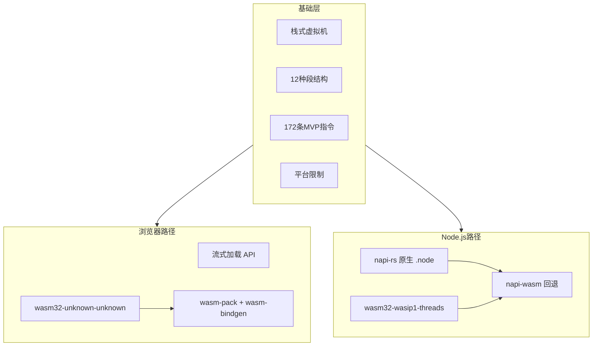
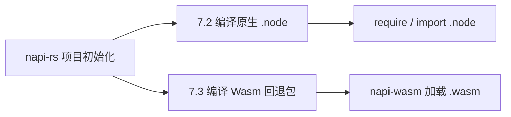

# Wasm 基础：原理、Rust 编译与 Node 集成

> 一篇从浅到深、不限制篇幅的 Wasm 全景指南。适合第一次接触 Wasm 的开发者系统阅读，也适合已有经验、希望把浏览器前端与 Node.js 集成串成完整知识链的工程师。

---

## 目录

1. [前言：Wasm 是什么，解决什么问题](#前言wasm-是什么解决什么问题)
2. [第 1 章：Wasm 原理与栈式虚拟机](#第-1-章wasm-原理与栈式虚拟机)
3. [第 2 章：二进制格式与段结构](#第-2-章二进制格式与段结构)
4. [第 3 章：指令集、内存模型与平台限制](#第-3-章指令集内存模型与平台限制)
5. [第 4 章：网页引入 wasm 与流式加载](#第-4-章网页引入-wasm-与流式加载)
6. [第 5 章：多语言编译 Wasm — 以 Rust 为例](#第-5-章多语言编译-wasm--以-rust-为例)
7. [第 6 章：wasm-pack 与 wasm-bindgen 生态](#第-6-章wasm-pack-与-wasm-bindgen-生态)
8. [第 7 章：napi-rs — 原生 Node 模块与 Wasm 回退](#第-7-章napi-rs--原生-node-模块与-wasm-回退)
9. [附录 A：用 WAT 手写一个最小模块](#附录-a用-wat-手写一个最小模块)
10. [附录 B：常见问题与排错](#附录-b常见问题与排错)
11. [总结与延伸阅读](#总结与延伸阅读)

---

## 前言：Wasm 是什么，解决什么问题

### 从 JavaScript 的局限说起

JavaScript 是 Web 的通用语言，但它是解释型、动态类型的。对于图像处理、音视频编解码、游戏物理引擎、加密计算等 **CPU 密集型** 任务，纯 JS 往往力不从心。过去常见的做法是：

- 用 C/C++ 编写核心逻辑，通过 **Emscripten** 编译为 Asm.js 或 Wasm
- 用 **Native Addon**（Node.js 的 `.node` 模块）在服务端跑原生代码

这些方案有效，但要么性能折损大，要么平台绑定强、分发困难。

### WebAssembly 的定位

**WebAssembly（Wasm）** 是一种低级、可移植的二进制指令格式，设计目标是：

| 目标 | 说明 |
|------|------|
| 快速 | 接近原生机器码的执行速度（引擎 JIT/AOT 编译后） |
| 安全 | 沙箱隔离，无法直接访问宿主内存或系统调用 |
| 开放 | 标准开放，多种语言可编译为目标格式 |
| 紧凑 | 二进制比文本 JS 更小，适合网络传输 |

Wasm **不是** JavaScript 的替代品，而是 **JS 的搭档**：

- **JS** 负责 DOM 操作、事件处理、网络请求、UI 逻辑
- **Wasm** 负责计算密集的核心算法

两者通过 `import` / `export` 互相调用。

### Wasm 的应用场景

```
浏览器前端     → 图像处理、游戏引擎、CAD、音视频、加密
Node.js       → 原生扩展的跨平台替代、napi-rs Wasm 回退
边缘计算       → Cloudflare Workers、Fastly Compute@Edge
插件系统       → 沙箱化第三方扩展（Figma、VS Code 等）
非 Web 运行时  → Wasmtime、Wasmer、WAMR（配合 WASI）
```

### Wasm 跨语言复用与包生态

Wasm 的核心价值之一，是把 **「一次编译，多处运行」** 从「同一语言内跨平台」扩展到 **跨语言边界**：Rust、C/C++、Go、AssemblyScript 等各自编译出 `.wasm`，宿主（浏览器 JS、Node、Python、Wasmer CLI 等）只需按统一的 `import` / `export` 约定加载，就能调用其中的函数——**调用方不必与编写方使用同一种语言**。例如用 Rust 写的图像压缩库编译为 `.wasm` 后，前端 JS 直接 `WebAssembly.instantiate` 调用；在 Node 里也可通过 `napi-wasm` 或 WASI 运行时复用同一份二进制。

随着 **Component Model + WIT** 的发展，跨语言复用更进一步：接口以 `.wit` 描述，各语言通过 `wit-bindgen` 生成绑定，组件之间像拼乐高一样组合——这才是 Wasm 生态长期对标 npm 的方向。

目前已有的共享渠道（成熟度不一）：

| 平台 | 地址 | 定位 |
|------|------|------|
| **Wasmer Registry** | [wasmer.io](https://wasmer.io/) | 最接近「Wasm 版 npm」——`wasmer publish` 发布、`wasmer run` 安装运行；原 WAPM 已并入此处 |
| **npm** | [npmjs.com](https://www.npmjs.com/) | 前端主流路径：`wasm-pack` 将 Rust Wasm 与 JS 胶水一并发布（如 `wasm-bindgen` 系包），搜索关键词 `wasm` 可找到大量模块 |
| **OCI / wkg** | [wasm-pkg-tools](https://github.com/bytecodealliance/wasm-pkg-tools) | Bytecode Alliance 推动的 Component 分发方案，通过 `wkg` CLI 从 OCI 镜像仓库拉取/发布 Wasm 组件 |
| **Warg 注册表** | [warg.wa.dev](https://warg.wa.dev/) | 实验性的联邦式 Wasm 包索引，面向 Component Model，生态仍在建设中 |

一句话总结：**跨语言复用靠 `.wasm` 二进制 + 统一接口；找现成模块，生产环境优先看 Wasmer Registry 和 npm，Component 时代则关注 OCI + `wkg` 工具链。**

### 本文知识地图



---

## 第 1 章：Wasm 原理与栈式虚拟机

### 1.1 编译链路：从高级语言到 Wasm

无论你用 Rust、C++ 还是 Go，编译到 Wasm 的典型链路是：

```
源代码 (.rs / .cpp / .go)
    ↓ 编译器前端
LLVM IR / 中间表示
    ↓ LLVM Wasm 后端 / 专用后端
Wasm 二进制 (.wasm) 或文本格式 (.wat)
    ↓ 浏览器/Node 引擎
机器码（JIT 或 AOT 编译）
```

你不需要手写 Wasm 指令——编译器负责生成。但理解栈式虚拟机有助于：

- 阅读反汇编和调试
- 理解为什么某些代码编译后体积大
- 排查 import/export 签名不匹配的问题

#### WAT 与 Wasm 原文对照（加法示例）

Wasm 有两种等价表示：**文本格式 WAT**（WebAssembly Text Format，人类可读）和 **二进制格式 `.wasm`**（网络传输与引擎加载用）。下面是一个最小的 `add(a, b) = a + b` 模块——逻辑完全相同，只是载体不同。

**WAT 文本**（保存为 `add.wat`）：

```wat
(module
  ;; 导出函数 add(i32, i32) -> i32
  (func (export "add") (param i32 i32) (result i32)
    local.get 0    ;; 取第 1 个参数压栈
    local.get 1    ;; 取第 2 个参数压栈
    i32.add        ;; 弹出两个 i32 相加，结果压栈
  )
)
```

**`.wasm` 二进制原文**（用十六进制查看时的实际字节，共 40 字节）：

```
00 61 73 6d   ;; Magic: "\0asm"
01 00 00 00   ;; Version: 1

01 07 01 60 02 7f 7f 01 7f   ;; type 段：1 个函数类型 (i32,i32) -> i32
03 02 01 00                  ;; function 段：1 个函数，签名索引 0
07 07 01 03 61 64 64 00 00   ;; export 段：导出函数名 "add"（0x61 0x64 0x64）
0a 09 01 07 00 20 00 20 01 6a 0b
;; code 段：函数体 = local.get 0 + local.get 1 + i32.add + end
```

用文本编辑器打开 `.wasm` 会看到乱码——这是正常的，它本来就是紧凑的二进制指令流，不是给人直接阅读的。想理解二进制里写了什么，要么反汇编回 WAT，要么借助下面提到的工具。

> 更完整的 WAT 手写示例（含内存、import）见 [附录 A](#附录-a用-wat-手写一个最小模块)。

#### WAT ↔ Wasm 互转：工具与命令

官方生态里最常用的是 **[WABT](https://github.com/WebAssembly/wabt)**（WebAssembly Binary Toolkit）：

| 方向 | 命令 | 说明 |
|------|------|------|
| WAT → Wasm | `wat2wasm add.wat -o add.wasm` | 文本编译为二进制 |
| Wasm → WAT | `wasm2wat add.wasm -o add.wat` | 反汇编为可读文本 |
| 查看结构 | `wasm-objdump -x add.wasm` | 列出段、类型、导出等 |
| 解释执行 | `wasm-interp add.wasm -r add -a "i32:3" -a "i32:5"` | 命令行直接调用导出函数，输出 `i32:8` |

安装方式（任选其一）：

```bash
# macOS
brew install wabt

# Windows（Scoop）
scoop install wabt

# npm
npm install -g wabt

# 源码编译
git clone https://github.com/WebAssembly/wabt
cd wabt && mkdir build && cd build && cmake .. && cmake --build .
```

除 WABT 外，**Binaryen** 工具集里的 `wasm-as` / `wasm-dis` 也能完成同类转换；`llvm-objdump -d module.wasm` 则适合分析 C/C++/Rust 经 LLVM 编译出的产物。日常「一段 WAT 和一份 `.wasm` 互相对照」用 WABT 就足够。

#### 用 Chrome 调试 Wasm

从 Chrome 73 起，DevTools 已支持 WebAssembly 调试；近年版本能力更完整，主要包括：

1. **无调试信息时**：在 DevTools → **Sources** 面板中仍能看到 Wasm 模块，引擎会把二进制**反汇编**为类 WAT 的文本，可单步执行、查看操作数栈变化（需配合 Scope / 调试侧边栏）。
2. **有 DWARF 调试信息时**（C/C++/Rust 用 `-g` 编译，并生成 `.dwarf.wasm` 或内嵌 DWARF）：DevTools 能直接映射回**原始源代码**，支持断点、变量查看、调用栈——体验接近调试普通 JS。

典型工作流：

```
1. 用 WAT/WABT 或编译器生成 .wasm
2. 页面通过 WebAssembly.instantiate(Streaming) 加载
3. 打开 DevTools → Sources → 左侧找到 .wasm 或对应的 .c/.rs 源文件
4. 点击行号设断点，触发调用后单步调试
```

截至 2026 年，[Chrome 官方文档](https://developer.chrome.com/docs/devtools/wasm)仍要求安装扩展 [C/C++ DevTools Support (DWARF)](https://goo.gle/wasm-debugging-extension)——DWARF 解析尚未完全内置进 DevTools，扩展负责把 Wasm 里的调试信息关联到原始源文件。安装后需重启 Chrome；

构建侧：Rust 用 `wasm-pack build --dev` 并在 `Cargo.toml` 中设置 `dwarf-debug-info = true`（默认 release 会剥离 DWARF）；Emscripten / Clang 用 `-g` 生成 DWARF。若只看到反汇编而没有源码，先检查 `.wasm` 里是否含 `.debug_*` 段（`wasm-objdump -x`），再确认扩展已启用。

在 Sources 面板中还可对线性内存使用 **Memory Inspector**（右键 `WebAssembly.Memory` 对象 → Inspect memory），以十六进制查看 Wasm 线性内存的读写内容。

### 1.2 栈式虚拟机（Stack Machine）

#### 什么是操作数栈

Wasm 是 **栈式虚拟机（Stack Machine）**。函数执行时维护一个 **操作数栈（Operand Stack）**，大多数指令从栈顶取操作数，将结果压回栈顶。

每条 Wasm 指令由两部分组成：

- **Opcode（操作码）**：1 字节，标识指令类型
- **Immediate（立即数）**：可选的附加参数，如 `i32.const 42` 中的 `42`，或 `local.get 3` 中的局部变量索引 `3`

#### 与控制流栈的配合

除操作数栈外，Wasm 还有 **控制流栈（Control Stack）**，管理结构化控制指令：

| 指令 | 作用 |
|------|------|
| `block` | 创建一个块，有结果类型 |
| `loop` | 创建循环头 |
| `if` / `else` | 条件分支 |
| `br` | 跳转到外层 block/loop |
| `br_table` | 多路分支（类似 switch） |
| `return` | 从函数返回 |
| `end` | 关闭当前 block/loop/if |

Wasm **禁止任意 `goto`**。所有跳转必须指向结构化块内的标签，这使得引擎可以在编译前 **静态验证** 控制流的合法性——不会出现"跳进了栈已销毁的栈帧"这类运行时错误。

### 1.3 模块、实例与内存

Wasm 程序以 **模块（Module）** 为编译单元。模块本身不可执行，必须经过 **实例化（Instantiate）** 才能运行。

```
Module（编译后的代码 + 元数据）
    ↓ instantiate(imports)
Instance（可执行的运行时实体）
    ├── 线性内存（Memory）
    ├── 函数表（Table）
    ├── 全局变量（Globals）
    ├── 已绑定的 import 函数
    └── 导出（exports）
```

**线性内存（Linear Memory）** 是 Wasm 唯一可寻址的内存空间，表现为一个连续的字节数组：

- 最小 1 页 = 64 KiB
- 可通过 `memory.grow` 动态增长
- 读写通过 `i32.load` / `i32.store` 等指令，带边界检查
- 不是 GC 堆，它没有 `malloc`/`free` 的内建实现，需语言运行时自行管理

### 1.4 验证（Validation）

引擎在实例化前会对模块做 **静态验证**，确保：

1. 每条指令的类型正确（如 `i32.add` 要求栈顶两个值都是 `i32`）
2. 操作数栈在每条指令后深度正确（栈平衡）
3. 控制流合法（`br` 目标存在且类型匹配）
4. 内存访问偏移合法
5. `call` / `call_indirect` 的目标函数签名匹配

验证失败则实例化直接报错，**不会**运行到一半才崩溃。这是 Wasm 安全模型的重要一环。

```javascript
// js 环境下校验
const wasmBytes = new Uint8Array([...])
WebAssembly.validate(wasmBytes) // 只校验，不生成机器码

WebAssembly.compile(bufferSource) // 隐式校验，再生成机器码
```

```bash
# wabt 校验
wasm-validate your_module.wasm
```

### 1.5 二进制文件头

每个 `.wasm` 文件以固定头部开始：

| 偏移 | 字段 | 内容 |
|------|------|------|
| 0–3 | Magic | `\0asm`（十六进制 `00 61 73 6D`） |
| 4–7 | Version | `1`（小端 u32，即 `01 00 00 00`） |

头部之后是段序列。可用 `wasm-objdump`（WABT 工具集）查看：

```bash
# 安装 WABT: https://github.com/WebAssembly/wabt
wasm-objdump -x add.wasm
```

### 本章小结

Wasm 是栈式虚拟机，靠操作数栈做运算、控制流栈管理分支。模块需实例化后执行，线性内存是唯一的可寻址空间。静态验证保证类型安全和栈平衡——这是 Wasm 能在不可信环境中安全运行的基石。

---

## 第 2 章：二进制格式与段结构

### 2.1 段的通用格式

每个段由三部分组成：

```
section_id   (1 byte)    — 段类型 ID
section_size (LEB128)    — payload 字节数
payload      (variable)  — 段内容
```

**LEB128（Little Endian Base 128）** 是一种变长整数编码，小数值占更少字节，广泛用于 Wasm 二进制格式中的索引和长度字段。

### 2.2 十二种标准段

按照 [WebAssembly Core Specification](https://webassembly.github.io/spec/core/binary/modules.html)，**Wasm 1.0 MVP 定义了 12 种标准段**（ID 0–11）：

| ID | 段名 | 作用 | 是否必须 |
|----|------|------|---------|
| 0 | custom | 自定义元数据（调试信息、producers 等） | 否 |
| 1 | type | 函数类型签名 | 否（但通常有） |
| 2 | import | 从宿主导入函数/内存/表/全局变量 | 否 |
| 3 | function | 模块内函数声明（索引到 type 段） | 否 |
| 4 | table | 函数引用表（`funcref` 类型） | 否 |
| 5 | memory | 线性内存定义 | 否 |
| 6 | global | 模块级全局变量 | 否 |
| 7 | export | 导出函数/内存/表/全局变量 | 否 |
| 8 | start | 实例化后自动执行的函数索引 | 否 |
| 9 | element | 表初始化（函数引用列表） | 否 |
| 10 | code | 函数体（局部变量 + 指令） | 否 |
| 11 | data | 内存初始化数据 | 否 |

### 2.3 各段详解

#### type 段（ID 1）

定义函数签名。每条类型以 `0x60`（func type）开头：

```
(func (param i32 i32) (result i32))
```

二进制编码为：`60 02 7f 7f 01 7f`（2 个 i32 参数，1 个 i32 返回值；`7f` = i32）

#### import 段（ID 2）

声明模块需要从宿主 **导入** 的能力。每条 import 包含：

- 模块名（字符串，如 `"env"`）
- 字段名（字符串，如 `"memory"` 或 `"abort"`）
- 导入类型（函数 / 表 / 内存 / 全局变量）

**这是 Wasm 与外部世界交互的唯一入口。** Wasm 本身没有 `syscall`，所有 I/O 都是 import 函数。

#### function 段（ID 3）

声明模块内定义的函数列表，每个条目是 type 段的索引。例如 `[0, 0, 1]` 表示 3 个函数，前两个是 type 0，第三个是 type 1。

#### table 段（ID 4）

函数引用表，元素类型为 `funcref`。主要用于 `call_indirect`——按索引间接调用函数，是实现函数指针、虚函数表、动态分派的基础。

#### memory 段（ID 5）

声明线性内存：

```
(memory (export "memory") 1)    ;; 最小 1 页（64 KiB）
(memory 1 10)                   ;; 最小 1 页，最大 10 页
```

#### global 段（ID 6）

模块级全局变量，有类型和可变性（`mut` / 不可变）。常用于存储堆指针（如 Rust 的 `__heap_base`）。

#### export 段（ID 7）

将函数、内存、表、全局变量暴露给宿主：

```
(export "add" (func 0))
(export "memory" (memory 0))
```

宿主通过 `instance.exports.add` 调用导出函数。

#### start 段（ID 8）

可选。指定一个函数索引，在实例化完成后 **自动执行**。常用于全局初始化。

#### element 段（ID 9）

初始化 table 的内容——将函数引用写入表的指定偏移位置。

#### code 段（ID 10）

‌静态指令代码，模块加载后常驻内存，直到模块卸载。

每个函数体包含：

- 局部变量声明（在参数之外的局部变量）
- 指令序列（以 `end` 结尾）

**function 段的函数数量必须与 code 段一致。**

#### data 段（ID 11）

‌不可变‌。模块实例化时，其内容被复制到 Linear Memory ——将字符串、全局数据等写入内存的指定偏移。

#### custom 段（ID 0）

任意自定义数据。常见用途：

- `name` 段：函数/局部变量的调试名称
- `producers` 段：工具链版本信息
- 源码映射（source map）相关数据，比如DWARF 调试信息

### 2.4 段的排列规则

```
┌─────────────────────────────────────────────────────┐
│  Header: magic + version                            │
├─────────────────────────────────────────────────────┤
│  [custom]*                                          │
│  type → import → function → table → memory → global │
│  [custom]*                                          │
│  export → start → element → code → data             │
│  [custom]*                                          │
└─────────────────────────────────────────────────────┘
```

- **custom 段**可出现在任意位置，可有多个
- 其余标准段 **至多出现一次**，且必须按 ID 升序, 目的是支持‌流式解析（Streaming Parsing）‌和‌单次遍历验证‌
- 所有段都可以为空（空模块也是合法模块）

### 2.5 扩展段

Wasm 2.0+ 引入了 **datacount 段（ID 12）**，在 data 段之前声明数据段条目数，便于流式验证。此外还有与 Component Model 相关的新段。本文以 MVP 为主，掌握 12 种标准段即可理解绝大多数 `.wasm` 文件。

### 本章小结

段是 Wasm 模块的骨架：**type/import/export**定义接口，**code/data** 定义实现，**memory/table/global** 定义运行时资源。**import** 段是 Wasm 请求宿主能力的桥梁——没有它，Wasm 只是一个纯粹的计算孤岛。

---

## 第 3 章：指令集、内存模型与平台限制

### 3.1 指令总览：172 条 MVP 指令

Wasm 1.0 MVP 共 **172 条指令**，opcode 为单字节。按功能分为 5 大类：

#### 控制流指令（13 条）

| 指令 | 作用 |
|------|------|
| `unreachable` | 触发陷阱（trap），类似 `abort` |
| `nop` | 空操作 |
| `block` / `loop` / `if` / `else` / `end` | 结构化控制流 |
| `br` | 无条件分支到标签 |
| `br_if` | 条件分支 |
| `br_table` | 多路分支 |
| `return` | 从函数返回 |
| `call` | 直接调用函数 |
| `call_indirect` | 通过表间接调用 |

#### 参数化指令（2 条）

| 指令 | 作用 |
|------|------|
| `drop` | 弹出栈顶值并丢弃 |
| `select` | 根据条件选择两个值之一 |

#### 变量指令（5 条 ）

| 指令 | 作用 |
|------|------|
| `local.get` / `local.set` / `local.tee` | 读/写/读改写局部变量 |
| `global.get` / `global.set` | 读/写全局变量 |

#### 内存指令（25 条）

| 指令 | 作用 |
|------|------|
| `i32.load` / `i64.load` / `f32.load` / `f64.load` | 从线性内存读取 |
| `i32.store` / `i64.store` / `f32.store` / `f64.store` | 写入线性内存 |
| `memory.size` | 返回当前内存页数 |
| `memory.grow` | 扩展内存 |

所有 load/store 都带 **对齐（align）** 和 **偏移（offset）** 参数，引擎在运行时做边界检查。

#### 数值指令（127 条）

涵盖 `i32`/`i64`/`f32`/`f64` 的：

- 常量：`i32.const`、`f64.const` 等
- 比较：`i32.eq`、`f64.lt` 等
- 一元运算：`i32.clz`、`f64.sqrt`、`f64.neg` 等
- 二元运算：`i32.add`、`i32.mul`、`i32.div_s`、`f64.add` 等
- 类型转换：`i32.wrap_i64`、`f32.convert_i32_s` 等
- 位运算：`i32.and`、`i32.shl`、`i32.rotl` 等

### 3.2 扩展指令与前缀编码

MVP 之后，指令总数超过 256，引入了 **前缀字节** 编码：

| 前缀 | 扩展 | 示例指令 |
|------|------|---------|
| `0xfc` | 杂项 / Bulk Memory | `memory.copy`、`memory.fill`、`table.copy` |
| `0xfd` | SIMD 128 位向量 | `v128.load`、`i32x4.add` |
| `0xfe` | 线程 / 原子操作 | `memory.atomic.add`、`memory.atomic.wait` |

因此 **172 是 MVP 基线**；Chrome、Firefox、Node.js 等现代引擎实际支持数百条指令。

MVP（Chrome 57，2017 年 3 月）之后，Chrome 通过 V8 陆续默认启用了大量扩展提案。下表按 **Chrome 版本** 升序列出主要已落地特性（数据来源：[webassembly.org/roadmap](https://webassembly.org/features/)，截至 2026 年初）：

| 提案名 | 提案描述 | Chrome 支持版本 |
|--------|----------|----------------|
| Mutable Globals | 允许在模块间导入/导出**可变**全局变量 | 74 |
| Sign-extension Operators | 有符号扩展指令，如 `i32.extend8_s`、`i64.extend32_s` | 74 |
| Threads | 共享线性内存 + 原子操作，支持 `SharedArrayBuffer` 多线程 Wasm（需站点开启 [跨域隔离](https://web.dev/articles/cross-origin-isolation-guide)） | 74 |
| Bulk Memory Operations | 批量内存/表操作：`memory.copy`、`memory.fill`、`memory.init`、`table.copy` 等；支持 passive 数据段 | 75 |
| Non-trapping float-to-int | 饱和浮点转整型（`i32.trunc_sat_f32_s` 等），越界时饱和而不 trap | 75 |
| Multi-value | 函数与块支持**多个返回值**，如 `(result i32 i32)` | 85 |
| JS BigInt Integration | JS `BigInt` 与 Wasm `i64` 在 JS API 层互操作（非字节码指令） | 85 |
| Fixed-width SIMD | 128 位固定宽度向量指令，前缀 `0xfd`，如 `v128.load`、`i32x4.add` | 91 |
| Legacy Exception Handling | 旧版异常处理方案（`try/catch` 块），已被 exnref 版取代 | 95 |
| Reference Types | 引入 `funcref`、`externref` 引用类型，表元素不再限于 `anyfunc` | 96 |
| Web Content Security Policy | Wasm 模块遵守宿主页面的 CSP 策略 | 97 |
| Tail Call | 尾调用优化：`return_call`、`return_call_indirect` | 112 |
| Extended Constant Expressions | 全局变量、元素段、数据段初始化可使用更丰富的常量表达式 | 114 |
| Relaxed SIMD | 放宽部分 SIMD 指令的语义约束以换取更高性能（如 `i32x4.relaxed_dot_i8x16_i7x16`） | 114 |
| Garbage Collection (WasmGC) | 结构体/数组堆类型，托管语言编译产物可直接复用 V8 垃圾回收器 | 119 |
| Typed Function References | 强类型函数引用，`call_ref` 等指令，表项携带精确函数签名 | 119 |
| Multiple Memories | 单个模块可声明并直接访问**多个**线性内存 | 120 |
| JS String Builtins | Wasm 通过 import 直接调用宿主 JS 字符串内置方法（如 `fromCharCode`） | 130 |
| Memory64 | 内存与表索引升级为 `i64`，寻址空间突破 4 GiB 上限 | 133 |
| Branch Hinting | 为分支指令附加预测提示，帮助引擎优化热路径布局 | 137 |
| Exception Handling (exnref) | 基于 `exnref` 的最终版异常处理，取代旧版 `try/catch` 方案 | 137 |
| JS Promise Integration | Wasm 函数可挂起并等待 JS `Promise` 完成，简化异步互操作 | 137 |

> 另有部分提案在 Chrome 中仅通过实验 flag 提供（如 Type Reflection、Stack Switching、Compilation Hints），尚未默认开启，上表未收录。

### 3.3 值类型

#### MVP 四种基本类型

| 类型 | 字节码 | 说明 |
|------|--------|------|
| `i32` | `0x7F` | 32 位整数 |
| `i64` | `0x7E` | 64 位整数 |
| `f32` | `0x7D` | 32 位浮点 |
| `f64` | `0x7C` | 64 位浮点 |

#### 扩展类型

| 类型 | 说明 | 用途 |
|------|------|------|
| `v128` | 128 位向量 | SIMD 并行计算 |
| `funcref` | 函数引用 | 表元素、间接调用 |
| `externref` | 外部引用 | 存放 JS 对象引用（需引擎支持） |

#### 函数类型

```
(param i32 i32) (result i32)    ;; 接受两个 i32，返回一个 i32
(param) (result)                ;; 无参无返回值
```

MVP 限制最多 1 个返回值。**Multi-value** 扩展后支持多返回值，如 `(result i32 i32)`。

>  为什么 MVP 不支持原生 string 类型？  
   字符串涉及编码（UTF-8/16/32）、内存管理（GC 或手动 malloc/free）、子串切片等复杂逻辑，MVP 旨在提供一个最小的、可移植的编译目标，将这些复杂性留给上层语言（C/Rust/Go）的工具链处理。  
   字符串在 Wasm MVP 中是通过‌“内存指针 + 长度”‌的模式，存储在‌线性内存（Linear Memory）‌中, 比如代码中硬编码的字符串（如 "Hello World"），编译器会将其放入 Wasm 模块的 ‌Data 段， 在模块实例化时，这些数据会被自动复制到 Linear Memory 的指定偏移位置。运行时生成的字符串，调用内存分配函数（如 C 的 malloc 或 Rust 的 alloc），在 Linear Memory 中申请一块足够大的空间，使用 i32.store8 等指令，将字符串的 UTF-8 字节逐个写入申请的内存区域，返回起始地址（i32）和长度（i32）即可。

```javascript
// 如何从wasm实例中，读取字符串到 JS
const memory = wasmInstance.exports.memory;
const ptr = wasmInstance.exports.get_string_ptr(); // 返回 i32
const len = wasmInstance.exports.get_string_len(); // 返回 i32

// 从 Wasm 内存中读取字节
const bytes = new Uint8Array(memory.buffer, ptr, len);
// 解码为 JS 字符串 (默认 UTF-8)
const jsString = new TextDecoder('utf-8').decode(bytes);
console.log(jsString);
```
   有关string的提案有很多，大都夭折了，目前可以关注 3.2 节的`JS String Builtins（chrome 130+)`,通过 import 调用宿主 JS 字符串 API。 另外实际开发时，不需要关注这个，大多数开发语言会处理字符串的问题，`wasm-bindgen` 参见 6.7 节。


### 3.4 内存模型深入

```
线性内存
┌──────────────────────────────────────────┐
│ 0x0000 │ data 段初始化的静态数据           │
│ 0x0100 │ 字符串、常量                      │
│ 0x1000 │ 堆（Rust/ C 运行时 malloc）       │
│  ...   │                                   │
│ 0xNNNN │ 栈（编译器分配的栈空间）           │
└──────────────────────────────────────────┘
         ↑ memory.grow 可扩展
```

关键特性：

- **单一连续字节数组**，无分段、无保护页（MVP）
- 访问必须带边界检查，越界触发 **trap**（不可捕获的异常，实例终止）
- 内存可以被多个实例共享（通过 `SharedArrayBuffer` + 线程扩展）
- Rust 的 `Vec`、`String` 最终都落在这条线性内存上

### 3.5 平台限制：Wasm 不能做什么

这是最重要的认知——Wasm 是 **计算层**，不是 **平台层**。

| 限制 | 原因 | 解决方案 |
|------|------|---------|
| **无自动内存管理** | 只有线性内存，无 GC | 语言运行时自带分配器（Rust `dlmalloc`/`wee_alloc`）,GC扩展提案主要服务 Java/Kotlin/JS 等托管语言编译器 |
| **无 DOM 访问** | 沙箱隔离 | `wasm-bindgen` + `web-sys` 从 JS 导入 |
| **无文件系统** | 无 syscall | WASI（`wasm32-wasi`）或 JS import |
| **无网络** | 同上 | `web-sys::fetch` 或 WASI socket 扩展 |
| **无线程** | 单线程模型 | Threads扩展 + `SharedArrayBuffer` |
| **无随机数** | 确定性要求 | 导入 `Math.random` 或 `getrandom` crate |
| **无直接系统调用** | 安全沙箱 | 全部通过 import 请求宿主 |

### 3.6 平台能力：Wasm 能做什么

| 能力 | 说明 |
|------|------|
| 高性能数值计算 | JIT 编译后接近原生速度 |
| 确定性执行 | 相同输入 → 相同输出（浮点遵循 IEEE 754） |
| 跨平台可移植 | 同一份 `.wasm` 到处运行 |
| 安全沙箱 | 适合运行不可信第三方代码 |
| 与 JS 互操作 | 通过 import/export 双向调用 |
| 紧凑体积 | 二进制格式 + 压缩（gzip/brotli） |

### 3.7 WASI：Wasm 的系统接口标准

**WASI（WebAssembly System Interface）** 是 Wasm 在非浏览器环境中的标准系统接口：

- 提供文件读写、目录操作、时钟、随机数、环境变量等
- Target 为 `wasm32-wasi` 或更新的 `wasm32-wasip1` / `wasm32-wasip1-threads`
- 可在 Node.js、Wasmtime、Wasmer 等运行时中执行
- napi-rs 的 Wasm 回退使用 `wasm32-wasip1-threads`，正是 WASI 家族的一员

### 本章小结

172 条 MVP 指令 + 4 种基本类型构成了 Wasm 的计算能力。线性内存是唯一的可寻址空间，无 GC、无 I/O、无 DOM——一切外部能力都通过 import 获取。牢记这一点，后面 wasm-bindgen 和 napi-rs 的设计就顺理成章了。

---

## 第 4 章：网页引入 wasm 与流式加载

### 4.1 JavaScript API 全景

浏览器通过 `WebAssembly` 全局对象与 Wasm 交互。核心类型：

| 类型 | 说明 |
|------|------|
| `WebAssembly.Module` | 已编译的 Wasm 模块，可多次实例化 |
| `WebAssembly.Instance` | 已实例化的模块，包含 exports |
| `WebAssembly.Memory` | 可从 JS 创建并传入 Wasm 的内存对象 |
| `WebAssembly.Table` | 可从 JS 创建并传入 Wasm 的函数表 |

核心 API：

| 方式 | API | 特点 |
|------|-----|------|
| 同步编译 | `new WebAssembly.Module(bytes)` | 阻塞主线程，不推荐 |
| 异步编译 | `WebAssembly.compile(bytes)` | 返回 Promise\<Module\> |
| 流式编译 | `WebAssembly.compileStreaming(response)` | 边下载边编译 |
| 同步实例化 | `new WebAssembly.Instance(module, imports)` | 阻塞 |
| 异步实例化 | `WebAssembly.instantiate(bytes, imports)` | 编译 + 实例化 |
| 流式实例化 | `WebAssembly.instantiateStreaming(response, imports)` | **推荐** |

### 4.2 完整 HTML 示例

参见 `load-wasm-in-page` 示例

### 4.3 服务器配置

#### Content-Type

**必须** 配置为 `application/wasm`：

```nginx
# Nginx
types {
    application/wasm wasm;
}
```

```json
// Vite / webpack dev server 通常自动处理
// 若未处理，在 vite.config.js 中：
server: {
  headers: {
    'Cross-Origin-Opener-Policy': 'same-origin',
    'Cross-Origin-Embedder-Policy': 'require-corp',
  }
}
```

#### 压缩

`.wasm` 文件 gzip 后通常能压缩 60%–70%。确保服务器开启 gzip/brotli：

```nginx
gzip_types application/wasm;
```

#### CORS

跨域加载需要服务器返回 `Access-Control-Allow-Origin`。同源部署则无此问题。

### 4.4 import 对象详解

`imports` 对象的键必须与 Wasm 模块 import 段 **完全匹配**：

```javascript
// 假设 wasm 的 import 段为:
//   (import "env" "memory" (memory 1))
//   (import "env" "table" (table 0 anyfunc))
//   (import "wasi_snapshot_preview1" "fd_write" (func ...))

const imports = {
  env: {
    memory: new WebAssembly.Memory({ initial: 256 }),  // 256 页 = 16 MiB
    table: new WebAssembly.Table({ initial: 0, element: 'anyfunc' }),
  },
  wasi_snapshot_preview1: {
    fd_write: (fd, iov, iovcnt, pnum) => { /* ... */ return 0; },
  },
};
```

名称、模块名、类型任一不匹配，实例化都会抛出 `LinkError`。

### 4.6 与 wasm-bindgen 生成物的关系

`wasm-pack build` 生成的 `pkg/` 目录结构：

```
pkg/
├── my_wasm.js          ← JS 胶水代码（封装 imports、内存、字符串编解码）
├── my_wasm_bg.wasm     ← 实际 Wasm 二进制
├── my_wasm.d.ts        ← TypeScript 类型定义
└── package.json
```

`my_wasm.js` 导出的 `default` 函数（通常叫 `init`）内部做了这些事：

1. `fetch` 加载 `my_wasm_bg.wasm`
2. 创建 `WebAssembly.Memory` 并放入 imports
3. 调用 `WebAssembly.instantiate` 或 `instantiateStreaming`
4. 将 exports 中的函数挂载到 JS 对象上

你不需要手动写 imports——wasm-bindgen 帮你生成好了。

### 4.7 调试技巧

```javascript
// 查看模块导出了什么
console.log(WebAssembly.Module.exports(module));
console.log(WebAssembly.Module.imports(module));

// Chrome DevTools → Sources → 可以看到 wasm 函数
// Firefox DevTools → Debugger → 支持 wasm 断点
```

### 本章小结

浏览器加载 Wasm 的推荐路径是 `instantiateStreaming` + 正确的 `Content-Type`。`imports` 是 Wasm 与 JS 之间的契约，必须精确匹配。wasm-bindgen 生成的 JS 胶水代码封装了这些细节，让你只需 `import init from './pkg/my_wasm.js'` 即可。

---

## 第 5 章：多语言编译 Wasm — 以 Rust 为例

### 5.1 哪些语言可以编译为 Wasm

| 语言 | 工具链 | 成熟度 | 典型场景 |
|------|--------|--------|---------|
| **Rust** | `wasm-bindgen` / `wasip2` | 最成熟 | 前端、Node、WASI |
| **C/C++** | Emscripten / WASI SDK | 成熟 | 游戏、遗留代码移植 |
| **Go** | TinyGo / `GOOS=js GOARCH=wasm` | 中等 | 服务端工具 |
| **AssemblyScript** | 专用编译器 | 成熟 | 前端（TS 语法） |
| **Kotlin** | Kotlin/Wasm | 发展中 | 多平台 UI |
| **C#** | Blazor WebAssembly | 成熟 | .NET Web 应用 |
| **Zig** | 原生 Wasm target | 发展中 | 系统编程 |

本文以 **Rust** 为例，因为它的工具链最完善，且内存安全特性与 Wasm 沙箱模型天然契合。

### 5.2 Rust 的 Wasm Target 对比

| Target | 说明 | 用途 |
|--------|------|------|
| `wasm32-unknown-unknown` | 无 OS，无标准库 I/O | **浏览器前端**（配合 wasm-bindgen） |
| `wasm32-wasi` | WASI 快照 preview1 | 通用 WASI 运行时 |
| `wasm32-wasip1` | WASI P1 | 新一代 WASI |
| `wasm32-wasip1-threads` | WASI P1 + 线程 | **napi-rs Wasm 回退** |

**不要混淆** `wasm32-unknown-unknown` 和 `wasm32-wasip1-threads`——前者给浏览器用，后者给 Node.js napi-rs 回退用，工具链和绑定完全不同。

### 5.3 安装工具链

```bash
# 1. 安装 Rust
curl --proto '=https' --tlsv1.2 -sSf https://sh.rustup.rs | sh

# 2. 添加 wasm32 编译目标
rustup target add wasm32-unknown-unknown

# 3. 安装 wasm-pack（构建 + 打包工具）
cargo install wasm-pack

# 4. 验证
rustc --print target-list | grep wasm
# 应看到 wasm32-unknown-unknown 等
```

### 5.4 创建项目

```bash
cargo new --lib my-wasm
cd my-wasm
```

**`Cargo.toml`**

```toml
[package]
name = "my-wasm"
version = "0.1.0"
edition = "2021"

[lib]
crate-type = ["cdylib"]

[dependencies]
wasm-bindgen = "0.2"

[profile.release]
opt-level = "s"          # 优化体积（"s" = size, "3" = speed）
lto = true               # 链接时优化，减小体积
```

**`src/lib.rs`**

```rust
use wasm_bindgen::prelude::*;

/// 导出加法函数给 JavaScript 调用
#[wasm_bindgen]
pub fn add(a: i32, b: i32) -> i32 {
    a + b
}

/// 导出斐波那契（展示计算密集型场景）
#[wasm_bindgen]
pub fn fibonacci(n: u32) -> u32 {
    match n {
        0 => 0,
        1 => 1,
        _ => fibonacci(n - 1) + fibonacci(n - 2),
    }
}
```

### 5.5 构建流程

#### 方式一：纯 cargo build（裸 wasm）

```bash
cargo build --target wasm32-unknown-unknown --release
```

产物：`target/wasm32-unknown-unknown/release/my_wasm.wasm`

这是 **裸 wasm**，缺少 JS 绑定，无法直接在浏览器中调用导出函数（没有内存管理和类型转换）。

#### 方式二：wasm-pack build（推荐）

```bash
wasm-pack build --target web --out-dir pkg
```

wasm-pack 在内部执行：

```
1. cargo build --target wasm32-unknown-unknown --release
2. wasm-bindgen target/wasm32-unknown-unknown/release/my_wasm.wasm
   → 生成 pkg/my_wasm.js（JS 胶水）
   → 生成 pkg/my_wasm_bg.wasm（处理后的 wasm）
3. 生成 pkg/package.json
4. 可选：wasm-opt 优化体积
```

#### 方式三：手动 wasm-bindgen

```bash
cargo build --target wasm32-unknown-unknown --release
wasm-bindgen --target web --out-dir pkg \
  target/wasm32-unknown-unknown/release/my_wasm.wasm
```

### 5.6 体积优化

Wasm 文件大小直接影响加载速度。常用优化手段：

| 手段 | 配置 | 效果 |
|------|------|------|
| 体积优化 | `opt-level = "s"` | 编译器优先减小体积 |
| 链接时优化 | `lto = true` | 跨 crate 消除死代码 |
| 轻量分配器 | `wee_alloc` crate | 替代默认分配器，减小 10–30 KiB |
| wasm-opt | `wasm-pack build` 自动调用 | 二进制级别优化，可减小 20%–50% |
| `#![no_std]` | 不使用标准库 | 大幅减小，但开发难度高 |

```toml
# 使用 wee_alloc 示例
[dependencies]
wee_alloc = "0.4"

# 在 lib.rs 顶部
#[global_allocator]
static ALLOC: wee_alloc::WeeAlloc = wee_alloc::WeeAlloc::INIT;
```

### 5.7 其他语言的快速说明

#### C/C++（Emscripten）

```bash
emcc hello.c -o hello.js    # 生成 hello.js + hello.wasm
```

Emscripten 会生成大量 JS 胶水代码（包含虚拟文件系统、SDL 等），体积通常比 Rust + wasm-bindgen 大得多，但适合移植大型 C/C++ 项目。

#### AssemblyScript

```typescript
// assembly/index.ts
export function add(a: i32, b: i32): i32 {
  return a + b;
}
```

语法类似 TypeScript，但只支持有限类型。编译后可直接在浏览器使用。

### 本章小结

Rust 编译 Wasm 的核心是 `wasm32-unknown-unknown` + `cdylib` + `wasm-pack`。裸 `cargo build` 只产出二进制；要与浏览器交互，必须经 wasm-bindgen 生成 JS 绑定。注意区分不同 wasm target 的用途。

---

## 第 6 章：wasm-pack 与 wasm-bindgen 生态

### 6.1 生态全景

```
你的 Rust 代码
    ↓ #[wasm_bindgen] 宏
wasm-bindgen（crate + CLI）
    ↓ 生成
pkg/my_wasm.js（JS 胶水） + pkg/my_wasm_bg.wasm
    ↓ 被浏览器/打包器加载
JavaScript 调用 Rust 函数
```

```
wasm-pack = cargo build + wasm-bindgen CLI + package.json 生成 + wasm-opt
```

### 6.2 wasm-pack 的 `--target` 详解

| target | 输出特点 | 使用场景 |
|--------|---------|---------|
| `web` | ES Module，`init()` 手动调用 | 直接在 HTML `<script type="module">` 中使用 |
| `bundler` | ES Module，不内联 wasm 路径 | Webpack / Vite / Rollup 打包 |
| `nodejs` | CommonJS，`fs.readFileSync` 加载 wasm | Node.js 环境 |
| `no-modules` | 全局变量，`<script>` 标签加载 | 旧式 HTML，无打包器 |
| `deno` | Deno 兼容格式 | Deno 运行时 |

```bash
# 前端项目（Vite/Webpack）用这个
wasm-pack build --target bundler --out-dir pkg

# 纯 HTML 演示用这个
wasm-pack build --target web --out-dir pkg
```

### 6.3 wasm-bindgen 深入

#### 导出函数给 JS

```rust
use wasm_bindgen::prelude::*;

// 基本导出
#[wasm_bindgen]
pub fn greet(name: &str) -> String {
    format!("Hello, {name}!")
}

// 导出结构体为 JS 类
#[wasm_bindgen]
pub struct Counter {
    value: i32,
}

#[wasm_bindgen]
impl Counter {
    #[wasm_bindgen(constructor)]
    pub fn new(start: i32) -> Counter {
        Counter { value: start }
    }

    pub fn increment(&mut self) -> i32 {
        self.value += 1;
        self.value
    }

    pub fn get(&self) -> i32 {
        self.value
    }
}
```

JS 侧：

```javascript
import init, { greet, Counter } from './pkg/my_wasm.js';

await init();

console.log(greet('World'));       // "Hello, World!"

const counter = new Counter(10);
console.log(counter.increment());  // 11
console.log(counter.get());        // 11
```

#### 从 JS 导入函数

```rust
use wasm_bindgen::prelude::*;

// 导入 JS 的 alert 函数
#[wasm_bindgen]
extern "C" {
    fn alert(s: &str);

    #[wasm_bindgen(js_namespace = console)]
    fn log(s: &str);
}

#[wasm_bindgen]
pub fn run() {
    alert("Hello from Rust via JS alert!");
    log("Logged from Rust via console.log");
}
```

#### 接收 JS 回调（闭包）

```rust
use wasm_bindgen::prelude::*;

#[wasm_bindgen]
pub fn call_callback(callback: &js_sys::Function, value: i32) {
    let this = JsValue::NULL;
    let arg = JsValue::from(value);
    callback.call1(&this, &arg).unwrap();
}
```

JS 侧：

```javascript
call_callback((v) => console.log('received:', v), 42);
```

### 6.4 js-sys：绑定 JavaScript 内置对象

[js-sys](https://docs.rs/js-sys/) 提供对 JavaScript 全局对象的绑定：

| 绑定 | 对应 JS |
|------|---------|
| `JsValue` | 任意 JS 值 |
| `Array` | `Array` |
| `Object` | `Object` |
| `Promise` | `Promise` |
| `Map` / `Set` | `Map` / `Set` |
| `Date` | `Date` |
| `JSON` | `JSON` |
| `Math` | `Math` |
| `Reflect` | `Reflect` |

```rust
use js_sys::{Array, Object, JSON};

#[wasm_bindgen]
pub fn create_array() -> JsValue {
    let arr = Array::new();
    arr.push(&JsValue::from(1));
    arr.push(&JsValue::from(2));
    arr.into()
}
```

### 6.5 web-sys：绑定 Web API

[web-sys](https://docs.rs/web-sys/) 提供对浏览器 Web API 的绑定。**必须** 在 `Cargo.toml` 中按需启用 feature，否则 crate 体积会爆炸：

```toml
[dependencies]
web-sys = { version = "0.3", features = [
    "console",
    "Document",
    "Element",
    "HtmlCanvasElement",
    "CanvasRenderingContext2d",
    "Window",
    "Response",
    "Request",
    "RequestInit",
] }
```

常用 API 示例：

```rust
use wasm_bindgen::prelude::*;
use web_sys::{console, window, document};

#[wasm_bindgen]
pub fn manipulate_dom() -> Result<(), JsValue> {
    let doc = document().ok_or("no document")?;
    let body = doc.body().ok_or("no body")?;

    let p = doc.create_element("p")?;
    p.set_text_content(Some("Created by Rust/Wasm!"));
    body.append_child(&p)?;

    console::log_1(&"DOM manipulation done".into());
    Ok(())
}
```

### 6.6 wasm-bindgen-futures：异步互操作

浏览器中大量 API 是异步的（`fetch`、IndexedDB 等）。`wasm-bindgen-futures` 让你能在 Rust 中 `.await` JS 的 `Promise`：

```rust
use wasm_bindgen::prelude::*;
use wasm_bindgen_futures::JsFuture;
use web_sys::{Request, RequestInit, RequestMode, Response};

#[wasm_bindgen]
pub async fn fetch_url(url: String) -> Result<String, JsValue> {
    let opts = RequestInit::new();
    opts.set_method("GET");
    opts.set_mode(RequestMode::Cors);

    let request = Request::new_with_str_and_init(&url, &opts)?;
    let window = web_sys::window().unwrap();

    let resp_value = JsFuture::from(window.fetch_with_request(&request)).await?;
    let resp: Response = resp_value.dyn_into()?;
    let text = JsFuture::from(resp.text()?).await?;

    Ok(text.as_string().unwrap_or_default())
}
```

反向方向——将 Rust `Future` 暴露给 JS 为 `Promise`：

```rust
use wasm_bindgen::prelude::*;
use wasm_bindgen_futures::future_to_promise;

#[wasm_bindgen]
pub fn async_computation(n: u32) -> js_sys::Promise {
    future_to_promise(async move {
        // 模拟耗时计算
        let result = fibonacci(n);
        Ok(JsValue::from(result))
    })
}
```

JS 侧：

```javascript
const result = await async_computation(20);
console.log(result); // 6765
```

### 6.7 字符串传递原理

字符串是 Wasm/JS 互操作中最复杂的类型。wasm-bindgen 的处理流程：

```
JS 字符串 (UTF-16)
    ↓ JS 胶水代码
Wasm 线性内存中的 UTF-8 字节
    ↓ Rust 侧
&str / String

反向:
Rust String/&str (UTF-8)
    ↓ wasm-bindgen 分配器
Wasm 内存
    ↓ JS 胶水代码
JS 字符串 (UTF-16)
```

这也是为什么需要 wasm-bindgen 的 JS 胶水代码——裸 Wasm 只认识 `i32`/`f64`，不认识字符串。

### 6.8 在 Vite 项目中完整集成

```bash
# 1. 在 Rust 项目中构建
wasm-pack build --target bundler --out-dir pkg

# 2. 将 pkg 复制或链接到前端项目
```

```javascript
// src/main.js
import init, { greet, Counter, fetch_url } from '../pkg/my_wasm.js';

async function main() {
  await init();

  console.log(greet('Vite'));

  const counter = new Counter(0);
  counter.increment();
  counter.increment();
  console.log(counter.get()); // 2

  const html = await fetch_url('https://example.com');
  console.log(html.slice(0, 100));
}

main();
```

```javascript
// vite.config.js
export default {
  optimizeDeps: {
    exclude: ['my-wasm'],  // 避免 Vite 预打包 wasm
  },
};
```

### 6.9 常用辅助 crate

| Crate | 作用 |
|-------|------|
| `console_error_panic_hook` | 将 Rust panic 信息打印到 `console.error` |
| `wee_alloc` | 轻量级 Wasm 分配器 |
| `serde-wasm-bindgen` | Serde 序列化/反序列化 JsValue |
| `gloo` | 高层 Web API 封装（定时器、事件、网络等） |
| `wasm-bindgen-test` | Wasm 环境下的单元测试 |

```rust
// 开发时建议加上 panic hook
#[wasm_bindgen(start)]
pub fn main() {
    console_error_panic_hook::set_once();
}
```

### 6.10 TypeScript 类型生成

`wasm-pack build` 会自动生成 `my_wasm.d.ts`：

```typescript
/* tslint:disable */
export function greet(name: string): string;
export class Counter {
  free(): void;
  constructor(start: number);
  increment(): number;
  get(): number;
}
export function fetch_url(url: string): Promise<string>;
export default function init(module_or_path?: any): Promise<void>;
```

前端项目可直接获得类型提示和自动补全。

### 本章小结

wasm-bindgen 生态是 Rust 前端 Wasm 开发的核心：`wasm-bindgen` 负责绑定生成，`js-sys` 覆盖 JS 内置对象，`web-sys` 覆盖 Web API，`wasm-bindgen-futures` 桥接异步。`wasm-pack` 将这一切打包为可直接 `npm publish` 的 `pkg/` 目录。

---

## 第 7 章：napi-rs — 原生 Node 模块与 Wasm 回退

### 7.1 为什么需要 napi-rs

Node.js 的性能敏感场景（图像处理、数据库驱动、加密、文件解析等）通常需要 **原生扩展**。传统方案：

| 方案 | 缺点 |
|------|------|
| `node-gyp` + C++ | 配置复杂，依赖 Python/VS Build Tools |
| `node-ffi` | 性能差，类型不安全 |
| Neon（Rust） | 依赖 V8 API，随 Node 版本变化 |

**napi-rs** 基于 **Node-API（N-API）**——Node.js 官方稳定的 C ABI：

- 不依赖 V8 内部 API，ABI 跨 Node 版本稳定
- 用 Rust 编写，内存安全
- 无需 `node-gyp`
- 同时支持原生 `.node` 和 Wasm 回退



### 7.2 项目初始化

```bash
# 需要 Node.js >= 16
npm init napi-rs my-native
cd my-native
npm install
```

生成的项目结构：

```
my-native/
├── Cargo.toml           # Rust 项目配置
├── package.json         # npm 配置 + napi 字段
├── build.rs             # 构建脚本
├── src/
│   └── lib.rs           # Rust 源码
├── index.js             # 自动生成：按平台加载 .node
├── index.d.ts           # 自动生成：TypeScript 类型
├── .github/
│   └── workflows/
│       └── CI.yml       # 多平台 CI 模板
└── rustfmt.toml
```

**`Cargo.toml`**

```toml
[package]
name = "my-native"
version = "0.1.0"
edition = "2021"

[lib]
crate-type = ["cdylib"]

[dependencies]
napi = "3"
napi-derive = "3"

[build-dependencies]
napi-build = "2"
```

**`src/lib.rs`**

```rust
use napi_derive::napi;

/// 简单加法
#[napi]
pub fn sum(a: i32, b: i32) -> i32 {
    a + b
}

/// 字符串处理
#[napi]
pub fn greet(name: String) -> String {
    format!("Hello, {name}!")
}

/// 返回数组
#[napi]
pub fn fibonacci_sequence(count: u32) -> Vec<u32> {
    let mut seq = Vec::with_capacity(count as usize);
    let (mut a, mut b) = (0u32, 1u32);
    for _ in 0..count {
        seq.push(a);
        (a, b) = (b, a + b);
    }
    seq
}
```

**`package.json`（关键字段）**

```json
{
  "name": "my-native",
  "version": "0.1.0",
  "main": "index.js",
  "types": "index.d.ts",
  "napi": {
    "name": "my-native",
    "triples": {
      "defaults": true,
      "additional": ["x86_64-pc-windows-msvc"]
    }
  },
  "scripts": {
    "build": "napi build --release",
    "build:debug": "napi build",
    "prepublishOnly": "napi prepublish -t npm"
  },
  "devDependencies": {
    "@napi-rs/cli": "^2"
  }
}
```

### 7.3 编译为原生 Node 模块

#### 本地构建

```bash
npm run build
# 等价于: napi build --release
```

产物（以 Windows x64 为例）：

```
my-native.win32-x64-msvc.node
```

命名规则：`{napi.name}.{platform}-{arch}-{abi}.node`

常见产物对照：

| 平台 | 文件名 |
|------|--------|
| Windows x64 | `my-native.win32-x64-msvc.node` |
| macOS ARM | `my-native.darwin-arm64.node` |
| macOS x64 | `my-native.darwin-x64.node` |
| Linux x64 GNU | `my-native.linux-x64-gnu.node` |
| Linux ARM64 | `my-native.linux-arm64-gnu.node` |

#### 多平台 CI 构建

生产环境通过 GitHub Actions 为所有目标平台交叉编译：

```yaml
# .github/workflows/CI.yml（napi-rs 模板自动生成）
jobs:
  build:
    strategy:
      matrix:
        settings:
          - host: ubuntu-latest
            target: x86_64-unknown-linux-gnu
          - host: windows-latest
            target: x86_64-pc-windows-msvc
          - host: macos-latest
            target: aarch64-apple-darwin
    # ...
```

```bash
# 本地交叉编译所有平台
napi build --release --platform
```

#### 发布到 npm

```bash
# 构建所有平台并准备 npm 发布
napi prepublish -t npm

# 发布
npm publish
```

发布后，npm 包结构：

```
my-native/
├── index.js                              # 平台检测 + 加载
├── index.d.ts
├── my-native.win32-x64-msvc.node         # optional dependency
├── my-native.darwin-arm64.node           # optional dependency
├── my-native.linux-x64-gnu.node          # optional dependency
└── package.json
```

用户 `npm install my-native` 时，npm 根据当前 `os`/`cpu` 自动安装匹配的二进制包。

#### 在 Node.js 工程中引用

**方式 1：npm 包（推荐，生产环境）**

```bash
npm install my-native
```

```javascript
const { sum, greet, fibonacci_sequence } = require('my-native');

console.log(sum(1, 2));                    // 3
console.log(greet('Node.js'));             // "Hello, Node.js!"
console.log(fibonacci_sequence(10));
// [0, 1, 1, 2, 3, 5, 8, 13, 21, 34]
```

`index.js` 内部逻辑（简化）：

```javascript
const { platform, arch } = process;
let binding;
if (platform === 'win32' && arch === 'x64') {
  binding = require('./my-native.win32-x64-msvc.node');
} else if (platform === 'darwin' && arch === 'arm64') {
  binding = require('./my-native.darwin-arm64.node');
}
// ...
module.exports = binding;
```

**方式 2：直接 require 完整路径（本地开发/调试）**

```javascript
const path = require('path');

// 绝对路径加载
const native = require(
  path.resolve(__dirname, './my-native.win32-x64-msvc.node')
);

console.log(native.sum(10, 20)); // 30
```

```javascript
// ES Module 方式
import { createRequire } from 'node:module';
const require = createRequire(import.meta.url);

const native = require(
  new URL('./my-native.win32-x64-msvc.node', import.meta.url).pathname
);
```

**方式 3：pnpm / yarn workspace 本地引用**

```json
// 消费方 package.json
{
  "dependencies": {
    "my-native": "workspace:*"
  }
}
```

#### 原生模块工作原理

```
Rust 源码 (.rs)
    ↓ #[napi] 宏展开
C ABI 导出函数 + __napi_register__* 注册函数
    ↓ cargo build --release
动态库 (.dll / .so / .dylib)
    ↓ napi build 重命名
.node 文件
    ↓ require('.node')
Node.js 加载动态库，执行注册函数，挂载 exports
```

- `#[napi]` 宏自动生成 JS 绑定代码和 N-API 注册逻辑
- 加载 `.node` 时，Rust 的 `ctor` 机制自动执行 `__napi_register__*` 函数
- 基于 N-API C ABI，**不同 Node.js 版本共用同一份 `.node`**（LTS 范围内）

#### 高级特性速览

```rust
use napi_derive::napi;
use napi::bindgen_prelude::*;
use std::sync::Arc;
use std::sync::Mutex;

// 异步函数
#[napi]
pub async fn async_task(input: String) -> Result<String> {
    // 在 Rust 异步运行时中执行
    Ok(format!("processed: {input}"))
}

// 导出 JS 类
#[napi]
pub struct Calculator {
    acc: Mutex<f64>,
}

#[napi]
impl Calculator {
    #[napi(constructor)]
    pub fn new() -> Self {
        Calculator { acc: Mutex::new(0.0) }
    }

    pub fn add(&self, v: f64) -> f64 {
        let mut acc = self.acc.lock().unwrap();
        *acc += v;
        *acc
    }
}

// 错误处理
#[napi]
pub fn divide(a: f64, b: f64) -> Result<f64> {
    if b == 0.0 {
        return Err(Error::from_reason("division by zero"));
    }
    Ok(a / b)
}
```

### 7.4 Wasm 回退方案

#### 何时需要 Wasm 回退

原生 `.node` 需要为每个平台预编译。如果用户的平台没有对应的预编译包（如 riscv64、loongarch64，或某些 ARM 变体），就需要 Wasm 回退。

```
npm install my-native
    ↓
检查 optionalDependencies 中是否有匹配 os/cpu 的 .node 包
    ├── 有 → 加载 .node（原生路径，性能最优）
    └── 无 → 检查是否有 wasm32 包
              ├── 有 → 加载 .wasm + napi-wasm（回退路径）
              └── 无 → 安装失败
```

#### Target 与工具链

| 项目 | 值 |
|------|-----|
| Rust Target | `wasm32-wasip1-threads` |
| 与浏览器的区别 | 不是 `wasm32-unknown-unknown` |
| 系统接口 | WASI P1 + 线程支持 |
| JS 绑定 | 不走 wasm-bindgen，走 N-API 语义 |
| 宿主环境 | `napi-wasm` 包提供 N-API 实现 |

#### 构建 Wasm 包

```bash
# 如有 C/C++ 依赖，先安装 wasi-sdk
# Windows (PowerShell):
# Invoke-WebRequest -Uri "https://github.com/WebAssembly/wasi-sdk/releases/download/wasi-sdk-25/wasi-sdk-25.0-x86_64-windows.tar.gz" -OutFile wasi-sdk.tar.gz
# tar -xzf wasi-sdk.tar.gz
# $env:WASI_SDK_PATH = "$PWD\wasi-sdk-25.0-x86_64-windows"

# Linux/macOS:
# wget https://github.com/WebAssembly/wasi-sdk/releases/download/wasi-sdk-25/wasi-sdk-25.0-x86_64-linux.tar.gz
# tar -xzf wasi-sdk-25.0-x86_64-linux.tar.gz
# export WASI_SDK_PATH="$(pwd)/wasi-sdk-25.0-x86_64-linux"

napi build --release --target wasm32-wasip1-threads
```

产物：`my-native.wasm`

#### Rust 侧：手动注册（Wasm 特有限制）

在原生 target 下，`#[napi]` 宏通过 Rust `ctor` 自动注册导出。但 **Wasm target 不支持 ctor**，必须手动实现 `napi_register_wasm_v1`：

```rust
use napi::bindgen_prelude::*;
use napi_derive::napi;

#[napi]
pub fn sum(a: i32, b: i32) -> i32 {
    a + b
}

#[napi]
pub fn greet(name: String) -> String {
    format!("Hello, {name}!")
}

// Wasm 专用注册函数
#[cfg(target_family = "wasm")]
#[no_mangle]
pub unsafe extern "C" fn napi_register_wasm_v1(
    env: napi::sys::napi_env,
    exports: napi::sys::napi_value,
) -> napi::sys::napi_value {
    unsafe {
        sum::register(env, exports);
        greet::register(env, exports);
    }
    exports
}
```

#### npm 发布 Wasm 包

Wasm 包通过 `cpu: ["wasm32"]` 标记：

```json
{
  "name": "my-native-wasm32-wasi",
  "cpu": ["wasm32"],
  "main": "my-native.wasm",
  "files": ["my-native.wasm"]
}
```

安装 Wasm 架构包：

```bash
# npm >= 10.2
npm install my-native --cpu=wasm32

# yarn v4
# .yarnrc.yml 中设置 supportedArchitectures.cpu: ["wasm32", "current"]
```

#### Node.js 中通过完整路径加载

```javascript
import { Environment, napi } from 'napi-wasm';
import { readFile } from 'node:fs/promises';
import path from 'node:path';
import { fileURLToPath } from 'node:url';

async function loadNapiWasm() {
  // 方式 1：从 node_modules 中按完整路径加载
  const wasmPath = path.resolve(
    path.dirname(fileURLToPath(import.meta.url)),
    'node_modules/my-native-wasm32-wasi/my-native.wasm'
  );

  // 方式 2：任意绝对路径
  // const wasmPath = 'D:/projects/my-native/my-native.wasm';

  const bytes = await readFile(wasmPath);

  // 注入 napi 宿主环境
  const { instance } = await WebAssembly.instantiate(bytes, {
    env: napi,
  });

  // 创建 N-API 环境，触发 napi_register_wasm_v1
  const env = new Environment(instance);
  const exports = env.exports;

  // 像普通 napi-rs 模块一样调用
  console.log(exports.sum(3, 4));       // 7
  console.log(exports.greet('Wasm'));     // "Hello, Wasm!"
}

loadNapiWasm();
```

CommonJS 版本：

```javascript
const { Environment, napi } = require('napi-wasm');
const { readFileSync } = require('node:fs');
const path = require('node:path');

const wasmPath = path.resolve(__dirname, './my-native.wasm');
const bytes = readFileSync(wasmPath);

const { instance } = new WebAssembly.Instance(
  new WebAssembly.Module(bytes),
  { env: napi }
);

const env = new Environment(instance);
console.log(env.exports.sum(1, 2)); // 3
```

#### 封装为自动回退加载器

生产项目中可封装统一的加载逻辑：

```javascript
// load-native.js
function loadMyNative() {
  try {
    // 优先尝试原生 .node
    return require('my-native');
  } catch {
    // 回退到 Wasm
    const { Environment, napi } = require('napi-wasm');
    const { readFileSync } = require('node:fs');
    const path = require('node:path');

    const wasmPath = path.join(
      path.dirname(require.resolve('my-native-wasm32-wasi')),
      'my-native.wasm'
    );
    const bytes = readFileSync(wasmPath);
    const { instance } = new WebAssembly.Instance(
      new WebAssembly.Module(bytes),
      { env: napi }
    );
    return new Environment(instance).exports;
  }
}

module.exports = loadMyNative();
```

### 7.5 两条路径对比

| 维度 | 原生 `.node` | Wasm 回退 `.wasm` |
|------|-------------|-------------------|
| 编译 Target | 当前 OS/CPU（如 `x86_64-pc-windows-msvc`） | `wasm32-wasip1-threads` |
| 产物 | `.node` 动态库 | `.wasm` 二进制 |
| 性能 | 最优（原生机器码） | 较慢（Wasm JIT，约 50%–80% 原生速度） |
| 引用方式 | `require('pkg')` 或 `require('/path/to/xxx.node')` | `napi-wasm` + `WebAssembly.instantiate` + 完整 `.wasm` 路径 |
| 绑定机制 | N-API 直接注册到 `exports` | N-API 通过 `napi-wasm` 模拟 |
| 注册方式 | `#[napi]` 宏 + ctor 自动注册 | 手动 `napi_register_wasm_v1` |
| 发布方式 | `optionalDependencies` 按 `os`/`cpu` 分发 | `cpu: ["wasm32"]` 标记 |
| 安装 | `npm install my-native` | `npm install my-native --cpu=wasm32` |
| 典型场景 | 生产环境、性能敏感 | 冷门平台、在线 Playground |
| 与 wasm-bindgen | 无关 | 无关（走 N-API 语义，非 DOM 绑定） |

### 7.6 三条 Wasm/Native 路径总览

至此，本文涉及三条不同的集成路径：

| 场景 | 工具链 | Target | 宿主 |
|------|--------|--------|------|
| 浏览器前端 | wasm-pack + wasm-bindgen | `wasm32-unknown-unknown` | 浏览器 JS 引擎 |
| Node.js 生产 | napi-rs | 原生 OS/CPU | Node.js N-API |
| Node.js 兜底 | napi-rs + napi-wasm | `wasm32-wasip1-threads` | napi-wasm 模拟 N-API |

**关键原则：三条路径互不替代，各就其位。**

### 本章小结

napi-rs 是 Rust 进入 Node.js 生态最成熟的方案。原生 `.node` 是生产首选——`npm install` 即可使用；Wasm 回退是兜底——通过 `napi-wasm` 和完整路径加载 `.wasm`。掌握这两条路径，就覆盖了 Node.js 中 Rust 集成的全部场景。

---

## 附录 A：用 WAT 手写一个最小模块

WAT（WebAssembly Text Format）是 Wasm 的可读文本格式。理解 WAT 有助于建立对 Wasm 指令的直觉。

### A.1 加法函数

```wat
(module
  ;; type 段：定义函数类型 (i32, i32) -> i32
  (type $add_type (func (param i32 i32) (result i32)))

  ;; export 段：导出函数 "add"
  (func $add (export "add") (param $a i32) (param $b i32) (result i32)
    local.get $a    ;; 将参数 a 压入栈
    local.get $b    ;; 将参数 b 压入栈
    i32.add         ;; 弹出两个 i32，相加，结果压栈
  )
)
```

编译为二进制：

```bash
wat2wasm add.wat -o add.wasm
```

验证：

```bash
wasm-objdump -x add.wasm
# 应看到 type、function、export、code 段
```

### A.2 带内存和 data 段的模块

```wat
(module
  ;; 内存：最小 1 页
  (memory (export "memory") 1)

  ;; 将字符串 "Hello" 写入内存偏移 0
  (data (i32.const 0) "Hello")

  ;; 导出函数：读取内存中的字节
  (func (export "get_byte") (param $offset i32) (result i32)
    local.get $offset
    i32.load8_u
  )
)
```

JS 调用：

```javascript
const { instance } = await WebAssembly.instantiateStreaming(
  fetch('hello.wasm')
);
console.log(instance.exports.get_byte(0));  // 72 ('H')
```

### A.3 需要 import 的模块

```wat
(module
  ;; 从 "env" 模块导入一个内存
  (import "env" "memory" (memory 1))

  ;; 从 "env" 模块导入一个函数
  (type $log_type (func (param i32)))
  (import "env" "log" (func $log (type $log_type)))

  (func (export "run") (result)
    i32.const 42
    call $log
  )
)
```

这展示了 Wasm 自身无法打印日志——必须 import 一个 `log` 函数。

---

## 附录 B：常见问题与排错

### B.1 浏览器端

| 错误 | 原因 | 解决 |
|------|------|------|
| `LinkError: import requires a function` | imports 对象缺少函数或签名不匹配 | 检查 `WebAssembly.Module.imports(m)` 并补全 |
| `CompileError: wasm validation error` | wasm 文件损坏或版本不兼容 | 重新编译，确认 magic bytes 为 `\0asm` |
| `instantiateStreaming failed` | Content-Type 不是 `application/wasm` | 配置服务器 MIME 类型，或回退到 arrayBuffer |
| `Out of memory` | 默认内存太小 | 增大 `WebAssembly.Memory({ initial: N })` |
| Rust panic 无输出 | 未设置 panic hook | 添加 `console_error_panic_hook::set_once()` |

### B.2 Rust / wasm-pack

| 错误 | 原因 | 解决 |
|------|------|------|
| `error: linker not found` | 缺少 C 链接器 | 安装系统链接器（MSVC / build-essential） |
| `wasm-bindgen not found` | 未安装 CLI | `cargo install wasm-bindgen-cli` |
| 生成 wasm 体积过大 | 未优化 | `opt-level = "s"`, `lto = true`, `wee_alloc` |
| `web-sys` 编译极慢 | 启用了过多 feature | 只启用需要的 feature |

### B.3 napi-rs

| 错误 | 原因 | 解决 |
|------|------|------|
| `Cannot find module '.node'` | 当前平台无预编译包 | 本地 `napi build` 或安装 wasm32 回退 |
| `NAPI_VERSION mismatch` | Node.js 版本过低 | 升级到 Node.js >= 10（推荐 LTS） |
| Wasm 回退注册失败 | 未实现 `napi_register_wasm_v1` | 手动添加注册函数 |
| `WASI_SDK_PATH not set` | 有 C 依赖但未配置 wasi-sdk | 下载并设置环境变量 |

---

## 总结与延伸阅读

### 知识链回顾

```
Wasm 原理
├── 栈式虚拟机（操作数栈 + 控制流栈）
├── 12 种标准段（type / import / export / code / data ...）
├── 172 条 MVP 指令（控制流 / 内存 / 数值）
├── 4 种基本值类型（i32 / i64 / f32 / f64）
└── 平台限制（无 GC / 无 DOM / 无 I/O → 全靠 import）

浏览器集成
├── instantiateStreaming 流式加载
├── imports 对象匹配 import 段
└── wasm-pack + wasm-bindgen 生态
    ├── wasm-bindgen：Rust ↔ JS 绑定
    ├── js-sys：JS 内置对象
    ├── web-sys：Web API
    └── wasm-bindgen-futures：异步互操作

Node.js 集成
├── napi-rs 原生 .node（生产首选）
│   ├── #[napi] 宏导出
│   ├── napi build --release
│   └── require('pkg') 或 require 完整路径
└── napi-rs Wasm 回退（兜底）
    ├── wasm32-wasip1-threads
    ├── napi_register_wasm_v1 手动注册
    └── napi-wasm + WebAssembly.instantiate
```

### 延伸阅读

- [WebAssembly Core Specification](https://webassembly.github.io/spec/core/) — 官方规范
- [WABT 工具集](https://github.com/WebAssembly/wabt) — `wat2wasm`、`wasm-objdump`、`wasm-interp`
- [wasm-bindgen 官方指南](https://rustwasm.github.io/docs/wasm-bindgen/)
- [wasm-pack 官方文档](https://rustwasm.github.io/docs/wasm-pack/)
- [Rust and WebAssembly 全书](https://rustwasm.github.io/docs/book/)
- [napi.rs 官方文档](https://napi.rs/)
- [napi.rs WebAssembly 支持](https://napi.rs/docs/concepts/webassembly)
- [napi-wasm npm 包](https://www.npmjs.com/package/napi-wasm)
- [WASI 官网](https://wasi.dev/)
- [MDN WebAssembly API](https://developer.mozilla.org/en-US/docs/WebAssembly)
