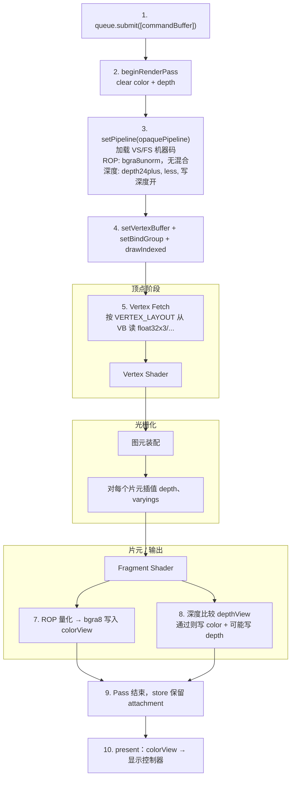

webgpu内部运行还是有很多不知道的细节的，比如以下概念：

```js
const DEPTH_FORMAT = "depth24plus";
const format = navigator.gpu.getPreferredCanvasFormat();

context.configure({
  device,
  format,
  alphaMode: "opaque",
});

let depthTexture;
let depthView;

// 深度纹理也改成同样的新尺寸
function recreateDepth() {
  if (depthTexture) depthTexture.destroy();
  depthTexture = device.createTexture({
    size: [canvas.width, canvas.height],
    format: DEPTH_FORMAT,
    usage: GPUTextureUsage.RENDER_ATTACHMENT,
  });
  depthView = depthTexture.createView();
}
recreateDepth();

const VERTEX_LAYOUT = {
  arrayStride: VERTEX_STRIDE,
  attributes: [
    { shaderLocation: 0, offset: 0, format: "float32x3" },
    { shaderLocation: 1, offset: 12, format: "float32x3" },
    { shaderLocation: 2, offset: 24, format: "float32x2" },
  ],
};

device.createRenderPipeline({
  layout: "auto",
  vertex: {
    module,
    entryPoint: "vs_main",
    buffers: [VERTEX_LAYOUT],
  },
  fragment: {
    module,
    entryPoint: "fs_main",
    targets: [{ format }],
  },
  primitive: {
    topology: "triangle-list",
    cullMode: "back",
  },
  depthStencil: {
    format: depthFormat,
    depthWriteEnabled: true,
    depthCompare: "less",
  },
});

const colorView = context.getCurrentTexture().createView();
const encoder = device.createCommandEncoder();
const renderPass = encoder.beginRenderPass({
  colorAttachments: [
    {
      view: colorView,
      clearValue: CLEAR_COLOR,
      loadOp: "clear",
      storeOp: "store",
    },
  ],
  depthStencilAttachment: {
    view: depthView,
    depthClearValue: 1,
    depthLoadOp: "clear",
    depthStoreOp: "store",
  },
});
```

根据以上内容，详细的讲一下 WebGpu的内部运行原理,关于format, depthFormat, Texture等知识，以及在Gpu内部是如何使用这些变量的。

---

# WebGPU 内部运行原理：Format、Texture 与 GPU 侧到底在干什么

上文那段代码里，表面上只是在 JS 里填了几个字符串常量、创建了几块纹理、配了一条渲染管线。但每一行都在和 **GPU 显存里的真实布局** 以及 **硬件固定功能单元** 对齐。下面按「这些变量是什么 → 在显存里长什么样 → 一帧渲染时 GPU 怎么用它们」的顺序讲透。

配套可运行示例见 [`webgpu-shader-demo`](../webgpu-shader-demo/raw/main.js)。

---

## 1. 先分清两类「对象」

WebGPU 里最容易混淆的是：**JS 里的句柄** 和 **显卡里的资源** 不是一回事。

| JS 侧你拿到的                        | 实际住在哪                  | 典型例子                       |
| ------------------------------------ | --------------------------- | ------------------------------ |
| `GPUDevice`、`GPURenderPipeline`     | 浏览器进程 + 驱动管理的对象 | 管线状态、编译好的 shader      |
| `GPUTexture`、`GPUBuffer` 背后的数据 | **显存（VRAM）**            | 颜色帧缓冲、深度缓冲、顶点数组 |
| `GPUCommandEncoder` 录出来的指令     | **系统内存**里的命令清单    | `drawIndexed`、`setPipeline`   |
| `submit` 之后                        | 驱动把命令 DMA 给 GPU 执行  | GPU 按清单去 VRAM 读资源       |

因此：`format = "bgra8unorm"` 不是「一个普通字符串变量传给 GPU 就完事」，而是在 **创建资源或管线时**，告诉驱动「请按这种像素/深度布局分配显存、配置输出单元」。创建完成后，格式信息已经 **烘焙** 进纹理描述符和管线状态里；每帧 `draw` 时 GPU 不会再读 JS 里的 `format` 变量。

---

## 2. `format`：画布颜色附件的像素格式

### 2.1 它描述的是什么

```js
const format = navigator.gpu.getPreferredCanvasFormat();
// 常见返回值："bgra8unorm" 或 "rgba8unorm"
```

`format` 的类型是 `GPUTextureFormat`，这里特指 **颜色附件** 每个像素在显存里占多少位、通道顺序如何、数值如何解释：

- **`8unorm`**：每通道 8 位无符号整数，Shader 里当 0.0～1.0 的归一化浮点用（不是 sRGB 自动 gamma 校正那种，除非格式名带 `srgb`）。
- **`bgra` vs `rgba`**：四个字节在内存里的排列顺序。Windows 上桌面合成器常偏好 BGRA，所以 `getPreferredCanvasFormat()` 在多数 PC 上返回 `"bgra8unorm"`。

**一个像素占 4 字节**（R/G/B/A 各 8 bit）。1920×1080 的颜色附件大约 1920×1080×4 ≈ 8 MB 量级——全部在 VRAM 里。

### 2.2 `context.configure` 在内部做了什么

```js
context.configure({
  device,
  format,
  alphaMode: "opaque",
});
```

这一步不只是「登记一下 format」，而是让浏览器/WebGPU 实现为你创建 **交换链（Swap Chain）**：

1. 向底层图形 API（D3D12 / Vulkan / Metal）申请 **2～3 张** 与 canvas 同尺寸的 **颜色纹理**，放在显存里。
2. 约定呈现路径：最终 `present` 时，OS 合成器会读这张纹理显示到屏幕。
3. `alphaMode: "opaque"` 告诉合成器：画布不透明，不必做与网页背景的 alpha 混合。

窗口尺寸变化时再次 `configure`，交换链颜色纹理的 **宽高会重建**（由 `canvas.width/height` 决定）。这就是为什么 demo 里 resize 时要 `recreateDepth()`——深度纹理是你 **自己** 创建的，不会随 `configure` 自动变大。

### 2.3 与 Fragment Shader 输出、`targets` 的绑定关系

```js
fragment: {
  module,
  entryPoint: "fs_main",
  targets: [{ format }],  // 必须与颜色附件 format 完全一致
},
```

创建 `GPURenderPipeline` 时，`targets[0].format` 必须和 **Render Pass 里绑定的颜色附件** 格式一致。原因在 GPU 硬件侧：

- 片元着色器（FS）执行完后，每个片元输出一个 `vec4<f32>`（逻辑上的 RGBA）。
- **输出合并单元（ROP / Color Attachment Unit）** 负责把浮点结果 **量化** 成附件格式规定的位布局，再写入帧缓冲。
- 若管线声明写 `rgba8unorm`，附件却是 `bgra8unorm`，硬件不知道如何打包字节，Validation Layer 会直接拒绝。

`targets` 里还可以声明 **混合（blend）** 状态。不透明管线通常不写 blend，表示新颜色 **覆盖** 旧像素；半透明管线会写 `src-alpha` / `one` 等，ROP 在写入前先做 `src × α + dst × (1-α)` 这类运算——混合公式同样 **烤进管线对象**，每帧不会变。

### 2.4 一帧里颜色纹理怎么被用到

```js
const colorView = context.getCurrentTexture().createView();
```

- `getCurrentTexture()`：从交换链 **取当前可写** 的那张颜色纹理（双缓冲/三缓冲轮转，避免显示器还在读上一帧时你覆盖同一块显存）。
- `createView()`：不分配新显存，只是创建一个 **视图描述符**——「把这张纹理当作 2D 颜色附件，从 mip0、layer0 开始，格式与创建时一致」。
- Render Pass 的 `colorAttachments[0].view = colorView` 告诉 GPU：本 Pass 所有 FS 输出都写到这块 VRAM。

#### `loadOp` / `storeOp`：Pass 级读写策略

这两个字段写在 `beginRenderPass` 的描述符里，分别控制 **Pass 开始前** 和 **Pass 结束后** 附件显存怎么处理。颜色附件用 `loadOp` / `storeOp`；深度/模板附件用同名的 `depthLoadOp` / `depthStoreOp`、`stencilLoadOp` / `stencilStoreOp`（枚举类型相同）。

```js
colorAttachments: [{
  view: colorView,
  clearValue: { r: 0.1, g: 0.2, b: 0.3, a: 1 },
  loadOp: "clear",
  storeOp: "store",
}],
```

WebGPU 规范里 **没有** `"dont-care"`（那是 Vulkan/D3D12 的概念）；合法取值只有下面四个。

**`GPULoadOp`（Pass 开始前）**

| 值 | GPU 做什么 | 典型场景 |
| --- | --- | --- |
| `"clear"` | 用 `clearValue` 把整片 attachment **刷成指定颜色** | 每帧首 Pass 清屏；不关心旧内容时优先用这个 |
| `"load"` | 从显存 **读入** 附件已有像素，再在其上绘制 | 多 Pass 叠加（先 3D 再 UI）；半透明混合需要读旧颜色 |

- 只有 `loadOp: "clear"` 时 `clearValue` 才生效；`"load"` 会忽略 clear 值。
- 移动端 **TBDR** 架构上，`"clear"` 往往比 `"load"` 快——不必把主存里的旧内容搬进 tile 本地内存。初始内容无所谓时，规范也建议用 `"clear"` 而非 `"load"`。
- `"load"` 要求附件 **已初始化**。若上一 Pass 用了 `"discard"` 或纹理从未写过，读到的内容未定义；规范要求驱动在真正读取前做 **惰性清零**，但不应依赖这一点做逻辑。

**`GPUStoreOp`（Pass 结束后）**

| 值 | GPU 做什么 | 典型场景 |
| --- | --- | --- |
| `"store"` | 把 Pass 渲染结果 **写回** 附件显存 | 交换链颜色（要上屏）；下一 Pass 还要读 |
| `"discard"` | **不写回** Pass 内的渲染结果 | 中间缓冲、本 Pass 后不再读的附件 |

- `"discard"` 后附件 **表现得像被清零**，但实现不必在 Pass 结束时立刻清；在 **采样、copy、下一 Pass 的 `"load"`、present 上屏** 等真正读取之前，驱动会惰性清零。
- 对 **画布/交换链颜色附件** 用 `"discard"` 不会触发 Validation 报错，但 present 读到的可能是全黑——实践上画布 **必须** `"store"`。
- 在 TBDR 上 `"discard"` 能跳过 tile 本地内存 → 主存的写回，省带宽；桌面 immediate-mode GPU 没有独立 tile 内存，语义仍按「像清零」处理，只是优化路径不同。

**常见组合**

| loadOp | storeOp | 含义 | 用途 |
| --- | --- | --- | --- |
| `"clear"` | `"store"` | 先清再画，结果保留 | **每帧主渲染**（demo 默认） |
| `"load"` | `"store"` | 在旧内容上叠加，结果保留 | 后处理链、UI Pass 叠在 3D 上 |
| `"clear"` | `"discard"` | 先清再画，结果丢弃 | 空 Pass 仅做清屏；一次性中间附件 |
| `"load"` | `"discard"` | 读旧内容参与渲染，但不写回 | 某些后处理中间步 |

**`TRANSIENT_ATTACHMENT` 纹理的强制组合**

创建纹理时若带 `GPUTextureUsage.TRANSIENT_ATTACHMENT`，Render Pass 里 **必须** `loadOp: "clear"` + `storeOp: "discard"`——驱动据此知道这是临时附件，可全程留在 tile 内存里。交换链 canvas 纹理不能配 `TRANSIENT_ATTACHMENT`。

---

## 3. `depthFormat`：深度附件的像素格式

### 3.1 与颜色 format 完全独立

```js
const DEPTH_FORMAT = "depth24plus";
```

深度缓冲 **不是** 颜色纹理的「第四个通道」，而是 **单独一块** `GPUTexture`，专门存 **每个像素距离相机的远近**（以及可能的模板位）。常见格式：

| 格式                   | 显存布局（概念上）            | 典型用途                   |
| ---------------------- | ----------------------------- | -------------------------- |
| `depth24plus`          | 24 bit 深度 + 8 bit 填充/模板 | Web 上最常用，精度够用     |
| `depth32float`         | 32 bit 浮点深度               | 大场景、需要更高精度       |
| `depth24plus-stencil8` | 24 bit 深度 + 8 bit 模板      | 需要模板测试（描边、遮罩） |

`depth24plus` 里每个像素 **至少 4 字节对齐**（24 bit 深度存在 32 bit 字里）。1080p 深度缓冲大约 1920×1080×4 ≈ 8 MB，同样全在 VRAM。

### 3.2 为什么要自己 `createTexture`，而不能 `getCurrentDepthTexture`

交换链只负责 **最终呈现到屏幕的颜色**。深度缓冲是中间数据，只在本帧渲染 Pass 内使用，从不需要显示给显示器——所以 WebGPU **不会** 自动给你深度纹理；必须：

```js
depthTexture = device.createTexture({
  size: [canvas.width, canvas.height],
  format: DEPTH_FORMAT,
  usage: GPUTextureUsage.RENDER_ATTACHMENT,
});
depthView = depthTexture.createView();
```

`usage: RENDER_ATTACHMENT` 告诉驱动：这块内存会被绑定为 Render Pass 的 depth/stencil 附件，硬件会配置 **深度测试单元** 对它读写。

### 3.3 管线里的 `depthStencil` 与附件必须一致

```js
depthStencil: {
  format: depthFormat,       // 必须 === depthTexture 的 format
  depthWriteEnabled: true,
  depthCompare: "less",
},
```

这里再次出现 `format`，但含义是 **深度附件格式**，与 Fragment 的 `targets[0].format` 无关。Validation 规则：

- 管线 `depthStencil.format` ≡ Render Pass 里 `depthStencilAttachment.view` 对应纹理的 format。
- `depthCompare: "less"`：新片元深度 **小于** 缓冲里已有值才通过（近处遮挡远处）。
- `depthWriteEnabled: true`：通过的片元把深度 **写回** 深度缓冲；半透明物体常设为 `false`，只测不写，避免后面的半透明被错误挡住。

### 3.4 GPU 内部：深度测试发生在哪一步

简化后的片元路径：

```
FS 输出颜色 + 插值得到的 depth
        ↓
   深度测试（与 depthTexture 该像素比较）
        ↓ 通过
   模板测试（若启用）
        ↓
   混合 / 覆盖 → 写入 colorView
        ↓
   （若 depthWriteEnabled）写 depthTexture
```

深度测试是 **固定功能硬件**，不在 WGSL 里写；你只通过管线状态声明 `less` / `greater` / `always` 等。Early-Z 等优化可能在 FS 之前就丢弃被挡住的片元，但语义等价。

`depthLoadOp: "clear"` + `depthClearValue: 1`：Pass 开始时把深度清为 1.0（WebGPU 深度范围 [0,1]，1 表示最远），保证本帧从「空深度」开始。

---

## 4. `GPUTexture` 与 `createView`：显存里的「图像」

### 4.1 创建时在 VRAM 里分配什么

```js
device.createTexture({
  size: [width, height], // 或 [width, height, depthOrArrayLayers]
  format: DEPTH_FORMAT,
  usage: GPUTextureUsage.RENDER_ATTACHMENT,
  mipLevelCount: 1, // 默认 1
  sampleCount: 1, // 默认 1，非 MSAA
});
```

驱动根据 `size × format 每像素字节数 × mip 级数 × sampleCount` 在 VRAM 划一块连续（或 tiled）区域。JS 里的 `GPUTexture` 是这块显存的 **句柄 + 元数据**（宽高、格式、usage）。

`usage` 是位掩码，限制纹理 **允许以何种方式使用**：

- `RENDER_ATTACHMENT`：可作为颜色/深度附件。
- `TEXTURE_BINDING`：可在 Shader 里 `texture_2d` 采样。
- `COPY_SRC` / `COPY_DST`：参与 `copyTextureToBuffer` 等。
- 未声明的用法在 Validation 阶段会被拒绝——防止把深度缓冲当普通贴图采样等未定义行为。

### 4.2 `createView`：同一块显存，多种「看法」

一张纹理可以有多个 `GPUTextureView`：

- 同一纹理，一个 view 指向 mip0 全图，另一个 view 指向 mip2（若有多级 mip）。
- 立方体贴图的六个面可以通过 `dimension: "cube"` 的 view 绑定。

View 本身几乎不占显存，只是 **绑定时的子资源描述**。Render Pass 和 BindGroup 里绑的是 **View**，不是 Texture 对象——这样 GPU 知道「从哪一级 mip、哪一层开始、当作 2D 还是 2D array」。

### 4.3 交换链纹理 vs 自管深度纹理

|          | 交换链颜色纹理             | 自创建 depthTexture            |
| -------- | -------------------------- | ------------------------------ |
| 谁创建   | `context.configure` 内部   | 你的 `createTexture`           |
| 尺寸变化 | `configure` 时重建         | 你需要 `destroy` + 重建        |
| 生命周期 | 浏览器管理，勿长期缓存引用 | 你负责 `destroy` 释放 VRAM     |
| 每帧获取 | `getCurrentTexture()`      | 固定 `depthView`（尺寸不变时） |

**不要** 跨帧长期持有 `getCurrentTexture()` 返回的对象而不重新获取——交换链会轮转，旧引用可能已 present 或失效。

---

## 5. 顶点布局里的 `format`：第三种「格式」

```js
const VERTEX_LAYOUT = {
  arrayStride: VERTEX_STRIDE,
  attributes: [
    { shaderLocation: 0, offset: 0, format: "float32x3" },
    { shaderLocation: 1, offset: 12, format: "float32x3" },
    { shaderLocation: 2, offset: 24, format: "float32x2" },
  ],
};
```

这里的 `format` 是 **顶点属性格式**（`GPUVertexFormat`），与纹理的 `GPUTextureFormat` **完全不是同一套枚举**：

- `float32x3`：从顶点缓冲读 3 个 32 位 float，共 12 字节。
- `shaderLocation: 0` 对应 WGSL 顶点入口的 `@location(0)` 输入。

GPU 顶点获取单元（Vertex Fetch）在 VS 运行前，按 `arrayStride` 和 `offset` 从 **顶点缓冲（VRAM 里的 GPUBuffer）** 拉数据：

```
顶点缓冲显存布局（每个顶点 32 字节示例）:
[ pos.x pos.y pos.z | normal.x normal.y normal.z | uv.u uv.v | ... ]
 0                 12                            24          32
 ↑ location 0      ↑ location 1                  ↑ location 2
```

`createRenderPipeline` 时把 `VERTEX_LAYOUT` **烤进管线**；录制命令时 `setVertexBuffer(0, vb)` 只说「顶点缓冲 0 绑到哪块 GPUBuffer」，**不再重复** 声明 format——格式已在管线里固定。换一套交错布局（比如加切线 `float32x4`）必须 **新建管线** 或新建 vertex buffer layout。

---

## 6. Render Pass：把颜色、深度、管线拧在一起

```js
const renderPass = encoder.beginRenderPass({
  colorAttachments: [
    {
      view: colorView,
      clearValue: CLEAR_COLOR,
      loadOp: "clear",
      storeOp: "store",
    },
  ],
  depthStencilAttachment: {
    view: depthView,
    depthClearValue: 1,
    depthLoadOp: "clear",
    depthStoreOp: "store",
  },
});
```

这一帧里，GPU 收到的 **附件集合** 是：

```
┌─────────────────────────────────────┐
│  Render Pass（同一 subpass）         │
│                                     │
│  colorView  ←── FS 输出 / 混合      │
│  depthView  ←── 深度测试读写的       │
│                                     │
│  使用的管线：opaquePipeline 等       │
│  - targets[0].format  ≡ color 格式  │
│  - depthStencil.format ≡ depth 格式 │
└─────────────────────────────────────┘
```

若 `beginRenderPass` 绑的 `colorView` 来自 `bgra8unorm` 交换链纹理，则 **本 Pass 内** 所有 `setPipeline` 的管线，其 `fragment.targets[0].format` 都必须是 `bgra8unorm`；深度侧同理必须是 `depth24plus`。

录制阶段（CPU/浏览器进程）只做 **兼容性检查 + 把附件句柄写进命令**；真正访问 VRAM 发生在 `queue.submit` 之后 GPU 执行时。

---

## 7. 从 `submit` 到像素：GPU 内部一帧在干什么

下面是把上文所有变量串起来的 **执行视角**（简化，略去驱动细节）：



几个容易误解的点：

- **`format` 变量在 submit 之后不再存在**：GPU 用的是创建管线/纹理时写进驱动描述符的格式枚举。
- **深度与颜色并行绑定**：同一像素坐标 `(x,y)` 在 colorView 和 depthView 各有一份存储；ROP 和深度单元 **协同** 决定最终是否写色、是否写深。
- **`layout: "auto"`**：根据 shader 里的 `@group/@binding` 和顶点 `@location` 自动推导 BindGroupLayout 与顶点布局；不改变 format 规则。

---

## 8. 常见错误与调试线索

| 现象                              | 常见原因                                                               |
| --------------------------------- | ---------------------------------------------------------------------- |
| Validation：`format` mismatch     | 管线 `targets[0].format` ≠ 交换链 / 附件 format                        |
| Validation：depth format mismatch | 管线 `depthStencil.format` ≠ `depthTexture.format`                     |
| resize 后画面拉伸或深度错乱       | 只 `configure` 没 `recreateDepth`，深度仍是旧尺寸                      |
| 黑屏但无报错                      | `storeOp: "discard"` 误用在 canvas 附件；或 `alphaMode` 与页面合成冲突 |
| 半透明顺序不对                    | 深度写入未关、或未先画不透明批次                                       |

Chrome / Edge 可在 `chrome://flags` 或 Launch 参数里打开 WebGPU 验证与错误回调；`device.pushErrorScope("validation")` 可在 JS 里捕获具体 mismatch 信息。

---

## 9. 小结：代码里每个「format」各管什么

| 代码位置                               | 类型                    | 管的是什么         | GPU 谁消费                   |
| -------------------------------------- | ----------------------- | ------------------ | ---------------------------- |
| `getPreferredCanvasFormat()`           | `GPUTextureFormat`      | 交换链颜色像素布局 | ROP 写帧缓冲                 |
| `fragment.targets[].format`            | 同上                    | FS 输出如何量化    | 必须与 color attachment 一致 |
| `depthStencil.format` / `DEPTH_FORMAT` | 深度 `GPUTextureFormat` | 深度/模板像素布局  | 深度测试单元                 |
| `VERTEX_LAYOUT.attributes[].format`    | `GPUVertexFormat`       | 顶点缓冲字段类型   | Vertex Fetch                 |
| `primitive.topology` 等                | 非 format               | 图元类型、剔除     | 图元装配 / 光栅化            |

**Texture** 是 VRAM 里的二维（或更高维）数组；**View** 是绑定用的透镜；**RenderPipeline** 把 Shader、顶点布局、颜色/深度格式、混合与深度状态 **一次性封包**；**RenderPass** 声明本趟绘制写哪几块附件、清不清、保不保留。你写的 JS 变量，大多是在 **创建期** 把这些硬件参数定死；**每帧** 变的主要是 Uniform（矩阵、时间）、绑哪块 Buffer、以及 `getCurrentTexture()` 轮转哪张交换链纹理。

搞清这一点，再回头看 demo 里的 `format`、`DEPTH_FORMAT`、`recreateDepth()` 和两套 Pipeline，就不是孤立的 API 调用，而是一条完整链路：**为 GPU 固定功能单元准备好格式匹配的显存，再用命令清单驱动并行着色器往这些显存里写正确的字节。**

---

## 10. 延伸阅读：书籍、教程与 MDN

上文横跨两层知识：**WebGPU API 怎么用**，以及 **GPU 渲染管线 / 显存 / 固定功能单元在干什么**。不同资料覆盖的重点不同，可按需组合阅读。

### 10.1 专门讲 WebGPU 的书与教程

这些资料会直接用到 `format`、`createTexture`、`configure`、`depthStencil` 等 API，但多数不会像本文那样细讲 ROP、Early-Z、交换链轮转等硬件细节。

| 资料 | 特点 | 与本文的对应关系 |
| --- | --- | --- |
| [The Book of WebGPU](https://electronut.in/webgpu/)（Mahesh Venkitachalam，No Starch Press，2024） | 项目驱动，从画三角形到 3D 变换、BindGroup | 讲 vertex buffer、pipeline、uniform；深度/纹理有涉及，偏实践 |
| [The WebGPU Sourcebook](https://www.routledge.com/The-WebGPU-Sourcebook-High-Performance-Graphics-and-Machine-Learning-in-the-Browser/Scarpino/p/book/9781032726670)（Matthew Scarpino，2025） | 第 6 章 *Lighting, Textures, and Depth* 明确讲深度与纹理 | **最接近** demo 里的 `format` + `depthFormat` 组合 |
| [WebGPU Unleashed](https://shi-yan.github.io/webgpuunleashed/)（免费在线） | 开篇讲 GPU driver 与 pipeline，强调硬件交互 | 理念上最接近「内部原理」，仍以 WebGPU 为主 |
| [WebGPU Fundamentals](https://webgpufundamentals.org/) | 系列文章 + 示例，类似 WebGL Fundamentals | 交换链、深度缓冲、Render Pass 有专题，免费 |

若目标是「把 demo 里每一行 API 对上号」，优先：**WebGPU Sourcebook** + **WebGPU Fundamentals**。

### 10.2 讲 GPU 内部原理的经典教材（API 无关）

ROP、深度测试、Vertex Fetch、显存布局等内容，主要来自**实时图形学 / GPU 架构**，不绑定 WebGPU，但原理完全通用。

| 书 | 相关章节 | 讲什么 |
| --- | --- | --- |
| [Real-Time Rendering, 4th Edition](https://www.routledge.com/Real-Time-Rendering-Fourth-Edition/Akenine-Moller-Haines-Hoffman/p/book/9781138627000)（实时渲染，第 4 版） | Ch.2 图形渲染管线；Ch.3 GPU；Ch.23 图形硬件（含深度缓冲） | 深度测试、帧缓冲、管线阶段的权威参考 |
| [Fundamentals of Computer Graphics](https://www.routledge.com/Fundamentals-of-Computer-Graphics/Shirley-Marschner/p/book/9781032329277)（Shirley 等） | 光栅化、深度缓冲、纹理 | 偏理论，适合补「深度值、Z-fighting」数学基础 |
| [Physically Based Rendering](https://pbrt.org/)（PBRT） | 成像、采样、帧缓冲 | 偏离线渲染，但纹理/像素格式概念清晰 |

补充一篇经典长文（免费）：

- [A trip through the Graphics Pipeline 2011](https://fgiesen.wordpress.com/2011/07/09/a-trip-through-the-graphics-pipeline-2011-index/)（Fabian Giesen）—— Real-Time Rendering 官网也推荐。从顶点输入到 ROP 逐步拆解，与本文第 7 节「从 submit 到像素」高度同构，只是使用 D3D/OpenGL 语境。

若目标是「搞懂 GPU 在干什么」，优先：**Real-Time Rendering Ch.2–3** + **Graphics Pipeline 2011**。

### 10.3 MDN 文档

MDN **有**完整 WebGPU API 文档，适合入门和查参数；**定位是 API 参考 + 教程，不是 GPU 硬件原理教材**。

**入口与教程**

- [WebGPU API 总览](https://developer.mozilla.org/en-US/docs/Web/API/WebGPU_API)——含 `configure`、`getPreferredCanvasFormat()`、`loadOp`/`storeOp`、顶点 layout 的 `format`、物理 GPU → 逻辑 Device 的分层说明；是 MDN 上最接近本文整体流程的一篇。
- [WebGPU best practices](https://developer.mozilla.org/en-US/docs/Web/API/WebGPU_API#see_also)（总览页 See also 中链接）

**与本文逐条对应的 MDN 页面**

| 本文主题 | MDN 页面 |
| --- | --- |
| 画布 `format` | [`GPU.getPreferredCanvasFormat()`](https://developer.mozilla.org/en-US/docs/Web/API/GPU/getPreferredCanvasFormat)、[`GPUCanvasContext.configure()`](https://developer.mozilla.org/en-US/docs/Web/API/GPUCanvasContext/configure) |
| 颜色/深度纹理 | [`GPUDevice.createTexture()`](https://developer.mozilla.org/en-US/docs/Web/API/GPUDevice/createTexture)、[`GPUTexture.format`](https://developer.mozilla.org/en-US/docs/Web/API/GPUTexture/format) |
| 纹理视图 | [`GPUTexture.createView()`](https://developer.mozilla.org/en-US/docs/Web/API/GPUTexture/createView) |
| 顶点 `format` | [`GPUVertexBufferLayout`](https://developer.mozilla.org/en-US/docs/Web/API/GPUVertexBufferLayout)、[`GPUVertexAttribute`](https://developer.mozilla.org/en-US/docs/Web/API/GPUVertexAttribute) |
| Render Pass | [`GPURenderPassDescriptor`](https://developer.mozilla.org/en-US/docs/Web/API/GPURenderPassDescriptor)、[`GPURenderPassEncoder`](https://developer.mozilla.org/en-US/docs/Web/API/GPURenderPassEncoder) |
| 深度状态 | [`GPUDepthStencilState`](https://developer.mozilla.org/en-US/docs/Web/API/GPUDepthStencilState) |
| Fragment 输出格式 | [`GPUColorTargetState`](https://developer.mozilla.org/en-US/docs/Web/API/GPUColorTargetState) |
| 混合 | [`GPUBlendState`](https://developer.mozilla.org/en-US/docs/Web/API/GPUBlendState) |

**格式枚举的规范字典**（MDN 会指向规范，完整列表在此）：

- [WebGPU 规范 — Texture Formats](https://gpuweb.github.io/gpuweb/#texture-formats)
- [gpuweb.github.io 类型参考 — GPUTextureFormat](https://gpuweb.github.io/types/types/GPUTextureFormat.html)

可在此查 `depth24plus`、`bgra8unorm` 等合法取值，但不会解释「24 bit 深度为何 4 字节对齐」等硬件细节。

**MDN 通常不会展开的内容**（需结合书本 / 长文）：

- 交换链双缓冲/三缓冲如何轮转
- ROP / 深度单元 / Early-Z 的硬件分工
- TBDR 与 `storeOp: "discard"` 的关系
- 「创建期烘焙 format vs 每帧不再读 JS 变量」这类心智模型

本文第 1～7 节补的正是这一层。

**官方补充（非 MDN，建议并列使用）**

- [WebGPU Explainer](https://gpuweb.github.io/gpuweb/explainer/)——设计动机、错误模型、兼容性模式
- [WebGPU Specification](https://gpuweb.github.io/gpuweb/)——Validation 规则（如 pipeline format 必须 match attachment）
- [WebGPU Samples](https://webgpu.github.io/webgpu-samples/)——可运行示例

### 10.4 推荐阅读组合

```
想弄懂 API 参数          → MDN WebGPU API + createTexture / depthStencil 各页
想弄懂 format 选型       → MDN getPreferredCanvasFormat + 规范 Texture Formats
想弄懂深度/纹理在管线里  → WebGPU Sourcebook Ch.6 或 webgpufundamentals.org
想弄懂 GPU 内部在干什么  → Real-Time Rendering Ch.2–3 + Graphics Pipeline 2011
想对照可运行代码         → 本仓库 webgpu-shader-demo + WebGPU Samples
```
